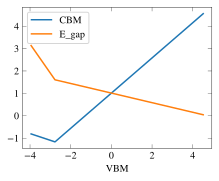
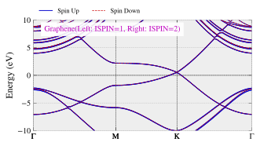

# PivotPy
> A Python Processing Tool for Vasp Input/Output. A CLI is available in Powershell, see <a href='https://github.com/massgh/Vasp2Visual'>Vasp2Visual</a>.


## Install
`pip install pivotpy`

## How to use
- [Read Function References](functions.md)
- See [Full Documentation](https://massgh.github.io/pivotpy/).
- For CLI, use [Vasp2Visual](https://github.com/massgh/Vasp2Visual).
- Run in Azure [](https://testazurenotebooks-massaz.notebooks.azure.com/j/notebooks/index.ipynb)

# New: Ipywidgets-based GUI in Progress
See GIF here:
 

- The code at end is used below to rebuild dataframe which can be use in many ways such as generating latex table. The matplotlib code is used to generate publication quality figure.

```
import pivotpy as pp
paths = ['e:/Research/graphene_example/ISPIN_1/bands/DOS/vasprun.xml',
         'e:/Research/graphene_example/ISPIN_1/bands/vasprun.xml',
         'e:/Research/graphene_example/ISPIN_1/dos/vasprun.xml',
         'e:/Research/graphene_example/ISPIN_2/bands/vasprun.xml',
         'e:/Research/graphene_example/ISPIN_2/dos/sigm0_01/vasprun.xml',
         'e:/Research/graphene_example/ISPIN_2/dos/vasprun.xml',
         'e:/Research/graphene_example/vasprun.xml']
df = pp.generate_summary(paths_list=paths)
df
```


<style  type="text/css" >
</style><table id="T_51c56cee_208f_11eb_91e2_44032c5fd2c2" ><caption>Root Path: e:/Research/graphene_example/</caption><thead>    <tr>        <th class="blank level0" ></th>        <th class="col_heading level0 col0" >sys</th>        <th class="col_heading level0 col1" >V</th>        <th class="col_heading level0 col2" >a</th>        <th class="col_heading level0 col3" >b</th>        <th class="col_heading level0 col4" >c</th>        <th class="col_heading level0 col5" >VBM</th>        <th class="col_heading level0 col6" >CBM</th>        <th class="col_heading level0 col7" >so_max</th>        <th class="col_heading level0 col8" >so_min</th>        <th class="col_heading level0 col9" >E_gap</th>        <th class="col_heading level0 col10" >Δ_SO</th>        <th class="col_heading level0 col11" >rel_path</th>    </tr></thead><tbody>
                <tr>
                        <th id="T_51c56cee_208f_11eb_91e2_44032c5fd2c2level0_row0" class="row_heading level0 row0" >0</th>
                        <td id="T_51c56cee_208f_11eb_91e2_44032c5fd2c2row0_col0" class="data row0 col0" >C2</td>
                        <td id="T_51c56cee_208f_11eb_91e2_44032c5fd2c2row0_col1" class="data row0 col1" >105.493250</td>
                        <td id="T_51c56cee_208f_11eb_91e2_44032c5fd2c2row0_col2" class="data row0 col2" >2.468030</td>
                        <td id="T_51c56cee_208f_11eb_91e2_44032c5fd2c2row0_col3" class="data row0 col3" >2.468030</td>
                        <td id="T_51c56cee_208f_11eb_91e2_44032c5fd2c2row0_col4" class="data row0 col4" >19.998290</td>
                        <td id="T_51c56cee_208f_11eb_91e2_44032c5fd2c2row0_col5" class="data row0 col5" >-3.946800</td>
                        <td id="T_51c56cee_208f_11eb_91e2_44032c5fd2c2row0_col6" class="data row0 col6" >-0.812500</td>
                        <td id="T_51c56cee_208f_11eb_91e2_44032c5fd2c2row0_col7" class="data row0 col7" >-3.949100</td>
                        <td id="T_51c56cee_208f_11eb_91e2_44032c5fd2c2row0_col8" class="data row0 col8" >4.781000</td>
                        <td id="T_51c56cee_208f_11eb_91e2_44032c5fd2c2row0_col9" class="data row0 col9" >3.134300</td>
                        <td id="T_51c56cee_208f_11eb_91e2_44032c5fd2c2row0_col10" class="data row0 col10" >-8.730100</td>
                        <td id="T_51c56cee_208f_11eb_91e2_44032c5fd2c2row0_col11" class="data row0 col11" >ISPIN_1/bands/DOS</td>
            </tr>
            <tr>
                        <th id="T_51c56cee_208f_11eb_91e2_44032c5fd2c2level0_row1" class="row_heading level0 row1" >1</th>
                        <td id="T_51c56cee_208f_11eb_91e2_44032c5fd2c2row1_col0" class="data row1 col0" >C2</td>
                        <td id="T_51c56cee_208f_11eb_91e2_44032c5fd2c2row1_col1" class="data row1 col1" >105.493250</td>
                        <td id="T_51c56cee_208f_11eb_91e2_44032c5fd2c2row1_col2" class="data row1 col2" >2.468030</td>
                        <td id="T_51c56cee_208f_11eb_91e2_44032c5fd2c2row1_col3" class="data row1 col3" >2.468030</td>
                        <td id="T_51c56cee_208f_11eb_91e2_44032c5fd2c2row1_col4" class="data row1 col4" >19.998290</td>
                        <td id="T_51c56cee_208f_11eb_91e2_44032c5fd2c2row1_col5" class="data row1 col5" >-2.773300</td>
                        <td id="T_51c56cee_208f_11eb_91e2_44032c5fd2c2row1_col6" class="data row1 col6" >-1.168200</td>
                        <td id="T_51c56cee_208f_11eb_91e2_44032c5fd2c2row1_col7" class="data row1 col7" >nan</td>
                        <td id="T_51c56cee_208f_11eb_91e2_44032c5fd2c2row1_col8" class="data row1 col8" >nan</td>
                        <td id="T_51c56cee_208f_11eb_91e2_44032c5fd2c2row1_col9" class="data row1 col9" >1.605100</td>
                        <td id="T_51c56cee_208f_11eb_91e2_44032c5fd2c2row1_col10" class="data row1 col10" >nan</td>
                        <td id="T_51c56cee_208f_11eb_91e2_44032c5fd2c2row1_col11" class="data row1 col11" >ISPIN_1/bands</td>
            </tr>
            <tr>
                        <th id="T_51c56cee_208f_11eb_91e2_44032c5fd2c2level0_row2" class="row_heading level0 row2" >2</th>
                        <td id="T_51c56cee_208f_11eb_91e2_44032c5fd2c2row2_col0" class="data row2 col0" >C2</td>
                        <td id="T_51c56cee_208f_11eb_91e2_44032c5fd2c2row2_col1" class="data row2 col1" >105.493250</td>
                        <td id="T_51c56cee_208f_11eb_91e2_44032c5fd2c2row2_col2" class="data row2 col2" >2.468030</td>
                        <td id="T_51c56cee_208f_11eb_91e2_44032c5fd2c2row2_col3" class="data row2 col3" >2.468030</td>
                        <td id="T_51c56cee_208f_11eb_91e2_44032c5fd2c2row2_col4" class="data row2 col4" >19.998290</td>
                        <td id="T_51c56cee_208f_11eb_91e2_44032c5fd2c2row2_col5" class="data row2 col5" >4.516100</td>
                        <td id="T_51c56cee_208f_11eb_91e2_44032c5fd2c2row2_col6" class="data row2 col6" >4.559100</td>
                        <td id="T_51c56cee_208f_11eb_91e2_44032c5fd2c2row2_col7" class="data row2 col7" >-9.840500</td>
                        <td id="T_51c56cee_208f_11eb_91e2_44032c5fd2c2row2_col8" class="data row2 col8" >-12.235500</td>
                        <td id="T_51c56cee_208f_11eb_91e2_44032c5fd2c2row2_col9" class="data row2 col9" >0.043000</td>
                        <td id="T_51c56cee_208f_11eb_91e2_44032c5fd2c2row2_col10" class="data row2 col10" >2.395000</td>
                        <td id="T_51c56cee_208f_11eb_91e2_44032c5fd2c2row2_col11" class="data row2 col11" >ISPIN_2/bands</td>
            </tr>
    </tbody></table>


```
print(df.caption)
df.data
```

    Root Path: e:/Research/graphene_example/
    


<div>
<style scoped>
    .dataframe tbody tr th:only-of-type {
        vertical-align: middle;
    }

    .dataframe tbody tr th {
        vertical-align: top;
    }

    .dataframe thead th {
        text-align: right;
    }
</style>
<table border="1" class="dataframe">
  <thead>
    <tr style="text-align: right;">
      <th></th>
      <th>sys</th>
      <th>V</th>
      <th>a</th>
      <th>b</th>
      <th>c</th>
      <th>VBM</th>
      <th>CBM</th>
      <th>so_max</th>
      <th>so_min</th>
      <th>E_gap</th>
      <th>Δ_SO</th>
      <th>rel_path</th>
    </tr>
  </thead>
  <tbody>
    <tr>
      <th>0</th>
      <td>C2</td>
      <td>105.49325</td>
      <td>2.46803</td>
      <td>2.46803</td>
      <td>19.99829</td>
      <td>-3.9468</td>
      <td>-0.8125</td>
      <td>-3.9491</td>
      <td>4.7810</td>
      <td>3.1343</td>
      <td>-8.7301</td>
      <td>ISPIN_1/bands/DOS</td>
    </tr>
    <tr>
      <th>1</th>
      <td>C2</td>
      <td>105.49325</td>
      <td>2.46803</td>
      <td>2.46803</td>
      <td>19.99829</td>
      <td>-2.7733</td>
      <td>-1.1682</td>
      <td>NaN</td>
      <td>NaN</td>
      <td>1.6051</td>
      <td>NaN</td>
      <td>ISPIN_1/bands</td>
    </tr>
    <tr>
      <th>2</th>
      <td>C2</td>
      <td>105.49325</td>
      <td>2.46803</td>
      <td>2.46803</td>
      <td>19.99829</td>
      <td>4.5161</td>
      <td>4.5591</td>
      <td>-9.8405</td>
      <td>-12.2355</td>
      <td>0.0430</td>
      <td>2.3950</td>
      <td>ISPIN_2/bands</td>
    </tr>
  </tbody>
</table>
</div>


```
print(df.data.to_latex())
```

    \begin{tabular}{llrrrrrrrrrrl}
    \toprule
    {} & sys &          V &        a &        b &         c &     VBM &     CBM &  so\_max &   so\_min &   E\_gap &    Δ\_SO &           rel\_path \\
    \midrule
    0 &  C2 &  105.49325 &  2.46803 &  2.46803 &  19.99829 & -3.9468 & -0.8125 & -3.9491 &   4.7810 &  3.1343 & -8.7301 &  ISPIN\_1/bands/DOS \\
    1 &  C2 &  105.49325 &  2.46803 &  2.46803 &  19.99829 & -2.7733 & -1.1682 &     NaN &      NaN &  1.6051 &     NaN &      ISPIN\_1/bands \\
    2 &  C2 &  105.49325 &  2.46803 &  2.46803 &  19.99829 &  4.5161 &  4.5591 & -9.8405 & -12.2355 &  0.0430 &  2.3950 &      ISPIN\_2/bands \\
    \bottomrule
    \end{tabular}
    
    

```
ax = pp.init_figure()
df = df.data # Access to Data if there is caption in Dataframe
df.sort_values('VBM').plot(ax=ax,x = 'VBM',y=['CBM','E_gap'])
```


    <matplotlib.axes._subplots.AxesSubplot at 0x283f03cbc88>





```
import pivotpy as pp
print(', '.join(pp.__all__))
```

    Dict2Data, Dic2Dot, read_asxml, exclude_kpts, get_ispin, get_summary, get_kpts, get_tdos, get_evals, get_bands_pro_set, get_dos_pro_set, get_structure, export_vasprun, load_export, dump_dict, get_file_size, interpolate_data, ps_to_py, ps_to_std, select_dirs, select_files, get_child_items, invert_color, printr, printg, printb, printy, printm, printc, EncodeFromNumpy, DecodeToNumpy, link_to_class, plot_bands, modify_axes, quick_bplot, add_text, add_legend, add_colorbar, create_rgb_lines, quick_rgb_lines, quick_color_lines, init_figure, select_pdos, collect_dos, quick_dos_lines, plt_to_html, get_rgb_data, flip_even_patches, rgb_to_plotly, plotly_to_html, plotly_rgb_lines, plotly_dos_lines, iplotfromtxt, save_mp_API, load_mp_data, get_crystal, get_poscar, get_kpath, get_kmesh, intersect_3p_p_3v, centroid, order, in_vol_sector, out_bz_plane, to_xy, rad_angle, arctan_full, get_bz, plot_bz, light_style, dark_style, get_files_gui, get_input_gui, read_data, click_data, tabulate_data, save_data, color_toggle, clrear_cache, matplotlib_code, generate_summary, show_app, show, savefig
    

```
import os 
os.chdir('E:/Research/graphene_example/ISPIN_1/bands')
xml_data=pp.read_asxml()
vr=pp.export_vasprun(elim=[-5,5])
vr
```


    Data(
        sys_info = Data(
            SYSTEM = C2
            NION = 2
            TypeION = 1
            ElemName = ['C']
            ElemIndex = [0, 2]
            E_Fermi = -3.35005822
            ISPIN = 1
            fields = ['s', 'py', 'pz', 'px', 'dxy', 'dyz', 'dz2', 'dxz', 'x2-y2']
            incar = Data(
                SYSTEM = C2
                PREC = high
                ALGO = N
                LSORBIT = T
                NELMIN = 7
                ISMEAR = 0
                SIGMA = 0.10000000
                LORBIT = 11
                KPOINT_BSE = -1     0     0     0
                GGA = PS
            )
        )
        dim_info = Data(
            ⇅ = Each of SpinUp/SpinDown Arrays
            kpoints = (NKPTS,3)
            kpath = (NKPTS,1)
            bands = ⇅(NKPTS,NBANDS)
            dos = ⇅(grid_size,3)
            pro_dos = ⇅(NION,grid_size,en+pro_fields)
            pro_bands = ⇅(NION,NKPTS,NBANDS,pro_fields)
        )
        kpoints = <ndarray:shape=(90, 3)>
        kpath = <list:len=90>
        bands = Data(
            E_Fermi = -3.35005822
            ISPIN = 1
            NBANDS = 10
            bands_range = range(4, 14)
            evals = <ndarray:shape=(90, 10)>
        )
        tdos = Data(
            E_Fermi = -3.35005822
            ISPIN = 1
            grid_range = range(124, 203)
            tdos = <ndarray:shape=(79, 3)>
        )
        pro_bands = Data(
            labels = ['s', 'py', 'pz', 'px', 'dxy', 'dyz', 'dz2', 'dxz', 'x2-y2']
            pros = <ndarray:shape=(2, 90, 10, 9)>
        )
        pro_dos = Data(
            labels = ['energy', 's', 'py', 'pz', 'px', 'dxy', 'dyz', 'dz2', 'dxz', 'x2-y2']
            pros = <ndarray:shape=(2, 79, 10)>
        )
        poscar = Data(
            volume = 105.49324928
            basis = <ndarray:shape=(3, 3)>
            rec_basis = <ndarray:shape=(3, 3)>
            positions = <ndarray:shape=(2, 3)>
        )
    )


## Matplotlib's static plots

```
#collapse_input
import pivotpy as pp 
import matplotlib.pyplot as plt 
vr1=pp.export_vasprun('E:/Research/graphene_example/ISPIN_2/bands/vasprun.xml')
vr2=pp.export_vasprun('E:/Research/graphene_example/ISPIN_2/dos/vasprun.xml')
axs=pp.init_figure(ncols=3,widths=[2,1,2.2],sharey=True,wspace=0.05,figsize=(8,2.6))
elements=[0,0,[0,1]]
orbs=[[0],[1],[2,3]]
labels=['s','$p_z$','$(p_x+p_y)$']
ti_cks=dict(xt_indices=[0,30,60,-1],xt_labels=['Γ','M','K','Γ'])
args_dict=dict(elements=elements,orbs=orbs,labels=labels,elim=[-20,15])
pp.quick_bplot(path_evr=vr1,ax=axs[0],**ti_cks,elim=[-20,15])
lg_k={'ncol': 3}
pp.quick_dos_lines(path_evr=vr2,ax=axs[1],vertical=True,spin='both',include_dos='pdos',**args_dict,legend_kwargs=lg_k)
pp.quick_rgb_lines(path_evr=vr1,ax=axs[2],**args_dict,**ti_cks,colorbar=True)
pp.show() 
```


## Interactive plots using plotly

```
args_dict['labels'] = ['s','p_z','p_x+p_y']
fig = pp.plotly_rgb_lines(vr1,**args_dict)
```

```
from IPython.display import HTML
HTML("""
<div>
<script src='https://cdn.plot.ly/plotly-latest.min.js'></script>
<div id='myDiv'><!-- Plotly chart will be drawn inside this DIV --></div>
<script>
var data = {};

Plotly.newPlot('myDiv', data.data,data.layout);
</script>
</div>
""".format(fig.to_json()))
```


<div>
<script src='https://cdn.plot.ly/plotly-latest.min.js'></script>
<div id='myDiv'><!-- Plotly chart will be drawn inside this DIV --></div>
<script>
var data = {"data":[{"hovertext":["Proj: ['s', 'p_z', 'p_x+p_y'] <br>RGB(100,0,0) </br>Band: B<sup>\u2191</sup><sub>1</sub>","Proj: ['s', 'p_z', 'p_x+p_y'] <br>RGB(100,0,0) </br>Band: B<sup>\u2191</sup><sub>1</sub>","Proj: ['s', 'p_z', 'p_x+p_y'] <br>RGB(100,0,0) </br>Band: B<sup>\u2191</sup><sub>1</sub>","Proj: ['s', 'p_z', 'p_x+p_y'] <br>RGB(100,0,0) </br>Band: B<sup>\u2191</sup><sub>1</sub>","Proj: ['s', 'p_z', 'p_x+p_y'] <br>RGB(100,0,0) </br>Band: B<sup>\u2191</sup><sub>1</sub>","Proj: ['s', 'p_z', 'p_x+p_y'] <br>RGB(100,1,0) </br>Band: B<sup>\u2191</sup><sub>1</sub>","Proj: ['s', 'p_z', 'p_x+p_y'] <br>RGB(100,1,0) </br>Band: B<sup>\u2191</sup><sub>1</sub>","Proj: ['s', 'p_z', 'p_x+p_y'] <br>RGB(100,2,0) </br>Band: B<sup>\u2191</sup><sub>1</sub>","Proj: ['s', 'p_z', 'p_x+p_y'] <br>RGB(100,3,0) </br>Band: B<sup>\u2191</sup><sub>1</sub>","Proj: ['s', 'p_z', 'p_x+p_y'] <br>RGB(100,3,0) </br>Band: B<sup>\u2191</sup><sub>1</sub>","Proj: ['s', 'p_z', 'p_x+p_y'] <br>RGB(100,4,0) </br>Band: B<sup>\u2191</sup><sub>1</sub>","Proj: ['s', 'p_z', 'p_x+p_y'] <br>RGB(100,5,0) </br>Band: B<sup>\u2191</sup><sub>1</sub>","Proj: ['s', 'p_z', 'p_x+p_y'] <br>RGB(100,6,0) </br>Band: B<sup>\u2191</sup><sub>1</sub>","Proj: ['s', 'p_z', 'p_x+p_y'] <br>RGB(100,8,0) </br>Band: B<sup>\u2191</sup><sub>1</sub>","Proj: ['s', 'p_z', 'p_x+p_y'] <br>RGB(100,9,0) </br>Band: B<sup>\u2191</sup><sub>1</sub>","Proj: ['s', 'p_z', 'p_x+p_y'] <br>RGB(100,11,0) </br>Band: B<sup>\u2191</sup><sub>1</sub>","Proj: ['s', 'p_z', 'p_x+p_y'] <br>RGB(100,12,0) </br>Band: B<sup>\u2191</sup><sub>1</sub>","Proj: ['s', 'p_z', 'p_x+p_y'] <br>RGB(100,14,0) </br>Band: B<sup>\u2191</sup><sub>1</sub>","Proj: ['s', 'p_z', 'p_x+p_y'] <br>RGB(100,16,0) </br>Band: B<sup>\u2191</sup><sub>1</sub>","Proj: ['s', 'p_z', 'p_x+p_y'] <br>RGB(100,18,0) </br>Band: B<sup>\u2191</sup><sub>1</sub>","Proj: ['s', 'p_z', 'p_x+p_y'] <br>RGB(100,20,0) </br>Band: B<sup>\u2191</sup><sub>1</sub>","Proj: ['s', 'p_z', 'p_x+p_y'] <br>RGB(100,22,0) </br>Band: B<sup>\u2191</sup><sub>1</sub>","Proj: ['s', 'p_z', 'p_x+p_y'] <br>RGB(100,24,0) </br>Band: B<sup>\u2191</sup><sub>1</sub>","Proj: ['s', 'p_z', 'p_x+p_y'] <br>RGB(100,26,0) </br>Band: B<sup>\u2191</sup><sub>1</sub>","Proj: ['s', 'p_z', 'p_x+p_y'] <br>RGB(100,28,0) </br>Band: B<sup>\u2191</sup><sub>1</sub>","Proj: ['s', 'p_z', 'p_x+p_y'] <br>RGB(100,29,0) </br>Band: B<sup>\u2191</sup><sub>1</sub>","Proj: ['s', 'p_z', 'p_x+p_y'] <br>RGB(100,30,0) </br>Band: B<sup>\u2191</sup><sub>1</sub>","Proj: ['s', 'p_z', 'p_x+p_y'] <br>RGB(100,29,0) </br>Band: B<sup>\u2191</sup><sub>1</sub>","Proj: ['s', 'p_z', 'p_x+p_y'] <br>RGB(100,25,0) </br>Band: B<sup>\u2191</sup><sub>1</sub>","Proj: ['s', 'p_z', 'p_x+p_y'] <br>RGB(100,21,0) </br>Band: B<sup>\u2191</sup><sub>1</sub>","Proj: ['s', 'p_z', 'p_x+p_y'] <br>RGB(100,21,0) </br>Band: B<sup>\u2191</sup><sub>1</sub>","Proj: ['s', 'p_z', 'p_x+p_y'] <br>RGB(100,21,0) </br>Band: B<sup>\u2191</sup><sub>1</sub>","Proj: ['s', 'p_z', 'p_x+p_y'] <br>RGB(100,21,0) </br>Band: B<sup>\u2191</sup><sub>1</sub>","Proj: ['s', 'p_z', 'p_x+p_y'] <br>RGB(100,21,0) </br>Band: B<sup>\u2191</sup><sub>1</sub>","Proj: ['s', 'p_z', 'p_x+p_y'] <br>RGB(100,21,0) </br>Band: B<sup>\u2191</sup><sub>1</sub>","Proj: ['s', 'p_z', 'p_x+p_y'] <br>RGB(100,21,0) </br>Band: B<sup>\u2191</sup><sub>1</sub>","Proj: ['s', 'p_z', 'p_x+p_y'] <br>RGB(100,21,0) </br>Band: B<sup>\u2191</sup><sub>1</sub>","Proj: ['s', 'p_z', 'p_x+p_y'] <br>RGB(100,21,1) </br>Band: B<sup>\u2191</sup><sub>1</sub>","Proj: ['s', 'p_z', 'p_x+p_y'] <br>RGB(100,21,1) </br>Band: B<sup>\u2191</sup><sub>1</sub>","Proj: ['s', 'p_z', 'p_x+p_y'] <br>RGB(100,21,2) </br>Band: B<sup>\u2191</sup><sub>1</sub>","Proj: ['s', 'p_z', 'p_x+p_y'] <br>RGB(100,21,2) </br>Band: B<sup>\u2191</sup><sub>1</sub>","Proj: ['s', 'p_z', 'p_x+p_y'] <br>RGB(100,21,3) </br>Band: B<sup>\u2191</sup><sub>1</sub>","Proj: ['s', 'p_z', 'p_x+p_y'] <br>RGB(100,21,3) </br>Band: B<sup>\u2191</sup><sub>1</sub>","Proj: ['s', 'p_z', 'p_x+p_y'] <br>RGB(100,21,4) </br>Band: B<sup>\u2191</sup><sub>1</sub>","Proj: ['s', 'p_z', 'p_x+p_y'] <br>RGB(100,21,5) </br>Band: B<sup>\u2191</sup><sub>1</sub>","Proj: ['s', 'p_z', 'p_x+p_y'] <br>RGB(100,22,5) </br>Band: B<sup>\u2191</sup><sub>1</sub>","Proj: ['s', 'p_z', 'p_x+p_y'] <br>RGB(100,22,6) </br>Band: B<sup>\u2191</sup><sub>1</sub>","Proj: ['s', 'p_z', 'p_x+p_y'] <br>RGB(100,22,7) </br>Band: B<sup>\u2191</sup><sub>1</sub>","Proj: ['s', 'p_z', 'p_x+p_y'] <br>RGB(100,22,8) </br>Band: B<sup>\u2191</sup><sub>1</sub>","Proj: ['s', 'p_z', 'p_x+p_y'] <br>RGB(100,22,9) </br>Band: B<sup>\u2191</sup><sub>1</sub>","Proj: ['s', 'p_z', 'p_x+p_y'] <br>RGB(100,22,10) </br>Band: B<sup>\u2191</sup><sub>1</sub>","Proj: ['s', 'p_z', 'p_x+p_y'] <br>RGB(100,22,11) </br>Band: B<sup>\u2191</sup><sub>1</sub>","Proj: ['s', 'p_z', 'p_x+p_y'] <br>RGB(100,23,13) </br>Band: B<sup>\u2191</sup><sub>1</sub>","Proj: ['s', 'p_z', 'p_x+p_y'] <br>RGB(100,23,14) </br>Band: B<sup>\u2191</sup><sub>1</sub>","Proj: ['s', 'p_z', 'p_x+p_y'] <br>RGB(100,23,15) </br>Band: B<sup>\u2191</sup><sub>1</sub>","Proj: ['s', 'p_z', 'p_x+p_y'] <br>RGB(100,23,17) </br>Band: B<sup>\u2191</sup><sub>1</sub>","Proj: ['s', 'p_z', 'p_x+p_y'] <br>RGB(100,23,19) </br>Band: B<sup>\u2191</sup><sub>1</sub>","Proj: ['s', 'p_z', 'p_x+p_y'] <br>RGB(100,24,20) </br>Band: B<sup>\u2191</sup><sub>1</sub>","Proj: ['s', 'p_z', 'p_x+p_y'] <br>RGB(100,24,22) </br>Band: B<sup>\u2191</sup><sub>1</sub>","Proj: ['s', 'p_z', 'p_x+p_y'] <br>RGB(100,24,24) </br>Band: B<sup>\u2191</sup><sub>1</sub>","Proj: ['s', 'p_z', 'p_x+p_y'] <br>RGB(100,24,24) </br>Band: B<sup>\u2191</sup><sub>1</sub>","Proj: ['s', 'p_z', 'p_x+p_y'] <br>RGB(100,28,18) </br>Band: B<sup>\u2191</sup><sub>1</sub>","Proj: ['s', 'p_z', 'p_x+p_y'] <br>RGB(100,30,15) </br>Band: B<sup>\u2191</sup><sub>1</sub>","Proj: ['s', 'p_z', 'p_x+p_y'] <br>RGB(100,31,13) </br>Band: B<sup>\u2191</sup><sub>1</sub>","Proj: ['s', 'p_z', 'p_x+p_y'] <br>RGB(100,30,11) </br>Band: B<sup>\u2191</sup><sub>1</sub>","Proj: ['s', 'p_z', 'p_x+p_y'] <br>RGB(100,29,10) </br>Band: B<sup>\u2191</sup><sub>1</sub>","Proj: ['s', 'p_z', 'p_x+p_y'] <br>RGB(100,27,9) </br>Band: B<sup>\u2191</sup><sub>1</sub>","Proj: ['s', 'p_z', 'p_x+p_y'] <br>RGB(100,25,8) </br>Band: B<sup>\u2191</sup><sub>1</sub>","Proj: ['s', 'p_z', 'p_x+p_y'] <br>RGB(100,22,7) </br>Band: B<sup>\u2191</sup><sub>1</sub>","Proj: ['s', 'p_z', 'p_x+p_y'] <br>RGB(100,20,7) </br>Band: B<sup>\u2191</sup><sub>1</sub>","Proj: ['s', 'p_z', 'p_x+p_y'] <br>RGB(100,18,6) </br>Band: B<sup>\u2191</sup><sub>1</sub>","Proj: ['s', 'p_z', 'p_x+p_y'] <br>RGB(100,16,5) </br>Band: B<sup>\u2191</sup><sub>1</sub>","Proj: ['s', 'p_z', 'p_x+p_y'] <br>RGB(100,14,4) </br>Band: B<sup>\u2191</sup><sub>1</sub>","Proj: ['s', 'p_z', 'p_x+p_y'] <br>RGB(100,12,4) </br>Band: B<sup>\u2191</sup><sub>1</sub>","Proj: ['s', 'p_z', 'p_x+p_y'] <br>RGB(100,11,3) </br>Band: B<sup>\u2191</sup><sub>1</sub>","Proj: ['s', 'p_z', 'p_x+p_y'] <br>RGB(100,9,3) </br>Band: B<sup>\u2191</sup><sub>1</sub>","Proj: ['s', 'p_z', 'p_x+p_y'] <br>RGB(100,8,2) </br>Band: B<sup>\u2191</sup><sub>1</sub>","Proj: ['s', 'p_z', 'p_x+p_y'] <br>RGB(100,7,2) </br>Band: B<sup>\u2191</sup><sub>1</sub>","Proj: ['s', 'p_z', 'p_x+p_y'] <br>RGB(100,5,1) </br>Band: B<sup>\u2191</sup><sub>1</sub>","Proj: ['s', 'p_z', 'p_x+p_y'] <br>RGB(100,4,1) </br>Band: B<sup>\u2191</sup><sub>1</sub>","Proj: ['s', 'p_z', 'p_x+p_y'] <br>RGB(100,3,1) </br>Band: B<sup>\u2191</sup><sub>1</sub>","Proj: ['s', 'p_z', 'p_x+p_y'] <br>RGB(100,3,1) </br>Band: B<sup>\u2191</sup><sub>1</sub>","Proj: ['s', 'p_z', 'p_x+p_y'] <br>RGB(100,2,0) </br>Band: B<sup>\u2191</sup><sub>1</sub>","Proj: ['s', 'p_z', 'p_x+p_y'] <br>RGB(100,1,0) </br>Band: B<sup>\u2191</sup><sub>1</sub>","Proj: ['s', 'p_z', 'p_x+p_y'] <br>RGB(100,1,0) </br>Band: B<sup>\u2191</sup><sub>1</sub>","Proj: ['s', 'p_z', 'p_x+p_y'] <br>RGB(100,0,0) </br>Band: B<sup>\u2191</sup><sub>1</sub>","Proj: ['s', 'p_z', 'p_x+p_y'] <br>RGB(100,0,0) </br>Band: B<sup>\u2191</sup><sub>1</sub>","Proj: ['s', 'p_z', 'p_x+p_y'] <br>RGB(100,0,0) </br>Band: B<sup>\u2191</sup><sub>1</sub>","Proj: ['s', 'p_z', 'p_x+p_y'] <br>RGB(100,0,0) </br>Band: B<sup>\u2191</sup><sub>1</sub>","Proj: ['s', 'p_z', 'p_x+p_y'] <br>RGB(100,0,0) </br>Band: B<sup>\u2191</sup><sub>1</sub>","Proj: ['s', 'p_z', 'p_x+p_y'] <br>RGB(0,0,100) </br>Band: B<sup>\u2191</sup><sub>2</sub>","Proj: ['s', 'p_z', 'p_x+p_y'] <br>RGB(0,0,100) </br>Band: B<sup>\u2191</sup><sub>2</sub>","Proj: ['s', 'p_z', 'p_x+p_y'] <br>RGB(0,0,100) </br>Band: B<sup>\u2191</sup><sub>2</sub>","Proj: ['s', 'p_z', 'p_x+p_y'] <br>RGB(0,0,100) </br>Band: B<sup>\u2191</sup><sub>2</sub>","Proj: ['s', 'p_z', 'p_x+p_y'] <br>RGB(0,0,100) </br>Band: B<sup>\u2191</sup><sub>2</sub>","Proj: ['s', 'p_z', 'p_x+p_y'] <br>RGB(0,0,100) </br>Band: B<sup>\u2191</sup><sub>2</sub>","Proj: ['s', 'p_z', 'p_x+p_y'] <br>RGB(0,0,100) </br>Band: B<sup>\u2191</sup><sub>2</sub>","Proj: ['s', 'p_z', 'p_x+p_y'] <br>RGB(0,0,100) </br>Band: B<sup>\u2191</sup><sub>2</sub>","Proj: ['s', 'p_z', 'p_x+p_y'] <br>RGB(0,0,100) </br>Band: B<sup>\u2191</sup><sub>2</sub>","Proj: ['s', 'p_z', 'p_x+p_y'] <br>RGB(0,0,100) </br>Band: B<sup>\u2191</sup><sub>2</sub>","Proj: ['s', 'p_z', 'p_x+p_y'] <br>RGB(0,0,100) </br>Band: B<sup>\u2191</sup><sub>2</sub>","Proj: ['s', 'p_z', 'p_x+p_y'] <br>RGB(0,0,100) </br>Band: B<sup>\u2191</sup><sub>2</sub>","Proj: ['s', 'p_z', 'p_x+p_y'] <br>RGB(46,100,46) </br>Band: B<sup>\u2191</sup><sub>2</sub>","Proj: ['s', 'p_z', 'p_x+p_y'] <br>RGB(54,100,48) </br>Band: B<sup>\u2191</sup><sub>2</sub>","Proj: ['s', 'p_z', 'p_x+p_y'] <br>RGB(63,100,49) </br>Band: B<sup>\u2191</sup><sub>2</sub>","Proj: ['s', 'p_z', 'p_x+p_y'] <br>RGB(73,100,51) </br>Band: B<sup>\u2191</sup><sub>2</sub>","Proj: ['s', 'p_z', 'p_x+p_y'] <br>RGB(83,100,53) </br>Band: B<sup>\u2191</sup><sub>2</sub>","Proj: ['s', 'p_z', 'p_x+p_y'] <br>RGB(95,100,55) </br>Band: B<sup>\u2191</sup><sub>2</sub>","Proj: ['s', 'p_z', 'p_x+p_y'] <br>RGB(100,92,52) </br>Band: B<sup>\u2191</sup><sub>2</sub>","Proj: ['s', 'p_z', 'p_x+p_y'] <br>RGB(100,81,48) </br>Band: B<sup>\u2191</sup><sub>2</sub>","Proj: ['s', 'p_z', 'p_x+p_y'] <br>RGB(100,72,44) </br>Band: B<sup>\u2191</sup><sub>2</sub>","Proj: ['s', 'p_z', 'p_x+p_y'] <br>RGB(100,64,41) </br>Band: B<sup>\u2191</sup><sub>2</sub>","Proj: ['s', 'p_z', 'p_x+p_y'] <br>RGB(100,56,38) </br>Band: B<sup>\u2191</sup><sub>2</sub>","Proj: ['s', 'p_z', 'p_x+p_y'] <br>RGB(100,50,35) </br>Band: B<sup>\u2191</sup><sub>2</sub>","Proj: ['s', 'p_z', 'p_x+p_y'] <br>RGB(100,44,33) </br>Band: B<sup>\u2191</sup><sub>2</sub>","Proj: ['s', 'p_z', 'p_x+p_y'] <br>RGB(100,39,31) </br>Band: B<sup>\u2191</sup><sub>2</sub>","Proj: ['s', 'p_z', 'p_x+p_y'] <br>RGB(100,35,29) </br>Band: B<sup>\u2191</sup><sub>2</sub>","Proj: ['s', 'p_z', 'p_x+p_y'] <br>RGB(100,31,27) </br>Band: B<sup>\u2191</sup><sub>2</sub>","Proj: ['s', 'p_z', 'p_x+p_y'] <br>RGB(100,27,25) </br>Band: B<sup>\u2191</sup><sub>2</sub>","Proj: ['s', 'p_z', 'p_x+p_y'] <br>RGB(100,24,24) </br>Band: B<sup>\u2191</sup><sub>2</sub>","Proj: ['s', 'p_z', 'p_x+p_y'] <br>RGB(100,24,24) </br>Band: B<sup>\u2191</sup><sub>2</sub>","Proj: ['s', 'p_z', 'p_x+p_y'] <br>RGB(100,32,19) </br>Band: B<sup>\u2191</sup><sub>2</sub>","Proj: ['s', 'p_z', 'p_x+p_y'] <br>RGB(100,42,14) </br>Band: B<sup>\u2191</sup><sub>2</sub>","Proj: ['s', 'p_z', 'p_x+p_y'] <br>RGB(100,53,9) </br>Band: B<sup>\u2191</sup><sub>2</sub>","Proj: ['s', 'p_z', 'p_x+p_y'] <br>RGB(100,64,6) </br>Band: B<sup>\u2191</sup><sub>2</sub>","Proj: ['s', 'p_z', 'p_x+p_y'] <br>RGB(100,75,3) </br>Band: B<sup>\u2191</sup><sub>2</sub>","Proj: ['s', 'p_z', 'p_x+p_y'] <br>RGB(100,86,2) </br>Band: B<sup>\u2191</sup><sub>2</sub>","Proj: ['s', 'p_z', 'p_x+p_y'] <br>RGB(100,95,1) </br>Band: B<sup>\u2191</sup><sub>2</sub>","Proj: ['s', 'p_z', 'p_x+p_y'] <br>RGB(96,100,0) </br>Band: B<sup>\u2191</sup><sub>2</sub>","Proj: ['s', 'p_z', 'p_x+p_y'] <br>RGB(90,100,0) </br>Band: B<sup>\u2191</sup><sub>2</sub>","Proj: ['s', 'p_z', 'p_x+p_y'] <br>RGB(86,100,0) </br>Band: B<sup>\u2191</sup><sub>2</sub>","Proj: ['s', 'p_z', 'p_x+p_y'] <br>RGB(82,100,0) </br>Band: B<sup>\u2191</sup><sub>2</sub>","Proj: ['s', 'p_z', 'p_x+p_y'] <br>RGB(80,100,0) </br>Band: B<sup>\u2191</sup><sub>2</sub>","Proj: ['s', 'p_z', 'p_x+p_y'] <br>RGB(77,100,0) </br>Band: B<sup>\u2191</sup><sub>2</sub>","Proj: ['s', 'p_z', 'p_x+p_y'] <br>RGB(76,100,0) </br>Band: B<sup>\u2191</sup><sub>2</sub>","Proj: ['s', 'p_z', 'p_x+p_y'] <br>RGB(74,100,0) </br>Band: B<sup>\u2191</sup><sub>2</sub>","Proj: ['s', 'p_z', 'p_x+p_y'] <br>RGB(73,100,0) </br>Band: B<sup>\u2191</sup><sub>2</sub>","Proj: ['s', 'p_z', 'p_x+p_y'] <br>RGB(72,100,0) </br>Band: B<sup>\u2191</sup><sub>2</sub>","Proj: ['s', 'p_z', 'p_x+p_y'] <br>RGB(72,100,0) </br>Band: B<sup>\u2191</sup><sub>2</sub>","Proj: ['s', 'p_z', 'p_x+p_y'] <br>RGB(71,100,0) </br>Band: B<sup>\u2191</sup><sub>2</sub>","Proj: ['s', 'p_z', 'p_x+p_y'] <br>RGB(71,100,0) </br>Band: B<sup>\u2191</sup><sub>2</sub>","Proj: ['s', 'p_z', 'p_x+p_y'] <br>RGB(70,100,0) </br>Band: B<sup>\u2191</sup><sub>2</sub>","Proj: ['s', 'p_z', 'p_x+p_y'] <br>RGB(70,100,0) </br>Band: B<sup>\u2191</sup><sub>2</sub>","Proj: ['s', 'p_z', 'p_x+p_y'] <br>RGB(70,100,0) </br>Band: B<sup>\u2191</sup><sub>2</sub>","Proj: ['s', 'p_z', 'p_x+p_y'] <br>RGB(70,100,0) </br>Band: B<sup>\u2191</sup><sub>2</sub>","Proj: ['s', 'p_z', 'p_x+p_y'] <br>RGB(69,100,0) </br>Band: B<sup>\u2191</sup><sub>2</sub>","Proj: ['s', 'p_z', 'p_x+p_y'] <br>RGB(69,100,0) </br>Band: B<sup>\u2191</sup><sub>2</sub>","Proj: ['s', 'p_z', 'p_x+p_y'] <br>RGB(69,100,0) </br>Band: B<sup>\u2191</sup><sub>2</sub>","Proj: ['s', 'p_z', 'p_x+p_y'] <br>RGB(69,100,0) </br>Band: B<sup>\u2191</sup><sub>2</sub>","Proj: ['s', 'p_z', 'p_x+p_y'] <br>RGB(69,100,0) </br>Band: B<sup>\u2191</sup><sub>2</sub>","Proj: ['s', 'p_z', 'p_x+p_y'] <br>RGB(69,100,0) </br>Band: B<sup>\u2191</sup><sub>2</sub>","Proj: ['s', 'p_z', 'p_x+p_y'] <br>RGB(80,100,0) </br>Band: B<sup>\u2191</sup><sub>2</sub>","Proj: ['s', 'p_z', 'p_x+p_y'] <br>RGB(90,100,0) </br>Band: B<sup>\u2191</sup><sub>2</sub>","Proj: ['s', 'p_z', 'p_x+p_y'] <br>RGB(92,100,0) </br>Band: B<sup>\u2191</sup><sub>2</sub>","Proj: ['s', 'p_z', 'p_x+p_y'] <br>RGB(90,100,0) </br>Band: B<sup>\u2191</sup><sub>2</sub>","Proj: ['s', 'p_z', 'p_x+p_y'] <br>RGB(86,100,0) </br>Band: B<sup>\u2191</sup><sub>2</sub>","Proj: ['s', 'p_z', 'p_x+p_y'] <br>RGB(80,100,0) </br>Band: B<sup>\u2191</sup><sub>2</sub>","Proj: ['s', 'p_z', 'p_x+p_y'] <br>RGB(74,100,0) </br>Band: B<sup>\u2191</sup><sub>2</sub>","Proj: ['s', 'p_z', 'p_x+p_y'] <br>RGB(68,100,0) </br>Band: B<sup>\u2191</sup><sub>2</sub>","Proj: ['s', 'p_z', 'p_x+p_y'] <br>RGB(63,100,0) </br>Band: B<sup>\u2191</sup><sub>2</sub>","Proj: ['s', 'p_z', 'p_x+p_y'] <br>RGB(57,100,0) </br>Band: B<sup>\u2191</sup><sub>2</sub>","Proj: ['s', 'p_z', 'p_x+p_y'] <br>RGB(52,100,0) </br>Band: B<sup>\u2191</sup><sub>2</sub>","Proj: ['s', 'p_z', 'p_x+p_y'] <br>RGB(46,100,0) </br>Band: B<sup>\u2191</sup><sub>2</sub>","Proj: ['s', 'p_z', 'p_x+p_y'] <br>RGB(42,100,0) </br>Band: B<sup>\u2191</sup><sub>2</sub>","Proj: ['s', 'p_z', 'p_x+p_y'] <br>RGB(37,100,0) </br>Band: B<sup>\u2191</sup><sub>2</sub>","Proj: ['s', 'p_z', 'p_x+p_y'] <br>RGB(32,100,0) </br>Band: B<sup>\u2191</sup><sub>2</sub>","Proj: ['s', 'p_z', 'p_x+p_y'] <br>RGB(28,100,0) </br>Band: B<sup>\u2191</sup><sub>2</sub>","Proj: ['s', 'p_z', 'p_x+p_y'] <br>RGB(0,0,100) </br>Band: B<sup>\u2191</sup><sub>2</sub>","Proj: ['s', 'p_z', 'p_x+p_y'] <br>RGB(0,0,100) </br>Band: B<sup>\u2191</sup><sub>2</sub>","Proj: ['s', 'p_z', 'p_x+p_y'] <br>RGB(0,0,100) </br>Band: B<sup>\u2191</sup><sub>2</sub>","Proj: ['s', 'p_z', 'p_x+p_y'] <br>RGB(0,0,100) </br>Band: B<sup>\u2191</sup><sub>2</sub>","Proj: ['s', 'p_z', 'p_x+p_y'] <br>RGB(0,0,100) </br>Band: B<sup>\u2191</sup><sub>2</sub>","Proj: ['s', 'p_z', 'p_x+p_y'] <br>RGB(0,0,100) </br>Band: B<sup>\u2191</sup><sub>2</sub>","Proj: ['s', 'p_z', 'p_x+p_y'] <br>RGB(0,0,100) </br>Band: B<sup>\u2191</sup><sub>2</sub>","Proj: ['s', 'p_z', 'p_x+p_y'] <br>RGB(0,0,100) </br>Band: B<sup>\u2191</sup><sub>2</sub>","Proj: ['s', 'p_z', 'p_x+p_y'] <br>RGB(0,0,100) </br>Band: B<sup>\u2191</sup><sub>2</sub>","Proj: ['s', 'p_z', 'p_x+p_y'] <br>RGB(0,0,100) </br>Band: B<sup>\u2191</sup><sub>2</sub>","Proj: ['s', 'p_z', 'p_x+p_y'] <br>RGB(0,0,100) </br>Band: B<sup>\u2191</sup><sub>2</sub>","Proj: ['s', 'p_z', 'p_x+p_y'] <br>RGB(0,0,100) </br>Band: B<sup>\u2191</sup><sub>2</sub>","Proj: ['s', 'p_z', 'p_x+p_y'] <br>RGB(0,0,100) </br>Band: B<sup>\u2191</sup><sub>2</sub>","Proj: ['s', 'p_z', 'p_x+p_y'] <br>RGB(0,100,32) </br>Band: B<sup>\u2191</sup><sub>3</sub>","Proj: ['s', 'p_z', 'p_x+p_y'] <br>RGB(0,100,0) </br>Band: B<sup>\u2191</sup><sub>3</sub>","Proj: ['s', 'p_z', 'p_x+p_y'] <br>RGB(0,100,0) </br>Band: B<sup>\u2191</sup><sub>3</sub>","Proj: ['s', 'p_z', 'p_x+p_y'] <br>RGB(1,100,0) </br>Band: B<sup>\u2191</sup><sub>3</sub>","Proj: ['s', 'p_z', 'p_x+p_y'] <br>RGB(3,100,0) </br>Band: B<sup>\u2191</sup><sub>3</sub>","Proj: ['s', 'p_z', 'p_x+p_y'] <br>RGB(4,100,0) </br>Band: B<sup>\u2191</sup><sub>3</sub>","Proj: ['s', 'p_z', 'p_x+p_y'] <br>RGB(7,100,0) </br>Band: B<sup>\u2191</sup><sub>3</sub>","Proj: ['s', 'p_z', 'p_x+p_y'] <br>RGB(9,100,0) </br>Band: B<sup>\u2191</sup><sub>3</sub>","Proj: ['s', 'p_z', 'p_x+p_y'] <br>RGB(11,100,0) </br>Band: B<sup>\u2191</sup><sub>3</sub>","Proj: ['s', 'p_z', 'p_x+p_y'] <br>RGB(14,100,0) </br>Band: B<sup>\u2191</sup><sub>3</sub>","Proj: ['s', 'p_z', 'p_x+p_y'] <br>RGB(17,100,0) </br>Band: B<sup>\u2191</sup><sub>3</sub>","Proj: ['s', 'p_z', 'p_x+p_y'] <br>RGB(21,100,0) </br>Band: B<sup>\u2191</sup><sub>3</sub>","Proj: ['s', 'p_z', 'p_x+p_y'] <br>RGB(25,100,0) </br>Band: B<sup>\u2191</sup><sub>3</sub>","Proj: ['s', 'p_z', 'p_x+p_y'] <br>RGB(0,0,100) </br>Band: B<sup>\u2191</sup><sub>3</sub>","Proj: ['s', 'p_z', 'p_x+p_y'] <br>RGB(0,0,100) </br>Band: B<sup>\u2191</sup><sub>3</sub>","Proj: ['s', 'p_z', 'p_x+p_y'] <br>RGB(0,0,100) </br>Band: B<sup>\u2191</sup><sub>3</sub>","Proj: ['s', 'p_z', 'p_x+p_y'] <br>RGB(0,0,100) </br>Band: B<sup>\u2191</sup><sub>3</sub>","Proj: ['s', 'p_z', 'p_x+p_y'] <br>RGB(0,0,100) </br>Band: B<sup>\u2191</sup><sub>3</sub>","Proj: ['s', 'p_z', 'p_x+p_y'] <br>RGB(0,0,100) </br>Band: B<sup>\u2191</sup><sub>3</sub>","Proj: ['s', 'p_z', 'p_x+p_y'] <br>RGB(0,0,100) </br>Band: B<sup>\u2191</sup><sub>3</sub>","Proj: ['s', 'p_z', 'p_x+p_y'] <br>RGB(0,0,100) </br>Band: B<sup>\u2191</sup><sub>3</sub>","Proj: ['s', 'p_z', 'p_x+p_y'] <br>RGB(0,0,100) </br>Band: B<sup>\u2191</sup><sub>3</sub>","Proj: ['s', 'p_z', 'p_x+p_y'] <br>RGB(0,0,100) </br>Band: B<sup>\u2191</sup><sub>3</sub>","Proj: ['s', 'p_z', 'p_x+p_y'] <br>RGB(0,0,100) </br>Band: B<sup>\u2191</sup><sub>3</sub>","Proj: ['s', 'p_z', 'p_x+p_y'] <br>RGB(0,0,100) </br>Band: B<sup>\u2191</sup><sub>3</sub>","Proj: ['s', 'p_z', 'p_x+p_y'] <br>RGB(0,0,100) </br>Band: B<sup>\u2191</sup><sub>3</sub>","Proj: ['s', 'p_z', 'p_x+p_y'] <br>RGB(0,0,100) </br>Band: B<sup>\u2191</sup><sub>3</sub>","Proj: ['s', 'p_z', 'p_x+p_y'] <br>RGB(0,0,100) </br>Band: B<sup>\u2191</sup><sub>3</sub>","Proj: ['s', 'p_z', 'p_x+p_y'] <br>RGB(0,0,100) </br>Band: B<sup>\u2191</sup><sub>3</sub>","Proj: ['s', 'p_z', 'p_x+p_y'] <br>RGB(0,0,100) </br>Band: B<sup>\u2191</sup><sub>3</sub>","Proj: ['s', 'p_z', 'p_x+p_y'] <br>RGB(0,0,100) </br>Band: B<sup>\u2191</sup><sub>3</sub>","Proj: ['s', 'p_z', 'p_x+p_y'] <br>RGB(0,0,100) </br>Band: B<sup>\u2191</sup><sub>3</sub>","Proj: ['s', 'p_z', 'p_x+p_y'] <br>RGB(0,0,100) </br>Band: B<sup>\u2191</sup><sub>3</sub>","Proj: ['s', 'p_z', 'p_x+p_y'] <br>RGB(0,0,100) </br>Band: B<sup>\u2191</sup><sub>3</sub>","Proj: ['s', 'p_z', 'p_x+p_y'] <br>RGB(1,0,100) </br>Band: B<sup>\u2191</sup><sub>3</sub>","Proj: ['s', 'p_z', 'p_x+p_y'] <br>RGB(2,0,100) </br>Band: B<sup>\u2191</sup><sub>3</sub>","Proj: ['s', 'p_z', 'p_x+p_y'] <br>RGB(2,0,100) </br>Band: B<sup>\u2191</sup><sub>3</sub>","Proj: ['s', 'p_z', 'p_x+p_y'] <br>RGB(3,0,100) </br>Band: B<sup>\u2191</sup><sub>3</sub>","Proj: ['s', 'p_z', 'p_x+p_y'] <br>RGB(4,0,100) </br>Band: B<sup>\u2191</sup><sub>3</sub>","Proj: ['s', 'p_z', 'p_x+p_y'] <br>RGB(6,1,100) </br>Band: B<sup>\u2191</sup><sub>3</sub>","Proj: ['s', 'p_z', 'p_x+p_y'] <br>RGB(7,1,100) </br>Band: B<sup>\u2191</sup><sub>3</sub>","Proj: ['s', 'p_z', 'p_x+p_y'] <br>RGB(8,1,100) </br>Band: B<sup>\u2191</sup><sub>3</sub>","Proj: ['s', 'p_z', 'p_x+p_y'] <br>RGB(10,2,100) </br>Band: B<sup>\u2191</sup><sub>3</sub>","Proj: ['s', 'p_z', 'p_x+p_y'] <br>RGB(11,2,100) </br>Band: B<sup>\u2191</sup><sub>3</sub>","Proj: ['s', 'p_z', 'p_x+p_y'] <br>RGB(12,3,100) </br>Band: B<sup>\u2191</sup><sub>3</sub>","Proj: ['s', 'p_z', 'p_x+p_y'] <br>RGB(13,3,100) </br>Band: B<sup>\u2191</sup><sub>3</sub>","Proj: ['s', 'p_z', 'p_x+p_y'] <br>RGB(15,4,100) </br>Band: B<sup>\u2191</sup><sub>3</sub>","Proj: ['s', 'p_z', 'p_x+p_y'] <br>RGB(16,5,100) </br>Band: B<sup>\u2191</sup><sub>3</sub>","Proj: ['s', 'p_z', 'p_x+p_y'] <br>RGB(16,6,100) </br>Band: B<sup>\u2191</sup><sub>3</sub>","Proj: ['s', 'p_z', 'p_x+p_y'] <br>RGB(17,8,100) </br>Band: B<sup>\u2191</sup><sub>3</sub>","Proj: ['s', 'p_z', 'p_x+p_y'] <br>RGB(17,9,100) </br>Band: B<sup>\u2191</sup><sub>3</sub>","Proj: ['s', 'p_z', 'p_x+p_y'] <br>RGB(17,12,100) </br>Band: B<sup>\u2191</sup><sub>3</sub>","Proj: ['s', 'p_z', 'p_x+p_y'] <br>RGB(16,15,100) </br>Band: B<sup>\u2191</sup><sub>3</sub>","Proj: ['s', 'p_z', 'p_x+p_y'] <br>RGB(14,19,100) </br>Band: B<sup>\u2191</sup><sub>3</sub>","Proj: ['s', 'p_z', 'p_x+p_y'] <br>RGB(12,25,100) </br>Band: B<sup>\u2191</sup><sub>3</sub>","Proj: ['s', 'p_z', 'p_x+p_y'] <br>RGB(9,33,100) </br>Band: B<sup>\u2191</sup><sub>3</sub>","Proj: ['s', 'p_z', 'p_x+p_y'] <br>RGB(6,44,100) </br>Band: B<sup>\u2191</sup><sub>3</sub>","Proj: ['s', 'p_z', 'p_x+p_y'] <br>RGB(3,59,100) </br>Band: B<sup>\u2191</sup><sub>3</sub>","Proj: ['s', 'p_z', 'p_x+p_y'] <br>RGB(0,78,100) </br>Band: B<sup>\u2191</sup><sub>3</sub>","Proj: ['s', 'p_z', 'p_x+p_y'] <br>RGB(0,99,100) </br>Band: B<sup>\u2191</sup><sub>3</sub>","Proj: ['s', 'p_z', 'p_x+p_y'] <br>RGB(0,99,100) </br>Band: B<sup>\u2191</sup><sub>3</sub>","Proj: ['s', 'p_z', 'p_x+p_y'] <br>RGB(2,81,100) </br>Band: B<sup>\u2191</sup><sub>3</sub>","Proj: ['s', 'p_z', 'p_x+p_y'] <br>RGB(6,71,100) </br>Band: B<sup>\u2191</sup><sub>3</sub>","Proj: ['s', 'p_z', 'p_x+p_y'] <br>RGB(9,65,100) </br>Band: B<sup>\u2191</sup><sub>3</sub>","Proj: ['s', 'p_z', 'p_x+p_y'] <br>RGB(11,62,100) </br>Band: B<sup>\u2191</sup><sub>3</sub>","Proj: ['s', 'p_z', 'p_x+p_y'] <br>RGB(12,59,100) </br>Band: B<sup>\u2191</sup><sub>3</sub>","Proj: ['s', 'p_z', 'p_x+p_y'] <br>RGB(12,58,100) </br>Band: B<sup>\u2191</sup><sub>3</sub>","Proj: ['s', 'p_z', 'p_x+p_y'] <br>RGB(12,57,100) </br>Band: B<sup>\u2191</sup><sub>3</sub>","Proj: ['s', 'p_z', 'p_x+p_y'] <br>RGB(12,56,100) </br>Band: B<sup>\u2191</sup><sub>3</sub>","Proj: ['s', 'p_z', 'p_x+p_y'] <br>RGB(11,55,100) </br>Band: B<sup>\u2191</sup><sub>3</sub>","Proj: ['s', 'p_z', 'p_x+p_y'] <br>RGB(10,54,100) </br>Band: B<sup>\u2191</sup><sub>3</sub>","Proj: ['s', 'p_z', 'p_x+p_y'] <br>RGB(9,53,100) </br>Band: B<sup>\u2191</sup><sub>3</sub>","Proj: ['s', 'p_z', 'p_x+p_y'] <br>RGB(8,52,100) </br>Band: B<sup>\u2191</sup><sub>3</sub>","Proj: ['s', 'p_z', 'p_x+p_y'] <br>RGB(7,52,100) </br>Band: B<sup>\u2191</sup><sub>3</sub>","Proj: ['s', 'p_z', 'p_x+p_y'] <br>RGB(6,51,100) </br>Band: B<sup>\u2191</sup><sub>3</sub>","Proj: ['s', 'p_z', 'p_x+p_y'] <br>RGB(5,49,100) </br>Band: B<sup>\u2191</sup><sub>3</sub>","Proj: ['s', 'p_z', 'p_x+p_y'] <br>RGB(4,48,100) </br>Band: B<sup>\u2191</sup><sub>3</sub>","Proj: ['s', 'p_z', 'p_x+p_y'] <br>RGB(0,0,100) </br>Band: B<sup>\u2191</sup><sub>3</sub>","Proj: ['s', 'p_z', 'p_x+p_y'] <br>RGB(39,100,44) </br>Band: B<sup>\u2191</sup><sub>3</sub>","Proj: ['s', 'p_z', 'p_x+p_y'] <br>RGB(32,100,43) </br>Band: B<sup>\u2191</sup><sub>3</sub>","Proj: ['s', 'p_z', 'p_x+p_y'] <br>RGB(26,100,42) </br>Band: B<sup>\u2191</sup><sub>3</sub>","Proj: ['s', 'p_z', 'p_x+p_y'] <br>RGB(21,100,40) </br>Band: B<sup>\u2191</sup><sub>3</sub>","Proj: ['s', 'p_z', 'p_x+p_y'] <br>RGB(16,100,39) </br>Band: B<sup>\u2191</sup><sub>3</sub>","Proj: ['s', 'p_z', 'p_x+p_y'] <br>RGB(12,100,37) </br>Band: B<sup>\u2191</sup><sub>3</sub>","Proj: ['s', 'p_z', 'p_x+p_y'] <br>RGB(8,100,36) </br>Band: B<sup>\u2191</sup><sub>3</sub>","Proj: ['s', 'p_z', 'p_x+p_y'] <br>RGB(5,100,35) </br>Band: B<sup>\u2191</sup><sub>3</sub>","Proj: ['s', 'p_z', 'p_x+p_y'] <br>RGB(3,100,34) </br>Band: B<sup>\u2191</sup><sub>3</sub>","Proj: ['s', 'p_z', 'p_x+p_y'] <br>RGB(1,100,33) </br>Band: B<sup>\u2191</sup><sub>3</sub>","Proj: ['s', 'p_z', 'p_x+p_y'] <br>RGB(0,100,33) </br>Band: B<sup>\u2191</sup><sub>3</sub>","Proj: ['s', 'p_z', 'p_x+p_y'] <br>RGB(0,100,32) </br>Band: B<sup>\u2191</sup><sub>3</sub>","Proj: ['s', 'p_z', 'p_x+p_y'] <br>RGB(0,32,100) </br>Band: B<sup>\u2191</sup><sub>4</sub>","Proj: ['s', 'p_z', 'p_x+p_y'] <br>RGB(0,33,100) </br>Band: B<sup>\u2191</sup><sub>4</sub>","Proj: ['s', 'p_z', 'p_x+p_y'] <br>RGB(0,33,100) </br>Band: B<sup>\u2191</sup><sub>4</sub>","Proj: ['s', 'p_z', 'p_x+p_y'] <br>RGB(0,34,100) </br>Band: B<sup>\u2191</sup><sub>4</sub>","Proj: ['s', 'p_z', 'p_x+p_y'] <br>RGB(0,35,100) </br>Band: B<sup>\u2191</sup><sub>4</sub>","Proj: ['s', 'p_z', 'p_x+p_y'] <br>RGB(0,36,100) </br>Band: B<sup>\u2191</sup><sub>4</sub>","Proj: ['s', 'p_z', 'p_x+p_y'] <br>RGB(0,38,100) </br>Band: B<sup>\u2191</sup><sub>4</sub>","Proj: ['s', 'p_z', 'p_x+p_y'] <br>RGB(0,39,100) </br>Band: B<sup>\u2191</sup><sub>4</sub>","Proj: ['s', 'p_z', 'p_x+p_y'] <br>RGB(0,41,100) </br>Band: B<sup>\u2191</sup><sub>4</sub>","Proj: ['s', 'p_z', 'p_x+p_y'] <br>RGB(1,42,100) </br>Band: B<sup>\u2191</sup><sub>4</sub>","Proj: ['s', 'p_z', 'p_x+p_y'] <br>RGB(1,44,100) </br>Band: B<sup>\u2191</sup><sub>4</sub>","Proj: ['s', 'p_z', 'p_x+p_y'] <br>RGB(2,45,100) </br>Band: B<sup>\u2191</sup><sub>4</sub>","Proj: ['s', 'p_z', 'p_x+p_y'] <br>RGB(3,47,100) </br>Band: B<sup>\u2191</sup><sub>4</sub>","Proj: ['s', 'p_z', 'p_x+p_y'] <br>RGB(0,0,100) </br>Band: B<sup>\u2191</sup><sub>4</sub>","Proj: ['s', 'p_z', 'p_x+p_y'] <br>RGB(0,0,100) </br>Band: B<sup>\u2191</sup><sub>4</sub>","Proj: ['s', 'p_z', 'p_x+p_y'] <br>RGB(0,0,100) </br>Band: B<sup>\u2191</sup><sub>4</sub>","Proj: ['s', 'p_z', 'p_x+p_y'] <br>RGB(0,0,100) </br>Band: B<sup>\u2191</sup><sub>4</sub>","Proj: ['s', 'p_z', 'p_x+p_y'] <br>RGB(0,0,100) </br>Band: B<sup>\u2191</sup><sub>4</sub>","Proj: ['s', 'p_z', 'p_x+p_y'] <br>RGB(0,0,100) </br>Band: B<sup>\u2191</sup><sub>4</sub>","Proj: ['s', 'p_z', 'p_x+p_y'] <br>RGB(0,0,100) </br>Band: B<sup>\u2191</sup><sub>4</sub>","Proj: ['s', 'p_z', 'p_x+p_y'] <br>RGB(0,0,100) </br>Band: B<sup>\u2191</sup><sub>4</sub>","Proj: ['s', 'p_z', 'p_x+p_y'] <br>RGB(0,0,100) </br>Band: B<sup>\u2191</sup><sub>4</sub>","Proj: ['s', 'p_z', 'p_x+p_y'] <br>RGB(0,0,100) </br>Band: B<sup>\u2191</sup><sub>4</sub>","Proj: ['s', 'p_z', 'p_x+p_y'] <br>RGB(0,0,100) </br>Band: B<sup>\u2191</sup><sub>4</sub>","Proj: ['s', 'p_z', 'p_x+p_y'] <br>RGB(0,0,100) </br>Band: B<sup>\u2191</sup><sub>4</sub>","Proj: ['s', 'p_z', 'p_x+p_y'] <br>RGB(0,0,100) </br>Band: B<sup>\u2191</sup><sub>4</sub>","Proj: ['s', 'p_z', 'p_x+p_y'] <br>RGB(0,0,100) </br>Band: B<sup>\u2191</sup><sub>4</sub>","Proj: ['s', 'p_z', 'p_x+p_y'] <br>RGB(0,0,100) </br>Band: B<sup>\u2191</sup><sub>4</sub>","Proj: ['s', 'p_z', 'p_x+p_y'] <br>RGB(0,0,100) </br>Band: B<sup>\u2191</sup><sub>4</sub>","Proj: ['s', 'p_z', 'p_x+p_y'] <br>RGB(0,0,100) </br>Band: B<sup>\u2191</sup><sub>4</sub>","Proj: ['s', 'p_z', 'p_x+p_y'] <br>RGB(0,0,100) </br>Band: B<sup>\u2191</sup><sub>4</sub>","Proj: ['s', 'p_z', 'p_x+p_y'] <br>RGB(0,0,100) </br>Band: B<sup>\u2191</sup><sub>4</sub>","Proj: ['s', 'p_z', 'p_x+p_y'] <br>RGB(0,0,100) </br>Band: B<sup>\u2191</sup><sub>4</sub>","Proj: ['s', 'p_z', 'p_x+p_y'] <br>RGB(0,0,100) </br>Band: B<sup>\u2191</sup><sub>4</sub>","Proj: ['s', 'p_z', 'p_x+p_y'] <br>RGB(0,0,100) </br>Band: B<sup>\u2191</sup><sub>4</sub>","Proj: ['s', 'p_z', 'p_x+p_y'] <br>RGB(0,0,100) </br>Band: B<sup>\u2191</sup><sub>4</sub>","Proj: ['s', 'p_z', 'p_x+p_y'] <br>RGB(0,0,100) </br>Band: B<sup>\u2191</sup><sub>4</sub>","Proj: ['s', 'p_z', 'p_x+p_y'] <br>RGB(0,0,100) </br>Band: B<sup>\u2191</sup><sub>4</sub>","Proj: ['s', 'p_z', 'p_x+p_y'] <br>RGB(0,0,100) </br>Band: B<sup>\u2191</sup><sub>4</sub>","Proj: ['s', 'p_z', 'p_x+p_y'] <br>RGB(0,0,100) </br>Band: B<sup>\u2191</sup><sub>4</sub>","Proj: ['s', 'p_z', 'p_x+p_y'] <br>RGB(0,0,100) </br>Band: B<sup>\u2191</sup><sub>4</sub>","Proj: ['s', 'p_z', 'p_x+p_y'] <br>RGB(0,0,100) </br>Band: B<sup>\u2191</sup><sub>4</sub>","Proj: ['s', 'p_z', 'p_x+p_y'] <br>RGB(0,0,100) </br>Band: B<sup>\u2191</sup><sub>4</sub>","Proj: ['s', 'p_z', 'p_x+p_y'] <br>RGB(0,0,100) </br>Band: B<sup>\u2191</sup><sub>4</sub>","Proj: ['s', 'p_z', 'p_x+p_y'] <br>RGB(0,0,100) </br>Band: B<sup>\u2191</sup><sub>4</sub>","Proj: ['s', 'p_z', 'p_x+p_y'] <br>RGB(0,0,100) </br>Band: B<sup>\u2191</sup><sub>4</sub>","Proj: ['s', 'p_z', 'p_x+p_y'] <br>RGB(0,0,100) </br>Band: B<sup>\u2191</sup><sub>4</sub>","Proj: ['s', 'p_z', 'p_x+p_y'] <br>RGB(0,0,100) </br>Band: B<sup>\u2191</sup><sub>4</sub>","Proj: ['s', 'p_z', 'p_x+p_y'] <br>RGB(0,0,100) </br>Band: B<sup>\u2191</sup><sub>4</sub>","Proj: ['s', 'p_z', 'p_x+p_y'] <br>RGB(0,0,100) </br>Band: B<sup>\u2191</sup><sub>4</sub>","Proj: ['s', 'p_z', 'p_x+p_y'] <br>RGB(0,0,100) </br>Band: B<sup>\u2191</sup><sub>4</sub>","Proj: ['s', 'p_z', 'p_x+p_y'] <br>RGB(0,0,100) </br>Band: B<sup>\u2191</sup><sub>4</sub>","Proj: ['s', 'p_z', 'p_x+p_y'] <br>RGB(0,0,100) </br>Band: B<sup>\u2191</sup><sub>4</sub>","Proj: ['s', 'p_z', 'p_x+p_y'] <br>RGB(0,0,100) </br>Band: B<sup>\u2191</sup><sub>4</sub>","Proj: ['s', 'p_z', 'p_x+p_y'] <br>RGB(0,0,100) </br>Band: B<sup>\u2191</sup><sub>4</sub>","Proj: ['s', 'p_z', 'p_x+p_y'] <br>RGB(0,0,100) </br>Band: B<sup>\u2191</sup><sub>4</sub>","Proj: ['s', 'p_z', 'p_x+p_y'] <br>RGB(0,0,100) </br>Band: B<sup>\u2191</sup><sub>4</sub>","Proj: ['s', 'p_z', 'p_x+p_y'] <br>RGB(0,0,100) </br>Band: B<sup>\u2191</sup><sub>4</sub>","Proj: ['s', 'p_z', 'p_x+p_y'] <br>RGB(0,0,100) </br>Band: B<sup>\u2191</sup><sub>4</sub>","Proj: ['s', 'p_z', 'p_x+p_y'] <br>RGB(0,0,100) </br>Band: B<sup>\u2191</sup><sub>4</sub>","Proj: ['s', 'p_z', 'p_x+p_y'] <br>RGB(0,0,100) </br>Band: B<sup>\u2191</sup><sub>4</sub>","Proj: ['s', 'p_z', 'p_x+p_y'] <br>RGB(0,0,100) </br>Band: B<sup>\u2191</sup><sub>4</sub>","Proj: ['s', 'p_z', 'p_x+p_y'] <br>RGB(0,0,100) </br>Band: B<sup>\u2191</sup><sub>4</sub>","Proj: ['s', 'p_z', 'p_x+p_y'] <br>RGB(0,0,100) </br>Band: B<sup>\u2191</sup><sub>4</sub>","Proj: ['s', 'p_z', 'p_x+p_y'] <br>RGB(0,0,100) </br>Band: B<sup>\u2191</sup><sub>4</sub>","Proj: ['s', 'p_z', 'p_x+p_y'] <br>RGB(0,0,100) </br>Band: B<sup>\u2191</sup><sub>4</sub>","Proj: ['s', 'p_z', 'p_x+p_y'] <br>RGB(0,0,100) </br>Band: B<sup>\u2191</sup><sub>4</sub>","Proj: ['s', 'p_z', 'p_x+p_y'] <br>RGB(0,0,100) </br>Band: B<sup>\u2191</sup><sub>4</sub>","Proj: ['s', 'p_z', 'p_x+p_y'] <br>RGB(0,0,100) </br>Band: B<sup>\u2191</sup><sub>4</sub>","Proj: ['s', 'p_z', 'p_x+p_y'] <br>RGB(0,0,100) </br>Band: B<sup>\u2191</sup><sub>4</sub>","Proj: ['s', 'p_z', 'p_x+p_y'] <br>RGB(0,0,100) </br>Band: B<sup>\u2191</sup><sub>4</sub>","Proj: ['s', 'p_z', 'p_x+p_y'] <br>RGB(0,0,100) </br>Band: B<sup>\u2191</sup><sub>4</sub>","Proj: ['s', 'p_z', 'p_x+p_y'] <br>RGB(0,0,100) </br>Band: B<sup>\u2191</sup><sub>4</sub>","Proj: ['s', 'p_z', 'p_x+p_y'] <br>RGB(0,0,100) </br>Band: B<sup>\u2191</sup><sub>4</sub>","Proj: ['s', 'p_z', 'p_x+p_y'] <br>RGB(0,0,100) </br>Band: B<sup>\u2191</sup><sub>4</sub>","Proj: ['s', 'p_z', 'p_x+p_y'] <br>RGB(0,0,100) </br>Band: B<sup>\u2191</sup><sub>4</sub>","Proj: ['s', 'p_z', 'p_x+p_y'] <br>RGB(0,0,100) </br>Band: B<sup>\u2191</sup><sub>4</sub>","Proj: ['s', 'p_z', 'p_x+p_y'] <br>RGB(0,0,100) </br>Band: B<sup>\u2191</sup><sub>4</sub>","Proj: ['s', 'p_z', 'p_x+p_y'] <br>RGB(0,0,100) </br>Band: B<sup>\u2191</sup><sub>4</sub>","Proj: ['s', 'p_z', 'p_x+p_y'] <br>RGB(0,0,100) </br>Band: B<sup>\u2191</sup><sub>4</sub>","Proj: ['s', 'p_z', 'p_x+p_y'] <br>RGB(0,0,100) </br>Band: B<sup>\u2191</sup><sub>4</sub>","Proj: ['s', 'p_z', 'p_x+p_y'] <br>RGB(0,0,100) </br>Band: B<sup>\u2191</sup><sub>4</sub>","Proj: ['s', 'p_z', 'p_x+p_y'] <br>RGB(0,0,100) </br>Band: B<sup>\u2191</sup><sub>4</sub>","Proj: ['s', 'p_z', 'p_x+p_y'] <br>RGB(0,0,100) </br>Band: B<sup>\u2191</sup><sub>4</sub>","Proj: ['s', 'p_z', 'p_x+p_y'] <br>RGB(0,0,100) </br>Band: B<sup>\u2191</sup><sub>4</sub>","Proj: ['s', 'p_z', 'p_x+p_y'] <br>RGB(0,0,100) </br>Band: B<sup>\u2191</sup><sub>4</sub>","Proj: ['s', 'p_z', 'p_x+p_y'] <br>RGB(0,0,100) </br>Band: B<sup>\u2191</sup><sub>4</sub>","Proj: ['s', 'p_z', 'p_x+p_y'] <br>RGB(0,0,100) </br>Band: B<sup>\u2191</sup><sub>4</sub>","Proj: ['s', 'p_z', 'p_x+p_y'] <br>RGB(0,0,100) </br>Band: B<sup>\u2191</sup><sub>4</sub>","Proj: ['s', 'p_z', 'p_x+p_y'] <br>RGB(0,32,100) </br>Band: B<sup>\u2191</sup><sub>4</sub>","Proj: ['s', 'p_z', 'p_x+p_y'] <br>RGB(100,0,0) </br>Band: B<sup>\u2191</sup><sub>5</sub>","Proj: ['s', 'p_z', 'p_x+p_y'] <br>RGB(100,0,0) </br>Band: B<sup>\u2191</sup><sub>5</sub>","Proj: ['s', 'p_z', 'p_x+p_y'] <br>RGB(100,0,0) </br>Band: B<sup>\u2191</sup><sub>5</sub>","Proj: ['s', 'p_z', 'p_x+p_y'] <br>RGB(100,1,0) </br>Band: B<sup>\u2191</sup><sub>5</sub>","Proj: ['s', 'p_z', 'p_x+p_y'] <br>RGB(100,2,0) </br>Band: B<sup>\u2191</sup><sub>5</sub>","Proj: ['s', 'p_z', 'p_x+p_y'] <br>RGB(100,4,0) </br>Band: B<sup>\u2191</sup><sub>5</sub>","Proj: ['s', 'p_z', 'p_x+p_y'] <br>RGB(100,8,0) </br>Band: B<sup>\u2191</sup><sub>5</sub>","Proj: ['s', 'p_z', 'p_x+p_y'] <br>RGB(100,10,0) </br>Band: B<sup>\u2191</sup><sub>5</sub>","Proj: ['s', 'p_z', 'p_x+p_y'] <br>RGB(100,13,0) </br>Band: B<sup>\u2191</sup><sub>5</sub>","Proj: ['s', 'p_z', 'p_x+p_y'] <br>RGB(100,17,0) </br>Band: B<sup>\u2191</sup><sub>5</sub>","Proj: ['s', 'p_z', 'p_x+p_y'] <br>RGB(100,21,0) </br>Band: B<sup>\u2191</sup><sub>5</sub>","Proj: ['s', 'p_z', 'p_x+p_y'] <br>RGB(100,27,0) </br>Band: B<sup>\u2191</sup><sub>5</sub>","Proj: ['s', 'p_z', 'p_x+p_y'] <br>RGB(100,33,0) </br>Band: B<sup>\u2191</sup><sub>5</sub>","Proj: ['s', 'p_z', 'p_x+p_y'] <br>RGB(100,42,0) </br>Band: B<sup>\u2191</sup><sub>5</sub>","Proj: ['s', 'p_z', 'p_x+p_y'] <br>RGB(100,51,0) </br>Band: B<sup>\u2191</sup><sub>5</sub>","Proj: ['s', 'p_z', 'p_x+p_y'] <br>RGB(100,64,0) </br>Band: B<sup>\u2191</sup><sub>5</sub>","Proj: ['s', 'p_z', 'p_x+p_y'] <br>RGB(100,82,0) </br>Band: B<sup>\u2191</sup><sub>5</sub>","Proj: ['s', 'p_z', 'p_x+p_y'] <br>RGB(0,0,100) </br>Band: B<sup>\u2191</sup><sub>5</sub>","Proj: ['s', 'p_z', 'p_x+p_y'] <br>RGB(0,0,100) </br>Band: B<sup>\u2191</sup><sub>5</sub>","Proj: ['s', 'p_z', 'p_x+p_y'] <br>RGB(0,0,100) </br>Band: B<sup>\u2191</sup><sub>5</sub>","Proj: ['s', 'p_z', 'p_x+p_y'] <br>RGB(0,0,100) </br>Band: B<sup>\u2191</sup><sub>5</sub>","Proj: ['s', 'p_z', 'p_x+p_y'] <br>RGB(0,0,100) </br>Band: B<sup>\u2191</sup><sub>5</sub>","Proj: ['s', 'p_z', 'p_x+p_y'] <br>RGB(0,0,100) </br>Band: B<sup>\u2191</sup><sub>5</sub>","Proj: ['s', 'p_z', 'p_x+p_y'] <br>RGB(0,0,100) </br>Band: B<sup>\u2191</sup><sub>5</sub>","Proj: ['s', 'p_z', 'p_x+p_y'] <br>RGB(0,0,100) </br>Band: B<sup>\u2191</sup><sub>5</sub>","Proj: ['s', 'p_z', 'p_x+p_y'] <br>RGB(0,0,100) </br>Band: B<sup>\u2191</sup><sub>5</sub>","Proj: ['s', 'p_z', 'p_x+p_y'] <br>RGB(0,0,100) </br>Band: B<sup>\u2191</sup><sub>5</sub>","Proj: ['s', 'p_z', 'p_x+p_y'] <br>RGB(0,0,100) </br>Band: B<sup>\u2191</sup><sub>5</sub>","Proj: ['s', 'p_z', 'p_x+p_y'] <br>RGB(0,0,100) </br>Band: B<sup>\u2191</sup><sub>5</sub>","Proj: ['s', 'p_z', 'p_x+p_y'] <br>RGB(0,0,100) </br>Band: B<sup>\u2191</sup><sub>5</sub>","Proj: ['s', 'p_z', 'p_x+p_y'] <br>RGB(0,0,100) </br>Band: B<sup>\u2191</sup><sub>5</sub>","Proj: ['s', 'p_z', 'p_x+p_y'] <br>RGB(0,0,100) </br>Band: B<sup>\u2191</sup><sub>5</sub>","Proj: ['s', 'p_z', 'p_x+p_y'] <br>RGB(0,0,100) </br>Band: B<sup>\u2191</sup><sub>5</sub>","Proj: ['s', 'p_z', 'p_x+p_y'] <br>RGB(0,0,100) </br>Band: B<sup>\u2191</sup><sub>5</sub>","Proj: ['s', 'p_z', 'p_x+p_y'] <br>RGB(0,0,100) </br>Band: B<sup>\u2191</sup><sub>5</sub>","Proj: ['s', 'p_z', 'p_x+p_y'] <br>RGB(0,0,100) </br>Band: B<sup>\u2191</sup><sub>5</sub>","Proj: ['s', 'p_z', 'p_x+p_y'] <br>RGB(0,0,100) </br>Band: B<sup>\u2191</sup><sub>5</sub>","Proj: ['s', 'p_z', 'p_x+p_y'] <br>RGB(0,0,100) </br>Band: B<sup>\u2191</sup><sub>5</sub>","Proj: ['s', 'p_z', 'p_x+p_y'] <br>RGB(0,0,100) </br>Band: B<sup>\u2191</sup><sub>5</sub>","Proj: ['s', 'p_z', 'p_x+p_y'] <br>RGB(0,0,100) </br>Band: B<sup>\u2191</sup><sub>5</sub>","Proj: ['s', 'p_z', 'p_x+p_y'] <br>RGB(0,0,100) </br>Band: B<sup>\u2191</sup><sub>5</sub>","Proj: ['s', 'p_z', 'p_x+p_y'] <br>RGB(0,0,100) </br>Band: B<sup>\u2191</sup><sub>5</sub>","Proj: ['s', 'p_z', 'p_x+p_y'] <br>RGB(0,0,100) </br>Band: B<sup>\u2191</sup><sub>5</sub>","Proj: ['s', 'p_z', 'p_x+p_y'] <br>RGB(0,0,100) </br>Band: B<sup>\u2191</sup><sub>5</sub>","Proj: ['s', 'p_z', 'p_x+p_y'] <br>RGB(0,0,100) </br>Band: B<sup>\u2191</sup><sub>5</sub>","Proj: ['s', 'p_z', 'p_x+p_y'] <br>RGB(0,0,100) </br>Band: B<sup>\u2191</sup><sub>5</sub>","Proj: ['s', 'p_z', 'p_x+p_y'] <br>RGB(0,0,100) </br>Band: B<sup>\u2191</sup><sub>5</sub>","Proj: ['s', 'p_z', 'p_x+p_y'] <br>RGB(0,0,100) </br>Band: B<sup>\u2191</sup><sub>5</sub>","Proj: ['s', 'p_z', 'p_x+p_y'] <br>RGB(0,0,100) </br>Band: B<sup>\u2191</sup><sub>5</sub>","Proj: ['s', 'p_z', 'p_x+p_y'] <br>RGB(0,0,100) </br>Band: B<sup>\u2191</sup><sub>5</sub>","Proj: ['s', 'p_z', 'p_x+p_y'] <br>RGB(0,0,100) </br>Band: B<sup>\u2191</sup><sub>5</sub>","Proj: ['s', 'p_z', 'p_x+p_y'] <br>RGB(0,0,100) </br>Band: B<sup>\u2191</sup><sub>5</sub>","Proj: ['s', 'p_z', 'p_x+p_y'] <br>RGB(0,0,100) </br>Band: B<sup>\u2191</sup><sub>5</sub>","Proj: ['s', 'p_z', 'p_x+p_y'] <br>RGB(0,0,100) </br>Band: B<sup>\u2191</sup><sub>5</sub>","Proj: ['s', 'p_z', 'p_x+p_y'] <br>RGB(0,0,100) </br>Band: B<sup>\u2191</sup><sub>5</sub>","Proj: ['s', 'p_z', 'p_x+p_y'] <br>RGB(0,0,100) </br>Band: B<sup>\u2191</sup><sub>5</sub>","Proj: ['s', 'p_z', 'p_x+p_y'] <br>RGB(0,0,100) </br>Band: B<sup>\u2191</sup><sub>5</sub>","Proj: ['s', 'p_z', 'p_x+p_y'] <br>RGB(0,0,100) </br>Band: B<sup>\u2191</sup><sub>5</sub>","Proj: ['s', 'p_z', 'p_x+p_y'] <br>RGB(0,0,100) </br>Band: B<sup>\u2191</sup><sub>5</sub>","Proj: ['s', 'p_z', 'p_x+p_y'] <br>RGB(0,0,100) </br>Band: B<sup>\u2191</sup><sub>5</sub>","Proj: ['s', 'p_z', 'p_x+p_y'] <br>RGB(0,0,100) </br>Band: B<sup>\u2191</sup><sub>5</sub>","Proj: ['s', 'p_z', 'p_x+p_y'] <br>RGB(0,0,100) </br>Band: B<sup>\u2191</sup><sub>5</sub>","Proj: ['s', 'p_z', 'p_x+p_y'] <br>RGB(0,0,100) </br>Band: B<sup>\u2191</sup><sub>5</sub>","Proj: ['s', 'p_z', 'p_x+p_y'] <br>RGB(0,0,100) </br>Band: B<sup>\u2191</sup><sub>5</sub>","Proj: ['s', 'p_z', 'p_x+p_y'] <br>RGB(0,0,100) </br>Band: B<sup>\u2191</sup><sub>5</sub>","Proj: ['s', 'p_z', 'p_x+p_y'] <br>RGB(0,0,100) </br>Band: B<sup>\u2191</sup><sub>5</sub>","Proj: ['s', 'p_z', 'p_x+p_y'] <br>RGB(0,0,100) </br>Band: B<sup>\u2191</sup><sub>5</sub>","Proj: ['s', 'p_z', 'p_x+p_y'] <br>RGB(0,0,100) </br>Band: B<sup>\u2191</sup><sub>5</sub>","Proj: ['s', 'p_z', 'p_x+p_y'] <br>RGB(0,0,100) </br>Band: B<sup>\u2191</sup><sub>5</sub>","Proj: ['s', 'p_z', 'p_x+p_y'] <br>RGB(0,0,100) </br>Band: B<sup>\u2191</sup><sub>5</sub>","Proj: ['s', 'p_z', 'p_x+p_y'] <br>RGB(0,0,100) </br>Band: B<sup>\u2191</sup><sub>5</sub>","Proj: ['s', 'p_z', 'p_x+p_y'] <br>RGB(0,0,100) </br>Band: B<sup>\u2191</sup><sub>5</sub>","Proj: ['s', 'p_z', 'p_x+p_y'] <br>RGB(0,0,100) </br>Band: B<sup>\u2191</sup><sub>5</sub>","Proj: ['s', 'p_z', 'p_x+p_y'] <br>RGB(0,0,100) </br>Band: B<sup>\u2191</sup><sub>5</sub>","Proj: ['s', 'p_z', 'p_x+p_y'] <br>RGB(0,0,100) </br>Band: B<sup>\u2191</sup><sub>5</sub>","Proj: ['s', 'p_z', 'p_x+p_y'] <br>RGB(100,42,17) </br>Band: B<sup>\u2191</sup><sub>5</sub>","Proj: ['s', 'p_z', 'p_x+p_y'] <br>RGB(100,35,13) </br>Band: B<sup>\u2191</sup><sub>5</sub>","Proj: ['s', 'p_z', 'p_x+p_y'] <br>RGB(100,28,12) </br>Band: B<sup>\u2191</sup><sub>5</sub>","Proj: ['s', 'p_z', 'p_x+p_y'] <br>RGB(100,24,9) </br>Band: B<sup>\u2191</sup><sub>5</sub>","Proj: ['s', 'p_z', 'p_x+p_y'] <br>RGB(100,20,7) </br>Band: B<sup>\u2191</sup><sub>5</sub>","Proj: ['s', 'p_z', 'p_x+p_y'] <br>RGB(100,16,6) </br>Band: B<sup>\u2191</sup><sub>5</sub>","Proj: ['s', 'p_z', 'p_x+p_y'] <br>RGB(100,12,5) </br>Band: B<sup>\u2191</sup><sub>5</sub>","Proj: ['s', 'p_z', 'p_x+p_y'] <br>RGB(100,9,4) </br>Band: B<sup>\u2191</sup><sub>5</sub>","Proj: ['s', 'p_z', 'p_x+p_y'] <br>RGB(100,7,3) </br>Band: B<sup>\u2191</sup><sub>5</sub>","Proj: ['s', 'p_z', 'p_x+p_y'] <br>RGB(100,5,2) </br>Band: B<sup>\u2191</sup><sub>5</sub>","Proj: ['s', 'p_z', 'p_x+p_y'] <br>RGB(100,2,0) </br>Band: B<sup>\u2191</sup><sub>5</sub>","Proj: ['s', 'p_z', 'p_x+p_y'] <br>RGB(100,1,0) </br>Band: B<sup>\u2191</sup><sub>5</sub>","Proj: ['s', 'p_z', 'p_x+p_y'] <br>RGB(100,0,0) </br>Band: B<sup>\u2191</sup><sub>5</sub>","Proj: ['s', 'p_z', 'p_x+p_y'] <br>RGB(100,0,0) </br>Band: B<sup>\u2191</sup><sub>5</sub>","Proj: ['s', 'p_z', 'p_x+p_y'] <br>RGB(100,0,0) </br>Band: B<sup>\u2191</sup><sub>5</sub>","Proj: ['s', 'p_z', 'p_x+p_y'] <br>RGB(100,0,0) </br>Band: B<sup>\u2191</sup><sub>6</sub>","Proj: ['s', 'p_z', 'p_x+p_y'] <br>RGB(100,0,0) </br>Band: B<sup>\u2191</sup><sub>6</sub>","Proj: ['s', 'p_z', 'p_x+p_y'] <br>RGB(100,0,0) </br>Band: B<sup>\u2191</sup><sub>6</sub>","Proj: ['s', 'p_z', 'p_x+p_y'] <br>RGB(100,0,0) </br>Band: B<sup>\u2191</sup><sub>6</sub>","Proj: ['s', 'p_z', 'p_x+p_y'] <br>RGB(100,0,0) </br>Band: B<sup>\u2191</sup><sub>6</sub>","Proj: ['s', 'p_z', 'p_x+p_y'] <br>RGB(100,12,0) </br>Band: B<sup>\u2191</sup><sub>6</sub>","Proj: ['s', 'p_z', 'p_x+p_y'] <br>RGB(100,12,0) </br>Band: B<sup>\u2191</sup><sub>6</sub>","Proj: ['s', 'p_z', 'p_x+p_y'] <br>RGB(100,12,0) </br>Band: B<sup>\u2191</sup><sub>6</sub>","Proj: ['s', 'p_z', 'p_x+p_y'] <br>RGB(100,14,0) </br>Band: B<sup>\u2191</sup><sub>6</sub>","Proj: ['s', 'p_z', 'p_x+p_y'] <br>RGB(100,14,14) </br>Band: B<sup>\u2191</sup><sub>6</sub>","Proj: ['s', 'p_z', 'p_x+p_y'] <br>RGB(100,28,14) </br>Band: B<sup>\u2191</sup><sub>6</sub>","Proj: ['s', 'p_z', 'p_x+p_y'] <br>RGB(100,33,16) </br>Band: B<sup>\u2191</sup><sub>6</sub>","Proj: ['s', 'p_z', 'p_x+p_y'] <br>RGB(100,33,16) </br>Band: B<sup>\u2191</sup><sub>6</sub>","Proj: ['s', 'p_z', 'p_x+p_y'] <br>RGB(100,33,16) </br>Band: B<sup>\u2191</sup><sub>6</sub>","Proj: ['s', 'p_z', 'p_x+p_y'] <br>RGB(0,0,100) </br>Band: B<sup>\u2191</sup><sub>6</sub>","Proj: ['s', 'p_z', 'p_x+p_y'] <br>RGB(100,50,20) </br>Band: B<sup>\u2191</sup><sub>6</sub>","Proj: ['s', 'p_z', 'p_x+p_y'] <br>RGB(100,60,24) </br>Band: B<sup>\u2191</sup><sub>6</sub>","Proj: ['s', 'p_z', 'p_x+p_y'] <br>RGB(100,73,30) </br>Band: B<sup>\u2191</sup><sub>6</sub>","Proj: ['s', 'p_z', 'p_x+p_y'] <br>RGB(100,90,37) </br>Band: B<sup>\u2191</sup><sub>6</sub>","Proj: ['s', 'p_z', 'p_x+p_y'] <br>RGB(87,100,40) </br>Band: B<sup>\u2191</sup><sub>6</sub>","Proj: ['s', 'p_z', 'p_x+p_y'] <br>RGB(68,100,41) </br>Band: B<sup>\u2191</sup><sub>6</sub>","Proj: ['s', 'p_z', 'p_x+p_y'] <br>RGB(51,100,41) </br>Band: B<sup>\u2191</sup><sub>6</sub>","Proj: ['s', 'p_z', 'p_x+p_y'] <br>RGB(36,100,42) </br>Band: B<sup>\u2191</sup><sub>6</sub>","Proj: ['s', 'p_z', 'p_x+p_y'] <br>RGB(22,100,43) </br>Band: B<sup>\u2191</sup><sub>6</sub>","Proj: ['s', 'p_z', 'p_x+p_y'] <br>RGB(12,100,45) </br>Band: B<sup>\u2191</sup><sub>6</sub>","Proj: ['s', 'p_z', 'p_x+p_y'] <br>RGB(0,0,100) </br>Band: B<sup>\u2191</sup><sub>6</sub>","Proj: ['s', 'p_z', 'p_x+p_y'] <br>RGB(0,0,100) </br>Band: B<sup>\u2191</sup><sub>6</sub>","Proj: ['s', 'p_z', 'p_x+p_y'] <br>RGB(0,0,100) </br>Band: B<sup>\u2191</sup><sub>6</sub>","Proj: ['s', 'p_z', 'p_x+p_y'] <br>RGB(0,0,100) </br>Band: B<sup>\u2191</sup><sub>6</sub>","Proj: ['s', 'p_z', 'p_x+p_y'] <br>RGB(0,0,0) </br>Band: B<sup>\u2191</sup><sub>6</sub>","Proj: ['s', 'p_z', 'p_x+p_y'] <br>RGB(0,0,0) </br>Band: B<sup>\u2191</sup><sub>6</sub>","Proj: ['s', 'p_z', 'p_x+p_y'] <br>RGB(0,0,100) </br>Band: B<sup>\u2191</sup><sub>6</sub>","Proj: ['s', 'p_z', 'p_x+p_y'] <br>RGB(0,0,100) </br>Band: B<sup>\u2191</sup><sub>6</sub>","Proj: ['s', 'p_z', 'p_x+p_y'] <br>RGB(0,0,100) </br>Band: B<sup>\u2191</sup><sub>6</sub>","Proj: ['s', 'p_z', 'p_x+p_y'] <br>RGB(0,0,100) </br>Band: B<sup>\u2191</sup><sub>6</sub>","Proj: ['s', 'p_z', 'p_x+p_y'] <br>RGB(0,0,100) </br>Band: B<sup>\u2191</sup><sub>6</sub>","Proj: ['s', 'p_z', 'p_x+p_y'] <br>RGB(0,0,100) </br>Band: B<sup>\u2191</sup><sub>6</sub>","Proj: ['s', 'p_z', 'p_x+p_y'] <br>RGB(0,0,100) </br>Band: B<sup>\u2191</sup><sub>6</sub>","Proj: ['s', 'p_z', 'p_x+p_y'] <br>RGB(0,0,100) </br>Band: B<sup>\u2191</sup><sub>6</sub>","Proj: ['s', 'p_z', 'p_x+p_y'] <br>RGB(0,0,100) </br>Band: B<sup>\u2191</sup><sub>6</sub>","Proj: ['s', 'p_z', 'p_x+p_y'] <br>RGB(0,0,100) </br>Band: B<sup>\u2191</sup><sub>6</sub>","Proj: ['s', 'p_z', 'p_x+p_y'] <br>RGB(96,37,100) </br>Band: B<sup>\u2191</sup><sub>6</sub>","Proj: ['s', 'p_z', 'p_x+p_y'] <br>RGB(100,35,90) </br>Band: B<sup>\u2191</sup><sub>6</sub>","Proj: ['s', 'p_z', 'p_x+p_y'] <br>RGB(100,32,79) </br>Band: B<sup>\u2191</sup><sub>6</sub>","Proj: ['s', 'p_z', 'p_x+p_y'] <br>RGB(100,30,69) </br>Band: B<sup>\u2191</sup><sub>6</sub>","Proj: ['s', 'p_z', 'p_x+p_y'] <br>RGB(100,28,60) </br>Band: B<sup>\u2191</sup><sub>6</sub>","Proj: ['s', 'p_z', 'p_x+p_y'] <br>RGB(100,27,51) </br>Band: B<sup>\u2191</sup><sub>6</sub>","Proj: ['s', 'p_z', 'p_x+p_y'] <br>RGB(100,25,43) </br>Band: B<sup>\u2191</sup><sub>6</sub>","Proj: ['s', 'p_z', 'p_x+p_y'] <br>RGB(100,25,36) </br>Band: B<sup>\u2191</sup><sub>6</sub>","Proj: ['s', 'p_z', 'p_x+p_y'] <br>RGB(100,24,30) </br>Band: B<sup>\u2191</sup><sub>6</sub>","Proj: ['s', 'p_z', 'p_x+p_y'] <br>RGB(100,23,24) </br>Band: B<sup>\u2191</sup><sub>6</sub>","Proj: ['s', 'p_z', 'p_x+p_y'] <br>RGB(100,22,19) </br>Band: B<sup>\u2191</sup><sub>6</sub>","Proj: ['s', 'p_z', 'p_x+p_y'] <br>RGB(100,22,15) </br>Band: B<sup>\u2191</sup><sub>6</sub>","Proj: ['s', 'p_z', 'p_x+p_y'] <br>RGB(100,21,11) </br>Band: B<sup>\u2191</sup><sub>6</sub>","Proj: ['s', 'p_z', 'p_x+p_y'] <br>RGB(100,21,7) </br>Band: B<sup>\u2191</sup><sub>6</sub>","Proj: ['s', 'p_z', 'p_x+p_y'] <br>RGB(100,21,4) </br>Band: B<sup>\u2191</sup><sub>6</sub>","Proj: ['s', 'p_z', 'p_x+p_y'] <br>RGB(100,20,2) </br>Band: B<sup>\u2191</sup><sub>6</sub>","Proj: ['s', 'p_z', 'p_x+p_y'] <br>RGB(100,20,1) </br>Band: B<sup>\u2191</sup><sub>6</sub>","Proj: ['s', 'p_z', 'p_x+p_y'] <br>RGB(100,20,0) </br>Band: B<sup>\u2191</sup><sub>6</sub>","Proj: ['s', 'p_z', 'p_x+p_y'] <br>RGB(100,20,0) </br>Band: B<sup>\u2191</sup><sub>6</sub>","Proj: ['s', 'p_z', 'p_x+p_y'] <br>RGB(100,20,0) </br>Band: B<sup>\u2191</sup><sub>6</sub>","Proj: ['s', 'p_z', 'p_x+p_y'] <br>RGB(100,20,0) </br>Band: B<sup>\u2191</sup><sub>6</sub>","Proj: ['s', 'p_z', 'p_x+p_y'] <br>RGB(100,21,0) </br>Band: B<sup>\u2191</sup><sub>6</sub>","Proj: ['s', 'p_z', 'p_x+p_y'] <br>RGB(100,22,0) </br>Band: B<sup>\u2191</sup><sub>6</sub>","Proj: ['s', 'p_z', 'p_x+p_y'] <br>RGB(100,25,0) </br>Band: B<sup>\u2191</sup><sub>6</sub>","Proj: ['s', 'p_z', 'p_x+p_y'] <br>RGB(100,27,0) </br>Band: B<sup>\u2191</sup><sub>6</sub>","Proj: ['s', 'p_z', 'p_x+p_y'] <br>RGB(100,32,0) </br>Band: B<sup>\u2191</sup><sub>6</sub>","Proj: ['s', 'p_z', 'p_x+p_y'] <br>RGB(100,39,0) </br>Band: B<sup>\u2191</sup><sub>6</sub>","Proj: ['s', 'p_z', 'p_x+p_y'] <br>RGB(100,67,0) </br>Band: B<sup>\u2191</sup><sub>6</sub>","Proj: ['s', 'p_z', 'p_x+p_y'] <br>RGB(50,100,0) </br>Band: B<sup>\u2191</sup><sub>6</sub>","Proj: ['s', 'p_z', 'p_x+p_y'] <br>RGB(50,100,0) </br>Band: B<sup>\u2191</sup><sub>6</sub>","Proj: ['s', 'p_z', 'p_x+p_y'] <br>RGB(70,100,0) </br>Band: B<sup>\u2191</sup><sub>6</sub>","Proj: ['s', 'p_z', 'p_x+p_y'] <br>RGB(92,100,0) </br>Band: B<sup>\u2191</sup><sub>6</sub>","Proj: ['s', 'p_z', 'p_x+p_y'] <br>RGB(0,0,100) </br>Band: B<sup>\u2191</sup><sub>6</sub>","Proj: ['s', 'p_z', 'p_x+p_y'] <br>RGB(100,100,0) </br>Band: B<sup>\u2191</sup><sub>6</sub>","Proj: ['s', 'p_z', 'p_x+p_y'] <br>RGB(100,80,0) </br>Band: B<sup>\u2191</sup><sub>6</sub>","Proj: ['s', 'p_z', 'p_x+p_y'] <br>RGB(100,50,0) </br>Band: B<sup>\u2191</sup><sub>6</sub>","Proj: ['s', 'p_z', 'p_x+p_y'] <br>RGB(100,50,0) </br>Band: B<sup>\u2191</sup><sub>6</sub>","Proj: ['s', 'p_z', 'p_x+p_y'] <br>RGB(100,28,0) </br>Band: B<sup>\u2191</sup><sub>6</sub>","Proj: ['s', 'p_z', 'p_x+p_y'] <br>RGB(100,28,0) </br>Band: B<sup>\u2191</sup><sub>6</sub>","Proj: ['s', 'p_z', 'p_x+p_y'] <br>RGB(100,28,0) </br>Band: B<sup>\u2191</sup><sub>6</sub>","Proj: ['s', 'p_z', 'p_x+p_y'] <br>RGB(100,12,0) </br>Band: B<sup>\u2191</sup><sub>6</sub>","Proj: ['s', 'p_z', 'p_x+p_y'] <br>RGB(100,12,0) </br>Band: B<sup>\u2191</sup><sub>6</sub>","Proj: ['s', 'p_z', 'p_x+p_y'] <br>RGB(100,12,0) </br>Band: B<sup>\u2191</sup><sub>6</sub>","Proj: ['s', 'p_z', 'p_x+p_y'] <br>RGB(100,11,0) </br>Band: B<sup>\u2191</sup><sub>6</sub>","Proj: ['s', 'p_z', 'p_x+p_y'] <br>RGB(100,0,0) </br>Band: B<sup>\u2191</sup><sub>6</sub>","Proj: ['s', 'p_z', 'p_x+p_y'] <br>RGB(100,0,0) </br>Band: B<sup>\u2191</sup><sub>6</sub>","Proj: ['s', 'p_z', 'p_x+p_y'] <br>RGB(100,0,0) </br>Band: B<sup>\u2191</sup><sub>6</sub>","Proj: ['s', 'p_z', 'p_x+p_y'] <br>RGB(100,0,0) </br>Band: B<sup>\u2191</sup><sub>6</sub>","Proj: ['s', 'p_z', 'p_x+p_y'] <br>RGB(100,0,0) </br>Band: B<sup>\u2191</sup><sub>6</sub>","Proj: ['s', 'p_z', 'p_x+p_y'] <br>RGB(0,0,100) </br>Band: B<sup>\u2191</sup><sub>7</sub>","Proj: ['s', 'p_z', 'p_x+p_y'] <br>RGB(0,0,100) </br>Band: B<sup>\u2191</sup><sub>7</sub>","Proj: ['s', 'p_z', 'p_x+p_y'] <br>RGB(0,0,100) </br>Band: B<sup>\u2191</sup><sub>7</sub>","Proj: ['s', 'p_z', 'p_x+p_y'] <br>RGB(0,0,100) </br>Band: B<sup>\u2191</sup><sub>7</sub>","Proj: ['s', 'p_z', 'p_x+p_y'] <br>RGB(0,0,100) </br>Band: B<sup>\u2191</sup><sub>7</sub>","Proj: ['s', 'p_z', 'p_x+p_y'] <br>RGB(0,0,100) </br>Band: B<sup>\u2191</sup><sub>7</sub>","Proj: ['s', 'p_z', 'p_x+p_y'] <br>RGB(0,0,100) </br>Band: B<sup>\u2191</sup><sub>7</sub>","Proj: ['s', 'p_z', 'p_x+p_y'] <br>RGB(0,0,100) </br>Band: B<sup>\u2191</sup><sub>7</sub>","Proj: ['s', 'p_z', 'p_x+p_y'] <br>RGB(0,0,100) </br>Band: B<sup>\u2191</sup><sub>7</sub>","Proj: ['s', 'p_z', 'p_x+p_y'] <br>RGB(0,0,100) </br>Band: B<sup>\u2191</sup><sub>7</sub>","Proj: ['s', 'p_z', 'p_x+p_y'] <br>RGB(0,0,100) </br>Band: B<sup>\u2191</sup><sub>7</sub>","Proj: ['s', 'p_z', 'p_x+p_y'] <br>RGB(0,0,100) </br>Band: B<sup>\u2191</sup><sub>7</sub>","Proj: ['s', 'p_z', 'p_x+p_y'] <br>RGB(0,0,100) </br>Band: B<sup>\u2191</sup><sub>7</sub>","Proj: ['s', 'p_z', 'p_x+p_y'] <br>RGB(0,0,100) </br>Band: B<sup>\u2191</sup><sub>7</sub>","Proj: ['s', 'p_z', 'p_x+p_y'] <br>RGB(0,0,100) </br>Band: B<sup>\u2191</sup><sub>7</sub>","Proj: ['s', 'p_z', 'p_x+p_y'] <br>RGB(0,0,100) </br>Band: B<sup>\u2191</sup><sub>7</sub>","Proj: ['s', 'p_z', 'p_x+p_y'] <br>RGB(66,100,0) </br>Band: B<sup>\u2191</sup><sub>7</sub>","Proj: ['s', 'p_z', 'p_x+p_y'] <br>RGB(44,100,0) </br>Band: B<sup>\u2191</sup><sub>7</sub>","Proj: ['s', 'p_z', 'p_x+p_y'] <br>RGB(47,100,0) </br>Band: B<sup>\u2191</sup><sub>7</sub>","Proj: ['s', 'p_z', 'p_x+p_y'] <br>RGB(100,52,0) </br>Band: B<sup>\u2191</sup><sub>7</sub>","Proj: ['s', 'p_z', 'p_x+p_y'] <br>RGB(100,33,0) </br>Band: B<sup>\u2191</sup><sub>7</sub>","Proj: ['s', 'p_z', 'p_x+p_y'] <br>RGB(100,10,0) </br>Band: B<sup>\u2191</sup><sub>7</sub>","Proj: ['s', 'p_z', 'p_x+p_y'] <br>RGB(100,4,0) </br>Band: B<sup>\u2191</sup><sub>7</sub>","Proj: ['s', 'p_z', 'p_x+p_y'] <br>RGB(100,30,0) </br>Band: B<sup>\u2191</sup><sub>7</sub>","Proj: ['s', 'p_z', 'p_x+p_y'] <br>RGB(100,64,0) </br>Band: B<sup>\u2191</sup><sub>7</sub>","Proj: ['s', 'p_z', 'p_x+p_y'] <br>RGB(93,100,0) </br>Band: B<sup>\u2191</sup><sub>7</sub>","Proj: ['s', 'p_z', 'p_x+p_y'] <br>RGB(64,100,0) </br>Band: B<sup>\u2191</sup><sub>7</sub>","Proj: ['s', 'p_z', 'p_x+p_y'] <br>RGB(44,100,0) </br>Band: B<sup>\u2191</sup><sub>7</sub>","Proj: ['s', 'p_z', 'p_x+p_y'] <br>RGB(31,100,0) </br>Band: B<sup>\u2191</sup><sub>7</sub>","Proj: ['s', 'p_z', 'p_x+p_y'] <br>RGB(29,100,0) </br>Band: B<sup>\u2191</sup><sub>7</sub>","Proj: ['s', 'p_z', 'p_x+p_y'] <br>RGB(29,100,0) </br>Band: B<sup>\u2191</sup><sub>7</sub>","Proj: ['s', 'p_z', 'p_x+p_y'] <br>RGB(29,100,0) </br>Band: B<sup>\u2191</sup><sub>7</sub>","Proj: ['s', 'p_z', 'p_x+p_y'] <br>RGB(28,100,0) </br>Band: B<sup>\u2191</sup><sub>7</sub>","Proj: ['s', 'p_z', 'p_x+p_y'] <br>RGB(28,100,1) </br>Band: B<sup>\u2191</sup><sub>7</sub>","Proj: ['s', 'p_z', 'p_x+p_y'] <br>RGB(27,100,3) </br>Band: B<sup>\u2191</sup><sub>7</sub>","Proj: ['s', 'p_z', 'p_x+p_y'] <br>RGB(26,100,5) </br>Band: B<sup>\u2191</sup><sub>7</sub>","Proj: ['s', 'p_z', 'p_x+p_y'] <br>RGB(25,100,7) </br>Band: B<sup>\u2191</sup><sub>7</sub>","Proj: ['s', 'p_z', 'p_x+p_y'] <br>RGB(23,100,10) </br>Band: B<sup>\u2191</sup><sub>7</sub>","Proj: ['s', 'p_z', 'p_x+p_y'] <br>RGB(21,100,13) </br>Band: B<sup>\u2191</sup><sub>7</sub>","Proj: ['s', 'p_z', 'p_x+p_y'] <br>RGB(19,100,17) </br>Band: B<sup>\u2191</sup><sub>7</sub>","Proj: ['s', 'p_z', 'p_x+p_y'] <br>RGB(17,100,21) </br>Band: B<sup>\u2191</sup><sub>7</sub>","Proj: ['s', 'p_z', 'p_x+p_y'] <br>RGB(15,100,25) </br>Band: B<sup>\u2191</sup><sub>7</sub>","Proj: ['s', 'p_z', 'p_x+p_y'] <br>RGB(13,100,29) </br>Band: B<sup>\u2191</sup><sub>7</sub>","Proj: ['s', 'p_z', 'p_x+p_y'] <br>RGB(11,100,34) </br>Band: B<sup>\u2191</sup><sub>7</sub>","Proj: ['s', 'p_z', 'p_x+p_y'] <br>RGB(0,0,100) </br>Band: B<sup>\u2191</sup><sub>7</sub>","Proj: ['s', 'p_z', 'p_x+p_y'] <br>RGB(0,0,100) </br>Band: B<sup>\u2191</sup><sub>7</sub>","Proj: ['s', 'p_z', 'p_x+p_y'] <br>RGB(0,0,100) </br>Band: B<sup>\u2191</sup><sub>7</sub>","Proj: ['s', 'p_z', 'p_x+p_y'] <br>RGB(0,0,100) </br>Band: B<sup>\u2191</sup><sub>7</sub>","Proj: ['s', 'p_z', 'p_x+p_y'] <br>RGB(0,0,100) </br>Band: B<sup>\u2191</sup><sub>7</sub>","Proj: ['s', 'p_z', 'p_x+p_y'] <br>RGB(85,37,100) </br>Band: B<sup>\u2191</sup><sub>7</sub>","Proj: ['s', 'p_z', 'p_x+p_y'] <br>RGB(74,37,100) </br>Band: B<sup>\u2191</sup><sub>7</sub>","Proj: ['s', 'p_z', 'p_x+p_y'] <br>RGB(66,40,100) </br>Band: B<sup>\u2191</sup><sub>7</sub>","Proj: ['s', 'p_z', 'p_x+p_y'] <br>RGB(58,45,100) </br>Band: B<sup>\u2191</sup><sub>7</sub>","Proj: ['s', 'p_z', 'p_x+p_y'] <br>RGB(51,57,100) </br>Band: B<sup>\u2191</sup><sub>7</sub>","Proj: ['s', 'p_z', 'p_x+p_y'] <br>RGB(31,93,100) </br>Band: B<sup>\u2191</sup><sub>7</sub>","Proj: ['s', 'p_z', 'p_x+p_y'] <br>RGB(6,100,90) </br>Band: B<sup>\u2191</sup><sub>7</sub>","Proj: ['s', 'p_z', 'p_x+p_y'] <br>RGB(8,100,94) </br>Band: B<sup>\u2191</sup><sub>7</sub>","Proj: ['s', 'p_z', 'p_x+p_y'] <br>RGB(11,100,96) </br>Band: B<sup>\u2191</sup><sub>7</sub>","Proj: ['s', 'p_z', 'p_x+p_y'] <br>RGB(14,100,98) </br>Band: B<sup>\u2191</sup><sub>7</sub>","Proj: ['s', 'p_z', 'p_x+p_y'] <br>RGB(19,100,100) </br>Band: B<sup>\u2191</sup><sub>7</sub>","Proj: ['s', 'p_z', 'p_x+p_y'] <br>RGB(19,100,99) </br>Band: B<sup>\u2191</sup><sub>7</sub>","Proj: ['s', 'p_z', 'p_x+p_y'] <br>RGB(7,100,75) </br>Band: B<sup>\u2191</sup><sub>7</sub>","Proj: ['s', 'p_z', 'p_x+p_y'] <br>RGB(1,100,60) </br>Band: B<sup>\u2191</sup><sub>7</sub>","Proj: ['s', 'p_z', 'p_x+p_y'] <br>RGB(0,100,52) </br>Band: B<sup>\u2191</sup><sub>7</sub>","Proj: ['s', 'p_z', 'p_x+p_y'] <br>RGB(4,100,48) </br>Band: B<sup>\u2191</sup><sub>7</sub>","Proj: ['s', 'p_z', 'p_x+p_y'] <br>RGB(0,0,100) </br>Band: B<sup>\u2191</sup><sub>7</sub>","Proj: ['s', 'p_z', 'p_x+p_y'] <br>RGB(0,0,100) </br>Band: B<sup>\u2191</sup><sub>7</sub>","Proj: ['s', 'p_z', 'p_x+p_y'] <br>RGB(0,0,100) </br>Band: B<sup>\u2191</sup><sub>7</sub>","Proj: ['s', 'p_z', 'p_x+p_y'] <br>RGB(0,0,100) </br>Band: B<sup>\u2191</sup><sub>7</sub>","Proj: ['s', 'p_z', 'p_x+p_y'] <br>RGB(0,0,100) </br>Band: B<sup>\u2191</sup><sub>7</sub>","Proj: ['s', 'p_z', 'p_x+p_y'] <br>RGB(0,0,100) </br>Band: B<sup>\u2191</sup><sub>7</sub>","Proj: ['s', 'p_z', 'p_x+p_y'] <br>RGB(0,0,100) </br>Band: B<sup>\u2191</sup><sub>7</sub>","Proj: ['s', 'p_z', 'p_x+p_y'] <br>RGB(100,100,50) </br>Band: B<sup>\u2191</sup><sub>7</sub>","Proj: ['s', 'p_z', 'p_x+p_y'] <br>RGB(100,74,25) </br>Band: B<sup>\u2191</sup><sub>7</sub>","Proj: ['s', 'p_z', 'p_x+p_y'] <br>RGB(100,60,20) </br>Band: B<sup>\u2191</sup><sub>7</sub>","Proj: ['s', 'p_z', 'p_x+p_y'] <br>RGB(100,60,20) </br>Band: B<sup>\u2191</sup><sub>7</sub>","Proj: ['s', 'p_z', 'p_x+p_y'] <br>RGB(0,0,100) </br>Band: B<sup>\u2191</sup><sub>7</sub>","Proj: ['s', 'p_z', 'p_x+p_y'] <br>RGB(0,0,100) </br>Band: B<sup>\u2191</sup><sub>7</sub>","Proj: ['s', 'p_z', 'p_x+p_y'] <br>RGB(0,0,100) </br>Band: B<sup>\u2191</sup><sub>7</sub>","Proj: ['s', 'p_z', 'p_x+p_y'] <br>RGB(0,0,100) </br>Band: B<sup>\u2191</sup><sub>7</sub>","Proj: ['s', 'p_z', 'p_x+p_y'] <br>RGB(0,0,100) </br>Band: B<sup>\u2191</sup><sub>7</sub>","Proj: ['s', 'p_z', 'p_x+p_y'] <br>RGB(0,0,100) </br>Band: B<sup>\u2191</sup><sub>7</sub>","Proj: ['s', 'p_z', 'p_x+p_y'] <br>RGB(0,0,100) </br>Band: B<sup>\u2191</sup><sub>7</sub>","Proj: ['s', 'p_z', 'p_x+p_y'] <br>RGB(0,0,100) </br>Band: B<sup>\u2191</sup><sub>7</sub>","Proj: ['s', 'p_z', 'p_x+p_y'] <br>RGB(0,0,100) </br>Band: B<sup>\u2191</sup><sub>7</sub>","Proj: ['s', 'p_z', 'p_x+p_y'] <br>RGB(0,0,100) </br>Band: B<sup>\u2191</sup><sub>7</sub>","Proj: ['s', 'p_z', 'p_x+p_y'] <br>RGB(0,0,100) </br>Band: B<sup>\u2191</sup><sub>7</sub>","Proj: ['s', 'p_z', 'p_x+p_y'] <br>RGB(0,0,100) </br>Band: B<sup>\u2191</sup><sub>7</sub>","Proj: ['s', 'p_z', 'p_x+p_y'] <br>RGB(0,0,100) </br>Band: B<sup>\u2191</sup><sub>7</sub>","Proj: ['s', 'p_z', 'p_x+p_y'] <br>RGB(0,0,100) </br>Band: B<sup>\u2191</sup><sub>7</sub>","Proj: ['s', 'p_z', 'p_x+p_y'] <br>RGB(0,0,100) </br>Band: B<sup>\u2191</sup><sub>8</sub>","Proj: ['s', 'p_z', 'p_x+p_y'] <br>RGB(0,0,100) </br>Band: B<sup>\u2191</sup><sub>8</sub>","Proj: ['s', 'p_z', 'p_x+p_y'] <br>RGB(0,0,100) </br>Band: B<sup>\u2191</sup><sub>8</sub>","Proj: ['s', 'p_z', 'p_x+p_y'] <br>RGB(0,0,100) </br>Band: B<sup>\u2191</sup><sub>8</sub>","Proj: ['s', 'p_z', 'p_x+p_y'] <br>RGB(0,0,100) </br>Band: B<sup>\u2191</sup><sub>8</sub>","Proj: ['s', 'p_z', 'p_x+p_y'] <br>RGB(0,0,100) </br>Band: B<sup>\u2191</sup><sub>8</sub>","Proj: ['s', 'p_z', 'p_x+p_y'] <br>RGB(0,0,100) </br>Band: B<sup>\u2191</sup><sub>8</sub>","Proj: ['s', 'p_z', 'p_x+p_y'] <br>RGB(0,0,100) </br>Band: B<sup>\u2191</sup><sub>8</sub>","Proj: ['s', 'p_z', 'p_x+p_y'] <br>RGB(0,0,100) </br>Band: B<sup>\u2191</sup><sub>8</sub>","Proj: ['s', 'p_z', 'p_x+p_y'] <br>RGB(0,0,100) </br>Band: B<sup>\u2191</sup><sub>8</sub>","Proj: ['s', 'p_z', 'p_x+p_y'] <br>RGB(0,0,100) </br>Band: B<sup>\u2191</sup><sub>8</sub>","Proj: ['s', 'p_z', 'p_x+p_y'] <br>RGB(0,0,100) </br>Band: B<sup>\u2191</sup><sub>8</sub>","Proj: ['s', 'p_z', 'p_x+p_y'] <br>RGB(0,0,100) </br>Band: B<sup>\u2191</sup><sub>8</sub>","Proj: ['s', 'p_z', 'p_x+p_y'] <br>RGB(0,0,100) </br>Band: B<sup>\u2191</sup><sub>8</sub>","Proj: ['s', 'p_z', 'p_x+p_y'] <br>RGB(0,0,100) </br>Band: B<sup>\u2191</sup><sub>8</sub>","Proj: ['s', 'p_z', 'p_x+p_y'] <br>RGB(0,0,100) </br>Band: B<sup>\u2191</sup><sub>8</sub>","Proj: ['s', 'p_z', 'p_x+p_y'] <br>RGB(0,0,100) </br>Band: B<sup>\u2191</sup><sub>8</sub>","Proj: ['s', 'p_z', 'p_x+p_y'] <br>RGB(0,0,100) </br>Band: B<sup>\u2191</sup><sub>8</sub>","Proj: ['s', 'p_z', 'p_x+p_y'] <br>RGB(74,100,50) </br>Band: B<sup>\u2191</sup><sub>8</sub>","Proj: ['s', 'p_z', 'p_x+p_y'] <br>RGB(74,100,50) </br>Band: B<sup>\u2191</sup><sub>8</sub>","Proj: ['s', 'p_z', 'p_x+p_y'] <br>RGB(40,100,40) </br>Band: B<sup>\u2191</sup><sub>8</sub>","Proj: ['s', 'p_z', 'p_x+p_y'] <br>RGB(40,100,60) </br>Band: B<sup>\u2191</sup><sub>8</sub>","Proj: ['s', 'p_z', 'p_x+p_y'] <br>RGB(16,100,50) </br>Band: B<sup>\u2191</sup><sub>8</sub>","Proj: ['s', 'p_z', 'p_x+p_y'] <br>RGB(14,100,57) </br>Band: B<sup>\u2191</sup><sub>8</sub>","Proj: ['s', 'p_z', 'p_x+p_y'] <br>RGB(0,100,55) </br>Band: B<sup>\u2191</sup><sub>8</sub>","Proj: ['s', 'p_z', 'p_x+p_y'] <br>RGB(0,100,81) </br>Band: B<sup>\u2191</sup><sub>8</sub>","Proj: ['s', 'p_z', 'p_x+p_y'] <br>RGB(12,71,100) </br>Band: B<sup>\u2191</sup><sub>8</sub>","Proj: ['s', 'p_z', 'p_x+p_y'] <br>RGB(41,98,100) </br>Band: B<sup>\u2191</sup><sub>8</sub>","Proj: ['s', 'p_z', 'p_x+p_y'] <br>RGB(30,99,100) </br>Band: B<sup>\u2191</sup><sub>8</sub>","Proj: ['s', 'p_z', 'p_x+p_y'] <br>RGB(19,100,100) </br>Band: B<sup>\u2191</sup><sub>8</sub>","Proj: ['s', 'p_z', 'p_x+p_y'] <br>RGB(19,100,100) </br>Band: B<sup>\u2191</sup><sub>8</sub>","Proj: ['s', 'p_z', 'p_x+p_y'] <br>RGB(21,100,83) </br>Band: B<sup>\u2191</sup><sub>8</sub>","Proj: ['s', 'p_z', 'p_x+p_y'] <br>RGB(24,100,77) </br>Band: B<sup>\u2191</sup><sub>8</sub>","Proj: ['s', 'p_z', 'p_x+p_y'] <br>RGB(30,100,81) </br>Band: B<sup>\u2191</sup><sub>8</sub>","Proj: ['s', 'p_z', 'p_x+p_y'] <br>RGB(40,100,99) </br>Band: B<sup>\u2191</sup><sub>8</sub>","Proj: ['s', 'p_z', 'p_x+p_y'] <br>RGB(35,80,100) </br>Band: B<sup>\u2191</sup><sub>8</sub>","Proj: ['s', 'p_z', 'p_x+p_y'] <br>RGB(3,100,89) </br>Band: B<sup>\u2191</sup><sub>8</sub>","Proj: ['s', 'p_z', 'p_x+p_y'] <br>RGB(0,100,82) </br>Band: B<sup>\u2191</sup><sub>8</sub>","Proj: ['s', 'p_z', 'p_x+p_y'] <br>RGB(0,100,76) </br>Band: B<sup>\u2191</sup><sub>8</sub>","Proj: ['s', 'p_z', 'p_x+p_y'] <br>RGB(0,100,71) </br>Band: B<sup>\u2191</sup><sub>8</sub>","Proj: ['s', 'p_z', 'p_x+p_y'] <br>RGB(1,100,66) </br>Band: B<sup>\u2191</sup><sub>8</sub>","Proj: ['s', 'p_z', 'p_x+p_y'] <br>RGB(2,100,60) </br>Band: B<sup>\u2191</sup><sub>8</sub>","Proj: ['s', 'p_z', 'p_x+p_y'] <br>RGB(3,100,55) </br>Band: B<sup>\u2191</sup><sub>8</sub>","Proj: ['s', 'p_z', 'p_x+p_y'] <br>RGB(5,100,50) </br>Band: B<sup>\u2191</sup><sub>8</sub>","Proj: ['s', 'p_z', 'p_x+p_y'] <br>RGB(7,100,44) </br>Band: B<sup>\u2191</sup><sub>8</sub>","Proj: ['s', 'p_z', 'p_x+p_y'] <br>RGB(9,100,39) </br>Band: B<sup>\u2191</sup><sub>8</sub>","Proj: ['s', 'p_z', 'p_x+p_y'] <br>RGB(0,0,100) </br>Band: B<sup>\u2191</sup><sub>8</sub>","Proj: ['s', 'p_z', 'p_x+p_y'] <br>RGB(7,100,1) </br>Band: B<sup>\u2191</sup><sub>8</sub>","Proj: ['s', 'p_z', 'p_x+p_y'] <br>RGB(7,100,1) </br>Band: B<sup>\u2191</sup><sub>8</sub>","Proj: ['s', 'p_z', 'p_x+p_y'] <br>RGB(8,100,1) </br>Band: B<sup>\u2191</sup><sub>8</sub>","Proj: ['s', 'p_z', 'p_x+p_y'] <br>RGB(8,100,1) </br>Band: B<sup>\u2191</sup><sub>8</sub>","Proj: ['s', 'p_z', 'p_x+p_y'] <br>RGB(8,100,0) </br>Band: B<sup>\u2191</sup><sub>8</sub>","Proj: ['s', 'p_z', 'p_x+p_y'] <br>RGB(8,100,0) </br>Band: B<sup>\u2191</sup><sub>8</sub>","Proj: ['s', 'p_z', 'p_x+p_y'] <br>RGB(9,100,0) </br>Band: B<sup>\u2191</sup><sub>8</sub>","Proj: ['s', 'p_z', 'p_x+p_y'] <br>RGB(9,100,0) </br>Band: B<sup>\u2191</sup><sub>8</sub>","Proj: ['s', 'p_z', 'p_x+p_y'] <br>RGB(9,100,0) </br>Band: B<sup>\u2191</sup><sub>8</sub>","Proj: ['s', 'p_z', 'p_x+p_y'] <br>RGB(9,100,0) </br>Band: B<sup>\u2191</sup><sub>8</sub>","Proj: ['s', 'p_z', 'p_x+p_y'] <br>RGB(9,100,0) </br>Band: B<sup>\u2191</sup><sub>8</sub>","Proj: ['s', 'p_z', 'p_x+p_y'] <br>RGB(9,100,0) </br>Band: B<sup>\u2191</sup><sub>8</sub>","Proj: ['s', 'p_z', 'p_x+p_y'] <br>RGB(9,100,0) </br>Band: B<sup>\u2191</sup><sub>8</sub>","Proj: ['s', 'p_z', 'p_x+p_y'] <br>RGB(9,100,0) </br>Band: B<sup>\u2191</sup><sub>8</sub>","Proj: ['s', 'p_z', 'p_x+p_y'] <br>RGB(0,0,100) </br>Band: B<sup>\u2191</sup><sub>8</sub>","Proj: ['s', 'p_z', 'p_x+p_y'] <br>RGB(0,0,100) </br>Band: B<sup>\u2191</sup><sub>8</sub>","Proj: ['s', 'p_z', 'p_x+p_y'] <br>RGB(0,0,100) </br>Band: B<sup>\u2191</sup><sub>8</sub>","Proj: ['s', 'p_z', 'p_x+p_y'] <br>RGB(0,0,100) </br>Band: B<sup>\u2191</sup><sub>8</sub>","Proj: ['s', 'p_z', 'p_x+p_y'] <br>RGB(0,0,100) </br>Band: B<sup>\u2191</sup><sub>8</sub>","Proj: ['s', 'p_z', 'p_x+p_y'] <br>RGB(100,60,0) </br>Band: B<sup>\u2191</sup><sub>8</sub>","Proj: ['s', 'p_z', 'p_x+p_y'] <br>RGB(100,28,0) </br>Band: B<sup>\u2191</sup><sub>8</sub>","Proj: ['s', 'p_z', 'p_x+p_y'] <br>RGB(100,10,0) </br>Band: B<sup>\u2191</sup><sub>8</sub>","Proj: ['s', 'p_z', 'p_x+p_y'] <br>RGB(100,0,0) </br>Band: B<sup>\u2191</sup><sub>8</sub>","Proj: ['s', 'p_z', 'p_x+p_y'] <br>RGB(100,35,0) </br>Band: B<sup>\u2191</sup><sub>8</sub>","Proj: ['s', 'p_z', 'p_x+p_y'] <br>RGB(0,0,100) </br>Band: B<sup>\u2191</sup><sub>8</sub>","Proj: ['s', 'p_z', 'p_x+p_y'] <br>RGB(0,0,100) </br>Band: B<sup>\u2191</sup><sub>8</sub>","Proj: ['s', 'p_z', 'p_x+p_y'] <br>RGB(0,0,100) </br>Band: B<sup>\u2191</sup><sub>8</sub>","Proj: ['s', 'p_z', 'p_x+p_y'] <br>RGB(0,0,100) </br>Band: B<sup>\u2191</sup><sub>8</sub>","Proj: ['s', 'p_z', 'p_x+p_y'] <br>RGB(0,0,100) </br>Band: B<sup>\u2191</sup><sub>8</sub>","Proj: ['s', 'p_z', 'p_x+p_y'] <br>RGB(0,0,100) </br>Band: B<sup>\u2191</sup><sub>8</sub>","Proj: ['s', 'p_z', 'p_x+p_y'] <br>RGB(0,0,100) </br>Band: B<sup>\u2191</sup><sub>8</sub>","Proj: ['s', 'p_z', 'p_x+p_y'] <br>RGB(0,0,100) </br>Band: B<sup>\u2191</sup><sub>8</sub>","Proj: ['s', 'p_z', 'p_x+p_y'] <br>RGB(0,0,100) </br>Band: B<sup>\u2191</sup><sub>8</sub>","Proj: ['s', 'p_z', 'p_x+p_y'] <br>RGB(0,0,100) </br>Band: B<sup>\u2191</sup><sub>8</sub>","Proj: ['s', 'p_z', 'p_x+p_y'] <br>RGB(0,0,100) </br>Band: B<sup>\u2191</sup><sub>8</sub>","Proj: ['s', 'p_z', 'p_x+p_y'] <br>RGB(0,0,100) </br>Band: B<sup>\u2191</sup><sub>8</sub>","Proj: ['s', 'p_z', 'p_x+p_y'] <br>RGB(0,0,100) </br>Band: B<sup>\u2191</sup><sub>8</sub>","Proj: ['s', 'p_z', 'p_x+p_y'] <br>RGB(0,0,100) </br>Band: B<sup>\u2191</sup><sub>8</sub>","Proj: ['s', 'p_z', 'p_x+p_y'] <br>RGB(0,0,100) </br>Band: B<sup>\u2191</sup><sub>8</sub>","Proj: ['s', 'p_z', 'p_x+p_y'] <br>RGB(0,0,100) </br>Band: B<sup>\u2191</sup><sub>8</sub>","Proj: ['s', 'p_z', 'p_x+p_y'] <br>RGB(0,0,100) </br>Band: B<sup>\u2191</sup><sub>8</sub>","Proj: ['s', 'p_z', 'p_x+p_y'] <br>RGB(0,0,100) </br>Band: B<sup>\u2191</sup><sub>8</sub>","Proj: ['s', 'p_z', 'p_x+p_y'] <br>RGB(0,0,100) </br>Band: B<sup>\u2191</sup><sub>8</sub>","Proj: ['s', 'p_z', 'p_x+p_y'] <br>RGB(100,0,0) </br>Band: B<sup>\u2191</sup><sub>9</sub>","Proj: ['s', 'p_z', 'p_x+p_y'] <br>RGB(100,0,0) </br>Band: B<sup>\u2191</sup><sub>9</sub>","Proj: ['s', 'p_z', 'p_x+p_y'] <br>RGB(100,2,0) </br>Band: B<sup>\u2191</sup><sub>9</sub>","Proj: ['s', 'p_z', 'p_x+p_y'] <br>RGB(100,5,0) </br>Band: B<sup>\u2191</sup><sub>9</sub>","Proj: ['s', 'p_z', 'p_x+p_y'] <br>RGB(100,8,0) </br>Band: B<sup>\u2191</sup><sub>9</sub>","Proj: ['s', 'p_z', 'p_x+p_y'] <br>RGB(100,11,0) </br>Band: B<sup>\u2191</sup><sub>9</sub>","Proj: ['s', 'p_z', 'p_x+p_y'] <br>RGB(100,18,0) </br>Band: B<sup>\u2191</sup><sub>9</sub>","Proj: ['s', 'p_z', 'p_x+p_y'] <br>RGB(100,25,0) </br>Band: B<sup>\u2191</sup><sub>9</sub>","Proj: ['s', 'p_z', 'p_x+p_y'] <br>RGB(100,37,0) </br>Band: B<sup>\u2191</sup><sub>9</sub>","Proj: ['s', 'p_z', 'p_x+p_y'] <br>RGB(100,50,0) </br>Band: B<sup>\u2191</sup><sub>9</sub>","Proj: ['s', 'p_z', 'p_x+p_y'] <br>RGB(100,73,0) </br>Band: B<sup>\u2191</sup><sub>9</sub>","Proj: ['s', 'p_z', 'p_x+p_y'] <br>RGB(88,100,0) </br>Band: B<sup>\u2191</sup><sub>9</sub>","Proj: ['s', 'p_z', 'p_x+p_y'] <br>RGB(56,100,0) </br>Band: B<sup>\u2191</sup><sub>9</sub>","Proj: ['s', 'p_z', 'p_x+p_y'] <br>RGB(36,100,0) </br>Band: B<sup>\u2191</sup><sub>9</sub>","Proj: ['s', 'p_z', 'p_x+p_y'] <br>RGB(0,0,100) </br>Band: B<sup>\u2191</sup><sub>9</sub>","Proj: ['s', 'p_z', 'p_x+p_y'] <br>RGB(0,0,100) </br>Band: B<sup>\u2191</sup><sub>9</sub>","Proj: ['s', 'p_z', 'p_x+p_y'] <br>RGB(0,0,100) </br>Band: B<sup>\u2191</sup><sub>9</sub>","Proj: ['s', 'p_z', 'p_x+p_y'] <br>RGB(100,64,0) </br>Band: B<sup>\u2191</sup><sub>9</sub>","Proj: ['s', 'p_z', 'p_x+p_y'] <br>RGB(100,52,0) </br>Band: B<sup>\u2191</sup><sub>9</sub>","Proj: ['s', 'p_z', 'p_x+p_y'] <br>RGB(0,0,100) </br>Band: B<sup>\u2191</sup><sub>9</sub>","Proj: ['s', 'p_z', 'p_x+p_y'] <br>RGB(0,0,100) </br>Band: B<sup>\u2191</sup><sub>9</sub>","Proj: ['s', 'p_z', 'p_x+p_y'] <br>RGB(0,0,100) </br>Band: B<sup>\u2191</sup><sub>9</sub>","Proj: ['s', 'p_z', 'p_x+p_y'] <br>RGB(0,0,100) </br>Band: B<sup>\u2191</sup><sub>9</sub>","Proj: ['s', 'p_z', 'p_x+p_y'] <br>RGB(0,0,100) </br>Band: B<sup>\u2191</sup><sub>9</sub>","Proj: ['s', 'p_z', 'p_x+p_y'] <br>RGB(100,100,0) </br>Band: B<sup>\u2191</sup><sub>9</sub>","Proj: ['s', 'p_z', 'p_x+p_y'] <br>RGB(80,100,0) </br>Band: B<sup>\u2191</sup><sub>9</sub>","Proj: ['s', 'p_z', 'p_x+p_y'] <br>RGB(50,100,0) </br>Band: B<sup>\u2191</sup><sub>9</sub>","Proj: ['s', 'p_z', 'p_x+p_y'] <br>RGB(33,100,0) </br>Band: B<sup>\u2191</sup><sub>9</sub>","Proj: ['s', 'p_z', 'p_x+p_y'] <br>RGB(33,100,0) </br>Band: B<sup>\u2191</sup><sub>9</sub>","Proj: ['s', 'p_z', 'p_x+p_y'] <br>RGB(0,0,100) </br>Band: B<sup>\u2191</sup><sub>9</sub>","Proj: ['s', 'p_z', 'p_x+p_y'] <br>RGB(0,0,100) </br>Band: B<sup>\u2191</sup><sub>9</sub>","Proj: ['s', 'p_z', 'p_x+p_y'] <br>RGB(0,0,100) </br>Band: B<sup>\u2191</sup><sub>9</sub>","Proj: ['s', 'p_z', 'p_x+p_y'] <br>RGB(0,0,100) </br>Band: B<sup>\u2191</sup><sub>9</sub>","Proj: ['s', 'p_z', 'p_x+p_y'] <br>RGB(0,0,100) </br>Band: B<sup>\u2191</sup><sub>9</sub>","Proj: ['s', 'p_z', 'p_x+p_y'] <br>RGB(0,0,100) </br>Band: B<sup>\u2191</sup><sub>9</sub>","Proj: ['s', 'p_z', 'p_x+p_y'] <br>RGB(0,0,100) </br>Band: B<sup>\u2191</sup><sub>9</sub>","Proj: ['s', 'p_z', 'p_x+p_y'] <br>RGB(0,0,100) </br>Band: B<sup>\u2191</sup><sub>9</sub>","Proj: ['s', 'p_z', 'p_x+p_y'] <br>RGB(0,0,100) </br>Band: B<sup>\u2191</sup><sub>9</sub>","Proj: ['s', 'p_z', 'p_x+p_y'] <br>RGB(0,0,100) </br>Band: B<sup>\u2191</sup><sub>9</sub>","Proj: ['s', 'p_z', 'p_x+p_y'] <br>RGB(0,0,100) </br>Band: B<sup>\u2191</sup><sub>9</sub>","Proj: ['s', 'p_z', 'p_x+p_y'] <br>RGB(0,0,100) </br>Band: B<sup>\u2191</sup><sub>9</sub>","Proj: ['s', 'p_z', 'p_x+p_y'] <br>RGB(0,0,100) </br>Band: B<sup>\u2191</sup><sub>9</sub>","Proj: ['s', 'p_z', 'p_x+p_y'] <br>RGB(0,0,100) </br>Band: B<sup>\u2191</sup><sub>9</sub>","Proj: ['s', 'p_z', 'p_x+p_y'] <br>RGB(7,100,1) </br>Band: B<sup>\u2191</sup><sub>9</sub>","Proj: ['s', 'p_z', 'p_x+p_y'] <br>RGB(6,100,2) </br>Band: B<sup>\u2191</sup><sub>9</sub>","Proj: ['s', 'p_z', 'p_x+p_y'] <br>RGB(7,100,3) </br>Band: B<sup>\u2191</sup><sub>9</sub>","Proj: ['s', 'p_z', 'p_x+p_y'] <br>RGB(7,100,4) </br>Band: B<sup>\u2191</sup><sub>9</sub>","Proj: ['s', 'p_z', 'p_x+p_y'] <br>RGB(7,100,5) </br>Band: B<sup>\u2191</sup><sub>9</sub>","Proj: ['s', 'p_z', 'p_x+p_y'] <br>RGB(8,100,8) </br>Band: B<sup>\u2191</sup><sub>9</sub>","Proj: ['s', 'p_z', 'p_x+p_y'] <br>RGB(9,100,12) </br>Band: B<sup>\u2191</sup><sub>9</sub>","Proj: ['s', 'p_z', 'p_x+p_y'] <br>RGB(13,100,19) </br>Band: B<sup>\u2191</sup><sub>9</sub>","Proj: ['s', 'p_z', 'p_x+p_y'] <br>RGB(21,100,37) </br>Band: B<sup>\u2191</sup><sub>9</sub>","Proj: ['s', 'p_z', 'p_x+p_y'] <br>RGB(42,100,86) </br>Band: B<sup>\u2191</sup><sub>9</sub>","Proj: ['s', 'p_z', 'p_x+p_y'] <br>RGB(41,39,100) </br>Band: B<sup>\u2191</sup><sub>9</sub>","Proj: ['s', 'p_z', 'p_x+p_y'] <br>RGB(34,11,100) </br>Band: B<sup>\u2191</sup><sub>9</sub>","Proj: ['s', 'p_z', 'p_x+p_y'] <br>RGB(28,3,100) </br>Band: B<sup>\u2191</sup><sub>9</sub>","Proj: ['s', 'p_z', 'p_x+p_y'] <br>RGB(20,2,100) </br>Band: B<sup>\u2191</sup><sub>9</sub>","Proj: ['s', 'p_z', 'p_x+p_y'] <br>RGB(13,6,100) </br>Band: B<sup>\u2191</sup><sub>9</sub>","Proj: ['s', 'p_z', 'p_x+p_y'] <br>RGB(4,23,100) </br>Band: B<sup>\u2191</sup><sub>9</sub>","Proj: ['s', 'p_z', 'p_x+p_y'] <br>RGB(0,99,100) </br>Band: B<sup>\u2191</sup><sub>9</sub>","Proj: ['s', 'p_z', 'p_x+p_y'] <br>RGB(0,99,100) </br>Band: B<sup>\u2191</sup><sub>9</sub>","Proj: ['s', 'p_z', 'p_x+p_y'] <br>RGB(12,35,100) </br>Band: B<sup>\u2191</sup><sub>9</sub>","Proj: ['s', 'p_z', 'p_x+p_y'] <br>RGB(19,34,100) </br>Band: B<sup>\u2191</sup><sub>9</sub>","Proj: ['s', 'p_z', 'p_x+p_y'] <br>RGB(53,95,100) </br>Band: B<sup>\u2191</sup><sub>9</sub>","Proj: ['s', 'p_z', 'p_x+p_y'] <br>RGB(0,0,100) </br>Band: B<sup>\u2191</sup><sub>9</sub>","Proj: ['s', 'p_z', 'p_x+p_y'] <br>RGB(0,0,100) </br>Band: B<sup>\u2191</sup><sub>9</sub>","Proj: ['s', 'p_z', 'p_x+p_y'] <br>RGB(0,0,100) </br>Band: B<sup>\u2191</sup><sub>9</sub>","Proj: ['s', 'p_z', 'p_x+p_y'] <br>RGB(0,0,100) </br>Band: B<sup>\u2191</sup><sub>9</sub>","Proj: ['s', 'p_z', 'p_x+p_y'] <br>RGB(0,0,100) </br>Band: B<sup>\u2191</sup><sub>9</sub>","Proj: ['s', 'p_z', 'p_x+p_y'] <br>RGB(0,0,100) </br>Band: B<sup>\u2191</sup><sub>9</sub>","Proj: ['s', 'p_z', 'p_x+p_y'] <br>RGB(0,0,100) </br>Band: B<sup>\u2191</sup><sub>9</sub>","Proj: ['s', 'p_z', 'p_x+p_y'] <br>RGB(0,0,100) </br>Band: B<sup>\u2191</sup><sub>9</sub>","Proj: ['s', 'p_z', 'p_x+p_y'] <br>RGB(0,0,100) </br>Band: B<sup>\u2191</sup><sub>9</sub>","Proj: ['s', 'p_z', 'p_x+p_y'] <br>RGB(0,0,100) </br>Band: B<sup>\u2191</sup><sub>9</sub>","Proj: ['s', 'p_z', 'p_x+p_y'] <br>RGB(0,0,100) </br>Band: B<sup>\u2191</sup><sub>9</sub>","Proj: ['s', 'p_z', 'p_x+p_y'] <br>RGB(0,0,100) </br>Band: B<sup>\u2191</sup><sub>9</sub>","Proj: ['s', 'p_z', 'p_x+p_y'] <br>RGB(0,0,100) </br>Band: B<sup>\u2191</sup><sub>9</sub>","Proj: ['s', 'p_z', 'p_x+p_y'] <br>RGB(0,0,100) </br>Band: B<sup>\u2191</sup><sub>9</sub>","Proj: ['s', 'p_z', 'p_x+p_y'] <br>RGB(100,68,31) </br>Band: B<sup>\u2191</sup><sub>9</sub>","Proj: ['s', 'p_z', 'p_x+p_y'] <br>RGB(100,54,25) </br>Band: B<sup>\u2191</sup><sub>9</sub>","Proj: ['s', 'p_z', 'p_x+p_y'] <br>RGB(100,42,19) </br>Band: B<sup>\u2191</sup><sub>9</sub>","Proj: ['s', 'p_z', 'p_x+p_y'] <br>RGB(100,32,14) </br>Band: B<sup>\u2191</sup><sub>9</sub>","Proj: ['s', 'p_z', 'p_x+p_y'] <br>RGB(100,23,10) </br>Band: B<sup>\u2191</sup><sub>9</sub>","Proj: ['s', 'p_z', 'p_x+p_y'] <br>RGB(100,19,6) </br>Band: B<sup>\u2191</sup><sub>9</sub>","Proj: ['s', 'p_z', 'p_x+p_y'] <br>RGB(100,12,3) </br>Band: B<sup>\u2191</sup><sub>9</sub>","Proj: ['s', 'p_z', 'p_x+p_y'] <br>RGB(100,8,2) </br>Band: B<sup>\u2191</sup><sub>9</sub>","Proj: ['s', 'p_z', 'p_x+p_y'] <br>RGB(100,5,2) </br>Band: B<sup>\u2191</sup><sub>9</sub>","Proj: ['s', 'p_z', 'p_x+p_y'] <br>RGB(100,2,0) </br>Band: B<sup>\u2191</sup><sub>9</sub>","Proj: ['s', 'p_z', 'p_x+p_y'] <br>RGB(100,0,0) </br>Band: B<sup>\u2191</sup><sub>9</sub>","Proj: ['s', 'p_z', 'p_x+p_y'] <br>RGB(100,0,0) </br>Band: B<sup>\u2191</sup><sub>9</sub>","Proj: ['s', 'p_z', 'p_x+p_y'] <br>RGB(0,0,100) </br>Band: B<sup>\u2191</sup><sub>10</sub>","Proj: ['s', 'p_z', 'p_x+p_y'] <br>RGB(0,0,100) </br>Band: B<sup>\u2191</sup><sub>10</sub>","Proj: ['s', 'p_z', 'p_x+p_y'] <br>RGB(0,0,100) </br>Band: B<sup>\u2191</sup><sub>10</sub>","Proj: ['s', 'p_z', 'p_x+p_y'] <br>RGB(0,0,100) </br>Band: B<sup>\u2191</sup><sub>10</sub>","Proj: ['s', 'p_z', 'p_x+p_y'] <br>RGB(0,0,100) </br>Band: B<sup>\u2191</sup><sub>10</sub>","Proj: ['s', 'p_z', 'p_x+p_y'] <br>RGB(0,0,100) </br>Band: B<sup>\u2191</sup><sub>10</sub>","Proj: ['s', 'p_z', 'p_x+p_y'] <br>RGB(0,0,100) </br>Band: B<sup>\u2191</sup><sub>10</sub>","Proj: ['s', 'p_z', 'p_x+p_y'] <br>RGB(0,0,100) </br>Band: B<sup>\u2191</sup><sub>10</sub>","Proj: ['s', 'p_z', 'p_x+p_y'] <br>RGB(0,0,100) </br>Band: B<sup>\u2191</sup><sub>10</sub>","Proj: ['s', 'p_z', 'p_x+p_y'] <br>RGB(0,0,100) </br>Band: B<sup>\u2191</sup><sub>10</sub>","Proj: ['s', 'p_z', 'p_x+p_y'] <br>RGB(0,0,100) </br>Band: B<sup>\u2191</sup><sub>10</sub>","Proj: ['s', 'p_z', 'p_x+p_y'] <br>RGB(0,0,100) </br>Band: B<sup>\u2191</sup><sub>10</sub>","Proj: ['s', 'p_z', 'p_x+p_y'] <br>RGB(100,89,44) </br>Band: B<sup>\u2191</sup><sub>10</sub>","Proj: ['s', 'p_z', 'p_x+p_y'] <br>RGB(89,100,50) </br>Band: B<sup>\u2191</sup><sub>10</sub>","Proj: ['s', 'p_z', 'p_x+p_y'] <br>RGB(69,100,52) </br>Band: B<sup>\u2191</sup><sub>10</sub>","Proj: ['s', 'p_z', 'p_x+p_y'] <br>RGB(53,100,57) </br>Band: B<sup>\u2191</sup><sub>10</sub>","Proj: ['s', 'p_z', 'p_x+p_y'] <br>RGB(36,100,60) </br>Band: B<sup>\u2191</sup><sub>10</sub>","Proj: ['s', 'p_z', 'p_x+p_y'] <br>RGB(25,100,62) </br>Band: B<sup>\u2191</sup><sub>10</sub>","Proj: ['s', 'p_z', 'p_x+p_y'] <br>RGB(14,100,66) </br>Band: B<sup>\u2191</sup><sub>10</sub>","Proj: ['s', 'p_z', 'p_x+p_y'] <br>RGB(5,100,74) </br>Band: B<sup>\u2191</sup><sub>10</sub>","Proj: ['s', 'p_z', 'p_x+p_y'] <br>RGB(0,100,85) </br>Band: B<sup>\u2191</sup><sub>10</sub>","Proj: ['s', 'p_z', 'p_x+p_y'] <br>RGB(1,95,100) </br>Band: B<sup>\u2191</sup><sub>10</sub>","Proj: ['s', 'p_z', 'p_x+p_y'] <br>RGB(11,69,100) </br>Band: B<sup>\u2191</sup><sub>10</sub>","Proj: ['s', 'p_z', 'p_x+p_y'] <br>RGB(23,51,100) </br>Band: B<sup>\u2191</sup><sub>10</sub>","Proj: ['s', 'p_z', 'p_x+p_y'] <br>RGB(26,43,100) </br>Band: B<sup>\u2191</sup><sub>10</sub>","Proj: ['s', 'p_z', 'p_x+p_y'] <br>RGB(65,92,100) </br>Band: B<sup>\u2191</sup><sub>10</sub>","Proj: ['s', 'p_z', 'p_x+p_y'] <br>RGB(0,0,100) </br>Band: B<sup>\u2191</sup><sub>10</sub>","Proj: ['s', 'p_z', 'p_x+p_y'] <br>RGB(15,68,100) </br>Band: B<sup>\u2191</sup><sub>10</sub>","Proj: ['s', 'p_z', 'p_x+p_y'] <br>RGB(5,100,35) </br>Band: B<sup>\u2191</sup><sub>10</sub>","Proj: ['s', 'p_z', 'p_x+p_y'] <br>RGB(0,0,100) </br>Band: B<sup>\u2191</sup><sub>10</sub>","Proj: ['s', 'p_z', 'p_x+p_y'] <br>RGB(0,0,100) </br>Band: B<sup>\u2191</sup><sub>10</sub>","Proj: ['s', 'p_z', 'p_x+p_y'] <br>RGB(44,100,74) </br>Band: B<sup>\u2191</sup><sub>10</sub>","Proj: ['s', 'p_z', 'p_x+p_y'] <br>RGB(36,100,77) </br>Band: B<sup>\u2191</sup><sub>10</sub>","Proj: ['s', 'p_z', 'p_x+p_y'] <br>RGB(26,100,78) </br>Band: B<sup>\u2191</sup><sub>10</sub>","Proj: ['s', 'p_z', 'p_x+p_y'] <br>RGB(18,100,81) </br>Band: B<sup>\u2191</sup><sub>10</sub>","Proj: ['s', 'p_z', 'p_x+p_y'] <br>RGB(13,100,73) </br>Band: B<sup>\u2191</sup><sub>10</sub>","Proj: ['s', 'p_z', 'p_x+p_y'] <br>RGB(7,100,76) </br>Band: B<sup>\u2191</sup><sub>10</sub>","Proj: ['s', 'p_z', 'p_x+p_y'] <br>RGB(8,100,75) </br>Band: B<sup>\u2191</sup><sub>10</sub>","Proj: ['s', 'p_z', 'p_x+p_y'] <br>RGB(0,100,58) </br>Band: B<sup>\u2191</sup><sub>10</sub>","Proj: ['s', 'p_z', 'p_x+p_y'] <br>RGB(0,100,63) </br>Band: B<sup>\u2191</sup><sub>10</sub>","Proj: ['s', 'p_z', 'p_x+p_y'] <br>RGB(0,100,54) </br>Band: B<sup>\u2191</sup><sub>10</sub>","Proj: ['s', 'p_z', 'p_x+p_y'] <br>RGB(0,100,50) </br>Band: B<sup>\u2191</sup><sub>10</sub>","Proj: ['s', 'p_z', 'p_x+p_y'] <br>RGB(0,100,40) </br>Band: B<sup>\u2191</sup><sub>10</sub>","Proj: ['s', 'p_z', 'p_x+p_y'] <br>RGB(0,0,100) </br>Band: B<sup>\u2191</sup><sub>10</sub>","Proj: ['s', 'p_z', 'p_x+p_y'] <br>RGB(0,0,100) </br>Band: B<sup>\u2191</sup><sub>10</sub>","Proj: ['s', 'p_z', 'p_x+p_y'] <br>RGB(0,0,100) </br>Band: B<sup>\u2191</sup><sub>10</sub>","Proj: ['s', 'p_z', 'p_x+p_y'] <br>RGB(0,0,100) </br>Band: B<sup>\u2191</sup><sub>10</sub>","Proj: ['s', 'p_z', 'p_x+p_y'] <br>RGB(0,0,100) </br>Band: B<sup>\u2191</sup><sub>10</sub>","Proj: ['s', 'p_z', 'p_x+p_y'] <br>RGB(0,0,100) </br>Band: B<sup>\u2191</sup><sub>10</sub>","Proj: ['s', 'p_z', 'p_x+p_y'] <br>RGB(0,0,100) </br>Band: B<sup>\u2191</sup><sub>10</sub>","Proj: ['s', 'p_z', 'p_x+p_y'] <br>RGB(0,0,100) </br>Band: B<sup>\u2191</sup><sub>10</sub>","Proj: ['s', 'p_z', 'p_x+p_y'] <br>RGB(0,0,100) </br>Band: B<sup>\u2191</sup><sub>10</sub>","Proj: ['s', 'p_z', 'p_x+p_y'] <br>RGB(0,0,100) </br>Band: B<sup>\u2191</sup><sub>10</sub>","Proj: ['s', 'p_z', 'p_x+p_y'] <br>RGB(0,0,100) </br>Band: B<sup>\u2191</sup><sub>10</sub>","Proj: ['s', 'p_z', 'p_x+p_y'] <br>RGB(0,0,100) </br>Band: B<sup>\u2191</sup><sub>10</sub>","Proj: ['s', 'p_z', 'p_x+p_y'] <br>RGB(0,0,100) </br>Band: B<sup>\u2191</sup><sub>10</sub>","Proj: ['s', 'p_z', 'p_x+p_y'] <br>RGB(0,0,100) </br>Band: B<sup>\u2191</sup><sub>10</sub>","Proj: ['s', 'p_z', 'p_x+p_y'] <br>RGB(0,0,100) </br>Band: B<sup>\u2191</sup><sub>10</sub>","Proj: ['s', 'p_z', 'p_x+p_y'] <br>RGB(0,0,100) </br>Band: B<sup>\u2191</sup><sub>10</sub>","Proj: ['s', 'p_z', 'p_x+p_y'] <br>RGB(0,0,100) </br>Band: B<sup>\u2191</sup><sub>10</sub>","Proj: ['s', 'p_z', 'p_x+p_y'] <br>RGB(0,0,100) </br>Band: B<sup>\u2191</sup><sub>10</sub>","Proj: ['s', 'p_z', 'p_x+p_y'] <br>RGB(9,100,0) </br>Band: B<sup>\u2191</sup><sub>10</sub>","Proj: ['s', 'p_z', 'p_x+p_y'] <br>RGB(0,0,100) </br>Band: B<sup>\u2191</sup><sub>10</sub>","Proj: ['s', 'p_z', 'p_x+p_y'] <br>RGB(0,0,100) </br>Band: B<sup>\u2191</sup><sub>10</sub>","Proj: ['s', 'p_z', 'p_x+p_y'] <br>RGB(0,0,100) </br>Band: B<sup>\u2191</sup><sub>10</sub>","Proj: ['s', 'p_z', 'p_x+p_y'] <br>RGB(0,0,100) </br>Band: B<sup>\u2191</sup><sub>10</sub>","Proj: ['s', 'p_z', 'p_x+p_y'] <br>RGB(0,0,100) </br>Band: B<sup>\u2191</sup><sub>10</sub>","Proj: ['s', 'p_z', 'p_x+p_y'] <br>RGB(0,0,100) </br>Band: B<sup>\u2191</sup><sub>10</sub>","Proj: ['s', 'p_z', 'p_x+p_y'] <br>RGB(0,0,100) </br>Band: B<sup>\u2191</sup><sub>10</sub>","Proj: ['s', 'p_z', 'p_x+p_y'] <br>RGB(0,0,100) </br>Band: B<sup>\u2191</sup><sub>10</sub>","Proj: ['s', 'p_z', 'p_x+p_y'] <br>RGB(0,0,100) </br>Band: B<sup>\u2191</sup><sub>10</sub>","Proj: ['s', 'p_z', 'p_x+p_y'] <br>RGB(0,0,100) </br>Band: B<sup>\u2191</sup><sub>10</sub>","Proj: ['s', 'p_z', 'p_x+p_y'] <br>RGB(0,0,100) </br>Band: B<sup>\u2191</sup><sub>10</sub>","Proj: ['s', 'p_z', 'p_x+p_y'] <br>RGB(100,79,0) </br>Band: B<sup>\u2191</sup><sub>10</sub>","Proj: ['s', 'p_z', 'p_x+p_y'] <br>RGB(85,100,0) </br>Band: B<sup>\u2191</sup><sub>10</sub>","Proj: ['s', 'p_z', 'p_x+p_y'] <br>RGB(37,100,0) </br>Band: B<sup>\u2191</sup><sub>10</sub>","Proj: ['s', 'p_z', 'p_x+p_y'] <br>RGB(0,0,100) </br>Band: B<sup>\u2191</sup><sub>10</sub>","Proj: ['s', 'p_z', 'p_x+p_y'] <br>RGB(61,100,0) </br>Band: B<sup>\u2191</sup><sub>10</sub>","Proj: ['s', 'p_z', 'p_x+p_y'] <br>RGB(47,100,0) </br>Band: B<sup>\u2191</sup><sub>10</sub>","Proj: ['s', 'p_z', 'p_x+p_y'] <br>RGB(35,100,0) </br>Band: B<sup>\u2191</sup><sub>10</sub>","Proj: ['s', 'p_z', 'p_x+p_y'] <br>RGB(0,0,100) </br>Band: B<sup>\u2191</sup><sub>10</sub>","Proj: ['s', 'p_z', 'p_x+p_y'] <br>RGB(0,0,100) </br>Band: B<sup>\u2191</sup><sub>10</sub>","Proj: ['s', 'p_z', 'p_x+p_y'] <br>RGB(0,0,100) </br>Band: B<sup>\u2191</sup><sub>10</sub>","Proj: ['s', 'p_z', 'p_x+p_y'] <br>RGB(0,0,100) </br>Band: B<sup>\u2191</sup><sub>10</sub>","Proj: ['s', 'p_z', 'p_x+p_y'] <br>RGB(0,0,100) </br>Band: B<sup>\u2191</sup><sub>10</sub>","Proj: ['s', 'p_z', 'p_x+p_y'] <br>RGB(0,0,100) </br>Band: B<sup>\u2191</sup><sub>10</sub>","Proj: ['s', 'p_z', 'p_x+p_y'] <br>RGB(0,0,100) </br>Band: B<sup>\u2191</sup><sub>10</sub>","Proj: ['s', 'p_z', 'p_x+p_y'] <br>RGB(0,0,100) </br>Band: B<sup>\u2191</sup><sub>10</sub>","Proj: ['s', 'p_z', 'p_x+p_y'] <br>RGB(0,0,100) </br>Band: B<sup>\u2191</sup><sub>10</sub>","Proj: ['s', 'p_z', 'p_x+p_y'] <br>RGB(0,0,100) </br>Band: B<sup>\u2191</sup><sub>10</sub>","Proj: ['s', 'p_z', 'p_x+p_y'] <br>RGB(100,0,0) </br>Band: B<sup>\u2191</sup><sub>11</sub>","Proj: ['s', 'p_z', 'p_x+p_y'] <br>RGB(100,43,0) </br>Band: B<sup>\u2191</sup><sub>11</sub>","Proj: ['s', 'p_z', 'p_x+p_y'] <br>RGB(44,100,0) </br>Band: B<sup>\u2191</sup><sub>11</sub>","Proj: ['s', 'p_z', 'p_x+p_y'] <br>RGB(10,100,0) </br>Band: B<sup>\u2191</sup><sub>11</sub>","Proj: ['s', 'p_z', 'p_x+p_y'] <br>RGB(2,100,0) </br>Band: B<sup>\u2191</sup><sub>11</sub>","Proj: ['s', 'p_z', 'p_x+p_y'] <br>RGB(2,100,0) </br>Band: B<sup>\u2191</sup><sub>11</sub>","Proj: ['s', 'p_z', 'p_x+p_y'] <br>RGB(5,100,0) </br>Band: B<sup>\u2191</sup><sub>11</sub>","Proj: ['s', 'p_z', 'p_x+p_y'] <br>RGB(11,100,0) </br>Band: B<sup>\u2191</sup><sub>11</sub>","Proj: ['s', 'p_z', 'p_x+p_y'] <br>RGB(17,100,0) </br>Band: B<sup>\u2191</sup><sub>11</sub>","Proj: ['s', 'p_z', 'p_x+p_y'] <br>RGB(26,100,0) </br>Band: B<sup>\u2191</sup><sub>11</sub>","Proj: ['s', 'p_z', 'p_x+p_y'] <br>RGB(0,0,100) </br>Band: B<sup>\u2191</sup><sub>11</sub>","Proj: ['s', 'p_z', 'p_x+p_y'] <br>RGB(0,0,100) </br>Band: B<sup>\u2191</sup><sub>11</sub>","Proj: ['s', 'p_z', 'p_x+p_y'] <br>RGB(0,0,100) </br>Band: B<sup>\u2191</sup><sub>11</sub>","Proj: ['s', 'p_z', 'p_x+p_y'] <br>RGB(78,100,0) </br>Band: B<sup>\u2191</sup><sub>11</sub>","Proj: ['s', 'p_z', 'p_x+p_y'] <br>RGB(100,98,0) </br>Band: B<sup>\u2191</sup><sub>11</sub>","Proj: ['s', 'p_z', 'p_x+p_y'] <br>RGB(100,55,0) </br>Band: B<sup>\u2191</sup><sub>11</sub>","Proj: ['s', 'p_z', 'p_x+p_y'] <br>RGB(100,9,0) </br>Band: B<sup>\u2191</sup><sub>11</sub>","Proj: ['s', 'p_z', 'p_x+p_y'] <br>RGB(100,0,0) </br>Band: B<sup>\u2191</sup><sub>11</sub>","Proj: ['s', 'p_z', 'p_x+p_y'] <br>RGB(100,5,0) </br>Band: B<sup>\u2191</sup><sub>11</sub>","Proj: ['s', 'p_z', 'p_x+p_y'] <br>RGB(100,16,0) </br>Band: B<sup>\u2191</sup><sub>11</sub>","Proj: ['s', 'p_z', 'p_x+p_y'] <br>RGB(100,31,0) </br>Band: B<sup>\u2191</sup><sub>11</sub>","Proj: ['s', 'p_z', 'p_x+p_y'] <br>RGB(100,48,0) </br>Band: B<sup>\u2191</sup><sub>11</sub>","Proj: ['s', 'p_z', 'p_x+p_y'] <br>RGB(100,74,0) </br>Band: B<sup>\u2191</sup><sub>11</sub>","Proj: ['s', 'p_z', 'p_x+p_y'] <br>RGB(95,100,0) </br>Band: B<sup>\u2191</sup><sub>11</sub>","Proj: ['s', 'p_z', 'p_x+p_y'] <br>RGB(68,100,0) </br>Band: B<sup>\u2191</sup><sub>11</sub>","Proj: ['s', 'p_z', 'p_x+p_y'] <br>RGB(50,100,0) </br>Band: B<sup>\u2191</sup><sub>11</sub>","Proj: ['s', 'p_z', 'p_x+p_y'] <br>RGB(37,100,0) </br>Band: B<sup>\u2191</sup><sub>11</sub>","Proj: ['s', 'p_z', 'p_x+p_y'] <br>RGB(5,100,0) </br>Band: B<sup>\u2191</sup><sub>11</sub>","Proj: ['s', 'p_z', 'p_x+p_y'] <br>RGB(0,0,100) </br>Band: B<sup>\u2191</sup><sub>11</sub>","Proj: ['s', 'p_z', 'p_x+p_y'] <br>RGB(14,100,0) </br>Band: B<sup>\u2191</sup><sub>11</sub>","Proj: ['s', 'p_z', 'p_x+p_y'] <br>RGB(14,100,0) </br>Band: B<sup>\u2191</sup><sub>11</sub>","Proj: ['s', 'p_z', 'p_x+p_y'] <br>RGB(14,100,0) </br>Band: B<sup>\u2191</sup><sub>11</sub>","Proj: ['s', 'p_z', 'p_x+p_y'] <br>RGB(14,100,0) </br>Band: B<sup>\u2191</sup><sub>11</sub>","Proj: ['s', 'p_z', 'p_x+p_y'] <br>RGB(14,100,0) </br>Band: B<sup>\u2191</sup><sub>11</sub>","Proj: ['s', 'p_z', 'p_x+p_y'] <br>RGB(14,100,0) </br>Band: B<sup>\u2191</sup><sub>11</sub>","Proj: ['s', 'p_z', 'p_x+p_y'] <br>RGB(14,100,0) </br>Band: B<sup>\u2191</sup><sub>11</sub>","Proj: ['s', 'p_z', 'p_x+p_y'] <br>RGB(14,100,14) </br>Band: B<sup>\u2191</sup><sub>11</sub>","Proj: ['s', 'p_z', 'p_x+p_y'] <br>RGB(14,100,14) </br>Band: B<sup>\u2191</sup><sub>11</sub>","Proj: ['s', 'p_z', 'p_x+p_y'] <br>RGB(12,100,12) </br>Band: B<sup>\u2191</sup><sub>11</sub>","Proj: ['s', 'p_z', 'p_x+p_y'] <br>RGB(12,100,12) </br>Band: B<sup>\u2191</sup><sub>11</sub>","Proj: ['s', 'p_z', 'p_x+p_y'] <br>RGB(12,100,12) </br>Band: B<sup>\u2191</sup><sub>11</sub>","Proj: ['s', 'p_z', 'p_x+p_y'] <br>RGB(12,100,25) </br>Band: B<sup>\u2191</sup><sub>11</sub>","Proj: ['s', 'p_z', 'p_x+p_y'] <br>RGB(0,100,25) </br>Band: B<sup>\u2191</sup><sub>11</sub>","Proj: ['s', 'p_z', 'p_x+p_y'] <br>RGB(0,100,22) </br>Band: B<sup>\u2191</sup><sub>11</sub>","Proj: ['s', 'p_z', 'p_x+p_y'] <br>RGB(0,100,33) </br>Band: B<sup>\u2191</sup><sub>11</sub>","Proj: ['s', 'p_z', 'p_x+p_y'] <br>RGB(0,100,33) </br>Band: B<sup>\u2191</sup><sub>11</sub>","Proj: ['s', 'p_z', 'p_x+p_y'] <br>RGB(0,100,44) </br>Band: B<sup>\u2191</sup><sub>11</sub>","Proj: ['s', 'p_z', 'p_x+p_y'] <br>RGB(0,0,100) </br>Band: B<sup>\u2191</sup><sub>11</sub>","Proj: ['s', 'p_z', 'p_x+p_y'] <br>RGB(0,0,100) </br>Band: B<sup>\u2191</sup><sub>11</sub>","Proj: ['s', 'p_z', 'p_x+p_y'] <br>RGB(0,0,100) </br>Band: B<sup>\u2191</sup><sub>11</sub>","Proj: ['s', 'p_z', 'p_x+p_y'] <br>RGB(0,0,100) </br>Band: B<sup>\u2191</sup><sub>11</sub>","Proj: ['s', 'p_z', 'p_x+p_y'] <br>RGB(0,0,100) </br>Band: B<sup>\u2191</sup><sub>11</sub>","Proj: ['s', 'p_z', 'p_x+p_y'] <br>RGB(0,0,100) </br>Band: B<sup>\u2191</sup><sub>11</sub>","Proj: ['s', 'p_z', 'p_x+p_y'] <br>RGB(0,0,100) </br>Band: B<sup>\u2191</sup><sub>11</sub>","Proj: ['s', 'p_z', 'p_x+p_y'] <br>RGB(0,0,100) </br>Band: B<sup>\u2191</sup><sub>11</sub>","Proj: ['s', 'p_z', 'p_x+p_y'] <br>RGB(0,0,100) </br>Band: B<sup>\u2191</sup><sub>11</sub>","Proj: ['s', 'p_z', 'p_x+p_y'] <br>RGB(0,0,100) </br>Band: B<sup>\u2191</sup><sub>11</sub>","Proj: ['s', 'p_z', 'p_x+p_y'] <br>RGB(0,0,100) </br>Band: B<sup>\u2191</sup><sub>11</sub>","Proj: ['s', 'p_z', 'p_x+p_y'] <br>RGB(0,0,100) </br>Band: B<sup>\u2191</sup><sub>11</sub>","Proj: ['s', 'p_z', 'p_x+p_y'] <br>RGB(75,100,100) </br>Band: B<sup>\u2191</sup><sub>11</sub>","Proj: ['s', 'p_z', 'p_x+p_y'] <br>RGB(72,100,100) </br>Band: B<sup>\u2191</sup><sub>11</sub>","Proj: ['s', 'p_z', 'p_x+p_y'] <br>RGB(0,0,100) </br>Band: B<sup>\u2191</sup><sub>11</sub>","Proj: ['s', 'p_z', 'p_x+p_y'] <br>RGB(0,0,100) </br>Band: B<sup>\u2191</sup><sub>11</sub>","Proj: ['s', 'p_z', 'p_x+p_y'] <br>RGB(23,36,100) </br>Band: B<sup>\u2191</sup><sub>11</sub>","Proj: ['s', 'p_z', 'p_x+p_y'] <br>RGB(25,40,100) </br>Band: B<sup>\u2191</sup><sub>11</sub>","Proj: ['s', 'p_z', 'p_x+p_y'] <br>RGB(77,88,100) </br>Band: B<sup>\u2191</sup><sub>11</sub>","Proj: ['s', 'p_z', 'p_x+p_y'] <br>RGB(54,33,100) </br>Band: B<sup>\u2191</sup><sub>11</sub>","Proj: ['s', 'p_z', 'p_x+p_y'] <br>RGB(41,41,100) </br>Band: B<sup>\u2191</sup><sub>11</sub>","Proj: ['s', 'p_z', 'p_x+p_y'] <br>RGB(39,46,100) </br>Band: B<sup>\u2191</sup><sub>11</sub>","Proj: ['s', 'p_z', 'p_x+p_y'] <br>RGB(39,51,100) </br>Band: B<sup>\u2191</sup><sub>11</sub>","Proj: ['s', 'p_z', 'p_x+p_y'] <br>RGB(39,55,100) </br>Band: B<sup>\u2191</sup><sub>11</sub>","Proj: ['s', 'p_z', 'p_x+p_y'] <br>RGB(39,60,100) </br>Band: B<sup>\u2191</sup><sub>11</sub>","Proj: ['s', 'p_z', 'p_x+p_y'] <br>RGB(39,66,100) </br>Band: B<sup>\u2191</sup><sub>11</sub>","Proj: ['s', 'p_z', 'p_x+p_y'] <br>RGB(39,73,100) </br>Band: B<sup>\u2191</sup><sub>11</sub>","Proj: ['s', 'p_z', 'p_x+p_y'] <br>RGB(38,81,100) </br>Band: B<sup>\u2191</sup><sub>11</sub>","Proj: ['s', 'p_z', 'p_x+p_y'] <br>RGB(37,90,100) </br>Band: B<sup>\u2191</sup><sub>11</sub>","Proj: ['s', 'p_z', 'p_x+p_y'] <br>RGB(35,100,99) </br>Band: B<sup>\u2191</sup><sub>11</sub>","Proj: ['s', 'p_z', 'p_x+p_y'] <br>RGB(0,0,100) </br>Band: B<sup>\u2191</sup><sub>11</sub>","Proj: ['s', 'p_z', 'p_x+p_y'] <br>RGB(0,0,100) </br>Band: B<sup>\u2191</sup><sub>11</sub>","Proj: ['s', 'p_z', 'p_x+p_y'] <br>RGB(0,0,100) </br>Band: B<sup>\u2191</sup><sub>11</sub>","Proj: ['s', 'p_z', 'p_x+p_y'] <br>RGB(14,100,62) </br>Band: B<sup>\u2191</sup><sub>11</sub>","Proj: ['s', 'p_z', 'p_x+p_y'] <br>RGB(10,100,56) </br>Band: B<sup>\u2191</sup><sub>11</sub>","Proj: ['s', 'p_z', 'p_x+p_y'] <br>RGB(6,100,50) </br>Band: B<sup>\u2191</sup><sub>11</sub>","Proj: ['s', 'p_z', 'p_x+p_y'] <br>RGB(2,100,45) </br>Band: B<sup>\u2191</sup><sub>11</sub>","Proj: ['s', 'p_z', 'p_x+p_y'] <br>RGB(0,100,41) </br>Band: B<sup>\u2191</sup><sub>11</sub>","Proj: ['s', 'p_z', 'p_x+p_y'] <br>RGB(0,100,38) </br>Band: B<sup>\u2191</sup><sub>11</sub>","Proj: ['s', 'p_z', 'p_x+p_y'] <br>RGB(8,100,36) </br>Band: B<sup>\u2191</sup><sub>11</sub>","Proj: ['s', 'p_z', 'p_x+p_y'] <br>RGB(40,100,34) </br>Band: B<sup>\u2191</sup><sub>11</sub>","Proj: ['s', 'p_z', 'p_x+p_y'] <br>RGB(100,42,13) </br>Band: B<sup>\u2191</sup><sub>11</sub>","Proj: ['s', 'p_z', 'p_x+p_y'] <br>RGB(100,0,0) </br>Band: B<sup>\u2191</sup><sub>11</sub>","Proj: ['s', 'p_z', 'p_x+p_y'] <br>RGB(0,28,100) </br>Band: B<sup>\u2191</sup><sub>12</sub>","Proj: ['s', 'p_z', 'p_x+p_y'] <br>RGB(0,100,33) </br>Band: B<sup>\u2191</sup><sub>12</sub>","Proj: ['s', 'p_z', 'p_x+p_y'] <br>RGB(1,100,34) </br>Band: B<sup>\u2191</sup><sub>12</sub>","Proj: ['s', 'p_z', 'p_x+p_y'] <br>RGB(4,100,36) </br>Band: B<sup>\u2191</sup><sub>12</sub>","Proj: ['s', 'p_z', 'p_x+p_y'] <br>RGB(10,100,39) </br>Band: B<sup>\u2191</sup><sub>12</sub>","Proj: ['s', 'p_z', 'p_x+p_y'] <br>RGB(18,100,42) </br>Band: B<sup>\u2191</sup><sub>12</sub>","Proj: ['s', 'p_z', 'p_x+p_y'] <br>RGB(33,100,47) </br>Band: B<sup>\u2191</sup><sub>12</sub>","Proj: ['s', 'p_z', 'p_x+p_y'] <br>RGB(55,100,53) </br>Band: B<sup>\u2191</sup><sub>12</sub>","Proj: ['s', 'p_z', 'p_x+p_y'] <br>RGB(90,100,62) </br>Band: B<sup>\u2191</sup><sub>12</sub>","Proj: ['s', 'p_z', 'p_x+p_y'] <br>RGB(0,0,100) </br>Band: B<sup>\u2191</sup><sub>12</sub>","Proj: ['s', 'p_z', 'p_x+p_y'] <br>RGB(19,100,70) </br>Band: B<sup>\u2191</sup><sub>12</sub>","Proj: ['s', 'p_z', 'p_x+p_y'] <br>RGB(24,100,79) </br>Band: B<sup>\u2191</sup><sub>12</sub>","Proj: ['s', 'p_z', 'p_x+p_y'] <br>RGB(30,100,88) </br>Band: B<sup>\u2191</sup><sub>12</sub>","Proj: ['s', 'p_z', 'p_x+p_y'] <br>RGB(0,0,100) </br>Band: B<sup>\u2191</sup><sub>12</sub>","Proj: ['s', 'p_z', 'p_x+p_y'] <br>RGB(0,0,100) </br>Band: B<sup>\u2191</sup><sub>12</sub>","Proj: ['s', 'p_z', 'p_x+p_y'] <br>RGB(0,0,100) </br>Band: B<sup>\u2191</sup><sub>12</sub>","Proj: ['s', 'p_z', 'p_x+p_y'] <br>RGB(0,0,100) </br>Band: B<sup>\u2191</sup><sub>12</sub>","Proj: ['s', 'p_z', 'p_x+p_y'] <br>RGB(0,0,100) </br>Band: B<sup>\u2191</sup><sub>12</sub>","Proj: ['s', 'p_z', 'p_x+p_y'] <br>RGB(0,0,100) </br>Band: B<sup>\u2191</sup><sub>12</sub>","Proj: ['s', 'p_z', 'p_x+p_y'] <br>RGB(0,0,100) </br>Band: B<sup>\u2191</sup><sub>12</sub>","Proj: ['s', 'p_z', 'p_x+p_y'] <br>RGB(0,0,100) </br>Band: B<sup>\u2191</sup><sub>12</sub>","Proj: ['s', 'p_z', 'p_x+p_y'] <br>RGB(0,0,100) </br>Band: B<sup>\u2191</sup><sub>12</sub>","Proj: ['s', 'p_z', 'p_x+p_y'] <br>RGB(0,0,100) </br>Band: B<sup>\u2191</sup><sub>12</sub>","Proj: ['s', 'p_z', 'p_x+p_y'] <br>RGB(89,84,100) </br>Band: B<sup>\u2191</sup><sub>12</sub>","Proj: ['s', 'p_z', 'p_x+p_y'] <br>RGB(0,0,100) </br>Band: B<sup>\u2191</sup><sub>12</sub>","Proj: ['s', 'p_z', 'p_x+p_y'] <br>RGB(0,0,100) </br>Band: B<sup>\u2191</sup><sub>12</sub>","Proj: ['s', 'p_z', 'p_x+p_y'] <br>RGB(0,0,100) </br>Band: B<sup>\u2191</sup><sub>12</sub>","Proj: ['s', 'p_z', 'p_x+p_y'] <br>RGB(0,0,100) </br>Band: B<sup>\u2191</sup><sub>12</sub>","Proj: ['s', 'p_z', 'p_x+p_y'] <br>RGB(0,0,100) </br>Band: B<sup>\u2191</sup><sub>12</sub>","Proj: ['s', 'p_z', 'p_x+p_y'] <br>RGB(0,0,100) </br>Band: B<sup>\u2191</sup><sub>12</sub>","Proj: ['s', 'p_z', 'p_x+p_y'] <br>RGB(0,0,100) </br>Band: B<sup>\u2191</sup><sub>12</sub>","Proj: ['s', 'p_z', 'p_x+p_y'] <br>RGB(39,100,39) </br>Band: B<sup>\u2191</sup><sub>12</sub>","Proj: ['s', 'p_z', 'p_x+p_y'] <br>RGB(23,100,47) </br>Band: B<sup>\u2191</sup><sub>12</sub>","Proj: ['s', 'p_z', 'p_x+p_y'] <br>RGB(16,100,50) </br>Band: B<sup>\u2191</sup><sub>12</sub>","Proj: ['s', 'p_z', 'p_x+p_y'] <br>RGB(13,100,53) </br>Band: B<sup>\u2191</sup><sub>12</sub>","Proj: ['s', 'p_z', 'p_x+p_y'] <br>RGB(7,100,50) </br>Band: B<sup>\u2191</sup><sub>12</sub>","Proj: ['s', 'p_z', 'p_x+p_y'] <br>RGB(7,100,46) </br>Band: B<sup>\u2191</sup><sub>12</sub>","Proj: ['s', 'p_z', 'p_x+p_y'] <br>RGB(8,100,41) </br>Band: B<sup>\u2191</sup><sub>12</sub>","Proj: ['s', 'p_z', 'p_x+p_y'] <br>RGB(0,100,33) </br>Band: B<sup>\u2191</sup><sub>12</sub>","Proj: ['s', 'p_z', 'p_x+p_y'] <br>RGB(0,100,36) </br>Band: B<sup>\u2191</sup><sub>12</sub>","Proj: ['s', 'p_z', 'p_x+p_y'] <br>RGB(0,100,27) </br>Band: B<sup>\u2191</sup><sub>12</sub>","Proj: ['s', 'p_z', 'p_x+p_y'] <br>RGB(0,100,30) </br>Band: B<sup>\u2191</sup><sub>12</sub>","Proj: ['s', 'p_z', 'p_x+p_y'] <br>RGB(0,100,20) </br>Band: B<sup>\u2191</sup><sub>12</sub>","Proj: ['s', 'p_z', 'p_x+p_y'] <br>RGB(0,100,20) </br>Band: B<sup>\u2191</sup><sub>12</sub>","Proj: ['s', 'p_z', 'p_x+p_y'] <br>RGB(0,100,10) </br>Band: B<sup>\u2191</sup><sub>12</sub>","Proj: ['s', 'p_z', 'p_x+p_y'] <br>RGB(0,100,10) </br>Band: B<sup>\u2191</sup><sub>12</sub>","Proj: ['s', 'p_z', 'p_x+p_y'] <br>RGB(0,100,11) </br>Band: B<sup>\u2191</sup><sub>12</sub>","Proj: ['s', 'p_z', 'p_x+p_y'] <br>RGB(0,100,11) </br>Band: B<sup>\u2191</sup><sub>12</sub>","Proj: ['s', 'p_z', 'p_x+p_y'] <br>RGB(11,100,11) </br>Band: B<sup>\u2191</sup><sub>12</sub>","Proj: ['s', 'p_z', 'p_x+p_y'] <br>RGB(11,100,0) </br>Band: B<sup>\u2191</sup><sub>12</sub>","Proj: ['s', 'p_z', 'p_x+p_y'] <br>RGB(11,100,0) </br>Band: B<sup>\u2191</sup><sub>12</sub>","Proj: ['s', 'p_z', 'p_x+p_y'] <br>RGB(11,100,0) </br>Band: B<sup>\u2191</sup><sub>12</sub>","Proj: ['s', 'p_z', 'p_x+p_y'] <br>RGB(11,100,0) </br>Band: B<sup>\u2191</sup><sub>12</sub>","Proj: ['s', 'p_z', 'p_x+p_y'] <br>RGB(11,100,0) </br>Band: B<sup>\u2191</sup><sub>12</sub>","Proj: ['s', 'p_z', 'p_x+p_y'] <br>RGB(11,100,0) </br>Band: B<sup>\u2191</sup><sub>12</sub>","Proj: ['s', 'p_z', 'p_x+p_y'] <br>RGB(11,100,0) </br>Band: B<sup>\u2191</sup><sub>12</sub>","Proj: ['s', 'p_z', 'p_x+p_y'] <br>RGB(11,100,0) </br>Band: B<sup>\u2191</sup><sub>12</sub>","Proj: ['s', 'p_z', 'p_x+p_y'] <br>RGB(11,100,0) </br>Band: B<sup>\u2191</sup><sub>12</sub>","Proj: ['s', 'p_z', 'p_x+p_y'] <br>RGB(11,100,0) </br>Band: B<sup>\u2191</sup><sub>12</sub>","Proj: ['s', 'p_z', 'p_x+p_y'] <br>RGB(11,100,0) </br>Band: B<sup>\u2191</sup><sub>12</sub>","Proj: ['s', 'p_z', 'p_x+p_y'] <br>RGB(11,100,0) </br>Band: B<sup>\u2191</sup><sub>12</sub>","Proj: ['s', 'p_z', 'p_x+p_y'] <br>RGB(0,0,100) </br>Band: B<sup>\u2191</sup><sub>12</sub>","Proj: ['s', 'p_z', 'p_x+p_y'] <br>RGB(20,100,0) </br>Band: B<sup>\u2191</sup><sub>12</sub>","Proj: ['s', 'p_z', 'p_x+p_y'] <br>RGB(2,100,0) </br>Band: B<sup>\u2191</sup><sub>12</sub>","Proj: ['s', 'p_z', 'p_x+p_y'] <br>RGB(0,0,100) </br>Band: B<sup>\u2191</sup><sub>12</sub>","Proj: ['s', 'p_z', 'p_x+p_y'] <br>RGB(0,0,100) </br>Band: B<sup>\u2191</sup><sub>12</sub>","Proj: ['s', 'p_z', 'p_x+p_y'] <br>RGB(0,0,100) </br>Band: B<sup>\u2191</sup><sub>12</sub>","Proj: ['s', 'p_z', 'p_x+p_y'] <br>RGB(0,0,100) </br>Band: B<sup>\u2191</sup><sub>12</sub>","Proj: ['s', 'p_z', 'p_x+p_y'] <br>RGB(0,0,100) </br>Band: B<sup>\u2191</sup><sub>12</sub>","Proj: ['s', 'p_z', 'p_x+p_y'] <br>RGB(0,0,100) </br>Band: B<sup>\u2191</sup><sub>12</sub>","Proj: ['s', 'p_z', 'p_x+p_y'] <br>RGB(0,0,100) </br>Band: B<sup>\u2191</sup><sub>12</sub>","Proj: ['s', 'p_z', 'p_x+p_y'] <br>RGB(0,0,100) </br>Band: B<sup>\u2191</sup><sub>12</sub>","Proj: ['s', 'p_z', 'p_x+p_y'] <br>RGB(0,0,100) </br>Band: B<sup>\u2191</sup><sub>12</sub>","Proj: ['s', 'p_z', 'p_x+p_y'] <br>RGB(0,0,100) </br>Band: B<sup>\u2191</sup><sub>12</sub>","Proj: ['s', 'p_z', 'p_x+p_y'] <br>RGB(0,0,100) </br>Band: B<sup>\u2191</sup><sub>12</sub>","Proj: ['s', 'p_z', 'p_x+p_y'] <br>RGB(0,0,100) </br>Band: B<sup>\u2191</sup><sub>12</sub>","Proj: ['s', 'p_z', 'p_x+p_y'] <br>RGB(0,0,100) </br>Band: B<sup>\u2191</sup><sub>12</sub>","Proj: ['s', 'p_z', 'p_x+p_y'] <br>RGB(0,0,100) </br>Band: B<sup>\u2191</sup><sub>12</sub>","Proj: ['s', 'p_z', 'p_x+p_y'] <br>RGB(0,0,100) </br>Band: B<sup>\u2191</sup><sub>12</sub>","Proj: ['s', 'p_z', 'p_x+p_y'] <br>RGB(100,13,0) </br>Band: B<sup>\u2191</sup><sub>12</sub>","Proj: ['s', 'p_z', 'p_x+p_y'] <br>RGB(100,31,0) </br>Band: B<sup>\u2191</sup><sub>12</sub>","Proj: ['s', 'p_z', 'p_x+p_y'] <br>RGB(100,68,0) </br>Band: B<sup>\u2191</sup><sub>12</sub>","Proj: ['s', 'p_z', 'p_x+p_y'] <br>RGB(68,100,0) </br>Band: B<sup>\u2191</sup><sub>12</sub>","Proj: ['s', 'p_z', 'p_x+p_y'] <br>RGB(31,100,0) </br>Band: B<sup>\u2191</sup><sub>12</sub>","Proj: ['s', 'p_z', 'p_x+p_y'] <br>RGB(14,100,0) </br>Band: B<sup>\u2191</sup><sub>12</sub>","Proj: ['s', 'p_z', 'p_x+p_y'] <br>RGB(6,100,0) </br>Band: B<sup>\u2191</sup><sub>12</sub>","Proj: ['s', 'p_z', 'p_x+p_y'] <br>RGB(3,100,0) </br>Band: B<sup>\u2191</sup><sub>12</sub>","Proj: ['s', 'p_z', 'p_x+p_y'] <br>RGB(1,100,0) </br>Band: B<sup>\u2191</sup><sub>12</sub>","Proj: ['s', 'p_z', 'p_x+p_y'] <br>RGB(0,100,0) </br>Band: B<sup>\u2191</sup><sub>12</sub>","Proj: ['s', 'p_z', 'p_x+p_y'] <br>RGB(0,28,100) </br>Band: B<sup>\u2191</sup><sub>12</sub>","Proj: ['s', 'p_z', 'p_x+p_y'] <br>RGB(0,100,28) </br>Band: B<sup>\u2191</sup><sub>13</sub>","Proj: ['s', 'p_z', 'p_x+p_y'] <br>RGB(0,0,100) </br>Band: B<sup>\u2191</sup><sub>13</sub>","Proj: ['s', 'p_z', 'p_x+p_y'] <br>RGB(0,0,100) </br>Band: B<sup>\u2191</sup><sub>13</sub>","Proj: ['s', 'p_z', 'p_x+p_y'] <br>RGB(0,0,100) </br>Band: B<sup>\u2191</sup><sub>13</sub>","Proj: ['s', 'p_z', 'p_x+p_y'] <br>RGB(0,0,100) </br>Band: B<sup>\u2191</sup><sub>13</sub>","Proj: ['s', 'p_z', 'p_x+p_y'] <br>RGB(0,0,100) </br>Band: B<sup>\u2191</sup><sub>13</sub>","Proj: ['s', 'p_z', 'p_x+p_y'] <br>RGB(0,0,100) </br>Band: B<sup>\u2191</sup><sub>13</sub>","Proj: ['s', 'p_z', 'p_x+p_y'] <br>RGB(0,0,100) </br>Band: B<sup>\u2191</sup><sub>13</sub>","Proj: ['s', 'p_z', 'p_x+p_y'] <br>RGB(0,0,100) </br>Band: B<sup>\u2191</sup><sub>13</sub>","Proj: ['s', 'p_z', 'p_x+p_y'] <br>RGB(0,0,100) </br>Band: B<sup>\u2191</sup><sub>13</sub>","Proj: ['s', 'p_z', 'p_x+p_y'] <br>RGB(0,0,100) </br>Band: B<sup>\u2191</sup><sub>13</sub>","Proj: ['s', 'p_z', 'p_x+p_y'] <br>RGB(100,3,0) </br>Band: B<sup>\u2191</sup><sub>13</sub>","Proj: ['s', 'p_z', 'p_x+p_y'] <br>RGB(100,0,0) </br>Band: B<sup>\u2191</sup><sub>13</sub>","Proj: ['s', 'p_z', 'p_x+p_y'] <br>RGB(100,0,0) </br>Band: B<sup>\u2191</sup><sub>13</sub>","Proj: ['s', 'p_z', 'p_x+p_y'] <br>RGB(100,2,0) </br>Band: B<sup>\u2191</sup><sub>13</sub>","Proj: ['s', 'p_z', 'p_x+p_y'] <br>RGB(100,7,0) </br>Band: B<sup>\u2191</sup><sub>13</sub>","Proj: ['s', 'p_z', 'p_x+p_y'] <br>RGB(100,14,0) </br>Band: B<sup>\u2191</sup><sub>13</sub>","Proj: ['s', 'p_z', 'p_x+p_y'] <br>RGB(100,23,0) </br>Band: B<sup>\u2191</sup><sub>13</sub>","Proj: ['s', 'p_z', 'p_x+p_y'] <br>RGB(100,34,0) </br>Band: B<sup>\u2191</sup><sub>13</sub>","Proj: ['s', 'p_z', 'p_x+p_y'] <br>RGB(100,48,0) </br>Band: B<sup>\u2191</sup><sub>13</sub>","Proj: ['s', 'p_z', 'p_x+p_y'] <br>RGB(100,67,0) </br>Band: B<sup>\u2191</sup><sub>13</sub>","Proj: ['s', 'p_z', 'p_x+p_y'] <br>RGB(100,89,0) </br>Band: B<sup>\u2191</sup><sub>13</sub>","Proj: ['s', 'p_z', 'p_x+p_y'] <br>RGB(83,100,0) </br>Band: B<sup>\u2191</sup><sub>13</sub>","Proj: ['s', 'p_z', 'p_x+p_y'] <br>RGB(60,100,0) </br>Band: B<sup>\u2191</sup><sub>13</sub>","Proj: ['s', 'p_z', 'p_x+p_y'] <br>RGB(41,100,0) </br>Band: B<sup>\u2191</sup><sub>13</sub>","Proj: ['s', 'p_z', 'p_x+p_y'] <br>RGB(0,100,0) </br>Band: B<sup>\u2191</sup><sub>13</sub>","Proj: ['s', 'p_z', 'p_x+p_y'] <br>RGB(0,0,100) </br>Band: B<sup>\u2191</sup><sub>13</sub>","Proj: ['s', 'p_z', 'p_x+p_y'] <br>RGB(0,0,100) </br>Band: B<sup>\u2191</sup><sub>13</sub>","Proj: ['s', 'p_z', 'p_x+p_y'] <br>RGB(11,100,0) </br>Band: B<sup>\u2191</sup><sub>13</sub>","Proj: ['s', 'p_z', 'p_x+p_y'] <br>RGB(0,0,100) </br>Band: B<sup>\u2191</sup><sub>13</sub>","Proj: ['s', 'p_z', 'p_x+p_y'] <br>RGB(0,0,100) </br>Band: B<sup>\u2191</sup><sub>13</sub>","Proj: ['s', 'p_z', 'p_x+p_y'] <br>RGB(0,0,100) </br>Band: B<sup>\u2191</sup><sub>13</sub>","Proj: ['s', 'p_z', 'p_x+p_y'] <br>RGB(0,0,100) </br>Band: B<sup>\u2191</sup><sub>13</sub>","Proj: ['s', 'p_z', 'p_x+p_y'] <br>RGB(0,0,100) </br>Band: B<sup>\u2191</sup><sub>13</sub>","Proj: ['s', 'p_z', 'p_x+p_y'] <br>RGB(0,0,100) </br>Band: B<sup>\u2191</sup><sub>13</sub>","Proj: ['s', 'p_z', 'p_x+p_y'] <br>RGB(0,0,100) </br>Band: B<sup>\u2191</sup><sub>13</sub>","Proj: ['s', 'p_z', 'p_x+p_y'] <br>RGB(0,0,100) </br>Band: B<sup>\u2191</sup><sub>13</sub>","Proj: ['s', 'p_z', 'p_x+p_y'] <br>RGB(0,0,100) </br>Band: B<sup>\u2191</sup><sub>13</sub>","Proj: ['s', 'p_z', 'p_x+p_y'] <br>RGB(0,0,100) </br>Band: B<sup>\u2191</sup><sub>13</sub>","Proj: ['s', 'p_z', 'p_x+p_y'] <br>RGB(0,0,100) </br>Band: B<sup>\u2191</sup><sub>13</sub>","Proj: ['s', 'p_z', 'p_x+p_y'] <br>RGB(0,0,100) </br>Band: B<sup>\u2191</sup><sub>13</sub>","Proj: ['s', 'p_z', 'p_x+p_y'] <br>RGB(0,0,100) </br>Band: B<sup>\u2191</sup><sub>13</sub>","Proj: ['s', 'p_z', 'p_x+p_y'] <br>RGB(0,0,100) </br>Band: B<sup>\u2191</sup><sub>13</sub>","Proj: ['s', 'p_z', 'p_x+p_y'] <br>RGB(0,0,100) </br>Band: B<sup>\u2191</sup><sub>13</sub>","Proj: ['s', 'p_z', 'p_x+p_y'] <br>RGB(0,0,100) </br>Band: B<sup>\u2191</sup><sub>13</sub>","Proj: ['s', 'p_z', 'p_x+p_y'] <br>RGB(0,0,100) </br>Band: B<sup>\u2191</sup><sub>13</sub>","Proj: ['s', 'p_z', 'p_x+p_y'] <br>RGB(0,0,100) </br>Band: B<sup>\u2191</sup><sub>13</sub>","Proj: ['s', 'p_z', 'p_x+p_y'] <br>RGB(0,0,100) </br>Band: B<sup>\u2191</sup><sub>13</sub>","Proj: ['s', 'p_z', 'p_x+p_y'] <br>RGB(0,0,100) </br>Band: B<sup>\u2191</sup><sub>13</sub>","Proj: ['s', 'p_z', 'p_x+p_y'] <br>RGB(0,0,100) </br>Band: B<sup>\u2191</sup><sub>13</sub>","Proj: ['s', 'p_z', 'p_x+p_y'] <br>RGB(0,0,100) </br>Band: B<sup>\u2191</sup><sub>13</sub>","Proj: ['s', 'p_z', 'p_x+p_y'] <br>RGB(0,0,100) </br>Band: B<sup>\u2191</sup><sub>13</sub>","Proj: ['s', 'p_z', 'p_x+p_y'] <br>RGB(0,0,100) </br>Band: B<sup>\u2191</sup><sub>13</sub>","Proj: ['s', 'p_z', 'p_x+p_y'] <br>RGB(0,0,100) </br>Band: B<sup>\u2191</sup><sub>13</sub>","Proj: ['s', 'p_z', 'p_x+p_y'] <br>RGB(0,0,100) </br>Band: B<sup>\u2191</sup><sub>13</sub>","Proj: ['s', 'p_z', 'p_x+p_y'] <br>RGB(0,0,100) </br>Band: B<sup>\u2191</sup><sub>13</sub>","Proj: ['s', 'p_z', 'p_x+p_y'] <br>RGB(0,0,100) </br>Band: B<sup>\u2191</sup><sub>13</sub>","Proj: ['s', 'p_z', 'p_x+p_y'] <br>RGB(0,0,100) </br>Band: B<sup>\u2191</sup><sub>13</sub>","Proj: ['s', 'p_z', 'p_x+p_y'] <br>RGB(0,0,100) </br>Band: B<sup>\u2191</sup><sub>13</sub>","Proj: ['s', 'p_z', 'p_x+p_y'] <br>RGB(72,97,100) </br>Band: B<sup>\u2191</sup><sub>13</sub>","Proj: ['s', 'p_z', 'p_x+p_y'] <br>RGB(75,100,100) </br>Band: B<sup>\u2191</sup><sub>13</sub>","Proj: ['s', 'p_z', 'p_x+p_y'] <br>RGB(100,88,93) </br>Band: B<sup>\u2191</sup><sub>13</sub>","Proj: ['s', 'p_z', 'p_x+p_y'] <br>RGB(8,100,36) </br>Band: B<sup>\u2191</sup><sub>13</sub>","Proj: ['s', 'p_z', 'p_x+p_y'] <br>RGB(1,100,34) </br>Band: B<sup>\u2191</sup><sub>13</sub>","Proj: ['s', 'p_z', 'p_x+p_y'] <br>RGB(36,100,63) </br>Band: B<sup>\u2191</sup><sub>13</sub>","Proj: ['s', 'p_z', 'p_x+p_y'] <br>RGB(74,51,100) </br>Band: B<sup>\u2191</sup><sub>13</sub>","Proj: ['s', 'p_z', 'p_x+p_y'] <br>RGB(0,0,100) </br>Band: B<sup>\u2191</sup><sub>13</sub>","Proj: ['s', 'p_z', 'p_x+p_y'] <br>RGB(100,79,100) </br>Band: B<sup>\u2191</sup><sub>13</sub>","Proj: ['s', 'p_z', 'p_x+p_y'] <br>RGB(100,67,91) </br>Band: B<sup>\u2191</sup><sub>13</sub>","Proj: ['s', 'p_z', 'p_x+p_y'] <br>RGB(100,57,84) </br>Band: B<sup>\u2191</sup><sub>13</sub>","Proj: ['s', 'p_z', 'p_x+p_y'] <br>RGB(100,49,79) </br>Band: B<sup>\u2191</sup><sub>13</sub>","Proj: ['s', 'p_z', 'p_x+p_y'] <br>RGB(100,43,76) </br>Band: B<sup>\u2191</sup><sub>13</sub>","Proj: ['s', 'p_z', 'p_x+p_y'] <br>RGB(100,13,16) </br>Band: B<sup>\u2191</sup><sub>13</sub>","Proj: ['s', 'p_z', 'p_x+p_y'] <br>RGB(100,8,16) </br>Band: B<sup>\u2191</sup><sub>13</sub>","Proj: ['s', 'p_z', 'p_x+p_y'] <br>RGB(100,6,17) </br>Band: B<sup>\u2191</sup><sub>13</sub>","Proj: ['s', 'p_z', 'p_x+p_y'] <br>RGB(100,6,19) </br>Band: B<sup>\u2191</sup><sub>13</sub>","Proj: ['s', 'p_z', 'p_x+p_y'] <br>RGB(100,9,22) </br>Band: B<sup>\u2191</sup><sub>13</sub>","Proj: ['s', 'p_z', 'p_x+p_y'] <br>RGB(100,16,27) </br>Band: B<sup>\u2191</sup><sub>13</sub>","Proj: ['s', 'p_z', 'p_x+p_y'] <br>RGB(100,27,32) </br>Band: B<sup>\u2191</sup><sub>13</sub>","Proj: ['s', 'p_z', 'p_x+p_y'] <br>RGB(100,44,40) </br>Band: B<sup>\u2191</sup><sub>13</sub>","Proj: ['s', 'p_z', 'p_x+p_y'] <br>RGB(100,69,51) </br>Band: B<sup>\u2191</sup><sub>13</sub>","Proj: ['s', 'p_z', 'p_x+p_y'] <br>RGB(0,0,100) </br>Band: B<sup>\u2191</sup><sub>13</sub>","Proj: ['s', 'p_z', 'p_x+p_y'] <br>RGB(20,37,100) </br>Band: B<sup>\u2191</sup><sub>13</sub>","Proj: ['s', 'p_z', 'p_x+p_y'] <br>RGB(11,37,100) </br>Band: B<sup>\u2191</sup><sub>13</sub>","Proj: ['s', 'p_z', 'p_x+p_y'] <br>RGB(5,37,100) </br>Band: B<sup>\u2191</sup><sub>13</sub>","Proj: ['s', 'p_z', 'p_x+p_y'] <br>RGB(2,36,100) </br>Band: B<sup>\u2191</sup><sub>13</sub>","Proj: ['s', 'p_z', 'p_x+p_y'] <br>RGB(0,35,100) </br>Band: B<sup>\u2191</sup><sub>13</sub>","Proj: ['s', 'p_z', 'p_x+p_y'] <br>RGB(0,34,100) </br>Band: B<sup>\u2191</sup><sub>13</sub>","Proj: ['s', 'p_z', 'p_x+p_y'] <br>RGB(0,33,100) </br>Band: B<sup>\u2191</sup><sub>13</sub>","Proj: ['s', 'p_z', 'p_x+p_y'] <br>RGB(0,100,28) </br>Band: B<sup>\u2191</sup><sub>13</sub>","Proj: ['s', 'p_z', 'p_x+p_y'] <br>RGB(0,0,100) </br>Band: B<sup>\u2191</sup><sub>14</sub>","Proj: ['s', 'p_z', 'p_x+p_y'] <br>RGB(0,0,100) </br>Band: B<sup>\u2191</sup><sub>14</sub>","Proj: ['s', 'p_z', 'p_x+p_y'] <br>RGB(0,0,100) </br>Band: B<sup>\u2191</sup><sub>14</sub>","Proj: ['s', 'p_z', 'p_x+p_y'] <br>RGB(0,0,100) </br>Band: B<sup>\u2191</sup><sub>14</sub>","Proj: ['s', 'p_z', 'p_x+p_y'] <br>RGB(0,0,100) </br>Band: B<sup>\u2191</sup><sub>14</sub>","Proj: ['s', 'p_z', 'p_x+p_y'] <br>RGB(0,0,100) </br>Band: B<sup>\u2191</sup><sub>14</sub>","Proj: ['s', 'p_z', 'p_x+p_y'] <br>RGB(0,0,100) </br>Band: B<sup>\u2191</sup><sub>14</sub>","Proj: ['s', 'p_z', 'p_x+p_y'] <br>RGB(0,0,100) </br>Band: B<sup>\u2191</sup><sub>14</sub>","Proj: ['s', 'p_z', 'p_x+p_y'] <br>RGB(32,36,100) </br>Band: B<sup>\u2191</sup><sub>14</sub>","Proj: ['s', 'p_z', 'p_x+p_y'] <br>RGB(48,34,100) </br>Band: B<sup>\u2191</sup><sub>14</sub>","Proj: ['s', 'p_z', 'p_x+p_y'] <br>RGB(65,33,100) </br>Band: B<sup>\u2191</sup><sub>14</sub>","Proj: ['s', 'p_z', 'p_x+p_y'] <br>RGB(82,33,100) </br>Band: B<sup>\u2191</sup><sub>14</sub>","Proj: ['s', 'p_z', 'p_x+p_y'] <br>RGB(99,33,100) </br>Band: B<sup>\u2191</sup><sub>14</sub>","Proj: ['s', 'p_z', 'p_x+p_y'] <br>RGB(100,31,88) </br>Band: B<sup>\u2191</sup><sub>14</sub>","Proj: ['s', 'p_z', 'p_x+p_y'] <br>RGB(100,31,80) </br>Band: B<sup>\u2191</sup><sub>14</sub>","Proj: ['s', 'p_z', 'p_x+p_y'] <br>RGB(100,32,76) </br>Band: B<sup>\u2191</sup><sub>14</sub>","Proj: ['s', 'p_z', 'p_x+p_y'] <br>RGB(100,34,74) </br>Band: B<sup>\u2191</sup><sub>14</sub>","Proj: ['s', 'p_z', 'p_x+p_y'] <br>RGB(100,38,74) </br>Band: B<sup>\u2191</sup><sub>14</sub>","Proj: ['s', 'p_z', 'p_x+p_y'] <br>RGB(100,21,18) </br>Band: B<sup>\u2191</sup><sub>14</sub>","Proj: ['s', 'p_z', 'p_x+p_y'] <br>RGB(100,35,21) </br>Band: B<sup>\u2191</sup><sub>14</sub>","Proj: ['s', 'p_z', 'p_x+p_y'] <br>RGB(100,58,27) </br>Band: B<sup>\u2191</sup><sub>14</sub>","Proj: ['s', 'p_z', 'p_x+p_y'] <br>RGB(100,97,41) </br>Band: B<sup>\u2191</sup><sub>14</sub>","Proj: ['s', 'p_z', 'p_x+p_y'] <br>RGB(0,0,100) </br>Band: B<sup>\u2191</sup><sub>14</sub>","Proj: ['s', 'p_z', 'p_x+p_y'] <br>RGB(0,0,100) </br>Band: B<sup>\u2191</sup><sub>14</sub>","Proj: ['s', 'p_z', 'p_x+p_y'] <br>RGB(0,0,100) </br>Band: B<sup>\u2191</sup><sub>14</sub>","Proj: ['s', 'p_z', 'p_x+p_y'] <br>RGB(0,0,100) </br>Band: B<sup>\u2191</sup><sub>14</sub>","Proj: ['s', 'p_z', 'p_x+p_y'] <br>RGB(100,37,48) </br>Band: B<sup>\u2191</sup><sub>14</sub>","Proj: ['s', 'p_z', 'p_x+p_y'] <br>RGB(100,56,66) </br>Band: B<sup>\u2191</sup><sub>14</sub>","Proj: ['s', 'p_z', 'p_x+p_y'] <br>RGB(0,0,100) </br>Band: B<sup>\u2191</sup><sub>14</sub>","Proj: ['s', 'p_z', 'p_x+p_y'] <br>RGB(28,100,42) </br>Band: B<sup>\u2191</sup><sub>14</sub>","Proj: ['s', 'p_z', 'p_x+p_y'] <br>RGB(0,100,100) </br>Band: B<sup>\u2191</sup><sub>14</sub>","Proj: ['s', 'p_z', 'p_x+p_y'] <br>RGB(17,12,100) </br>Band: B<sup>\u2191</sup><sub>14</sub>","Proj: ['s', 'p_z', 'p_x+p_y'] <br>RGB(63,94,100) </br>Band: B<sup>\u2191</sup><sub>14</sub>","Proj: ['s', 'p_z', 'p_x+p_y'] <br>RGB(0,0,100) </br>Band: B<sup>\u2191</sup><sub>14</sub>","Proj: ['s', 'p_z', 'p_x+p_y'] <br>RGB(0,0,100) </br>Band: B<sup>\u2191</sup><sub>14</sub>","Proj: ['s', 'p_z', 'p_x+p_y'] <br>RGB(0,0,100) </br>Band: B<sup>\u2191</sup><sub>14</sub>","Proj: ['s', 'p_z', 'p_x+p_y'] <br>RGB(0,0,100) </br>Band: B<sup>\u2191</sup><sub>14</sub>","Proj: ['s', 'p_z', 'p_x+p_y'] <br>RGB(0,0,100) </br>Band: B<sup>\u2191</sup><sub>14</sub>","Proj: ['s', 'p_z', 'p_x+p_y'] <br>RGB(0,0,100) </br>Band: B<sup>\u2191</sup><sub>14</sub>","Proj: ['s', 'p_z', 'p_x+p_y'] <br>RGB(0,0,100) </br>Band: B<sup>\u2191</sup><sub>14</sub>","Proj: ['s', 'p_z', 'p_x+p_y'] <br>RGB(0,0,100) </br>Band: B<sup>\u2191</sup><sub>14</sub>","Proj: ['s', 'p_z', 'p_x+p_y'] <br>RGB(0,0,100) </br>Band: B<sup>\u2191</sup><sub>14</sub>","Proj: ['s', 'p_z', 'p_x+p_y'] <br>RGB(0,0,100) </br>Band: B<sup>\u2191</sup><sub>14</sub>","Proj: ['s', 'p_z', 'p_x+p_y'] <br>RGB(0,0,100) </br>Band: B<sup>\u2191</sup><sub>14</sub>","Proj: ['s', 'p_z', 'p_x+p_y'] <br>RGB(0,0,100) </br>Band: B<sup>\u2191</sup><sub>14</sub>","Proj: ['s', 'p_z', 'p_x+p_y'] <br>RGB(0,0,100) </br>Band: B<sup>\u2191</sup><sub>14</sub>","Proj: ['s', 'p_z', 'p_x+p_y'] <br>RGB(0,0,100) </br>Band: B<sup>\u2191</sup><sub>14</sub>","Proj: ['s', 'p_z', 'p_x+p_y'] <br>RGB(0,0,100) </br>Band: B<sup>\u2191</sup><sub>14</sub>","Proj: ['s', 'p_z', 'p_x+p_y'] <br>RGB(0,0,100) </br>Band: B<sup>\u2191</sup><sub>14</sub>","Proj: ['s', 'p_z', 'p_x+p_y'] <br>RGB(0,0,100) </br>Band: B<sup>\u2191</sup><sub>14</sub>","Proj: ['s', 'p_z', 'p_x+p_y'] <br>RGB(0,0,100) </br>Band: B<sup>\u2191</sup><sub>14</sub>","Proj: ['s', 'p_z', 'p_x+p_y'] <br>RGB(0,0,100) </br>Band: B<sup>\u2191</sup><sub>14</sub>","Proj: ['s', 'p_z', 'p_x+p_y'] <br>RGB(0,0,100) </br>Band: B<sup>\u2191</sup><sub>14</sub>","Proj: ['s', 'p_z', 'p_x+p_y'] <br>RGB(0,0,100) </br>Band: B<sup>\u2191</sup><sub>14</sub>","Proj: ['s', 'p_z', 'p_x+p_y'] <br>RGB(0,0,100) </br>Band: B<sup>\u2191</sup><sub>14</sub>","Proj: ['s', 'p_z', 'p_x+p_y'] <br>RGB(0,0,100) </br>Band: B<sup>\u2191</sup><sub>14</sub>","Proj: ['s', 'p_z', 'p_x+p_y'] <br>RGB(0,0,100) </br>Band: B<sup>\u2191</sup><sub>14</sub>","Proj: ['s', 'p_z', 'p_x+p_y'] <br>RGB(0,0,100) </br>Band: B<sup>\u2191</sup><sub>14</sub>","Proj: ['s', 'p_z', 'p_x+p_y'] <br>RGB(0,0,100) </br>Band: B<sup>\u2191</sup><sub>14</sub>","Proj: ['s', 'p_z', 'p_x+p_y'] <br>RGB(0,0,100) </br>Band: B<sup>\u2191</sup><sub>14</sub>","Proj: ['s', 'p_z', 'p_x+p_y'] <br>RGB(0,0,100) </br>Band: B<sup>\u2191</sup><sub>14</sub>","Proj: ['s', 'p_z', 'p_x+p_y'] <br>RGB(14,100,0) </br>Band: B<sup>\u2191</sup><sub>14</sub>","Proj: ['s', 'p_z', 'p_x+p_y'] <br>RGB(0,100,0) </br>Band: B<sup>\u2191</sup><sub>14</sub>","Proj: ['s', 'p_z', 'p_x+p_y'] <br>RGB(0,0,100) </br>Band: B<sup>\u2191</sup><sub>14</sub>","Proj: ['s', 'p_z', 'p_x+p_y'] <br>RGB(28,100,0) </br>Band: B<sup>\u2191</sup><sub>14</sub>","Proj: ['s', 'p_z', 'p_x+p_y'] <br>RGB(0,100,0) </br>Band: B<sup>\u2191</sup><sub>14</sub>","Proj: ['s', 'p_z', 'p_x+p_y'] <br>RGB(2,100,0) </br>Band: B<sup>\u2191</sup><sub>14</sub>","Proj: ['s', 'p_z', 'p_x+p_y'] <br>RGB(0,0,100) </br>Band: B<sup>\u2191</sup><sub>14</sub>","Proj: ['s', 'p_z', 'p_x+p_y'] <br>RGB(0,0,100) </br>Band: B<sup>\u2191</sup><sub>14</sub>","Proj: ['s', 'p_z', 'p_x+p_y'] <br>RGB(0,0,100) </br>Band: B<sup>\u2191</sup><sub>14</sub>","Proj: ['s', 'p_z', 'p_x+p_y'] <br>RGB(0,0,100) </br>Band: B<sup>\u2191</sup><sub>14</sub>","Proj: ['s', 'p_z', 'p_x+p_y'] <br>RGB(0,0,100) </br>Band: B<sup>\u2191</sup><sub>14</sub>","Proj: ['s', 'p_z', 'p_x+p_y'] <br>RGB(0,0,100) </br>Band: B<sup>\u2191</sup><sub>14</sub>","Proj: ['s', 'p_z', 'p_x+p_y'] <br>RGB(0,0,100) </br>Band: B<sup>\u2191</sup><sub>14</sub>","Proj: ['s', 'p_z', 'p_x+p_y'] <br>RGB(0,0,100) </br>Band: B<sup>\u2191</sup><sub>14</sub>","Proj: ['s', 'p_z', 'p_x+p_y'] <br>RGB(0,0,100) </br>Band: B<sup>\u2191</sup><sub>14</sub>","Proj: ['s', 'p_z', 'p_x+p_y'] <br>RGB(0,0,100) </br>Band: B<sup>\u2191</sup><sub>14</sub>","Proj: ['s', 'p_z', 'p_x+p_y'] <br>RGB(0,0,100) </br>Band: B<sup>\u2191</sup><sub>14</sub>","Proj: ['s', 'p_z', 'p_x+p_y'] <br>RGB(0,0,100) </br>Band: B<sup>\u2191</sup><sub>14</sub>","Proj: ['s', 'p_z', 'p_x+p_y'] <br>RGB(0,0,100) </br>Band: B<sup>\u2191</sup><sub>14</sub>","Proj: ['s', 'p_z', 'p_x+p_y'] <br>RGB(0,0,100) </br>Band: B<sup>\u2191</sup><sub>14</sub>","Proj: ['s', 'p_z', 'p_x+p_y'] <br>RGB(0,0,100) </br>Band: B<sup>\u2191</sup><sub>14</sub>","Proj: ['s', 'p_z', 'p_x+p_y'] <br>RGB(0,0,100) </br>Band: B<sup>\u2191</sup><sub>14</sub>","Proj: ['s', 'p_z', 'p_x+p_y'] <br>RGB(0,0,100) </br>Band: B<sup>\u2191</sup><sub>14</sub>","Proj: ['s', 'p_z', 'p_x+p_y'] <br>RGB(0,0,100) </br>Band: B<sup>\u2191</sup><sub>14</sub>","Proj: ['s', 'p_z', 'p_x+p_y'] <br>RGB(0,0,100) </br>Band: B<sup>\u2191</sup><sub>14</sub>","Proj: ['s', 'p_z', 'p_x+p_y'] <br>RGB(0,0,100) </br>Band: B<sup>\u2191</sup><sub>14</sub>","Proj: ['s', 'p_z', 'p_x+p_y'] <br>RGB(0,0,100) </br>Band: B<sup>\u2191</sup><sub>14</sub>","Proj: ['s', 'p_z', 'p_x+p_y'] <br>RGB(0,0,100) </br>Band: B<sup>\u2191</sup><sub>14</sub>","Proj: ['s', 'p_z', 'p_x+p_y'] <br>RGB(0,0,100) </br>Band: B<sup>\u2191</sup><sub>14</sub>"],"line":{"color":"rgba(255,255,250,0)","width":0.001},"marker":{"color":["rgb(255,0,0)","rgb(255,0,0)","rgb(255,0,0)","rgb(255,1,0)","rgb(255,1,0)","rgb(255,2,0)","rgb(255,4,0)","rgb(255,5,0)","rgb(255,7,0)","rgb(255,9,0)","rgb(255,12,0)","rgb(255,14,0)","rgb(255,17,0)","rgb(255,20,0)","rgb(255,24,0)","rgb(255,28,0)","rgb(255,32,0)","rgb(255,36,0)","rgb(255,41,0)","rgb(255,46,0)","rgb(255,51,0)","rgb(255,56,0)","rgb(255,62,0)","rgb(255,67,0)","rgb(255,72,0)","rgb(255,76,0)","rgb(255,78,0)","rgb(255,75,0)","rgb(255,65,0)","rgb(255,54,0)","rgb(255,54,0)","rgb(255,54,0)","rgb(255,54,0)","rgb(255,54,0)","rgb(255,54,1)","rgb(255,54,1)","rgb(255,54,2)","rgb(255,54,3)","rgb(255,54,4)","rgb(255,54,5)","rgb(255,55,6)","rgb(255,55,7)","rgb(255,55,9)","rgb(255,55,11)","rgb(255,56,13)","rgb(255,56,14)","rgb(255,56,17)","rgb(255,56,19)","rgb(255,57,22)","rgb(255,57,24)","rgb(255,57,27)","rgb(255,58,30)","rgb(255,58,33)","rgb(255,59,37)","rgb(255,59,40)","rgb(255,60,44)","rgb(255,60,48)","rgb(255,61,52)","rgb(255,61,57)","rgb(255,62,62)","rgb(255,62,62)","rgb(255,71,46)","rgb(255,77,38)","rgb(255,79,33)","rgb(255,77,30)","rgb(255,74,27)","rgb(255,69,24)","rgb(255,63,22)","rgb(255,58,20)","rgb(255,52,18)","rgb(255,47,16)","rgb(255,42,14)","rgb(255,37,12)","rgb(255,32,11)","rgb(255,28,9)","rgb(255,24,8)","rgb(255,21,7)","rgb(255,17,5)","rgb(255,14,4)","rgb(255,12,4)","rgb(255,9,3)","rgb(255,7,2)","rgb(255,5,1)","rgb(255,4,1)","rgb(255,2,0)","rgb(255,1,0)","rgb(255,1,0)","rgb(255,0,0)","rgb(255,0,0)","rgb(255,0,0)","rgb(0,0,255)","rgb(0,0,255)","rgb(0,0,255)","rgb(0,0,255)","rgb(0,0,255)","rgb(0,0,255)","rgb(0,0,255)","rgb(0,0,255)","rgb(0,0,255)","rgb(0,0,255)","rgb(0,0,255)","rgb(0,0,255)","rgb(119,255,118)","rgb(139,255,122)","rgb(161,255,126)","rgb(186,255,131)","rgb(213,255,135)","rgb(243,255,140)","rgb(255,235,134)","rgb(255,208,123)","rgb(255,184,113)","rgb(255,163,105)","rgb(255,144,97)","rgb(255,128,90)","rgb(255,114,84)","rgb(255,101,79)","rgb(255,89,74)","rgb(255,79,69)","rgb(255,70,65)","rgb(255,62,62)","rgb(255,62,62)","rgb(255,82,49)","rgb(255,107,36)","rgb(255,135,24)","rgb(255,165,15)","rgb(255,193,9)","rgb(255,219,5)","rgb(255,243,2)","rgb(246,255,1)","rgb(231,255,0)","rgb(219,255,0)","rgb(211,255,0)","rgb(204,255,0)","rgb(198,255,0)","rgb(194,255,0)","rgb(190,255,0)","rgb(188,255,0)","rgb(185,255,0)","rgb(184,255,0)","rgb(182,255,0)","rgb(181,255,0)","rgb(180,255,0)","rgb(179,255,0)","rgb(179,255,0)","rgb(178,255,0)","rgb(178,255,0)","rgb(177,255,0)","rgb(177,255,0)","rgb(177,255,0)","rgb(177,255,0)","rgb(177,255,0)","rgb(205,255,0)","rgb(230,255,0)","rgb(236,255,0)","rgb(230,255,0)","rgb(219,255,0)","rgb(205,255,0)","rgb(190,255,0)","rgb(175,255,0)","rgb(161,255,0)","rgb(146,255,0)","rgb(132,255,0)","rgb(119,255,0)","rgb(107,255,0)","rgb(95,255,0)","rgb(84,255,0)","rgb(73,255,0)","rgb(0,0,255)","rgb(0,0,255)","rgb(0,0,255)","rgb(0,0,255)","rgb(0,0,255)","rgb(0,0,255)","rgb(0,0,255)","rgb(0,0,255)","rgb(0,0,255)","rgb(0,0,255)","rgb(0,0,255)","rgb(0,0,255)","rgb(0,0,255)","rgb(0,255,83)","rgb(0,255,0)","rgb(2,255,0)","rgb(4,255,0)","rgb(8,255,0)","rgb(12,255,0)","rgb(17,255,0)","rgb(23,255,0)","rgb(30,255,0)","rgb(37,255,0)","rgb(45,255,0)","rgb(54,255,0)","rgb(63,255,0)","rgb(0,0,255)","rgb(0,0,255)","rgb(0,0,255)","rgb(0,0,255)","rgb(0,0,255)","rgb(0,0,255)","rgb(0,0,255)","rgb(0,0,255)","rgb(0,0,255)","rgb(0,0,255)","rgb(0,0,255)","rgb(0,0,255)","rgb(0,0,255)","rgb(0,0,255)","rgb(0,0,255)","rgb(0,0,255)","rgb(0,0,255)","rgb(0,0,255)","rgb(0,0,255)","rgb(0,0,255)","rgb(1,0,255)","rgb(3,0,255)","rgb(5,0,255)","rgb(7,1,255)","rgb(9,1,255)","rgb(12,2,255)","rgb(15,2,255)","rgb(18,3,255)","rgb(22,4,255)","rgb(25,5,255)","rgb(29,6,255)","rgb(32,8,255)","rgb(35,9,255)","rgb(38,11,255)","rgb(41,13,255)","rgb(43,16,255)","rgb(44,20,255)","rgb(45,25,255)","rgb(44,31,255)","rgb(42,39,255)","rgb(38,50,255)","rgb(32,65,255)","rgb(24,86,255)","rgb(16,114,255)","rgb(8,152,255)","rgb(2,199,255)","rgb(0,254,255)","rgb(0,254,255)","rgb(6,208,255)","rgb(16,182,255)","rgb(24,167,255)","rgb(29,158,255)","rgb(32,152,255)","rgb(33,148,255)","rgb(32,145,255)","rgb(31,143,255)","rgb(29,141,255)","rgb(26,139,255)","rgb(24,137,255)","rgb(21,135,255)","rgb(18,132,255)","rgb(15,130,255)","rgb(12,127,255)","rgb(10,124,255)","rgb(0,0,255)","rgb(100,255,114)","rgb(83,255,110)","rgb(68,255,107)","rgb(54,255,103)","rgb(42,255,100)","rgb(31,255,96)","rgb(22,255,93)","rgb(14,255,90)","rgb(8,255,88)","rgb(3,255,86)","rgb(0,255,85)","rgb(0,255,83)","rgb(0,83,255)","rgb(0,85,255)","rgb(0,86,255)","rgb(0,88,255)","rgb(0,91,255)","rgb(0,94,255)","rgb(0,97,255)","rgb(1,101,255)","rgb(2,105,255)","rgb(3,109,255)","rgb(4,113,255)","rgb(6,117,255)","rgb(8,120,255)","rgb(0,0,255)","rgb(0,0,255)","rgb(0,0,255)","rgb(0,0,255)","rgb(0,0,255)","rgb(0,0,255)","rgb(0,0,255)","rgb(0,0,255)","rgb(0,0,255)","rgb(0,0,255)","rgb(0,0,255)","rgb(0,0,255)","rgb(0,0,255)","rgb(0,0,255)","rgb(0,0,255)","rgb(0,0,255)","rgb(0,0,255)","rgb(0,0,255)","rgb(0,0,255)","rgb(0,0,255)","rgb(0,0,255)","rgb(0,0,255)","rgb(0,0,255)","rgb(0,0,255)","rgb(0,0,255)","rgb(0,0,255)","rgb(0,0,255)","rgb(0,0,255)","rgb(0,0,255)","rgb(0,0,255)","rgb(0,0,255)","rgb(0,0,255)","rgb(0,0,255)","rgb(0,0,255)","rgb(0,0,255)","rgb(0,0,255)","rgb(0,0,255)","rgb(0,0,255)","rgb(0,0,255)","rgb(0,0,255)","rgb(0,0,255)","rgb(0,0,255)","rgb(0,0,255)","rgb(0,0,255)","rgb(0,0,255)","rgb(0,0,255)","rgb(0,0,255)","rgb(0,0,255)","rgb(0,0,255)","rgb(0,0,255)","rgb(0,0,255)","rgb(0,0,255)","rgb(0,0,255)","rgb(0,0,255)","rgb(0,0,255)","rgb(0,0,255)","rgb(0,0,255)","rgb(0,0,255)","rgb(0,0,255)","rgb(0,0,255)","rgb(0,0,255)","rgb(0,0,255)","rgb(0,0,255)","rgb(0,0,255)","rgb(0,0,255)","rgb(0,0,255)","rgb(0,0,255)","rgb(0,0,255)","rgb(0,0,255)","rgb(0,0,255)","rgb(0,0,255)","rgb(0,0,255)","rgb(0,0,255)","rgb(0,0,255)","rgb(0,0,255)","rgb(0,0,255)","rgb(0,83,255)","rgb(255,0,0)","rgb(255,0,0)","rgb(255,2,0)","rgb(255,4,0)","rgb(255,7,0)","rgb(255,12,0)","rgb(255,20,0)","rgb(255,26,0)","rgb(255,34,0)","rgb(255,43,0)","rgb(255,56,0)","rgb(255,69,0)","rgb(255,85,0)","rgb(255,108,0)","rgb(255,132,0)","rgb(255,163,0)","rgb(255,211,0)","rgb(0,0,255)","rgb(0,0,255)","rgb(0,0,255)","rgb(0,0,255)","rgb(0,0,255)","rgb(0,0,255)","rgb(0,0,255)","rgb(0,0,255)","rgb(0,0,255)","rgb(0,0,255)","rgb(0,0,255)","rgb(0,0,255)","rgb(0,0,255)","rgb(0,0,255)","rgb(0,0,255)","rgb(0,0,255)","rgb(0,0,255)","rgb(0,0,255)","rgb(0,0,255)","rgb(0,0,255)","rgb(0,0,255)","rgb(0,0,255)","rgb(0,0,255)","rgb(0,0,255)","rgb(0,0,255)","rgb(0,0,255)","rgb(0,0,255)","rgb(0,0,255)","rgb(0,0,255)","rgb(0,0,255)","rgb(0,0,255)","rgb(0,0,255)","rgb(0,0,255)","rgb(0,0,255)","rgb(0,0,255)","rgb(0,0,255)","rgb(0,0,255)","rgb(0,0,255)","rgb(0,0,255)","rgb(0,0,255)","rgb(0,0,255)","rgb(0,0,255)","rgb(0,0,255)","rgb(0,0,255)","rgb(0,0,255)","rgb(0,0,255)","rgb(0,0,255)","rgb(0,0,255)","rgb(0,0,255)","rgb(0,0,255)","rgb(0,0,255)","rgb(0,0,255)","rgb(0,0,255)","rgb(0,0,255)","rgb(0,0,255)","rgb(0,0,255)","rgb(0,0,255)","rgb(0,0,255)","rgb(255,107,43)","rgb(255,89,35)","rgb(255,73,30)","rgb(255,62,23)","rgb(255,52,20)","rgb(255,42,16)","rgb(255,32,13)","rgb(255,23,10)","rgb(255,18,7)","rgb(255,12,5)","rgb(255,7,2)","rgb(255,4,2)","rgb(255,2,0)","rgb(255,0,0)","rgb(255,0,0)","rgb(255,0,0)","rgb(255,0,0)","rgb(255,0,0)","rgb(255,0,0)","rgb(255,0,0)","rgb(255,31,0)","rgb(255,31,0)","rgb(255,31,0)","rgb(255,36,0)","rgb(255,36,36)","rgb(255,72,36)","rgb(255,85,42)","rgb(255,85,42)","rgb(255,85,42)","rgb(0,0,255)","rgb(255,129,52)","rgb(255,155,62)","rgb(255,188,78)","rgb(255,229,96)","rgb(223,255,103)","rgb(174,255,104)","rgb(130,255,106)","rgb(93,255,108)","rgb(58,255,110)","rgb(32,255,115)","rgb(0,0,255)","rgb(0,0,255)","rgb(0,0,255)","rgb(0,0,255)","rgb(0,0,0)","rgb(0,0,0)","rgb(0,0,255)","rgb(0,0,255)","rgb(0,0,255)","rgb(0,0,255)","rgb(0,0,255)","rgb(0,0,255)","rgb(0,0,255)","rgb(0,0,255)","rgb(0,0,255)","rgb(0,0,255)","rgb(246,95,255)","rgb(255,89,231)","rgb(255,83,202)","rgb(255,77,176)","rgb(255,73,153)","rgb(255,69,131)","rgb(255,66,111)","rgb(255,63,93)","rgb(255,61,77)","rgb(255,59,62)","rgb(255,57,49)","rgb(255,56,38)","rgb(255,55,28)","rgb(255,54,19)","rgb(255,53,12)","rgb(255,52,7)","rgb(255,52,3)","rgb(255,52,0)","rgb(255,52,0)","rgb(255,52,0)","rgb(255,52,0)","rgb(255,55,0)","rgb(255,58,0)","rgb(255,63,0)","rgb(255,71,0)","rgb(255,81,0)","rgb(255,100,0)","rgb(255,173,0)","rgb(129,255,0)","rgb(128,255,0)","rgb(178,255,0)","rgb(236,255,0)","rgb(0,0,255)","rgb(255,255,0)","rgb(255,204,0)","rgb(255,127,0)","rgb(255,127,0)","rgb(255,72,0)","rgb(255,72,0)","rgb(255,72,0)","rgb(255,31,0)","rgb(255,31,0)","rgb(255,31,0)","rgb(255,28,0)","rgb(255,0,0)","rgb(255,0,0)","rgb(255,0,0)","rgb(255,0,0)","rgb(255,0,0)","rgb(0,0,255)","rgb(0,0,255)","rgb(0,0,255)","rgb(0,0,255)","rgb(0,0,255)","rgb(0,0,255)","rgb(0,0,255)","rgb(0,0,255)","rgb(0,0,255)","rgb(0,0,255)","rgb(0,0,255)","rgb(0,0,255)","rgb(0,0,255)","rgb(0,0,255)","rgb(0,0,255)","rgb(0,0,255)","rgb(170,255,0)","rgb(113,255,0)","rgb(120,255,0)","rgb(255,134,0)","rgb(255,85,0)","rgb(255,28,0)","rgb(255,10,0)","rgb(255,77,0)","rgb(255,164,0)","rgb(239,255,0)","rgb(163,255,0)","rgb(114,255,0)","rgb(80,255,0)","rgb(75,255,0)","rgb(75,255,0)","rgb(75,255,0)","rgb(73,255,1)","rgb(72,255,4)","rgb(70,255,9)","rgb(66,255,13)","rgb(64,255,19)","rgb(60,255,26)","rgb(54,255,35)","rgb(50,255,44)","rgb(44,255,54)","rgb(39,255,65)","rgb(34,255,75)","rgb(29,255,88)","rgb(0,0,255)","rgb(0,0,255)","rgb(0,0,255)","rgb(0,0,255)","rgb(0,0,255)","rgb(216,94,255)","rgb(191,96,255)","rgb(168,102,255)","rgb(148,116,255)","rgb(130,146,255)","rgb(80,238,255)","rgb(16,255,231)","rgb(20,255,240)","rgb(28,255,246)","rgb(38,255,250)","rgb(50,255,255)","rgb(49,255,254)","rgb(20,255,193)","rgb(2,255,154)","rgb(0,255,133)","rgb(11,255,123)","rgb(0,0,255)","rgb(0,0,255)","rgb(0,0,255)","rgb(0,0,255)","rgb(0,0,255)","rgb(0,0,255)","rgb(0,0,255)","rgb(255,255,127)","rgb(255,191,63)","rgb(255,153,51)","rgb(255,153,51)","rgb(0,0,255)","rgb(0,0,255)","rgb(0,0,255)","rgb(0,0,255)","rgb(0,0,255)","rgb(0,0,255)","rgb(0,0,255)","rgb(0,0,255)","rgb(0,0,255)","rgb(0,0,255)","rgb(0,0,255)","rgb(0,0,255)","rgb(0,0,255)","rgb(0,0,255)","rgb(0,0,255)","rgb(0,0,255)","rgb(0,0,255)","rgb(0,0,255)","rgb(0,0,255)","rgb(0,0,255)","rgb(0,0,255)","rgb(0,0,255)","rgb(0,0,255)","rgb(0,0,255)","rgb(0,0,255)","rgb(0,0,255)","rgb(0,0,255)","rgb(0,0,255)","rgb(0,0,255)","rgb(0,0,255)","rgb(0,0,255)","rgb(0,0,255)","rgb(191,255,127)","rgb(191,255,127)","rgb(102,255,102)","rgb(102,255,153)","rgb(42,255,127)","rgb(36,255,145)","rgb(0,255,141)","rgb(0,255,208)","rgb(31,183,255)","rgb(105,251,255)","rgb(76,254,255)","rgb(50,255,255)","rgb(49,255,255)","rgb(56,255,212)","rgb(63,255,196)","rgb(76,255,209)","rgb(102,255,253)","rgb(91,205,255)","rgb(9,255,228)","rgb(2,255,209)","rgb(0,255,195)","rgb(0,255,182)","rgb(2,255,168)","rgb(5,255,154)","rgb(9,255,141)","rgb(13,255,127)","rgb(18,255,114)","rgb(22,255,101)","rgb(0,0,255)","rgb(18,255,4)","rgb(20,255,3)","rgb(20,255,2)","rgb(20,255,2)","rgb(21,255,1)","rgb(22,255,1)","rgb(23,255,1)","rgb(23,255,0)","rgb(23,255,0)","rgb(23,255,0)","rgb(23,255,0)","rgb(23,255,0)","rgb(23,255,0)","rgb(23,255,0)","rgb(0,0,255)","rgb(0,0,255)","rgb(0,0,255)","rgb(0,0,255)","rgb(0,0,255)","rgb(255,153,0)","rgb(255,72,0)","rgb(255,25,0)","rgb(255,0,0)","rgb(255,91,0)","rgb(0,0,255)","rgb(0,0,255)","rgb(0,0,255)","rgb(0,0,255)","rgb(0,0,255)","rgb(0,0,255)","rgb(0,0,255)","rgb(0,0,255)","rgb(0,0,255)","rgb(0,0,255)","rgb(0,0,255)","rgb(0,0,255)","rgb(0,0,255)","rgb(0,0,255)","rgb(0,0,255)","rgb(0,0,255)","rgb(0,0,255)","rgb(0,0,255)","rgb(0,0,255)","rgb(255,0,0)","rgb(255,0,0)","rgb(255,7,0)","rgb(255,14,0)","rgb(255,21,0)","rgb(255,30,0)","rgb(255,46,0)","rgb(255,65,0)","rgb(255,96,0)","rgb(255,127,0)","rgb(255,186,0)","rgb(225,255,0)","rgb(144,255,0)","rgb(91,255,0)","rgb(0,0,255)","rgb(0,0,255)","rgb(0,0,255)","rgb(255,163,0)","rgb(255,133,0)","rgb(0,0,255)","rgb(0,0,255)","rgb(0,0,255)","rgb(0,0,255)","rgb(0,0,255)","rgb(255,255,0)","rgb(204,255,0)","rgb(127,255,0)","rgb(85,255,0)","rgb(85,255,0)","rgb(0,0,255)","rgb(0,0,255)","rgb(0,0,255)","rgb(0,0,255)","rgb(0,0,255)","rgb(0,0,255)","rgb(0,0,255)","rgb(0,0,255)","rgb(0,0,255)","rgb(0,0,255)","rgb(0,0,255)","rgb(0,0,255)","rgb(0,0,255)","rgb(0,0,255)","rgb(18,255,4)","rgb(17,255,7)","rgb(18,255,8)","rgb(17,255,11)","rgb(18,255,14)","rgb(20,255,20)","rgb(25,255,30)","rgb(35,255,49)","rgb(54,255,95)","rgb(108,255,221)","rgb(105,100,255)","rgb(89,28,255)","rgb(72,9,255)","rgb(53,7,255)","rgb(33,16,255)","rgb(12,60,255)","rgb(0,254,255)","rgb(0,254,255)","rgb(31,90,255)","rgb(49,88,255)","rgb(136,244,255)","rgb(0,0,255)","rgb(0,0,255)","rgb(0,0,255)","rgb(0,0,255)","rgb(0,0,255)","rgb(0,0,255)","rgb(0,0,255)","rgb(0,0,255)","rgb(0,0,255)","rgb(0,0,255)","rgb(0,0,255)","rgb(0,0,255)","rgb(0,0,255)","rgb(0,0,255)","rgb(255,173,81)","rgb(255,138,63)","rgb(255,107,49)","rgb(255,81,36)","rgb(255,59,25)","rgb(255,49,16)","rgb(255,30,7)","rgb(255,22,7)","rgb(255,14,7)","rgb(255,7,0)","rgb(255,0,0)","rgb(255,0,0)","rgb(0,0,255)","rgb(0,0,255)","rgb(0,0,255)","rgb(0,0,255)","rgb(0,0,255)","rgb(0,0,255)","rgb(0,0,255)","rgb(0,0,255)","rgb(0,0,255)","rgb(0,0,255)","rgb(0,0,255)","rgb(0,0,255)","rgb(255,229,114)","rgb(229,255,127)","rgb(177,255,133)","rgb(137,255,147)","rgb(93,255,153)","rgb(65,255,160)","rgb(36,255,170)","rgb(14,255,189)","rgb(0,255,216)","rgb(4,242,255)","rgb(29,178,255)","rgb(60,130,255)","rgb(67,112,255)","rgb(167,236,255)","rgb(0,0,255)","rgb(40,174,255)","rgb(15,255,89)","rgb(0,0,255)","rgb(0,0,255)","rgb(113,255,188)","rgb(92,255,197)","rgb(67,255,201)","rgb(47,255,207)","rgb(34,255,187)","rgb(19,255,196)","rgb(21,255,191)","rgb(0,255,148)","rgb(0,255,162)","rgb(0,255,139)","rgb(0,255,127)","rgb(0,255,102)","rgb(0,0,255)","rgb(0,0,255)","rgb(0,0,255)","rgb(0,0,255)","rgb(0,0,255)","rgb(0,0,255)","rgb(0,0,255)","rgb(0,0,255)","rgb(0,0,255)","rgb(0,0,255)","rgb(0,0,255)","rgb(0,0,255)","rgb(0,0,255)","rgb(0,0,255)","rgb(0,0,255)","rgb(0,0,255)","rgb(0,0,255)","rgb(0,0,255)","rgb(25,255,0)","rgb(0,0,255)","rgb(0,0,255)","rgb(0,0,255)","rgb(0,0,255)","rgb(0,0,255)","rgb(0,0,255)","rgb(0,0,255)","rgb(0,0,255)","rgb(0,0,255)","rgb(0,0,255)","rgb(0,0,255)","rgb(255,203,0)","rgb(217,255,0)","rgb(95,255,0)","rgb(0,0,255)","rgb(156,255,0)","rgb(120,255,0)","rgb(91,255,0)","rgb(0,0,255)","rgb(0,0,255)","rgb(0,0,255)","rgb(0,0,255)","rgb(0,0,255)","rgb(0,0,255)","rgb(0,0,255)","rgb(0,0,255)","rgb(0,0,255)","rgb(0,0,255)","rgb(255,0,0)","rgb(255,110,0)","rgb(113,255,0)","rgb(27,255,0)","rgb(5,255,0)","rgb(5,255,0)","rgb(15,255,0)","rgb(28,255,0)","rgb(45,255,0)","rgb(66,255,0)","rgb(0,0,255)","rgb(0,0,255)","rgb(0,0,255)","rgb(199,255,0)","rgb(255,250,0)","rgb(255,140,0)","rgb(255,23,0)","rgb(255,0,0)","rgb(255,14,0)","rgb(255,42,0)","rgb(255,80,0)","rgb(255,123,0)","rgb(255,188,0)","rgb(244,255,0)","rgb(175,255,0)","rgb(127,255,0)","rgb(95,255,0)","rgb(14,255,0)","rgb(0,0,255)","rgb(36,255,0)","rgb(36,255,0)","rgb(36,255,0)","rgb(36,255,0)","rgb(36,255,0)","rgb(36,255,0)","rgb(36,255,0)","rgb(36,255,36)","rgb(36,255,36)","rgb(31,255,31)","rgb(31,255,31)","rgb(31,255,31)","rgb(31,255,63)","rgb(0,255,63)","rgb(0,255,56)","rgb(0,255,85)","rgb(0,255,85)","rgb(0,255,113)","rgb(0,0,255)","rgb(0,0,255)","rgb(0,0,255)","rgb(0,0,255)","rgb(0,0,255)","rgb(0,0,255)","rgb(0,0,255)","rgb(0,0,255)","rgb(0,0,255)","rgb(0,0,255)","rgb(0,0,255)","rgb(0,0,255)","rgb(191,255,255)","rgb(186,255,255)","rgb(0,0,255)","rgb(0,0,255)","rgb(60,93,255)","rgb(65,102,255)","rgb(197,225,255)","rgb(138,86,255)","rgb(106,106,255)","rgb(100,119,255)","rgb(100,130,255)","rgb(101,142,255)","rgb(101,155,255)","rgb(101,170,255)","rgb(101,187,255)","rgb(99,207,255)","rgb(96,230,255)","rgb(91,255,252)","rgb(0,0,255)","rgb(0,0,255)","rgb(0,0,255)","rgb(36,255,160)","rgb(25,255,143)","rgb(15,255,129)","rgb(6,255,116)","rgb(0,255,106)","rgb(1,255,98)","rgb(20,255,92)","rgb(103,255,87)","rgb(255,107,34)","rgb(255,0,0)","rgb(0,72,255)","rgb(1,255,85)","rgb(5,255,88)","rgb(12,255,93)","rgb(25,255,99)","rgb(47,255,108)","rgb(84,255,120)","rgb(142,255,136)","rgb(230,255,158)","rgb(0,0,255)","rgb(49,255,179)","rgb(62,255,201)","rgb(76,255,226)","rgb(0,0,255)","rgb(0,0,255)","rgb(0,0,255)","rgb(0,0,255)","rgb(0,0,255)","rgb(0,0,255)","rgb(0,0,255)","rgb(0,0,255)","rgb(0,0,255)","rgb(0,0,255)","rgb(227,214,255)","rgb(0,0,255)","rgb(0,0,255)","rgb(0,0,255)","rgb(0,0,255)","rgb(0,0,255)","rgb(0,0,255)","rgb(0,0,255)","rgb(100,255,100)","rgb(60,255,121)","rgb(42,255,127)","rgb(34,255,136)","rgb(18,255,127)","rgb(19,255,117)","rgb(21,255,106)","rgb(0,255,85)","rgb(0,255,92)","rgb(0,255,69)","rgb(0,255,76)","rgb(0,255,51)","rgb(0,255,51)","rgb(0,255,25)","rgb(0,255,25)","rgb(0,255,28)","rgb(0,255,28)","rgb(28,255,28)","rgb(28,255,0)","rgb(28,255,0)","rgb(28,255,0)","rgb(28,255,0)","rgb(28,255,0)","rgb(28,255,0)","rgb(28,255,0)","rgb(28,255,0)","rgb(28,255,0)","rgb(28,255,0)","rgb(28,255,0)","rgb(28,255,0)","rgb(0,0,255)","rgb(52,255,0)","rgb(5,255,0)","rgb(0,0,255)","rgb(0,0,255)","rgb(0,0,255)","rgb(0,0,255)","rgb(0,0,255)","rgb(0,0,255)","rgb(0,0,255)","rgb(0,0,255)","rgb(0,0,255)","rgb(0,0,255)","rgb(0,0,255)","rgb(0,0,255)","rgb(0,0,255)","rgb(0,0,255)","rgb(0,0,255)","rgb(255,33,0)","rgb(255,80,0)","rgb(255,174,0)","rgb(174,255,0)","rgb(80,255,0)","rgb(36,255,0)","rgb(16,255,0)","rgb(7,255,0)","rgb(2,255,0)","rgb(0,255,0)","rgb(0,72,255)","rgb(0,255,72)","rgb(0,0,255)","rgb(0,0,255)","rgb(0,0,255)","rgb(0,0,255)","rgb(0,0,255)","rgb(0,0,255)","rgb(0,0,255)","rgb(0,0,255)","rgb(0,0,255)","rgb(0,0,255)","rgb(255,8,0)","rgb(255,0,0)","rgb(255,0,0)","rgb(255,7,0)","rgb(255,19,0)","rgb(255,37,0)","rgb(255,59,0)","rgb(255,88,0)","rgb(255,124,0)","rgb(255,171,0)","rgb(255,228,0)","rgb(212,255,0)","rgb(153,255,0)","rgb(106,255,0)","rgb(1,255,0)","rgb(0,0,255)","rgb(0,0,255)","rgb(28,255,0)","rgb(0,0,255)","rgb(0,0,255)","rgb(0,0,255)","rgb(0,0,255)","rgb(0,0,255)","rgb(0,0,255)","rgb(0,0,255)","rgb(0,0,255)","rgb(0,0,255)","rgb(0,0,255)","rgb(0,0,255)","rgb(0,0,255)","rgb(0,0,255)","rgb(0,0,255)","rgb(0,0,255)","rgb(0,0,255)","rgb(0,0,255)","rgb(0,0,255)","rgb(0,0,255)","rgb(0,0,255)","rgb(0,0,255)","rgb(0,0,255)","rgb(0,0,255)","rgb(0,0,255)","rgb(0,0,255)","rgb(0,0,255)","rgb(0,0,255)","rgb(0,0,255)","rgb(0,0,255)","rgb(0,0,255)","rgb(186,248,255)","rgb(192,255,255)","rgb(255,225,238)","rgb(20,255,93)","rgb(2,255,88)","rgb(93,255,161)","rgb(189,130,255)","rgb(0,0,255)","rgb(255,201,255)","rgb(255,171,232)","rgb(255,146,214)","rgb(255,126,202)","rgb(255,110,194)","rgb(255,34,41)","rgb(255,21,43)","rgb(255,16,44)","rgb(255,17,50)","rgb(255,25,56)","rgb(255,41,68)","rgb(255,70,82)","rgb(255,113,104)","rgb(255,178,132)","rgb(0,0,255)","rgb(52,94,255)","rgb(29,96,255)","rgb(14,95,255)","rgb(6,94,255)","rgb(1,91,255)","rgb(0,88,255)","rgb(0,85,255)","rgb(0,255,72)","rgb(0,0,255)","rgb(0,0,255)","rgb(0,0,255)","rgb(0,0,255)","rgb(0,0,255)","rgb(0,0,255)","rgb(0,0,255)","rgb(0,0,255)","rgb(83,91,255)","rgb(122,88,255)","rgb(166,85,255)","rgb(211,84,255)","rgb(253,86,255)","rgb(255,80,225)","rgb(255,79,206)","rgb(255,82,195)","rgb(255,88,190)","rgb(255,98,190)","rgb(255,54,47)","rgb(255,89,53)","rgb(255,148,69)","rgb(255,248,104)","rgb(0,0,255)","rgb(0,0,255)","rgb(0,0,255)","rgb(0,0,255)","rgb(255,95,123)","rgb(255,143,170)","rgb(0,0,255)","rgb(72,255,109)","rgb(0,255,255)","rgb(44,31,255)","rgb(161,241,255)","rgb(0,0,255)","rgb(0,0,255)","rgb(0,0,255)","rgb(0,0,255)","rgb(0,0,255)","rgb(0,0,255)","rgb(0,0,255)","rgb(0,0,255)","rgb(0,0,255)","rgb(0,0,255)","rgb(0,0,255)","rgb(0,0,255)","rgb(0,0,255)","rgb(0,0,255)","rgb(0,0,255)","rgb(0,0,255)","rgb(0,0,255)","rgb(0,0,255)","rgb(0,0,255)","rgb(0,0,255)","rgb(0,0,255)","rgb(0,0,255)","rgb(0,0,255)","rgb(0,0,255)","rgb(0,0,255)","rgb(0,0,255)","rgb(0,0,255)","rgb(0,0,255)","rgb(37,255,0)","rgb(0,255,0)","rgb(0,0,255)","rgb(71,255,0)","rgb(1,255,0)","rgb(7,255,0)","rgb(0,0,255)","rgb(0,0,255)","rgb(0,0,255)","rgb(0,0,255)","rgb(0,0,255)","rgb(0,0,255)","rgb(0,0,255)","rgb(0,0,255)","rgb(0,0,255)","rgb(0,0,255)","rgb(0,0,255)","rgb(0,0,255)","rgb(0,0,255)","rgb(0,0,255)","rgb(0,0,255)","rgb(0,0,255)","rgb(0,0,255)","rgb(0,0,255)","rgb(0,0,255)","rgb(0,0,255)","rgb(0,0,255)","rgb(0,0,255)","rgb(0,0,255)"],"size":[4.668240613586559,4.668240613586559,4.669701533966398,4.6726233747260775,4.677006135865595,4.681388897005113,4.68723257852447,4.6945371804236675,4.703302702702702,4.7120682249817385,4.720833747260774,4.7339820306793285,4.7456693937180425,4.760278597516435,4.77342688093499,4.789497005113222,4.807028049671294,4.824559094229365,4.843551059167275,4.864003944485026,4.885917750182615,4.9092924762600445,4.935589043097152,4.963346530314097,4.994025858290723,5.030548867786706,5.072915558802045,5.129891453615778,5.211702994886779,5.278905332359385,5.278905332359385,5.280366252739225,5.280366252739226,5.280366252739226,5.281827173119065,5.2832880934989035,5.2832880934989035,5.286209934258583,5.2891317750182605,5.29205361577794,5.294975456537618,5.296436376917458,5.300819138056975,5.3052018991964935,5.308123739956172,5.31250650109569,5.3168892622352075,5.321272023374726,5.325654784514244,5.330037545653761,5.337342147552958,5.341724908692476,5.347568590211833,5.353412271731191,5.357795032870708,5.366560555149744,5.372404236669101,5.379708838568297,5.385552520087654,5.391396201607012,5.391396201607012,5.353412271731191,5.290592695398101,5.227773119065011,5.170797224251277,5.119665010956902,5.075837399561724,5.034931628926223,4.996947699050402,4.964807450693938,4.934128122717311,4.904909715120526,4.878613148283419,4.8537775018261495,4.83186369612856,4.81141081081081,4.7909579254930605,4.77050504017531,4.754434915997079,4.7398257121986855,4.725216508400292,4.714990065741416,4.703302702702702,4.693076260043827,4.685771658144631,4.679927976625274,4.6726233747260775,4.671162454346238,4.66677969320672,4.668240613586559,3.1255086924762603,3.126969612856099,3.128430533235939,3.1313523739956173,3.135735135135135,3.1401178962746528,3.1459615777940098,3.154727100073046,3.1634926223520816,3.173719065010957,3.18686734842951,3.201476552227903,5.682119357195033,5.6616664718772824,5.641213586559532,5.620760701241782,5.601768736303871,5.58277677136596,5.5652457268078885,5.547714682249817,5.531644558071585,5.515574433893352,5.49950430971512,5.483434185536888,5.467364061358656,5.451293937180424,5.43668473338203,5.420614609203799,5.406005405405406,5.392857121986852,5.392857121986852,5.391396201607012,5.369482395909424,5.331498466033601,5.284749013878743,5.2321558802045285,5.182484587289992,5.135735135135134,5.097751205259313,5.0626891161431695,5.033470708546385,5.0057132213294375,4.980877574872169,4.961885609934258,4.9443545653761865,4.9268235208181155,4.913675237399561,4.900526953981007,4.890300511322133,4.881534989043097,4.871308546384222,4.864003944485026,4.856699342585829,4.850855661066472,4.847933820306793,4.843551059167275,4.839168298027757,4.837707377647918,4.836246457268079,4.836246457268079,4.836246457268079,4.906370635500364,4.989643097151205,5.0510017531044555,5.100673046018992,5.14303973703433,5.182484587289993,5.2204685171658145,5.258452447041637,5.296436376917459,5.334420306793279,5.370943316289263,5.410388166544924,5.449833016800585,5.489277867056245,5.530183637691746,5.572550328707086,3.1927110299488675,3.181023666910153,3.1707972242512783,3.162031701972243,3.1532661796932064,3.1474224981738494,3.141578816654492,3.1371960555149743,3.1328132943754565,3.129891453615778,3.128430533235939,3.126969612856099,3.1255086924762603,6.004982761139518,5.999139079620161,5.985990796201607,5.9655379108838575,5.939241344046749,5.907101095690285,5.870578086194302,5.829672315558802,5.788766544923301,5.744938933528122,5.7011113221329435,5.657283710737765,5.614917019722425,3.2058593133674216,3.2204685171658145,3.2365386413440467,3.2555306062819573,5.747860774287801,5.740556172388605,5.7347124908692475,5.73032972972973,5.727407888970051,5.723025127830533,5.720103287070854,5.718642366691016,5.717181446311176,5.715720525931337,5.715720525931337,5.714259605551497,5.714259605551497,5.714259605551497,5.711337764791819,5.704033162892623,5.692345799853908,5.673353834915998,5.654361869978086,5.62660438276114,5.600307815924032,5.568167567567567,5.536027319211103,5.502426150474799,5.464442220598977,5.427919211102995,5.389935281227173,5.350490430971512,5.3110455807158505,5.270139810080351,5.22777311906501,5.182484587289992,5.137196055514975,5.088985682980278,5.036392549306062,4.980877574872169,4.922440759678597,4.858160262965669,4.795340686632578,4.7339820306793285,4.6886934989043105,4.659475091307524,4.6492486486486495,4.6492486486486495,4.677006135865595,4.731060189919649,4.7909579254930605,4.847933820306793,4.901987874360847,4.954581008035062,5.0057132213294375,5.058306355003652,5.107977647918188,5.159109861212563,5.213163915266618,5.268678889700512,5.321272023374726,5.378247918188459,5.435223813002191,5.493660628195764,3.2175466764061356,5.70841592403214,5.7347124908692475,5.761009057706355,5.79168838568298,5.823828634039445,5.858890723155588,5.8924918918918925,5.924632140248356,5.95677238860482,5.981608035062088,5.997678159240321,6.004982761139518,6.004982761139518,5.999139079620161,5.988912636961286,5.968459751643535,5.942163184806427,5.908562016070124,5.869117165814462,5.823828634039444,5.7741573411249085,5.721564207450694,5.6660492330168,5.609073338203068,5.552097443389335,3.235077720964207,3.2555306062819573,3.278905332359386,3.3052018991964935,3.3344203067932794,3.365099634769905,3.400161723886048,3.4396065741417092,3.4805123447772095,3.5243399561723883,3.5710894083272464,3.619299780861943,3.66751015339664,3.712798685171658,3.7551653761869974,3.7902274653031416,3.81360219138057,3.81360219138057,3.804836669101534,3.7975320672023374,3.7902274653031416,3.7829228634039445,3.7770791818845875,3.77123550036523,3.765391818845873,3.759548137326515,3.7551653761869974,3.7507826150474797,3.746399853907962,3.742017092768444,3.7390952520087657,3.7361734112490863,3.733251570489408,3.73032972972973,3.727407888970051,3.7244860482103723,3.7230251278305335,3.7215642074506934,3.7186423666910153,3.7171814463111765,3.7171814463111765,3.715720525931337,3.714259605551497,3.714259605551497,3.714259605551497,3.712798685171658,3.712798685171658,3.712798685171658,3.698189481373265,3.6602055514974428,3.6119951789627462,3.5594020452885315,3.5097307523739953,3.4644422205989773,3.4235364499634766,3.387013440467494,3.353412271731191,3.3241938641344047,3.2993582176771366,3.275983491599708,5.755165376186997,5.765391818845873,5.775618261504748,5.788766544923302,5.801914828341856,5.817984952520087,5.835515997078159,5.855968882395909,5.876421767713659,5.8983355734112495,5.920249379108839,5.940702264426589,5.9611551497443385,5.97868619430241,5.991834477720964,6.0006,6.004982761139518,0.15399663988312637,0.15399663988312637,0.15399663988312634,0.15545756026296564,0.15545756026296564,0.15545756026296564,0.15837940102264428,0.15837940102264425,0.15984032140248355,0.16130124178232286,0.16276216216216216,0.16422308254200146,0.16860584368151935,0.17152768444119795,0.17591044558071586,0.18029320672023372,0.18759780861943023,4.040044850255661,4.026896566837108,3.9553114682249815,3.873499926953981,3.787305624543462,3.702572242512783,3.6178388604821032,3.5360273192111027,3.455676698319941,3.3797088385682983,3.3125065010956902,3.2657570489408325,3.2453041636230826,3.2453041636230826,3.246765084002922,3.252608765522279,3.259913367421475,3.2716007304601895,3.286209934258583,3.302280058436815,3.3227329437545654,3.3461076698319943,3.370943316289262,3.400161723886048,3.4293801314828336,3.461520379839299,3.495121548575603,3.528722717311906,3.5637848064280493,3.5988468955441926,3.6324480642804966,3.6660492330168006,3.6967285609934253,3.725946968590212,3.7507826150474797,3.7741573411249085,3.79168838568298,3.806297589481373,3.816524032140248,3.8223677136596055,3.8238286340394447,3.8209067932797662,3.81360219138057,3.81360219138057,3.83259415631848,3.8530470416362306,3.8749608473338197,3.9012574141709275,3.930475821767714,3.964076990504017,4.0005999999999995,4.040044850255661,4.086794302410519,4.136465595325055,4.193441490138787,4.254800146092038,4.323463403944485,4.397970343316289,0.17737136596055514,0.17444952520087653,0.17152768444119795,0.16860584368151935,0.16568400292184077,0.16422308254200146,0.16276216216216216,0.15984032140248355,0.15837940102264425,0.15691848064280497,0.15545756026296564,0.15545756026296564,0.15399663988312634,0.15399663988312637,0.15399663988312637,0.013748283418553688,0.013748283418553688,0.013748283418553688,0.013748283418553688,0.013748283418553688,0.013748283418553688,0.013748283418553688,0.013748283418553688,0.01228736303871439,0.013748283418553688,0.015209203798392988,0.013748283418553688,0.013748283418553688,0.013748283418553688,4.47978188458729,0.18321504747991235,0.18759780861943026,0.19490241051862672,0.20366793279766254,0.21389437545653767,0.22412081811541276,0.24311278305332362,0.2650265887509131,0.2971668371073777,0.34683813002191377,0.21535529583637694,0.12331731190650108,0.054654054054054046,0.013748283418553688,0.0006000000000000001,0.0006000000000000001,0.0035218407596785974,0.015209203798392988,0.03274024835646458,0.05757589481373264,0.08971614317019723,0.1291609934258583,0.17591044558071586,0.2285035792549306,0.28694039444850256,0.34975997078159243,3.721564207450694,3.701111322132944,3.673353834915997,3.64559634769905,3.6149170197224247,3.584237691745799,3.550636523009496,3.5184962746530313,3.4848951059167272,3.449833016800584,3.420614609203798,3.3913962016070123,3.3636387143900657,3.3417249086924756,3.319811102994887,3.302280058436815,3.2905926953981006,3.2832880934989035,3.280366252739225,3.280366252739225,3.280366252739226,3.281827173119065,3.2832880934989044,3.284749013878743,3.280366252739226,3.264296128560993,3.163492622352082,2.070724178232286,0.4549462381300219,0.2621047479912345,0.21681621621621622,0.19782425127830533,3.248226004382761,0.015209203798392988,0.013748283418553688,0.013748283418553688,0.013748283418553688,0.013748283418553688,0.013748283418553688,0.013748283418553688,0.013748283418553688,0.013748283418553688,0.013748283418553688,0.015209203798392988,0.013748283418553688,0.013748283418553688,0.013748283418553688,0.013748283418553688,0.013748283418553688,0.14961387874360849,0.14961387874360849,0.14961387874360849,0.14961387874360849,0.15107479912344776,0.15107479912344776,0.15253571950328706,0.15253571950328706,0.15399663988312637,0.15691848064280495,0.15837940102264425,0.16130124178232283,0.16568400292184074,0.17444952520087656,0.19928517165814463,0.37167377647918187,0.015209203798392985,0.01959196493791088,0.03712300949598247,1.5374882395909424,3.0320097881665444,1.4308410518626735,0.3395335281227173,0.23873002191380574,0.22412081811541273,0.22704265887509134,0.23580818115412708,0.2504173849525201,0.26940934989043097,0.30154959824689553,0.30154959824689553,0.30154959824689553,0.30301051862673484,0.30739327976625275,0.3132369612856099,0.3176197224251278,0.32492432432432433,0.33368984660336015,0.34391628926223516,0.35706457268078895,0.37167377647918187,0.38774390065741415,0.4081967859751643,0.43157151205259314,0.6580141709276844,0.6054210372534696,0.5455233016800585,0.4812428049671293,0.41404046749452156,3.7347124908692475,3.731790650109569,3.701111322132944,3.6032296566837103,3.359255953250548,1.9436241051862675,1.3358812271731189,1.4717468224981736,1.649979108838568,1.8530470416362308,2.076567859751643,2.073646018991965,1.4191536888239589,0.8610821037253469,0.5747417092768444,0.4301105916727538,0.3117760409057706,0.3585254930606282,0.3395335281227173,0.298627757487217,0.26356566837107376,0.2372691015339664,0.21827713659605552,0.015209203798392988,0.01228736303871439,0.013748283418553688,0.013748283418553688,0.17298860482103723,0.16860584368151935,0.16422308254200146,0.16130124178232283,0.15837940102264425,0.15691848064280495,0.15399663988312637,0.15253571950328706,0.15253571950328706,0.15107479912344776,0.15107479912344776,0.14961387874360849,0.14961387874360849,0.14961387874360849,0.1262391526661797,0.1262391526661797,0.1262391526661797,0.12770007304601896,0.12770007304601896,0.12770007304601896,0.12770007304601896,0.12770007304601896,0.12770007304601896,0.1291609934258583,0.1291609934258583,0.1306219138056976,0.1306219138056976,4.568898027757486,0.17883228634039444,0.18467596785975163,0.19344149013878742,0.20512885317750185,0.013748283418553688,0.013748283418553688,0.013748283418553688,0.015209203798392988,0.015209203798392985,0.018131044558071584,0.02105288531775018,0.02981840759678598,0.08679430241051861,3.011556902848795,2.5513669831994155,2.076567859751643,2.0794897005113224,2.2387300219138053,2.314697881665449,2.4242669101533965,2.631717604090577,2.246034623813002,1.06268911614317,0.9224407596785975,0.8260200146092038,0.7442084733382032,0.6770061358655953,0.6200302410518628,0.5703589481373265,0.5265313367421476,0.4914692476260044,0.45932899926953985,0.7003808619430241,0.3307680058436815,0.3249243243243244,0.3190806428049672,0.3132369612856099,0.30739327976625275,0.30447143900657414,0.30154959824689553,0.2971668371073777,0.2942449963476991,0.29278407596785977,0.29132315558802047,0.2898622352081812,0.2898622352081812,0.2898622352081812,0.3833611395178963,0.32784616508400294,0.2957059167275384,0.2723311906501096,0.25480014609203794,0.01228736303871439,0.013748283418553688,0.016670124178232288,0.03420116873630387,1.7244860482103723,0.2372691015339664,0.30885420014609205,1.1634926223520818,3.877882688093499,0.45056347699050403,0.15837940102264425,0.13646559532505476,0.13208283418553687,0.1291609934258583,0.1291609934258583,0.12770007304601896,0.12770007304601896,0.12770007304601896,0.12770007304601896,0.12770007304601896,0.1262391526661797,0.1262391526661797,0.1262391526661797,0.1262391526661797,0.054654054054054046,0.054654054054054046,0.054654054054054046,0.05611497443389335,0.05611497443389335,0.05611497443389335,0.05757589481373264,0.05757589481373265,0.05903681519357195,0.06195865595325055,0.06634141709276845,0.07218509861212563,0.08533338203067933,0.1218563915266618,4.159840321402484,0.46225084002921846,0.20366793279766254,3.29205361577794,3.2701398100803507,0.22265989773557343,0.22119897735573413,0.22412081811541273,0.23142542001460925,0.24165186267348432,0.01228736303871439,0.013748283418553688,0.013748283418553688,0.012287363038714388,0.01813104455807158,0.6127256391526662,0.6127256391526662,0.6156474799123448,0.621491161431702,0.6331785244704163,0.6477877282688094,0.6667796932067203,0.6872325785244704,0.7076854638422206,0.7281383491599708,0.7442084733382031,0.7515130752373995,0.7456693937180423,0.7295992695398101,0.338072607742878,0.3482990504017531,0.35852549306062825,0.3702128560993426,0.38190021913805694,0.3979703433162892,0.41404046749452156,0.4388761139517897,0.4768600438276115,0.5601325054784514,0.7354429510591672,1.0144787436084732,1.2423823228634039,1.2672179693206722,1.100673046018992,0.8683867056245435,0.7558958363769174,0.7558958363769174,1.1868673484295105,1.8121412710007305,3.422075529583638,0.010826442658875092,0.0035218407596785974,0.04588853177501826,0.10140350620891161,0.1291609934258583,0.1379265157048941,0.13938743608473336,0.13938743608473336,0.1379265157048941,0.13646559532505476,0.13500467494521548,0.1335437545653762,0.13208283418553687,4.663857852447041,0.06488049671292914,0.06341957633308982,0.06195865595325055,0.060497735573411246,0.05903681519357195,0.05757589481373265,0.05611497443389335,0.05611497443389335,0.05611497443389335,0.054654054054054046,0.054654054054054046,0.054654054054054046,0.19051964937910887,0.19051964937910887,0.19051964937910887,0.19051964937910887,0.19051964937910887,0.19198056975894814,0.19198056975894814,0.19344149013878742,0.19490241051862672,0.19636333089846605,4.872769466764061,4.766122279035792,0.06926325785244704,0.07072417823228634,0.07510693937180424,0.08095062089116144,0.08679430241051862,0.09702074506939373,0.11162994886778671,0.1350046749452155,0.18175412710007305,0.3030105186267349,0.758817677136596,2.161301241782323,2.7120682249817385,3.758087216946676,0.04296669101533966,0.051732213294375454,0.035662089116143166,0.19051964937910887,0.18759780861943023,0.08679430241051861,0.06926325785244704,0.05757589481373265,0.04734945215485756,0.04150577063550037,0.03566208911614317,0.03274024835646457,0.028357487216946677,0.02689656683710738,0.025435646457268077,0.02251380569758948,0.02105288531775018,0.17298860482103723,0.17298860482103723,0.17152768444119795,0.17152768444119795,0.17152768444119795,0.17006676406135862,0.17006676406135862,0.17006676406135862,0.17006676406135862,0.16860584368151935,0.16860584368151935,0.16860584368151935,0.16860584368151935,0.16860584368151935,0.16860584368151935,0.16714492330168007,0.16714492330168007,0.16714492330168007,0.32638524470416364,0.20512885317750185,0.18467596785975163,0.17444952520087656,0.16860584368151935,0.16422308254200146,0.16130124178232283,0.15837940102264425,0.15691848064280495,0.15837940102264425,0.16130124178232283,0.17006676406135862,3.2102420745069393,2.088255222790358,0.30154959824689553,4.56305434623813,3.41623184806428,3.4425284149013877,3.4527548575602625,0.19928517165814463,0.19490241051862672,0.19344149013878742,0.19198056975894814,0.19198056975894814,0.19051964937910887,0.19051964937910887,0.19051964937910887,0.19051964937910887,0.19051964937910887,0.08241154127100073,0.11162994886778671,0.20951161431701978,0.43303243243243245,0.929745361577794,1.8530470416362308,2.754434915997078,3.2087811541271,3.381169758948137,3.4410674945215485,0.21827713659605552,0.6127256391526662,4.549906062819576,3.3621777940102264,3.162031701972243,1.35487319211103,0.2124334550766983,0.10432534696859022,0.07948970051132213,0.07218509861212563,0.06780233747260773,0.06780233747260773,0.06926325785244704,0.06926325785244704,0.07218509861212563,0.07510693937180422,0.08095062089116144,0.3760565376186998,0.3731346968590212,0.01228736303871439,0.01228736303871439,0.01228736303871439,0.01228736303871439,0.01228736303871439,0.01228736303871439,0.01228736303871439,0.013748283418553688,0.013748283418553688,0.015209203798392988,0.015209203798392988,0.015209203798392988,0.016670124178232285,0.015209203798392988,0.016670124178232285,0.01813104455807158,0.01813104455807158,0.01959196493791088,0.17444952520087656,0.17444952520087656,0.17591044558071586,0.17591044558071586,0.17737136596055514,0.17883228634039444,0.18029320672023375,0.18029320672023375,0.18175412710007305,0.18321504747991235,0.18467596785975163,0.18613688823959093,0.14523111760409058,0.14815295836376918,0.1291609934258583,0.08095062089116142,2.262104747991234,2.6171084002921843,4.009365522279036,0.9180579985390795,2.4008921840759676,2.9078315558802044,3.06268911614317,3.1342742147552958,3.175179985390796,3.201476552227904,3.2219294375456533,3.233616800584368,3.240921402483565,3.240921402483565,0.20512885317750185,0.20220701241782324,0.19928517165814463,3.0977512052593132,2.963346530314098,2.725216508400292,2.320541563184806,1.7215642074506938,1.052462673484295,0.5411405405405405,0.2533392257121987,0.1189345507669832,0.08241154127100073,3.8223677136596055,3.7785401022644267,3.628065303140979,3.313967421475529,2.7661222790357924,2.056114974433893,1.4133100073046017,0.9648074506939371,0.6828498173849524,4.983799415631848,3.173719065010957,3.213163915266618,3.233616800584368,0.20805069393718045,0.21243345507669836,0.21827713659605552,0.225581738495252,0.23288634039444855,0.24165186267348432,0.24603462381300217,0.23288634039444855,0.16860584368151935,0.061958655953250535,4.1978242512783055,0.01959196493791088,0.05757589481373264,0.08971614317019723,0.11382132943754564,0.12477823228634038,0.19051964937910887,0.18759780861943023,0.07364601899196493,0.05319313367421475,0.044427611395178965,0.037123009495982476,0.03274024835646458,0.02981840759678598,0.02689656683710738,0.02397472607742878,0.02251380569758948,0.02105288531775018,0.01959196493791088,0.018131044558071584,0.018131044558071584,0.016670124178232288,0.016670124178232288,0.015209203798392988,0.015209203798392988,0.016670124178232288,0.015209203798392988,0.015209203798392988,0.015209203798392988,0.015209203798392988,0.015209203798392988,0.015209203798392988,0.015209203798392988,0.015209203798392988,0.015209203798392988,0.015209203798392988,0.015209203798392988,0.015209203798392988,0.18613688823959093,0.08679430241051861,0.44179795471146827,0.38190021913805705,0.3234634039444851,0.2957059167275384,0.2767139517896275,0.26356566837107376,0.2533392257121987,0.2445737034331629,0.2387300219138057,0.23434726077428783,0.23142542001460925,0.23142542001460925,0.2358081811541271,0.25626106647187735,0.40527494521548574,4.45932899926954,0.16422308254200146,0.21389437545653767,0.31031512052593135,0.5221485756026296,1.013017823228634,1.9509287070854637,2.906370635500365,3.433762892622352,3.6777365960555146,3.788766544923302,3.8223677136596055,3.8223677136596055,3.826750474799124,3.838437837837837,3.8574298027757488,3.883726369612856,3.9144056975894816,3.949467786705624,3.9889126369612855,5.1985547114682245,5.091907523739955,4.964807450693937,0.13646559532505476,0.12185639152666179,0.11162994886778671,0.10724718772826881,0.1028644265887509,0.10286442658875092,0.10140350620891161,0.1028644265887509,0.1028644265887509,0.1057862673484295,0.10870810810810808,0.11309086924762599,0.1174736303871439,0.1291609934258583,0.538218699780862,0.5718198685171658,0.4695554419284149,0.015209203798392988,0.22412081811541273,0.22412081811541273,0.22265989773557343,0.21973805697589482,0.21535529583637694,0.20951161431701976,0.20074609203798396,0.18905872899926957,0.17298860482103723,0.15545756026296564,0.13500467494521548,0.11309086924762599,0.09117706355003652,0.06926325785244704,0.05027129291453615,0.03274024835646458,0.02105288531775018,0.01228736303871439,0.006443681519357194,0.002060920379839299,0.002060920379839299,0.002060920379839299,0.004982761139517896,0.007904601899196494,0.013748283418553688,0.02105288531775018,0.031279327976625276,0.04734945215485756,0.07656785975164353,0.14084835646457267,0.14669203798392985,0.14961387874360849,0.24749554419284148,0.36875193571950327,0.17152768444119795,0.14377019722425127,0.2445737034331629,0.002060920379839299,4.330768005843681,4.424266910153397,4.487086486486486,4.527992257121986,4.546984222059898,0.14084835646457267,0.15253571950328706,0.16714492330168007,0.18905872899926957,0.21681621621621622,0.2562610664718773,0.3117760409057706,0.39066574141709276,0.5060784514243974,5.0962902848794736,4.050271292914536,3.991834477720964,3.942163184806428,3.9012574141709275,3.8676562454346235,3.844281519357195,3.8267504747991232,3.8223677136596055,0.2708702702702703,0.2708702702702703,0.2723311906501096,0.2723311906501096,0.2737921110299489,0.2752530314097882,5.318350182615047,5.210242074506938,4.117473630387144,4.190519649379109,4.265026588750913,4.3336898466033595,4.39650942293645,4.449102556610664,4.492930168005843,4.525070416362308,4.544062381300219,4.552827903579255,0.13354375456537618,0.13062191380569757,0.1306219138056976,0.13646559532505476,0.02981840759678598,0.07948970051132212,0.12185639152666179,0.15691848064280495,0.7215642074506938,0.47612958363769187,0.19344149013878742,0.01813104455807158,0.02105288531775018,0.1087081081081081,1.3928571219868517,0.1057862673484295,0.10432534696859022,0.10432534696859022,0.1028644265887509,0.1028644265887509,0.1028644265887509,0.1028644265887509,0.1028644265887509,0.1028644265887509,0.1028644265887509,0.1028644265887509,0.1028644265887509,0.1028644265887509,0.1028644265887509,0.1028644265887509,0.1028644265887509,0.10140350620891161,0.10140350620891161,0.10140350620891161,0.10140350620891161,0.10140350620891161,0.10140350620891161,0.10140350620891161,0.10140350620891161,0.10140350620891161,0.10140350620891161,0.10140350620891161,0.10140350620891161,0.09263798392987581,0.015209203798392988,0.21827713659605552,0.1335437545653762,0.6799279766252739,0.9092924762600437,0.5352968590211834,0.45932899926953974,0.41404046749452156,0.3848220598977356,0.3629082542001461,0.34683813002191377,0.33368984660336015,0.3234634039444851,0.3146978816654492,0.30739327976625275,0.30154959824689553,0.2957059167275384,4.120395471146822,4.0736460189919645,4.029818407596785,5.294975456537618,5.3563341124908685,0.298627757487217,0.2737921110299489,0.2723311906501096,0.2708702702702703,0.2708702702702703,0.2708702702702703],"symbol":0},"mode":"markers","name":"B<sup>\u2191</sup>","showlegend":true,"type":"scatter","x":[0.0,0.0172,0.0344,0.0516,0.0688,0.086,0.1032,0.1204,0.1376,0.1548,0.172,0.1892,0.2064,0.2236,0.2408,0.258,0.2752,0.2924,0.3096,0.3268,0.344,0.3612,0.3784,0.3956,0.4128,0.43,0.4472,0.4644,0.4816,0.5,0.5,0.5128,0.5257,0.5385,0.5513,0.5642,0.577,0.5899,0.6027,0.6155,0.6284,0.6412,0.654,0.6669,0.6797,0.6925,0.7054,0.7182,0.731,0.7439,0.7567,0.7695,0.7824,0.7952,0.8081,0.8209,0.8337,0.8466,0.8594,0.8727,0.8727,0.889,0.9053,0.9215,0.9378,0.9541,0.9703,0.9866,1.0028,1.0191,1.0354,1.0516,1.0679,1.0842,1.1004,1.1167,1.1329,1.1492,1.1655,1.1817,1.198,1.2143,1.2305,1.2468,1.263,1.2793,1.2956,1.3118,1.3281,1.3281,1.3281,1.3281,1.3118,1.2956,1.2793,1.263,1.2468,1.2305,1.2143,1.198,1.1817,1.1655,1.1492,1.1329,1.1167,1.1004,1.0842,1.0679,1.0516,1.0354,1.0191,1.0028,0.9866,0.9703,0.9541,0.9378,0.9215,0.9053,0.889,0.8727,0.8727,0.8594,0.8466,0.8337,0.8209,0.8081,0.7952,0.7824,0.7695,0.7567,0.7439,0.731,0.7182,0.7054,0.6925,0.6797,0.6669,0.654,0.6412,0.6284,0.6155,0.6027,0.5899,0.577,0.5642,0.5513,0.5385,0.5257,0.5128,0.5,0.5,0.4816,0.4644,0.4472,0.43,0.4128,0.3956,0.3784,0.3612,0.344,0.3268,0.3096,0.2924,0.2752,0.258,0.2408,0.2236,0.2064,0.1892,0.172,0.1548,0.1376,0.1204,0.1032,0.086,0.0688,0.0516,0.0344,0.0172,0.0,0.0,0.0172,0.0344,0.0516,0.0688,0.086,0.1032,0.1204,0.1376,0.1548,0.172,0.1892,0.2064,0.2236,0.2408,0.258,0.2752,0.2924,0.3096,0.3268,0.344,0.3612,0.3784,0.3956,0.4128,0.43,0.4472,0.4644,0.4816,0.5,0.5,0.5128,0.5257,0.5385,0.5513,0.5642,0.577,0.5899,0.6027,0.6155,0.6284,0.6412,0.654,0.6669,0.6797,0.6925,0.7054,0.7182,0.731,0.7439,0.7567,0.7695,0.7824,0.7952,0.8081,0.8209,0.8337,0.8466,0.8594,0.8727,0.8727,0.889,0.9053,0.9215,0.9378,0.9541,0.9703,0.9866,1.0028,1.0191,1.0354,1.0516,1.0679,1.0842,1.1004,1.1167,1.1329,1.1492,1.1655,1.1817,1.198,1.2143,1.2305,1.2468,1.263,1.2793,1.2956,1.3118,1.3281,1.3281,1.3281,1.3281,1.3118,1.2956,1.2793,1.263,1.2468,1.2305,1.2143,1.198,1.1817,1.1655,1.1492,1.1329,1.1167,1.1004,1.0842,1.0679,1.0516,1.0354,1.0191,1.0028,0.9866,0.9703,0.9541,0.9378,0.9215,0.9053,0.889,0.8727,0.8727,0.8594,0.8466,0.8337,0.8209,0.8081,0.7952,0.7824,0.7695,0.7567,0.7439,0.731,0.7182,0.7054,0.6925,0.6797,0.6669,0.654,0.6412,0.6284,0.6155,0.6027,0.5899,0.577,0.5642,0.5513,0.5385,0.5257,0.5128,0.5,0.5,0.4816,0.4644,0.4472,0.43,0.4128,0.3956,0.3784,0.3612,0.344,0.3268,0.3096,0.2924,0.2752,0.258,0.2408,0.2236,0.2064,0.1892,0.172,0.1548,0.1376,0.1204,0.1032,0.086,0.0688,0.0516,0.0344,0.0172,0.0,0.0,0.0172,0.0344,0.0516,0.0688,0.086,0.1032,0.1204,0.1376,0.1548,0.172,0.1892,0.2064,0.2236,0.2408,0.258,0.2752,0.2924,0.3096,0.3268,0.344,0.3612,0.3784,0.3956,0.4128,0.43,0.4472,0.4644,0.4816,0.5,0.5,0.5128,0.5257,0.5385,0.5513,0.5642,0.577,0.5899,0.6027,0.6155,0.6284,0.6412,0.654,0.6669,0.6797,0.6925,0.7054,0.7182,0.731,0.7439,0.7567,0.7695,0.7824,0.7952,0.8081,0.8209,0.8337,0.8466,0.8594,0.8727,0.8727,0.889,0.9053,0.9215,0.9378,0.9541,0.9703,0.9866,1.0028,1.0191,1.0354,1.0516,1.0679,1.0842,1.1004,1.1167,1.1329,1.1492,1.1655,1.1817,1.198,1.2143,1.2305,1.2468,1.263,1.2793,1.2956,1.3118,1.3281,1.3281,1.3281,1.3281,1.3118,1.2956,1.2793,1.263,1.2468,1.2305,1.2143,1.198,1.1817,1.1655,1.1492,1.1329,1.1167,1.1004,1.0842,1.0679,1.0516,1.0354,1.0191,1.0028,0.9866,0.9703,0.9541,0.9378,0.9215,0.9053,0.889,0.8727,0.8727,0.8594,0.8466,0.8337,0.8209,0.8081,0.7952,0.7824,0.7695,0.7567,0.7439,0.731,0.7182,0.7054,0.6925,0.6797,0.6669,0.654,0.6412,0.6284,0.6155,0.6027,0.5899,0.577,0.5642,0.5513,0.5385,0.5257,0.5128,0.5,0.5,0.4816,0.4644,0.4472,0.43,0.4128,0.3956,0.3784,0.3612,0.344,0.3268,0.3096,0.2924,0.2752,0.258,0.2408,0.2236,0.2064,0.1892,0.172,0.1548,0.1376,0.1204,0.1032,0.086,0.0688,0.0516,0.0344,0.0172,0.0,0.0,0.0172,0.0344,0.0516,0.0688,0.086,0.1032,0.1204,0.1376,0.1548,0.172,0.1892,0.2064,0.2236,0.2408,0.258,0.2752,0.2924,0.3096,0.3268,0.344,0.3612,0.3784,0.3956,0.4128,0.43,0.4472,0.4644,0.4816,0.5,0.5,0.5128,0.5257,0.5385,0.5513,0.5642,0.577,0.5899,0.6027,0.6155,0.6284,0.6412,0.654,0.6669,0.6797,0.6925,0.7054,0.7182,0.731,0.7439,0.7567,0.7695,0.7824,0.7952,0.8081,0.8209,0.8337,0.8466,0.8594,0.8727,0.8727,0.889,0.9053,0.9215,0.9378,0.9541,0.9703,0.9866,1.0028,1.0191,1.0354,1.0516,1.0679,1.0842,1.1004,1.1167,1.1329,1.1492,1.1655,1.1817,1.198,1.2143,1.2305,1.2468,1.263,1.2793,1.2956,1.3118,1.3281,1.3281,1.3281,1.3281,1.3118,1.2956,1.2793,1.263,1.2468,1.2305,1.2143,1.198,1.1817,1.1655,1.1492,1.1329,1.1167,1.1004,1.0842,1.0679,1.0516,1.0354,1.0191,1.0028,0.9866,0.9703,0.9541,0.9378,0.9215,0.9053,0.889,0.8727,0.8727,0.8594,0.8466,0.8337,0.8209,0.8081,0.7952,0.7824,0.7695,0.7567,0.7439,0.731,0.7182,0.7054,0.6925,0.6797,0.6669,0.654,0.6412,0.6284,0.6155,0.6027,0.5899,0.577,0.5642,0.5513,0.5385,0.5257,0.5128,0.5,0.5,0.4816,0.4644,0.4472,0.43,0.4128,0.3956,0.3784,0.3612,0.344,0.3268,0.3096,0.2924,0.2752,0.258,0.2408,0.2236,0.2064,0.1892,0.172,0.1548,0.1376,0.1204,0.1032,0.086,0.0688,0.0516,0.0344,0.0172,0.0,0.0,0.0172,0.0344,0.0516,0.0688,0.086,0.1032,0.1204,0.1376,0.1548,0.172,0.1892,0.2064,0.2236,0.2408,0.258,0.2752,0.2924,0.3096,0.3268,0.344,0.3612,0.3784,0.3956,0.4128,0.43,0.4472,0.4644,0.4816,0.5,0.5,0.5128,0.5257,0.5385,0.5513,0.5642,0.577,0.5899,0.6027,0.6155,0.6284,0.6412,0.654,0.6669,0.6797,0.6925,0.7054,0.7182,0.731,0.7439,0.7567,0.7695,0.7824,0.7952,0.8081,0.8209,0.8337,0.8466,0.8594,0.8727,0.8727,0.889,0.9053,0.9215,0.9378,0.9541,0.9703,0.9866,1.0028,1.0191,1.0354,1.0516,1.0679,1.0842,1.1004,1.1167,1.1329,1.1492,1.1655,1.1817,1.198,1.2143,1.2305,1.2468,1.263,1.2793,1.2956,1.3118,1.3281,1.3281,1.3281,1.3281,1.3118,1.2956,1.2793,1.263,1.2468,1.2305,1.2143,1.198,1.1817,1.1655,1.1492,1.1329,1.1167,1.1004,1.0842,1.0679,1.0516,1.0354,1.0191,1.0028,0.9866,0.9703,0.9541,0.9378,0.9215,0.9053,0.889,0.8727,0.8727,0.8594,0.8466,0.8337,0.8209,0.8081,0.7952,0.7824,0.7695,0.7567,0.7439,0.731,0.7182,0.7054,0.6925,0.6797,0.6669,0.654,0.6412,0.6284,0.6155,0.6027,0.5899,0.577,0.5642,0.5513,0.5385,0.5257,0.5128,0.5,0.5,0.4816,0.4644,0.4472,0.43,0.4128,0.3956,0.3784,0.3612,0.344,0.3268,0.3096,0.2924,0.2752,0.258,0.2408,0.2236,0.2064,0.1892,0.172,0.1548,0.1376,0.1204,0.1032,0.086,0.0688,0.0516,0.0344,0.0172,0.0,0.0,0.0172,0.0344,0.0516,0.0688,0.086,0.1032,0.1204,0.1376,0.1548,0.172,0.1892,0.2064,0.2236,0.2408,0.258,0.2752,0.2924,0.3096,0.3268,0.344,0.3612,0.3784,0.3956,0.4128,0.43,0.4472,0.4644,0.4816,0.5,0.5,0.5128,0.5257,0.5385,0.5513,0.5642,0.577,0.5899,0.6027,0.6155,0.6284,0.6412,0.654,0.6669,0.6797,0.6925,0.7054,0.7182,0.731,0.7439,0.7567,0.7695,0.7824,0.7952,0.8081,0.8209,0.8337,0.8466,0.8594,0.8727,0.8727,0.889,0.9053,0.9215,0.9378,0.9541,0.9703,0.9866,1.0028,1.0191,1.0354,1.0516,1.0679,1.0842,1.1004,1.1167,1.1329,1.1492,1.1655,1.1817,1.198,1.2143,1.2305,1.2468,1.263,1.2793,1.2956,1.3118,1.3281,1.3281,1.3281,1.3281,1.3118,1.2956,1.2793,1.263,1.2468,1.2305,1.2143,1.198,1.1817,1.1655,1.1492,1.1329,1.1167,1.1004,1.0842,1.0679,1.0516,1.0354,1.0191,1.0028,0.9866,0.9703,0.9541,0.9378,0.9215,0.9053,0.889,0.8727,0.8727,0.8594,0.8466,0.8337,0.8209,0.8081,0.7952,0.7824,0.7695,0.7567,0.7439,0.731,0.7182,0.7054,0.6925,0.6797,0.6669,0.654,0.6412,0.6284,0.6155,0.6027,0.5899,0.577,0.5642,0.5513,0.5385,0.5257,0.5128,0.5,0.5,0.4816,0.4644,0.4472,0.43,0.4128,0.3956,0.3784,0.3612,0.344,0.3268,0.3096,0.2924,0.2752,0.258,0.2408,0.2236,0.2064,0.1892,0.172,0.1548,0.1376,0.1204,0.1032,0.086,0.0688,0.0516,0.0344,0.0172,0.0,0.0,0.0172,0.0344,0.0516,0.0688,0.086,0.1032,0.1204,0.1376,0.1548,0.172,0.1892,0.2064,0.2236,0.2408,0.258,0.2752,0.2924,0.3096,0.3268,0.344,0.3612,0.3784,0.3956,0.4128,0.43,0.4472,0.4644,0.4816,0.5,0.5,0.5128,0.5257,0.5385,0.5513,0.5642,0.577,0.5899,0.6027,0.6155,0.6284,0.6412,0.654,0.6669,0.6797,0.6925,0.7054,0.7182,0.731,0.7439,0.7567,0.7695,0.7824,0.7952,0.8081,0.8209,0.8337,0.8466,0.8594,0.8727,0.8727,0.889,0.9053,0.9215,0.9378,0.9541,0.9703,0.9866,1.0028,1.0191,1.0354,1.0516,1.0679,1.0842,1.1004,1.1167,1.1329,1.1492,1.1655,1.1817,1.198,1.2143,1.2305,1.2468,1.263,1.2793,1.2956,1.3118,1.3281,1.3281,1.3281,1.3281,1.3118,1.2956,1.2793,1.263,1.2468,1.2305,1.2143,1.198,1.1817,1.1655,1.1492,1.1329,1.1167,1.1004,1.0842,1.0679,1.0516,1.0354,1.0191,1.0028,0.9866,0.9703,0.9541,0.9378,0.9215,0.9053,0.889,0.8727,0.8727,0.8594,0.8466,0.8337,0.8209,0.8081,0.7952,0.7824,0.7695,0.7567,0.7439,0.731,0.7182,0.7054,0.6925,0.6797,0.6669,0.654,0.6412,0.6284,0.6155,0.6027,0.5899,0.577,0.5642,0.5513,0.5385,0.5257,0.5128,0.5,0.5,0.4816,0.4644,0.4472,0.43,0.4128,0.3956,0.3784,0.3612,0.344,0.3268,0.3096,0.2924,0.2752,0.258,0.2408,0.2236,0.2064,0.1892,0.172,0.1548,0.1376,0.1204,0.1032,0.086,0.0688,0.0516,0.0344,0.0172,0.0],"y":[-18.8854,-18.8784,-18.8575,-18.8225,-18.773600000000002,-18.7108,-18.6341,-18.5435,-18.439,-18.3208,-18.1889,-18.043400000000002,-17.8842,-17.7116,-17.5256,-17.3263,-17.1139,-16.8885,-16.6503,-16.3997,-16.1367,-15.861799999999999,-15.575600000000001,-15.2788,-14.9725,-14.6589,-14.342099999999999,-14.032399999999999,-13.760100000000001,-13.6201,-13.6201,-13.618100000000002,-13.612100000000002,-13.6021,-13.5881,-13.5701,-13.548100000000002,-13.522100000000002,-13.4921,-13.458100000000002,-13.420100000000001,-13.3781,-13.3322,-13.2822,-13.2283,-13.1704,-13.1086,-13.0427,-12.9729,-12.8992,-12.8215,-12.739799999999999,-12.6542,-12.5647,-12.4713,-12.374,-12.2728,-12.1679,-12.0594,-11.947000000000001,-11.947000000000001,-12.2253,-12.571200000000001,-12.950299999999999,-13.342600000000001,-13.736899999999999,-14.126999999999999,-14.5088,-14.8798,-15.238299999999999,-15.583000000000002,-15.9129,-16.2273,-16.5256,-16.8073,-17.072,-17.3195,-17.549500000000002,-17.7617,-17.9559,-18.132,-18.2899,-18.4294,-18.5504,-18.6529,-18.7368,-18.8021,-18.8486,-18.8764,-18.8854,-7.0615000000000006,-7.050700000000001,-7.0175,-6.9619,-6.883900000000001,-6.783900000000001,-6.6617,-6.517799999999999,-6.3522,-6.1653,-5.9574,-5.728899999999999,-6.074300000000001,-6.5001999999999995,-6.9222,-7.3382000000000005,-7.746500000000001,-8.1456,-8.5345,-8.9121,-9.2777,-9.6306,-9.9702,-10.296100000000001,-10.6079,-10.9052,-11.1879,-11.4557,-11.7083,-11.9457,-11.9457,-11.8458,-11.7772,-11.7398,-11.7306,-11.7442,-11.774700000000001,-11.817,-11.8669,-11.9216,-11.9789,-12.037,-12.0949,-12.1517,-12.2067,-12.259500000000001,-12.3096,-12.3567,-12.4007,-12.4413,-12.4784,-12.5119,-12.5416,-12.5675,-12.589500000000001,-12.607500000000002,-12.6216,-12.631699999999999,-12.637799999999999,-12.639800000000001,-12.639800000000001,-12.4879,-12.183,-11.82,-11.4294,-11.0219,-10.602,-10.1723,-9.7345,-9.2902,-8.8406,-8.3872,-7.9313,-7.4747,-7.019,-6.5662,-6.118600000000001,-5.8736999999999995,-6.061,-6.232800000000001,-6.388999999999999,-6.529300000000001,-6.653500000000001,-6.7614,-6.8529,-6.927900000000001,-6.9863,-7.0281,-7.0532,-7.0615000000000006,-2.42,-2.4491000000000005,-2.5357000000000003,-2.6775,-2.8707000000000003,-3.1108000000000002,-3.3927000000000005,-3.7111,-4.0607,-4.4366,-4.834300000000001,-5.249600000000001,-5.678800000000001,-5.6714,-5.4544,-5.2233,-4.9787,-4.8399,-4.9871,-5.1240000000000006,-5.2498000000000005,-5.3637999999999995,-5.4657,-5.5549,-5.6311,-5.694000000000001,-5.7433,-5.779,-5.800800000000001,-5.8088,-5.8088,-5.8195,-5.8513,-5.9039,-5.9765999999999995,-6.068300000000001,-6.177900000000001,-6.3041,-6.445600000000001,-6.6008,-6.7683,-6.9467,-7.1343,-7.3299,-7.5319,-7.7391000000000005,-7.950000000000001,-8.1633,-8.3775,-8.5908,-8.8016,-9.0075,-9.2059,-9.3932,-9.5649,-9.7156,-9.839,-9.9292,-9.9827,-9.9999,-9.9999,-9.9399,-9.7889,-9.580400000000001,-9.3337,-9.0596,-8.7645,-8.452300000000001,-8.1262,-7.7883,-7.440900000000001,-7.086,-6.7256,-6.361800000000001,-5.997,-5.6335,-5.274000000000001,-5.4803,-5.6472,-5.2219,-4.8025,-4.3937,-4.0014,-3.6325000000000003,-3.2954,-2.9995000000000003,-2.7547000000000006,-2.5712,-2.4576000000000002,-2.42,-2.4198000000000004,-2.4400000000000004,-2.5016,-2.6036,-2.7444000000000006,-2.9215999999999998,-3.1327,-3.3744000000000005,-3.6433999999999997,-3.9362000000000004,-4.2491,-4.5786,-4.9214,-5.2120999999999995,-4.925000000000001,-4.6198,-4.2974000000000006,-3.9589,-3.6055,-3.2387000000000006,-2.8605,-2.4728000000000003,-2.0782,-1.6797000000000004,-1.2807000000000004,-0.8852000000000002,-0.49760000000000026,-0.12290000000000001,0.23359999999999959,0.5667,0.5667,0.4107999999999996,0.2594999999999996,0.1126999999999998,-0.028900000000000148,-0.16530000000000022,-0.2965,-0.42230000000000034,-0.5428000000000002,-0.6579000000000006,-0.7675000000000001,-0.8717000000000006,-0.9702999999999999,-1.0635000000000003,-1.1511000000000005,-1.2332,-1.3097000000000003,-1.3806000000000003,-1.4458000000000002,-1.5055000000000005,-1.5594999999999999,-1.6078000000000001,-1.6505,-1.6875,-1.7189000000000005,-1.7445000000000004,-1.7645,-1.7787000000000006,-1.7873,-1.7900999999999998,-1.7900999999999998,-1.8428000000000004,-1.9792000000000005,-2.1808000000000005,-2.4275,-2.7025000000000006,-2.9932,-3.2908,-3.5893000000000006,-3.8842,-4.1726,-4.4522,-4.721299999999999,-4.683199999999999,-4.518,-4.3455,-4.1671000000000005,-3.9843,-3.7991,-3.6136,-3.4304000000000006,-3.2522,-3.0822000000000003,-2.9239000000000006,-2.7810000000000006,-2.6572000000000005,-2.5563000000000002,-2.4815000000000005,-2.4354000000000005,-2.4198000000000004,4.0152,4.0247,4.053,4.1002,4.166399999999999,4.2514,4.3553,4.478199999999999,4.6198999999999995,4.7805,4.959899999999999,5.1581,5.375,5.6106,5.8648,6.137499999999999,6.4284,6.5892,6.1189,5.6431000000000004,5.1701,4.7049,4.2524,3.8183999999999996,3.4101999999999997,3.0376,2.7137,2.4560999999999997,2.2855,2.2201999999999997,2.2201999999999997,2.2196,2.2177999999999995,2.2146999999999997,2.2101999999999995,2.2039999999999997,2.1959999999999997,2.186,2.1734999999999998,2.1582999999999997,2.1399,2.1178,2.0915999999999997,2.0606999999999998,2.0246999999999997,1.9828999999999999,1.9346999999999999,1.8796999999999997,1.8173,1.7469999999999999,1.6684999999999999,1.5812999999999997,1.4852999999999998,1.3801999999999999,1.2660999999999998,1.1429999999999998,1.0111999999999997,0.871,0.7232999999999996,0.5684999999999998,0.5684999999999998,0.8981999999999997,1.2476999999999996,1.6164999999999998,2.0039999999999996,2.4093999999999998,2.832,3.2706999999999997,3.7247,4.1926,4.6731,5.1645,5.664999999999999,6.1724,6.6842,6.4909,6.1502,5.8345,5.543799999999999,5.2782,5.0379,4.8229,4.6331999999999995,4.4688,4.3298,4.2162,4.1278999999999995,4.0649999999999995,4.0274,4.0152,4.753,4.7656,4.8042,4.8689,4.9596,5.0764,5.2193,5.388199999999999,5.5832,5.8042,6.0512999999999995,6.3245000000000005,6.6236999999999995,6.949,7.1975999999999996,6.8564,7.2463999999999995,7.660699999999999,8.099,8.5607,9.0452,9.5516,10.078299999999999,10.6231,11.1823,11.273299999999999,11.222,11.1507,11.0946,11.0731,11.0731,11.0789,11.0968,11.1274,11.1708,11.2271,11.2957,11.376,11.4668,11.5668,11.6741,11.536,11.2223,10.910499999999999,10.6034,10.3035,10.012799999999999,9.7333,9.467099999999999,9.216000000000001,8.9817,8.766,8.5708,8.3976,8.2479,8.1233,8.024999999999999,7.9539,7.911,7.896599999999999,7.896599999999999,7.9006,7.9116,7.9294,7.9536999999999995,7.9837,8.0175,8.0488,8.024000000000001,7.7528999999999995,7.4048,7.0634,6.737299999999999,7.0075,6.9384999999999994,6.6569,6.3946,6.1518,5.9284,5.724399999999999,5.5398,5.3747,5.229,5.1027,4.9958,4.9084,4.8404,4.7919,4.7627,4.753,4.837899999999999,4.8475,4.8763,4.9244,4.9916,5.077999999999999,5.1836,5.3083,5.4521,5.6149000000000004,5.7966999999999995,5.997299999999999,6.2163,6.4532,6.7058,6.9619,7.2394,7.5595,7.898,8.2265,8.2195,8.277899999999999,8.604299999999999,9.0099,9.4414,9.892199999999999,10.3606,10.844999999999999,11.343399999999999,11.8279,11.8279,11.8305,11.8386,11.8519,11.8706,11.8946,11.9238,11.9582,11.9977,12.0422,12.0917,12.1459,12.2048,12.2681,12.235199999999999,12.1293,12.017199999999999,11.902,11.7867,11.8483,12.1548,12.4495,12.7236,12.964,13.1459,13.2364,13.3139,13.3845,13.4472,13.5018,13.5018,13.2726,12.838799999999999,12.3103,11.749,11.244399999999999,11.0654,10.7311,10.3073,9.8513,9.392199999999999,8.9433,8.5106,8.081199999999999,7.6777999999999995,7.3004,6.9992,6.6808,6.3872,6.1188,5.8756,5.6577,5.4654,5.2987,5.1575999999999995,5.042199999999999,4.9525,4.8885,4.8503,4.837899999999999,5.8528,5.8652,5.903499999999999,5.967499999999999,6.0573,6.1729,6.3142,6.481199999999999,6.6738,6.8919999999999995,7.1357,7.4048,7.699199999999999,7.7092,7.342,7.7089,8.0989,8.511099999999999,8.9661,9.4476,9.955,10.488299999999999,11.0475,11.6325,12.2429,12.8782,13.5354,13.606399999999999,13.577399999999999,13.5023,13.5023,13.5217,13.4896,13.4183,13.312,13.1735,13.0749,12.987499999999999,12.9,12.813,12.7271,12.6431,12.5615,12.4828,12.407399999999999,12.335799999999999,12.3321,12.3806,12.3159,12.2566,12.2026,12.1541,12.1111,12.0738,12.0421,12.0161,11.9959,11.981399999999999,11.9727,11.9698,11.9698,12.256499999999999,11.7598,11.271799999999999,10.797699999999999,10.3392,9.8933,9.4565,9.0393,8.6426,8.299,7.9607,7.6366,7.379,7.5854,7.704,7.4681,7.2326999999999995,7.0137,6.8129,6.6308,6.4678,6.3237,6.1989,6.0931,6.0066,5.939299999999999,5.8911999999999995,5.862399999999999,5.8528,6.4067,6.4163,6.4451,6.4931,6.5603,6.646599999999999,6.7522,6.8769,7.0207999999999995,7.1838,7.3658,7.5666,7.785699999999999,8.021799999999999,8.095099999999999,8.0466,8.3259,8.3843,8.3249,8.3094,8.6784,9.0665,9.472999999999999,9.897400000000001,10.349699999999999,10.8254,11.320599999999999,11.834999999999999,12.3674,12.6957,12.6957,12.6955,12.6947,12.6929,12.6892,12.6827,12.671899999999999,12.6552,12.6305,12.5959,12.5497,12.4903,12.4177,12.4504,12.5253,12.6051,12.6897,12.779,12.873,12.9718,13.075899999999999,13.1867,13.3071,13.4419,13.594,13.7536,13.8979,14.0046,14.062899999999999,14.0784,14.0784,14.0478,13.9694,13.591099999999999,13.2605,12.7503,12.2964,11.8487,11.380099999999999,10.902999999999999,10.4323,9.976199999999999,9.539200000000001,9.1238,8.7314,8.3628,8.0186,8.215399999999999,7.9604,7.6902,7.4459,7.2273,7.0344999999999995,6.8675,6.7263,6.6109,6.5212,6.4573,6.4191,6.4067,8.0253,8.0376,8.0755,8.1389,8.2278,8.342099999999999,8.4818,8.646899999999999,8.8371,9.052299999999999,9.194199999999999,8.712,8.2562,8.5777,8.924900000000001,9.2975,9.6955,10.1187,10.5667,11.0388,11.5338,12.0482,12.5679,13.025,13.3637,13.5373,13.8329,14.2357,14.937,15.6369,15.6371,15.4361,15.2641,15.097199999999999,14.936,14.7806,14.6313,14.4881,14.3512,14.2206,14.0964,13.9785,13.866999999999999,13.761099999999999,13.6614,13.5682,13.4813,13.4009,13.3268,13.2592,13.198,13.1433,13.094899999999999,13.052999999999999,13.0175,12.9884,12.9658,12.9497,12.94,12.9367,12.9367,12.47,12.8021,12.3101,11.8311,11.3684,10.9231,10.4957,10.086500000000001,9.6958,9.3239,8.9711,8.6379,8.4415,8.4555,8.2684,8.520199999999999,8.732099999999999,8.7833,8.826699999999999,8.793800000000001,8.6333,8.4912,8.367799999999999,8.2632,8.1776,8.111,8.0634,8.0348,8.0253,8.6735,8.6817,8.706,8.7449,8.7939,8.8418,8.8738,8.8854,8.8799,8.8597,8.9712,9.1504,8.9467,8.6762,8.6245,8.6489,8.8927,9.200299999999999,9.5329,9.886299999999999,10.2594,10.6518,11.0634,11.4938,11.9429,12.410499999999999,12.8957,13.0031,13.2468,12.9506,12.9506,12.9537,12.963099999999999,12.9787,13.0007,13.0289,13.0635,13.1045,13.1518,13.2056,13.2658,13.3324,13.4054,13.4849,13.5708,13.6631,13.7618,13.8671,13.9795,14.0984,14.2236,14.3551,14.4931,14.6374,14.788,14.9449,15.1081,15.2774,15.4525,15.6389,15.6389,15.0832,14.4489,13.8469,13.6348,13.4537,13.2746,12.8447,12.4893,12.1503,11.82,11.5002,11.193200000000001,10.9008,10.625,10.367,10.1281,9.8457,9.556999999999999,9.2924,9.3731,9.234300000000001,9.1136,9.008700000000001,8.9169,8.8362,8.768,8.7162,8.6842,8.6735,8.8523,8.8596,8.8828,8.924399999999999,8.9888,9.0815,9.2053,9.3598,9.543099999999999,9.6568,9.5314,9.71,9.9089,10.1579,10.492799999999999,10.8489,11.224,11.6139,12.0107,12.3984,12.7438,12.9979,13.1641,13.3481,13.7173,14.2064,14.777,15.3887,15.9836,15.6392,15.6394,15.531,15.3566,15.1867,15.0223,14.8637,14.7111,14.5647,14.4246,14.290799999999999,14.1633,14.0423,13.9277,13.8195,13.7177,13.622399999999999,13.5335,13.4511,13.3752,13.3058,13.2429,13.1866,13.1367,13.0935,13.056799999999999,13.0267,13.0032,12.9864,12.9764,12.972999999999999,12.972999999999999,13.4765,13.4034,13.549999999999999,13.8329,13.4115,12.9908,12.581199999999999,12.185599999999999,11.8058,11.4426,11.096599999999999,10.7684,10.4582,10.1663,9.8933,9.6399,9.4117,9.4115,9.6472,9.4695,9.3125,9.177399999999999,9.0673,8.986699999999999,8.9343,8.8991,8.8737,8.8579,8.8523,8.8524,8.883099999999999,8.974699999999999,9.1257,9.332899999999999,9.5928,9.901399999999999,10.2547,10.521799999999999,10.1704,9.794,9.844899999999999,10.062100000000001,10.2988,10.5547,10.829699999999999,11.1237,11.4366,11.7683,12.1187,12.4876,12.875,13.2804,13.7036,14.1432,14.092,14.1722,13.911999999999999,13.5763,13.8225,13.8225,13.824,13.8287,13.8364,13.847199999999999,13.861,13.8779,13.898,13.9216,13.9493,13.9818,14.0196,14.0642,14.1162,14.1762,14.2446,14.3216,14.4072,14.501199999999999,14.603299999999999,14.7133,14.8309,14.9554,15.0864,15.2228,15.363199999999999,15.5038,15.6352,15.7201,15.6456,15.6455,16.0105,15.6124,15.0253,14.4164,13.8217,13.3661,13.226799999999999,13.0946,12.9548,12.8093,12.6599,12.3767,11.9601,11.5684,11.201799999999999,10.8607,10.5452,10.2554,9.9916,9.754,10.0942,10.355799999999999,10.042,9.733,9.4463,9.2,9.0107,8.8919,8.8524,11.018899999999999,11.030999999999999,11.068200000000001,11.1303,11.2173,11.3292,10.8691,10.500599999999999,10.6592,10.9424,11.2004,11.4332,11.6441,11.8374,12.017,12.1867,12.3493,12.5067,12.818,13.2833,13.772,14.2829,14.7888,15.1953,15.69,16.2273,16.735599999999998,16.3784,16.0235,16.0811,15.6938,16.224600000000002,16.2985,16.1711,16.008200000000002,15.8507,15.6993,15.5542,15.4155,15.283199999999999,15.1573,15.037799999999999,14.9248,14.8181,14.7179,14.6242,14.5369,14.456,14.381499999999999,14.3136,14.2521,14.197,14.1484,14.1062,14.0705,14.0413,14.0185,14.0023,13.9925,13.9893,13.9893,13.9233,14.1705,14.6362,14.6059,14.632,15.1424,15.2728,14.9579,14.6269,14.297699999999999,13.977,13.6683,13.3736,13.094199999999999,12.831,12.5844,12.3551,12.1433,11.5401,11.078,10.6482,10.8432,11.1304,11.2512,11.168199999999999,11.1029,11.0563,11.0283,11.018899999999999]},{"hovertext":["Proj: ['s', 'p_z', 'p_x+p_y'] <br>RGB(100,0,0) </br>Band: B<sup>\u2193</sup><sub>1</sub>","Proj: ['s', 'p_z', 'p_x+p_y'] <br>RGB(100,0,0) </br>Band: B<sup>\u2193</sup><sub>1</sub>","Proj: ['s', 'p_z', 'p_x+p_y'] <br>RGB(100,0,0) </br>Band: B<sup>\u2193</sup><sub>1</sub>","Proj: ['s', 'p_z', 'p_x+p_y'] <br>RGB(100,0,0) </br>Band: B<sup>\u2193</sup><sub>1</sub>","Proj: ['s', 'p_z', 'p_x+p_y'] <br>RGB(100,0,0) </br>Band: B<sup>\u2193</sup><sub>1</sub>","Proj: ['s', 'p_z', 'p_x+p_y'] <br>RGB(100,1,0) </br>Band: B<sup>\u2193</sup><sub>1</sub>","Proj: ['s', 'p_z', 'p_x+p_y'] <br>RGB(100,1,0) </br>Band: B<sup>\u2193</sup><sub>1</sub>","Proj: ['s', 'p_z', 'p_x+p_y'] <br>RGB(100,2,0) </br>Band: B<sup>\u2193</sup><sub>1</sub>","Proj: ['s', 'p_z', 'p_x+p_y'] <br>RGB(100,3,0) </br>Band: B<sup>\u2193</sup><sub>1</sub>","Proj: ['s', 'p_z', 'p_x+p_y'] <br>RGB(100,3,0) </br>Band: B<sup>\u2193</sup><sub>1</sub>","Proj: ['s', 'p_z', 'p_x+p_y'] <br>RGB(100,4,0) </br>Band: B<sup>\u2193</sup><sub>1</sub>","Proj: ['s', 'p_z', 'p_x+p_y'] <br>RGB(100,5,0) </br>Band: B<sup>\u2193</sup><sub>1</sub>","Proj: ['s', 'p_z', 'p_x+p_y'] <br>RGB(100,6,0) </br>Band: B<sup>\u2193</sup><sub>1</sub>","Proj: ['s', 'p_z', 'p_x+p_y'] <br>RGB(100,8,0) </br>Band: B<sup>\u2193</sup><sub>1</sub>","Proj: ['s', 'p_z', 'p_x+p_y'] <br>RGB(100,9,0) </br>Band: B<sup>\u2193</sup><sub>1</sub>","Proj: ['s', 'p_z', 'p_x+p_y'] <br>RGB(100,11,0) </br>Band: B<sup>\u2193</sup><sub>1</sub>","Proj: ['s', 'p_z', 'p_x+p_y'] <br>RGB(100,12,0) </br>Band: B<sup>\u2193</sup><sub>1</sub>","Proj: ['s', 'p_z', 'p_x+p_y'] <br>RGB(100,14,0) </br>Band: B<sup>\u2193</sup><sub>1</sub>","Proj: ['s', 'p_z', 'p_x+p_y'] <br>RGB(100,16,0) </br>Band: B<sup>\u2193</sup><sub>1</sub>","Proj: ['s', 'p_z', 'p_x+p_y'] <br>RGB(100,18,0) </br>Band: B<sup>\u2193</sup><sub>1</sub>","Proj: ['s', 'p_z', 'p_x+p_y'] <br>RGB(100,20,0) </br>Band: B<sup>\u2193</sup><sub>1</sub>","Proj: ['s', 'p_z', 'p_x+p_y'] <br>RGB(100,22,0) </br>Band: B<sup>\u2193</sup><sub>1</sub>","Proj: ['s', 'p_z', 'p_x+p_y'] <br>RGB(100,24,0) </br>Band: B<sup>\u2193</sup><sub>1</sub>","Proj: ['s', 'p_z', 'p_x+p_y'] <br>RGB(100,26,0) </br>Band: B<sup>\u2193</sup><sub>1</sub>","Proj: ['s', 'p_z', 'p_x+p_y'] <br>RGB(100,28,0) </br>Band: B<sup>\u2193</sup><sub>1</sub>","Proj: ['s', 'p_z', 'p_x+p_y'] <br>RGB(100,29,0) </br>Band: B<sup>\u2193</sup><sub>1</sub>","Proj: ['s', 'p_z', 'p_x+p_y'] <br>RGB(100,30,0) </br>Band: B<sup>\u2193</sup><sub>1</sub>","Proj: ['s', 'p_z', 'p_x+p_y'] <br>RGB(100,29,0) </br>Band: B<sup>\u2193</sup><sub>1</sub>","Proj: ['s', 'p_z', 'p_x+p_y'] <br>RGB(100,25,0) </br>Band: B<sup>\u2193</sup><sub>1</sub>","Proj: ['s', 'p_z', 'p_x+p_y'] <br>RGB(100,21,0) </br>Band: B<sup>\u2193</sup><sub>1</sub>","Proj: ['s', 'p_z', 'p_x+p_y'] <br>RGB(100,21,0) </br>Band: B<sup>\u2193</sup><sub>1</sub>","Proj: ['s', 'p_z', 'p_x+p_y'] <br>RGB(100,21,0) </br>Band: B<sup>\u2193</sup><sub>1</sub>","Proj: ['s', 'p_z', 'p_x+p_y'] <br>RGB(100,21,0) </br>Band: B<sup>\u2193</sup><sub>1</sub>","Proj: ['s', 'p_z', 'p_x+p_y'] <br>RGB(100,21,0) </br>Band: B<sup>\u2193</sup><sub>1</sub>","Proj: ['s', 'p_z', 'p_x+p_y'] <br>RGB(100,21,0) </br>Band: B<sup>\u2193</sup><sub>1</sub>","Proj: ['s', 'p_z', 'p_x+p_y'] <br>RGB(100,21,0) </br>Band: B<sup>\u2193</sup><sub>1</sub>","Proj: ['s', 'p_z', 'p_x+p_y'] <br>RGB(100,21,0) </br>Band: B<sup>\u2193</sup><sub>1</sub>","Proj: ['s', 'p_z', 'p_x+p_y'] <br>RGB(100,21,1) </br>Band: B<sup>\u2193</sup><sub>1</sub>","Proj: ['s', 'p_z', 'p_x+p_y'] <br>RGB(100,21,1) </br>Band: B<sup>\u2193</sup><sub>1</sub>","Proj: ['s', 'p_z', 'p_x+p_y'] <br>RGB(100,21,2) </br>Band: B<sup>\u2193</sup><sub>1</sub>","Proj: ['s', 'p_z', 'p_x+p_y'] <br>RGB(100,21,2) </br>Band: B<sup>\u2193</sup><sub>1</sub>","Proj: ['s', 'p_z', 'p_x+p_y'] <br>RGB(100,21,3) </br>Band: B<sup>\u2193</sup><sub>1</sub>","Proj: ['s', 'p_z', 'p_x+p_y'] <br>RGB(100,21,3) </br>Band: B<sup>\u2193</sup><sub>1</sub>","Proj: ['s', 'p_z', 'p_x+p_y'] <br>RGB(100,21,4) </br>Band: B<sup>\u2193</sup><sub>1</sub>","Proj: ['s', 'p_z', 'p_x+p_y'] <br>RGB(100,21,5) </br>Band: B<sup>\u2193</sup><sub>1</sub>","Proj: ['s', 'p_z', 'p_x+p_y'] <br>RGB(100,22,5) </br>Band: B<sup>\u2193</sup><sub>1</sub>","Proj: ['s', 'p_z', 'p_x+p_y'] <br>RGB(100,22,6) </br>Band: B<sup>\u2193</sup><sub>1</sub>","Proj: ['s', 'p_z', 'p_x+p_y'] <br>RGB(100,22,7) </br>Band: B<sup>\u2193</sup><sub>1</sub>","Proj: ['s', 'p_z', 'p_x+p_y'] <br>RGB(100,22,8) </br>Band: B<sup>\u2193</sup><sub>1</sub>","Proj: ['s', 'p_z', 'p_x+p_y'] <br>RGB(100,22,9) </br>Band: B<sup>\u2193</sup><sub>1</sub>","Proj: ['s', 'p_z', 'p_x+p_y'] <br>RGB(100,22,10) </br>Band: B<sup>\u2193</sup><sub>1</sub>","Proj: ['s', 'p_z', 'p_x+p_y'] <br>RGB(100,22,11) </br>Band: B<sup>\u2193</sup><sub>1</sub>","Proj: ['s', 'p_z', 'p_x+p_y'] <br>RGB(100,23,13) </br>Band: B<sup>\u2193</sup><sub>1</sub>","Proj: ['s', 'p_z', 'p_x+p_y'] <br>RGB(100,23,14) </br>Band: B<sup>\u2193</sup><sub>1</sub>","Proj: ['s', 'p_z', 'p_x+p_y'] <br>RGB(100,23,15) </br>Band: B<sup>\u2193</sup><sub>1</sub>","Proj: ['s', 'p_z', 'p_x+p_y'] <br>RGB(100,23,17) </br>Band: B<sup>\u2193</sup><sub>1</sub>","Proj: ['s', 'p_z', 'p_x+p_y'] <br>RGB(100,23,19) </br>Band: B<sup>\u2193</sup><sub>1</sub>","Proj: ['s', 'p_z', 'p_x+p_y'] <br>RGB(100,24,20) </br>Band: B<sup>\u2193</sup><sub>1</sub>","Proj: ['s', 'p_z', 'p_x+p_y'] <br>RGB(100,24,22) </br>Band: B<sup>\u2193</sup><sub>1</sub>","Proj: ['s', 'p_z', 'p_x+p_y'] <br>RGB(100,24,24) </br>Band: B<sup>\u2193</sup><sub>1</sub>","Proj: ['s', 'p_z', 'p_x+p_y'] <br>RGB(100,24,24) </br>Band: B<sup>\u2193</sup><sub>1</sub>","Proj: ['s', 'p_z', 'p_x+p_y'] <br>RGB(100,28,18) </br>Band: B<sup>\u2193</sup><sub>1</sub>","Proj: ['s', 'p_z', 'p_x+p_y'] <br>RGB(100,30,15) </br>Band: B<sup>\u2193</sup><sub>1</sub>","Proj: ['s', 'p_z', 'p_x+p_y'] <br>RGB(100,31,13) </br>Band: B<sup>\u2193</sup><sub>1</sub>","Proj: ['s', 'p_z', 'p_x+p_y'] <br>RGB(100,30,11) </br>Band: B<sup>\u2193</sup><sub>1</sub>","Proj: ['s', 'p_z', 'p_x+p_y'] <br>RGB(100,29,10) </br>Band: B<sup>\u2193</sup><sub>1</sub>","Proj: ['s', 'p_z', 'p_x+p_y'] <br>RGB(100,27,9) </br>Band: B<sup>\u2193</sup><sub>1</sub>","Proj: ['s', 'p_z', 'p_x+p_y'] <br>RGB(100,25,8) </br>Band: B<sup>\u2193</sup><sub>1</sub>","Proj: ['s', 'p_z', 'p_x+p_y'] <br>RGB(100,22,7) </br>Band: B<sup>\u2193</sup><sub>1</sub>","Proj: ['s', 'p_z', 'p_x+p_y'] <br>RGB(100,20,7) </br>Band: B<sup>\u2193</sup><sub>1</sub>","Proj: ['s', 'p_z', 'p_x+p_y'] <br>RGB(100,18,6) </br>Band: B<sup>\u2193</sup><sub>1</sub>","Proj: ['s', 'p_z', 'p_x+p_y'] <br>RGB(100,16,5) </br>Band: B<sup>\u2193</sup><sub>1</sub>","Proj: ['s', 'p_z', 'p_x+p_y'] <br>RGB(100,14,4) </br>Band: B<sup>\u2193</sup><sub>1</sub>","Proj: ['s', 'p_z', 'p_x+p_y'] <br>RGB(100,12,4) </br>Band: B<sup>\u2193</sup><sub>1</sub>","Proj: ['s', 'p_z', 'p_x+p_y'] <br>RGB(100,11,3) </br>Band: B<sup>\u2193</sup><sub>1</sub>","Proj: ['s', 'p_z', 'p_x+p_y'] <br>RGB(100,9,3) </br>Band: B<sup>\u2193</sup><sub>1</sub>","Proj: ['s', 'p_z', 'p_x+p_y'] <br>RGB(100,8,2) </br>Band: B<sup>\u2193</sup><sub>1</sub>","Proj: ['s', 'p_z', 'p_x+p_y'] <br>RGB(100,7,2) </br>Band: B<sup>\u2193</sup><sub>1</sub>","Proj: ['s', 'p_z', 'p_x+p_y'] <br>RGB(100,5,1) </br>Band: B<sup>\u2193</sup><sub>1</sub>","Proj: ['s', 'p_z', 'p_x+p_y'] <br>RGB(100,4,1) </br>Band: B<sup>\u2193</sup><sub>1</sub>","Proj: ['s', 'p_z', 'p_x+p_y'] <br>RGB(100,3,1) </br>Band: B<sup>\u2193</sup><sub>1</sub>","Proj: ['s', 'p_z', 'p_x+p_y'] <br>RGB(100,3,1) </br>Band: B<sup>\u2193</sup><sub>1</sub>","Proj: ['s', 'p_z', 'p_x+p_y'] <br>RGB(100,2,0) </br>Band: B<sup>\u2193</sup><sub>1</sub>","Proj: ['s', 'p_z', 'p_x+p_y'] <br>RGB(100,1,0) </br>Band: B<sup>\u2193</sup><sub>1</sub>","Proj: ['s', 'p_z', 'p_x+p_y'] <br>RGB(100,1,0) </br>Band: B<sup>\u2193</sup><sub>1</sub>","Proj: ['s', 'p_z', 'p_x+p_y'] <br>RGB(100,0,0) </br>Band: B<sup>\u2193</sup><sub>1</sub>","Proj: ['s', 'p_z', 'p_x+p_y'] <br>RGB(100,0,0) </br>Band: B<sup>\u2193</sup><sub>1</sub>","Proj: ['s', 'p_z', 'p_x+p_y'] <br>RGB(100,0,0) </br>Band: B<sup>\u2193</sup><sub>1</sub>","Proj: ['s', 'p_z', 'p_x+p_y'] <br>RGB(100,0,0) </br>Band: B<sup>\u2193</sup><sub>1</sub>","Proj: ['s', 'p_z', 'p_x+p_y'] <br>RGB(100,0,0) </br>Band: B<sup>\u2193</sup><sub>1</sub>","Proj: ['s', 'p_z', 'p_x+p_y'] <br>RGB(0,0,100) </br>Band: B<sup>\u2193</sup><sub>2</sub>","Proj: ['s', 'p_z', 'p_x+p_y'] <br>RGB(0,0,100) </br>Band: B<sup>\u2193</sup><sub>2</sub>","Proj: ['s', 'p_z', 'p_x+p_y'] <br>RGB(0,0,100) </br>Band: B<sup>\u2193</sup><sub>2</sub>","Proj: ['s', 'p_z', 'p_x+p_y'] <br>RGB(0,0,100) </br>Band: B<sup>\u2193</sup><sub>2</sub>","Proj: ['s', 'p_z', 'p_x+p_y'] <br>RGB(0,0,100) </br>Band: B<sup>\u2193</sup><sub>2</sub>","Proj: ['s', 'p_z', 'p_x+p_y'] <br>RGB(0,0,100) </br>Band: B<sup>\u2193</sup><sub>2</sub>","Proj: ['s', 'p_z', 'p_x+p_y'] <br>RGB(0,0,100) </br>Band: B<sup>\u2193</sup><sub>2</sub>","Proj: ['s', 'p_z', 'p_x+p_y'] <br>RGB(0,0,100) </br>Band: B<sup>\u2193</sup><sub>2</sub>","Proj: ['s', 'p_z', 'p_x+p_y'] <br>RGB(0,0,100) </br>Band: B<sup>\u2193</sup><sub>2</sub>","Proj: ['s', 'p_z', 'p_x+p_y'] <br>RGB(0,0,100) </br>Band: B<sup>\u2193</sup><sub>2</sub>","Proj: ['s', 'p_z', 'p_x+p_y'] <br>RGB(0,0,100) </br>Band: B<sup>\u2193</sup><sub>2</sub>","Proj: ['s', 'p_z', 'p_x+p_y'] <br>RGB(0,0,100) </br>Band: B<sup>\u2193</sup><sub>2</sub>","Proj: ['s', 'p_z', 'p_x+p_y'] <br>RGB(46,100,46) </br>Band: B<sup>\u2193</sup><sub>2</sub>","Proj: ['s', 'p_z', 'p_x+p_y'] <br>RGB(54,100,48) </br>Band: B<sup>\u2193</sup><sub>2</sub>","Proj: ['s', 'p_z', 'p_x+p_y'] <br>RGB(63,100,49) </br>Band: B<sup>\u2193</sup><sub>2</sub>","Proj: ['s', 'p_z', 'p_x+p_y'] <br>RGB(73,100,51) </br>Band: B<sup>\u2193</sup><sub>2</sub>","Proj: ['s', 'p_z', 'p_x+p_y'] <br>RGB(83,100,53) </br>Band: B<sup>\u2193</sup><sub>2</sub>","Proj: ['s', 'p_z', 'p_x+p_y'] <br>RGB(95,100,55) </br>Band: B<sup>\u2193</sup><sub>2</sub>","Proj: ['s', 'p_z', 'p_x+p_y'] <br>RGB(100,92,52) </br>Band: B<sup>\u2193</sup><sub>2</sub>","Proj: ['s', 'p_z', 'p_x+p_y'] <br>RGB(100,81,48) </br>Band: B<sup>\u2193</sup><sub>2</sub>","Proj: ['s', 'p_z', 'p_x+p_y'] <br>RGB(100,72,44) </br>Band: B<sup>\u2193</sup><sub>2</sub>","Proj: ['s', 'p_z', 'p_x+p_y'] <br>RGB(100,64,41) </br>Band: B<sup>\u2193</sup><sub>2</sub>","Proj: ['s', 'p_z', 'p_x+p_y'] <br>RGB(100,56,38) </br>Band: B<sup>\u2193</sup><sub>2</sub>","Proj: ['s', 'p_z', 'p_x+p_y'] <br>RGB(100,50,35) </br>Band: B<sup>\u2193</sup><sub>2</sub>","Proj: ['s', 'p_z', 'p_x+p_y'] <br>RGB(100,44,33) </br>Band: B<sup>\u2193</sup><sub>2</sub>","Proj: ['s', 'p_z', 'p_x+p_y'] <br>RGB(100,39,31) </br>Band: B<sup>\u2193</sup><sub>2</sub>","Proj: ['s', 'p_z', 'p_x+p_y'] <br>RGB(100,35,29) </br>Band: B<sup>\u2193</sup><sub>2</sub>","Proj: ['s', 'p_z', 'p_x+p_y'] <br>RGB(100,31,27) </br>Band: B<sup>\u2193</sup><sub>2</sub>","Proj: ['s', 'p_z', 'p_x+p_y'] <br>RGB(100,27,25) </br>Band: B<sup>\u2193</sup><sub>2</sub>","Proj: ['s', 'p_z', 'p_x+p_y'] <br>RGB(100,24,24) </br>Band: B<sup>\u2193</sup><sub>2</sub>","Proj: ['s', 'p_z', 'p_x+p_y'] <br>RGB(100,24,24) </br>Band: B<sup>\u2193</sup><sub>2</sub>","Proj: ['s', 'p_z', 'p_x+p_y'] <br>RGB(100,32,19) </br>Band: B<sup>\u2193</sup><sub>2</sub>","Proj: ['s', 'p_z', 'p_x+p_y'] <br>RGB(100,42,14) </br>Band: B<sup>\u2193</sup><sub>2</sub>","Proj: ['s', 'p_z', 'p_x+p_y'] <br>RGB(100,53,9) </br>Band: B<sup>\u2193</sup><sub>2</sub>","Proj: ['s', 'p_z', 'p_x+p_y'] <br>RGB(100,64,6) </br>Band: B<sup>\u2193</sup><sub>2</sub>","Proj: ['s', 'p_z', 'p_x+p_y'] <br>RGB(100,75,3) </br>Band: B<sup>\u2193</sup><sub>2</sub>","Proj: ['s', 'p_z', 'p_x+p_y'] <br>RGB(100,86,2) </br>Band: B<sup>\u2193</sup><sub>2</sub>","Proj: ['s', 'p_z', 'p_x+p_y'] <br>RGB(100,95,1) </br>Band: B<sup>\u2193</sup><sub>2</sub>","Proj: ['s', 'p_z', 'p_x+p_y'] <br>RGB(96,100,0) </br>Band: B<sup>\u2193</sup><sub>2</sub>","Proj: ['s', 'p_z', 'p_x+p_y'] <br>RGB(90,100,0) </br>Band: B<sup>\u2193</sup><sub>2</sub>","Proj: ['s', 'p_z', 'p_x+p_y'] <br>RGB(86,100,0) </br>Band: B<sup>\u2193</sup><sub>2</sub>","Proj: ['s', 'p_z', 'p_x+p_y'] <br>RGB(82,100,0) </br>Band: B<sup>\u2193</sup><sub>2</sub>","Proj: ['s', 'p_z', 'p_x+p_y'] <br>RGB(80,100,0) </br>Band: B<sup>\u2193</sup><sub>2</sub>","Proj: ['s', 'p_z', 'p_x+p_y'] <br>RGB(77,100,0) </br>Band: B<sup>\u2193</sup><sub>2</sub>","Proj: ['s', 'p_z', 'p_x+p_y'] <br>RGB(76,100,0) </br>Band: B<sup>\u2193</sup><sub>2</sub>","Proj: ['s', 'p_z', 'p_x+p_y'] <br>RGB(74,100,0) </br>Band: B<sup>\u2193</sup><sub>2</sub>","Proj: ['s', 'p_z', 'p_x+p_y'] <br>RGB(73,100,0) </br>Band: B<sup>\u2193</sup><sub>2</sub>","Proj: ['s', 'p_z', 'p_x+p_y'] <br>RGB(72,100,0) </br>Band: B<sup>\u2193</sup><sub>2</sub>","Proj: ['s', 'p_z', 'p_x+p_y'] <br>RGB(72,100,0) </br>Band: B<sup>\u2193</sup><sub>2</sub>","Proj: ['s', 'p_z', 'p_x+p_y'] <br>RGB(71,100,0) </br>Band: B<sup>\u2193</sup><sub>2</sub>","Proj: ['s', 'p_z', 'p_x+p_y'] <br>RGB(71,100,0) </br>Band: B<sup>\u2193</sup><sub>2</sub>","Proj: ['s', 'p_z', 'p_x+p_y'] <br>RGB(70,100,0) </br>Band: B<sup>\u2193</sup><sub>2</sub>","Proj: ['s', 'p_z', 'p_x+p_y'] <br>RGB(70,100,0) </br>Band: B<sup>\u2193</sup><sub>2</sub>","Proj: ['s', 'p_z', 'p_x+p_y'] <br>RGB(70,100,0) </br>Band: B<sup>\u2193</sup><sub>2</sub>","Proj: ['s', 'p_z', 'p_x+p_y'] <br>RGB(70,100,0) </br>Band: B<sup>\u2193</sup><sub>2</sub>","Proj: ['s', 'p_z', 'p_x+p_y'] <br>RGB(69,100,0) </br>Band: B<sup>\u2193</sup><sub>2</sub>","Proj: ['s', 'p_z', 'p_x+p_y'] <br>RGB(69,100,0) </br>Band: B<sup>\u2193</sup><sub>2</sub>","Proj: ['s', 'p_z', 'p_x+p_y'] <br>RGB(69,100,0) </br>Band: B<sup>\u2193</sup><sub>2</sub>","Proj: ['s', 'p_z', 'p_x+p_y'] <br>RGB(69,100,0) </br>Band: B<sup>\u2193</sup><sub>2</sub>","Proj: ['s', 'p_z', 'p_x+p_y'] <br>RGB(69,100,0) </br>Band: B<sup>\u2193</sup><sub>2</sub>","Proj: ['s', 'p_z', 'p_x+p_y'] <br>RGB(69,100,0) </br>Band: B<sup>\u2193</sup><sub>2</sub>","Proj: ['s', 'p_z', 'p_x+p_y'] <br>RGB(80,100,0) </br>Band: B<sup>\u2193</sup><sub>2</sub>","Proj: ['s', 'p_z', 'p_x+p_y'] <br>RGB(90,100,0) </br>Band: B<sup>\u2193</sup><sub>2</sub>","Proj: ['s', 'p_z', 'p_x+p_y'] <br>RGB(92,100,0) </br>Band: B<sup>\u2193</sup><sub>2</sub>","Proj: ['s', 'p_z', 'p_x+p_y'] <br>RGB(90,100,0) </br>Band: B<sup>\u2193</sup><sub>2</sub>","Proj: ['s', 'p_z', 'p_x+p_y'] <br>RGB(86,100,0) </br>Band: B<sup>\u2193</sup><sub>2</sub>","Proj: ['s', 'p_z', 'p_x+p_y'] <br>RGB(80,100,0) </br>Band: B<sup>\u2193</sup><sub>2</sub>","Proj: ['s', 'p_z', 'p_x+p_y'] <br>RGB(74,100,0) </br>Band: B<sup>\u2193</sup><sub>2</sub>","Proj: ['s', 'p_z', 'p_x+p_y'] <br>RGB(68,100,0) </br>Band: B<sup>\u2193</sup><sub>2</sub>","Proj: ['s', 'p_z', 'p_x+p_y'] <br>RGB(63,100,0) </br>Band: B<sup>\u2193</sup><sub>2</sub>","Proj: ['s', 'p_z', 'p_x+p_y'] <br>RGB(57,100,0) </br>Band: B<sup>\u2193</sup><sub>2</sub>","Proj: ['s', 'p_z', 'p_x+p_y'] <br>RGB(52,100,0) </br>Band: B<sup>\u2193</sup><sub>2</sub>","Proj: ['s', 'p_z', 'p_x+p_y'] <br>RGB(46,100,0) </br>Band: B<sup>\u2193</sup><sub>2</sub>","Proj: ['s', 'p_z', 'p_x+p_y'] <br>RGB(42,100,0) </br>Band: B<sup>\u2193</sup><sub>2</sub>","Proj: ['s', 'p_z', 'p_x+p_y'] <br>RGB(37,100,0) </br>Band: B<sup>\u2193</sup><sub>2</sub>","Proj: ['s', 'p_z', 'p_x+p_y'] <br>RGB(32,100,0) </br>Band: B<sup>\u2193</sup><sub>2</sub>","Proj: ['s', 'p_z', 'p_x+p_y'] <br>RGB(28,100,0) </br>Band: B<sup>\u2193</sup><sub>2</sub>","Proj: ['s', 'p_z', 'p_x+p_y'] <br>RGB(0,0,100) </br>Band: B<sup>\u2193</sup><sub>2</sub>","Proj: ['s', 'p_z', 'p_x+p_y'] <br>RGB(0,0,100) </br>Band: B<sup>\u2193</sup><sub>2</sub>","Proj: ['s', 'p_z', 'p_x+p_y'] <br>RGB(0,0,100) </br>Band: B<sup>\u2193</sup><sub>2</sub>","Proj: ['s', 'p_z', 'p_x+p_y'] <br>RGB(0,0,100) </br>Band: B<sup>\u2193</sup><sub>2</sub>","Proj: ['s', 'p_z', 'p_x+p_y'] <br>RGB(0,0,100) </br>Band: B<sup>\u2193</sup><sub>2</sub>","Proj: ['s', 'p_z', 'p_x+p_y'] <br>RGB(0,0,100) </br>Band: B<sup>\u2193</sup><sub>2</sub>","Proj: ['s', 'p_z', 'p_x+p_y'] <br>RGB(0,0,100) </br>Band: B<sup>\u2193</sup><sub>2</sub>","Proj: ['s', 'p_z', 'p_x+p_y'] <br>RGB(0,0,100) </br>Band: B<sup>\u2193</sup><sub>2</sub>","Proj: ['s', 'p_z', 'p_x+p_y'] <br>RGB(0,0,100) </br>Band: B<sup>\u2193</sup><sub>2</sub>","Proj: ['s', 'p_z', 'p_x+p_y'] <br>RGB(0,0,100) </br>Band: B<sup>\u2193</sup><sub>2</sub>","Proj: ['s', 'p_z', 'p_x+p_y'] <br>RGB(0,0,100) </br>Band: B<sup>\u2193</sup><sub>2</sub>","Proj: ['s', 'p_z', 'p_x+p_y'] <br>RGB(0,0,100) </br>Band: B<sup>\u2193</sup><sub>2</sub>","Proj: ['s', 'p_z', 'p_x+p_y'] <br>RGB(0,0,100) </br>Band: B<sup>\u2193</sup><sub>2</sub>","Proj: ['s', 'p_z', 'p_x+p_y'] <br>RGB(0,100,32) </br>Band: B<sup>\u2193</sup><sub>3</sub>","Proj: ['s', 'p_z', 'p_x+p_y'] <br>RGB(0,100,0) </br>Band: B<sup>\u2193</sup><sub>3</sub>","Proj: ['s', 'p_z', 'p_x+p_y'] <br>RGB(0,100,0) </br>Band: B<sup>\u2193</sup><sub>3</sub>","Proj: ['s', 'p_z', 'p_x+p_y'] <br>RGB(1,100,0) </br>Band: B<sup>\u2193</sup><sub>3</sub>","Proj: ['s', 'p_z', 'p_x+p_y'] <br>RGB(3,100,0) </br>Band: B<sup>\u2193</sup><sub>3</sub>","Proj: ['s', 'p_z', 'p_x+p_y'] <br>RGB(4,100,0) </br>Band: B<sup>\u2193</sup><sub>3</sub>","Proj: ['s', 'p_z', 'p_x+p_y'] <br>RGB(7,100,0) </br>Band: B<sup>\u2193</sup><sub>3</sub>","Proj: ['s', 'p_z', 'p_x+p_y'] <br>RGB(9,100,0) </br>Band: B<sup>\u2193</sup><sub>3</sub>","Proj: ['s', 'p_z', 'p_x+p_y'] <br>RGB(11,100,0) </br>Band: B<sup>\u2193</sup><sub>3</sub>","Proj: ['s', 'p_z', 'p_x+p_y'] <br>RGB(14,100,0) </br>Band: B<sup>\u2193</sup><sub>3</sub>","Proj: ['s', 'p_z', 'p_x+p_y'] <br>RGB(17,100,0) </br>Band: B<sup>\u2193</sup><sub>3</sub>","Proj: ['s', 'p_z', 'p_x+p_y'] <br>RGB(21,100,0) </br>Band: B<sup>\u2193</sup><sub>3</sub>","Proj: ['s', 'p_z', 'p_x+p_y'] <br>RGB(25,100,0) </br>Band: B<sup>\u2193</sup><sub>3</sub>","Proj: ['s', 'p_z', 'p_x+p_y'] <br>RGB(0,0,100) </br>Band: B<sup>\u2193</sup><sub>3</sub>","Proj: ['s', 'p_z', 'p_x+p_y'] <br>RGB(0,0,100) </br>Band: B<sup>\u2193</sup><sub>3</sub>","Proj: ['s', 'p_z', 'p_x+p_y'] <br>RGB(0,0,100) </br>Band: B<sup>\u2193</sup><sub>3</sub>","Proj: ['s', 'p_z', 'p_x+p_y'] <br>RGB(0,0,100) </br>Band: B<sup>\u2193</sup><sub>3</sub>","Proj: ['s', 'p_z', 'p_x+p_y'] <br>RGB(0,0,100) </br>Band: B<sup>\u2193</sup><sub>3</sub>","Proj: ['s', 'p_z', 'p_x+p_y'] <br>RGB(0,0,100) </br>Band: B<sup>\u2193</sup><sub>3</sub>","Proj: ['s', 'p_z', 'p_x+p_y'] <br>RGB(0,0,100) </br>Band: B<sup>\u2193</sup><sub>3</sub>","Proj: ['s', 'p_z', 'p_x+p_y'] <br>RGB(0,0,100) </br>Band: B<sup>\u2193</sup><sub>3</sub>","Proj: ['s', 'p_z', 'p_x+p_y'] <br>RGB(0,0,100) </br>Band: B<sup>\u2193</sup><sub>3</sub>","Proj: ['s', 'p_z', 'p_x+p_y'] <br>RGB(0,0,100) </br>Band: B<sup>\u2193</sup><sub>3</sub>","Proj: ['s', 'p_z', 'p_x+p_y'] <br>RGB(0,0,100) </br>Band: B<sup>\u2193</sup><sub>3</sub>","Proj: ['s', 'p_z', 'p_x+p_y'] <br>RGB(0,0,100) </br>Band: B<sup>\u2193</sup><sub>3</sub>","Proj: ['s', 'p_z', 'p_x+p_y'] <br>RGB(0,0,100) </br>Band: B<sup>\u2193</sup><sub>3</sub>","Proj: ['s', 'p_z', 'p_x+p_y'] <br>RGB(0,0,100) </br>Band: B<sup>\u2193</sup><sub>3</sub>","Proj: ['s', 'p_z', 'p_x+p_y'] <br>RGB(0,0,100) </br>Band: B<sup>\u2193</sup><sub>3</sub>","Proj: ['s', 'p_z', 'p_x+p_y'] <br>RGB(0,0,100) </br>Band: B<sup>\u2193</sup><sub>3</sub>","Proj: ['s', 'p_z', 'p_x+p_y'] <br>RGB(0,0,100) </br>Band: B<sup>\u2193</sup><sub>3</sub>","Proj: ['s', 'p_z', 'p_x+p_y'] <br>RGB(0,0,100) </br>Band: B<sup>\u2193</sup><sub>3</sub>","Proj: ['s', 'p_z', 'p_x+p_y'] <br>RGB(0,0,100) </br>Band: B<sup>\u2193</sup><sub>3</sub>","Proj: ['s', 'p_z', 'p_x+p_y'] <br>RGB(0,0,100) </br>Band: B<sup>\u2193</sup><sub>3</sub>","Proj: ['s', 'p_z', 'p_x+p_y'] <br>RGB(0,0,100) </br>Band: B<sup>\u2193</sup><sub>3</sub>","Proj: ['s', 'p_z', 'p_x+p_y'] <br>RGB(1,0,100) </br>Band: B<sup>\u2193</sup><sub>3</sub>","Proj: ['s', 'p_z', 'p_x+p_y'] <br>RGB(2,0,100) </br>Band: B<sup>\u2193</sup><sub>3</sub>","Proj: ['s', 'p_z', 'p_x+p_y'] <br>RGB(2,0,100) </br>Band: B<sup>\u2193</sup><sub>3</sub>","Proj: ['s', 'p_z', 'p_x+p_y'] <br>RGB(3,0,100) </br>Band: B<sup>\u2193</sup><sub>3</sub>","Proj: ['s', 'p_z', 'p_x+p_y'] <br>RGB(4,0,100) </br>Band: B<sup>\u2193</sup><sub>3</sub>","Proj: ['s', 'p_z', 'p_x+p_y'] <br>RGB(6,1,100) </br>Band: B<sup>\u2193</sup><sub>3</sub>","Proj: ['s', 'p_z', 'p_x+p_y'] <br>RGB(7,1,100) </br>Band: B<sup>\u2193</sup><sub>3</sub>","Proj: ['s', 'p_z', 'p_x+p_y'] <br>RGB(8,1,100) </br>Band: B<sup>\u2193</sup><sub>3</sub>","Proj: ['s', 'p_z', 'p_x+p_y'] <br>RGB(10,2,100) </br>Band: B<sup>\u2193</sup><sub>3</sub>","Proj: ['s', 'p_z', 'p_x+p_y'] <br>RGB(11,2,100) </br>Band: B<sup>\u2193</sup><sub>3</sub>","Proj: ['s', 'p_z', 'p_x+p_y'] <br>RGB(12,3,100) </br>Band: B<sup>\u2193</sup><sub>3</sub>","Proj: ['s', 'p_z', 'p_x+p_y'] <br>RGB(13,3,100) </br>Band: B<sup>\u2193</sup><sub>3</sub>","Proj: ['s', 'p_z', 'p_x+p_y'] <br>RGB(15,4,100) </br>Band: B<sup>\u2193</sup><sub>3</sub>","Proj: ['s', 'p_z', 'p_x+p_y'] <br>RGB(16,5,100) </br>Band: B<sup>\u2193</sup><sub>3</sub>","Proj: ['s', 'p_z', 'p_x+p_y'] <br>RGB(16,6,100) </br>Band: B<sup>\u2193</sup><sub>3</sub>","Proj: ['s', 'p_z', 'p_x+p_y'] <br>RGB(17,8,100) </br>Band: B<sup>\u2193</sup><sub>3</sub>","Proj: ['s', 'p_z', 'p_x+p_y'] <br>RGB(17,9,100) </br>Band: B<sup>\u2193</sup><sub>3</sub>","Proj: ['s', 'p_z', 'p_x+p_y'] <br>RGB(17,12,100) </br>Band: B<sup>\u2193</sup><sub>3</sub>","Proj: ['s', 'p_z', 'p_x+p_y'] <br>RGB(16,15,100) </br>Band: B<sup>\u2193</sup><sub>3</sub>","Proj: ['s', 'p_z', 'p_x+p_y'] <br>RGB(14,19,100) </br>Band: B<sup>\u2193</sup><sub>3</sub>","Proj: ['s', 'p_z', 'p_x+p_y'] <br>RGB(12,25,100) </br>Band: B<sup>\u2193</sup><sub>3</sub>","Proj: ['s', 'p_z', 'p_x+p_y'] <br>RGB(9,33,100) </br>Band: B<sup>\u2193</sup><sub>3</sub>","Proj: ['s', 'p_z', 'p_x+p_y'] <br>RGB(6,44,100) </br>Band: B<sup>\u2193</sup><sub>3</sub>","Proj: ['s', 'p_z', 'p_x+p_y'] <br>RGB(3,59,100) </br>Band: B<sup>\u2193</sup><sub>3</sub>","Proj: ['s', 'p_z', 'p_x+p_y'] <br>RGB(0,78,100) </br>Band: B<sup>\u2193</sup><sub>3</sub>","Proj: ['s', 'p_z', 'p_x+p_y'] <br>RGB(0,99,100) </br>Band: B<sup>\u2193</sup><sub>3</sub>","Proj: ['s', 'p_z', 'p_x+p_y'] <br>RGB(0,99,100) </br>Band: B<sup>\u2193</sup><sub>3</sub>","Proj: ['s', 'p_z', 'p_x+p_y'] <br>RGB(2,81,100) </br>Band: B<sup>\u2193</sup><sub>3</sub>","Proj: ['s', 'p_z', 'p_x+p_y'] <br>RGB(6,71,100) </br>Band: B<sup>\u2193</sup><sub>3</sub>","Proj: ['s', 'p_z', 'p_x+p_y'] <br>RGB(9,65,100) </br>Band: B<sup>\u2193</sup><sub>3</sub>","Proj: ['s', 'p_z', 'p_x+p_y'] <br>RGB(11,62,100) </br>Band: B<sup>\u2193</sup><sub>3</sub>","Proj: ['s', 'p_z', 'p_x+p_y'] <br>RGB(12,59,100) </br>Band: B<sup>\u2193</sup><sub>3</sub>","Proj: ['s', 'p_z', 'p_x+p_y'] <br>RGB(12,58,100) </br>Band: B<sup>\u2193</sup><sub>3</sub>","Proj: ['s', 'p_z', 'p_x+p_y'] <br>RGB(12,57,100) </br>Band: B<sup>\u2193</sup><sub>3</sub>","Proj: ['s', 'p_z', 'p_x+p_y'] <br>RGB(12,56,100) </br>Band: B<sup>\u2193</sup><sub>3</sub>","Proj: ['s', 'p_z', 'p_x+p_y'] <br>RGB(11,55,100) </br>Band: B<sup>\u2193</sup><sub>3</sub>","Proj: ['s', 'p_z', 'p_x+p_y'] <br>RGB(10,54,100) </br>Band: B<sup>\u2193</sup><sub>3</sub>","Proj: ['s', 'p_z', 'p_x+p_y'] <br>RGB(9,53,100) </br>Band: B<sup>\u2193</sup><sub>3</sub>","Proj: ['s', 'p_z', 'p_x+p_y'] <br>RGB(8,52,100) </br>Band: B<sup>\u2193</sup><sub>3</sub>","Proj: ['s', 'p_z', 'p_x+p_y'] <br>RGB(7,52,100) </br>Band: B<sup>\u2193</sup><sub>3</sub>","Proj: ['s', 'p_z', 'p_x+p_y'] <br>RGB(6,51,100) </br>Band: B<sup>\u2193</sup><sub>3</sub>","Proj: ['s', 'p_z', 'p_x+p_y'] <br>RGB(5,49,100) </br>Band: B<sup>\u2193</sup><sub>3</sub>","Proj: ['s', 'p_z', 'p_x+p_y'] <br>RGB(4,48,100) </br>Band: B<sup>\u2193</sup><sub>3</sub>","Proj: ['s', 'p_z', 'p_x+p_y'] <br>RGB(0,0,100) </br>Band: B<sup>\u2193</sup><sub>3</sub>","Proj: ['s', 'p_z', 'p_x+p_y'] <br>RGB(39,100,44) </br>Band: B<sup>\u2193</sup><sub>3</sub>","Proj: ['s', 'p_z', 'p_x+p_y'] <br>RGB(32,100,43) </br>Band: B<sup>\u2193</sup><sub>3</sub>","Proj: ['s', 'p_z', 'p_x+p_y'] <br>RGB(26,100,42) </br>Band: B<sup>\u2193</sup><sub>3</sub>","Proj: ['s', 'p_z', 'p_x+p_y'] <br>RGB(21,100,40) </br>Band: B<sup>\u2193</sup><sub>3</sub>","Proj: ['s', 'p_z', 'p_x+p_y'] <br>RGB(16,100,39) </br>Band: B<sup>\u2193</sup><sub>3</sub>","Proj: ['s', 'p_z', 'p_x+p_y'] <br>RGB(12,100,37) </br>Band: B<sup>\u2193</sup><sub>3</sub>","Proj: ['s', 'p_z', 'p_x+p_y'] <br>RGB(8,100,36) </br>Band: B<sup>\u2193</sup><sub>3</sub>","Proj: ['s', 'p_z', 'p_x+p_y'] <br>RGB(5,100,35) </br>Band: B<sup>\u2193</sup><sub>3</sub>","Proj: ['s', 'p_z', 'p_x+p_y'] <br>RGB(3,100,34) </br>Band: B<sup>\u2193</sup><sub>3</sub>","Proj: ['s', 'p_z', 'p_x+p_y'] <br>RGB(1,100,33) </br>Band: B<sup>\u2193</sup><sub>3</sub>","Proj: ['s', 'p_z', 'p_x+p_y'] <br>RGB(0,100,33) </br>Band: B<sup>\u2193</sup><sub>3</sub>","Proj: ['s', 'p_z', 'p_x+p_y'] <br>RGB(0,100,32) </br>Band: B<sup>\u2193</sup><sub>3</sub>","Proj: ['s', 'p_z', 'p_x+p_y'] <br>RGB(0,32,100) </br>Band: B<sup>\u2193</sup><sub>4</sub>","Proj: ['s', 'p_z', 'p_x+p_y'] <br>RGB(0,33,100) </br>Band: B<sup>\u2193</sup><sub>4</sub>","Proj: ['s', 'p_z', 'p_x+p_y'] <br>RGB(0,33,100) </br>Band: B<sup>\u2193</sup><sub>4</sub>","Proj: ['s', 'p_z', 'p_x+p_y'] <br>RGB(0,34,100) </br>Band: B<sup>\u2193</sup><sub>4</sub>","Proj: ['s', 'p_z', 'p_x+p_y'] <br>RGB(0,35,100) </br>Band: B<sup>\u2193</sup><sub>4</sub>","Proj: ['s', 'p_z', 'p_x+p_y'] <br>RGB(0,36,100) </br>Band: B<sup>\u2193</sup><sub>4</sub>","Proj: ['s', 'p_z', 'p_x+p_y'] <br>RGB(0,38,100) </br>Band: B<sup>\u2193</sup><sub>4</sub>","Proj: ['s', 'p_z', 'p_x+p_y'] <br>RGB(0,39,100) </br>Band: B<sup>\u2193</sup><sub>4</sub>","Proj: ['s', 'p_z', 'p_x+p_y'] <br>RGB(0,41,100) </br>Band: B<sup>\u2193</sup><sub>4</sub>","Proj: ['s', 'p_z', 'p_x+p_y'] <br>RGB(1,42,100) </br>Band: B<sup>\u2193</sup><sub>4</sub>","Proj: ['s', 'p_z', 'p_x+p_y'] <br>RGB(1,44,100) </br>Band: B<sup>\u2193</sup><sub>4</sub>","Proj: ['s', 'p_z', 'p_x+p_y'] <br>RGB(2,45,100) </br>Band: B<sup>\u2193</sup><sub>4</sub>","Proj: ['s', 'p_z', 'p_x+p_y'] <br>RGB(3,47,100) </br>Band: B<sup>\u2193</sup><sub>4</sub>","Proj: ['s', 'p_z', 'p_x+p_y'] <br>RGB(0,0,100) </br>Band: B<sup>\u2193</sup><sub>4</sub>","Proj: ['s', 'p_z', 'p_x+p_y'] <br>RGB(0,0,100) </br>Band: B<sup>\u2193</sup><sub>4</sub>","Proj: ['s', 'p_z', 'p_x+p_y'] <br>RGB(0,0,100) </br>Band: B<sup>\u2193</sup><sub>4</sub>","Proj: ['s', 'p_z', 'p_x+p_y'] <br>RGB(0,0,100) </br>Band: B<sup>\u2193</sup><sub>4</sub>","Proj: ['s', 'p_z', 'p_x+p_y'] <br>RGB(0,0,100) </br>Band: B<sup>\u2193</sup><sub>4</sub>","Proj: ['s', 'p_z', 'p_x+p_y'] <br>RGB(0,0,100) </br>Band: B<sup>\u2193</sup><sub>4</sub>","Proj: ['s', 'p_z', 'p_x+p_y'] <br>RGB(0,0,100) </br>Band: B<sup>\u2193</sup><sub>4</sub>","Proj: ['s', 'p_z', 'p_x+p_y'] <br>RGB(0,0,100) </br>Band: B<sup>\u2193</sup><sub>4</sub>","Proj: ['s', 'p_z', 'p_x+p_y'] <br>RGB(0,0,100) </br>Band: B<sup>\u2193</sup><sub>4</sub>","Proj: ['s', 'p_z', 'p_x+p_y'] <br>RGB(0,0,100) </br>Band: B<sup>\u2193</sup><sub>4</sub>","Proj: ['s', 'p_z', 'p_x+p_y'] <br>RGB(0,0,100) </br>Band: B<sup>\u2193</sup><sub>4</sub>","Proj: ['s', 'p_z', 'p_x+p_y'] <br>RGB(0,0,100) </br>Band: B<sup>\u2193</sup><sub>4</sub>","Proj: ['s', 'p_z', 'p_x+p_y'] <br>RGB(0,0,100) </br>Band: B<sup>\u2193</sup><sub>4</sub>","Proj: ['s', 'p_z', 'p_x+p_y'] <br>RGB(0,0,100) </br>Band: B<sup>\u2193</sup><sub>4</sub>","Proj: ['s', 'p_z', 'p_x+p_y'] <br>RGB(0,0,100) </br>Band: B<sup>\u2193</sup><sub>4</sub>","Proj: ['s', 'p_z', 'p_x+p_y'] <br>RGB(0,0,100) </br>Band: B<sup>\u2193</sup><sub>4</sub>","Proj: ['s', 'p_z', 'p_x+p_y'] <br>RGB(0,0,100) </br>Band: B<sup>\u2193</sup><sub>4</sub>","Proj: ['s', 'p_z', 'p_x+p_y'] <br>RGB(0,0,100) </br>Band: B<sup>\u2193</sup><sub>4</sub>","Proj: ['s', 'p_z', 'p_x+p_y'] <br>RGB(0,0,100) </br>Band: B<sup>\u2193</sup><sub>4</sub>","Proj: ['s', 'p_z', 'p_x+p_y'] <br>RGB(0,0,100) </br>Band: B<sup>\u2193</sup><sub>4</sub>","Proj: ['s', 'p_z', 'p_x+p_y'] <br>RGB(0,0,100) </br>Band: B<sup>\u2193</sup><sub>4</sub>","Proj: ['s', 'p_z', 'p_x+p_y'] <br>RGB(0,0,100) </br>Band: B<sup>\u2193</sup><sub>4</sub>","Proj: ['s', 'p_z', 'p_x+p_y'] <br>RGB(0,0,100) </br>Band: B<sup>\u2193</sup><sub>4</sub>","Proj: ['s', 'p_z', 'p_x+p_y'] <br>RGB(0,0,100) </br>Band: B<sup>\u2193</sup><sub>4</sub>","Proj: ['s', 'p_z', 'p_x+p_y'] <br>RGB(0,0,100) </br>Band: B<sup>\u2193</sup><sub>4</sub>","Proj: ['s', 'p_z', 'p_x+p_y'] <br>RGB(0,0,100) </br>Band: B<sup>\u2193</sup><sub>4</sub>","Proj: ['s', 'p_z', 'p_x+p_y'] <br>RGB(0,0,100) </br>Band: B<sup>\u2193</sup><sub>4</sub>","Proj: ['s', 'p_z', 'p_x+p_y'] <br>RGB(0,0,100) </br>Band: B<sup>\u2193</sup><sub>4</sub>","Proj: ['s', 'p_z', 'p_x+p_y'] <br>RGB(0,0,100) </br>Band: B<sup>\u2193</sup><sub>4</sub>","Proj: ['s', 'p_z', 'p_x+p_y'] <br>RGB(0,0,100) </br>Band: B<sup>\u2193</sup><sub>4</sub>","Proj: ['s', 'p_z', 'p_x+p_y'] <br>RGB(0,0,100) </br>Band: B<sup>\u2193</sup><sub>4</sub>","Proj: ['s', 'p_z', 'p_x+p_y'] <br>RGB(0,0,100) </br>Band: B<sup>\u2193</sup><sub>4</sub>","Proj: ['s', 'p_z', 'p_x+p_y'] <br>RGB(0,0,100) </br>Band: B<sup>\u2193</sup><sub>4</sub>","Proj: ['s', 'p_z', 'p_x+p_y'] <br>RGB(0,0,100) </br>Band: B<sup>\u2193</sup><sub>4</sub>","Proj: ['s', 'p_z', 'p_x+p_y'] <br>RGB(0,0,100) </br>Band: B<sup>\u2193</sup><sub>4</sub>","Proj: ['s', 'p_z', 'p_x+p_y'] <br>RGB(0,0,100) </br>Band: B<sup>\u2193</sup><sub>4</sub>","Proj: ['s', 'p_z', 'p_x+p_y'] <br>RGB(0,0,100) </br>Band: B<sup>\u2193</sup><sub>4</sub>","Proj: ['s', 'p_z', 'p_x+p_y'] <br>RGB(0,0,100) </br>Band: B<sup>\u2193</sup><sub>4</sub>","Proj: ['s', 'p_z', 'p_x+p_y'] <br>RGB(0,0,100) </br>Band: B<sup>\u2193</sup><sub>4</sub>","Proj: ['s', 'p_z', 'p_x+p_y'] <br>RGB(0,0,100) </br>Band: B<sup>\u2193</sup><sub>4</sub>","Proj: ['s', 'p_z', 'p_x+p_y'] <br>RGB(0,0,100) </br>Band: B<sup>\u2193</sup><sub>4</sub>","Proj: ['s', 'p_z', 'p_x+p_y'] <br>RGB(0,0,100) </br>Band: B<sup>\u2193</sup><sub>4</sub>","Proj: ['s', 'p_z', 'p_x+p_y'] <br>RGB(0,0,100) </br>Band: B<sup>\u2193</sup><sub>4</sub>","Proj: ['s', 'p_z', 'p_x+p_y'] <br>RGB(0,0,100) </br>Band: B<sup>\u2193</sup><sub>4</sub>","Proj: ['s', 'p_z', 'p_x+p_y'] <br>RGB(0,0,100) </br>Band: B<sup>\u2193</sup><sub>4</sub>","Proj: ['s', 'p_z', 'p_x+p_y'] <br>RGB(0,0,100) </br>Band: B<sup>\u2193</sup><sub>4</sub>","Proj: ['s', 'p_z', 'p_x+p_y'] <br>RGB(0,0,100) </br>Band: B<sup>\u2193</sup><sub>4</sub>","Proj: ['s', 'p_z', 'p_x+p_y'] <br>RGB(0,0,100) </br>Band: B<sup>\u2193</sup><sub>4</sub>","Proj: ['s', 'p_z', 'p_x+p_y'] <br>RGB(0,0,100) </br>Band: B<sup>\u2193</sup><sub>4</sub>","Proj: ['s', 'p_z', 'p_x+p_y'] <br>RGB(0,0,100) </br>Band: B<sup>\u2193</sup><sub>4</sub>","Proj: ['s', 'p_z', 'p_x+p_y'] <br>RGB(0,0,100) </br>Band: B<sup>\u2193</sup><sub>4</sub>","Proj: ['s', 'p_z', 'p_x+p_y'] <br>RGB(0,0,100) </br>Band: B<sup>\u2193</sup><sub>4</sub>","Proj: ['s', 'p_z', 'p_x+p_y'] <br>RGB(0,0,100) </br>Band: B<sup>\u2193</sup><sub>4</sub>","Proj: ['s', 'p_z', 'p_x+p_y'] <br>RGB(0,0,100) </br>Band: B<sup>\u2193</sup><sub>4</sub>","Proj: ['s', 'p_z', 'p_x+p_y'] <br>RGB(0,0,100) </br>Band: B<sup>\u2193</sup><sub>4</sub>","Proj: ['s', 'p_z', 'p_x+p_y'] <br>RGB(0,0,100) </br>Band: B<sup>\u2193</sup><sub>4</sub>","Proj: ['s', 'p_z', 'p_x+p_y'] <br>RGB(0,0,100) </br>Band: B<sup>\u2193</sup><sub>4</sub>","Proj: ['s', 'p_z', 'p_x+p_y'] <br>RGB(0,0,100) </br>Band: B<sup>\u2193</sup><sub>4</sub>","Proj: ['s', 'p_z', 'p_x+p_y'] <br>RGB(0,0,100) </br>Band: B<sup>\u2193</sup><sub>4</sub>","Proj: ['s', 'p_z', 'p_x+p_y'] <br>RGB(0,0,100) </br>Band: B<sup>\u2193</sup><sub>4</sub>","Proj: ['s', 'p_z', 'p_x+p_y'] <br>RGB(0,0,100) </br>Band: B<sup>\u2193</sup><sub>4</sub>","Proj: ['s', 'p_z', 'p_x+p_y'] <br>RGB(0,0,100) </br>Band: B<sup>\u2193</sup><sub>4</sub>","Proj: ['s', 'p_z', 'p_x+p_y'] <br>RGB(0,0,100) </br>Band: B<sup>\u2193</sup><sub>4</sub>","Proj: ['s', 'p_z', 'p_x+p_y'] <br>RGB(0,0,100) </br>Band: B<sup>\u2193</sup><sub>4</sub>","Proj: ['s', 'p_z', 'p_x+p_y'] <br>RGB(0,0,100) </br>Band: B<sup>\u2193</sup><sub>4</sub>","Proj: ['s', 'p_z', 'p_x+p_y'] <br>RGB(0,0,100) </br>Band: B<sup>\u2193</sup><sub>4</sub>","Proj: ['s', 'p_z', 'p_x+p_y'] <br>RGB(0,0,100) </br>Band: B<sup>\u2193</sup><sub>4</sub>","Proj: ['s', 'p_z', 'p_x+p_y'] <br>RGB(0,0,100) </br>Band: B<sup>\u2193</sup><sub>4</sub>","Proj: ['s', 'p_z', 'p_x+p_y'] <br>RGB(0,0,100) </br>Band: B<sup>\u2193</sup><sub>4</sub>","Proj: ['s', 'p_z', 'p_x+p_y'] <br>RGB(0,0,100) </br>Band: B<sup>\u2193</sup><sub>4</sub>","Proj: ['s', 'p_z', 'p_x+p_y'] <br>RGB(0,0,100) </br>Band: B<sup>\u2193</sup><sub>4</sub>","Proj: ['s', 'p_z', 'p_x+p_y'] <br>RGB(0,0,100) </br>Band: B<sup>\u2193</sup><sub>4</sub>","Proj: ['s', 'p_z', 'p_x+p_y'] <br>RGB(0,0,100) </br>Band: B<sup>\u2193</sup><sub>4</sub>","Proj: ['s', 'p_z', 'p_x+p_y'] <br>RGB(0,0,100) </br>Band: B<sup>\u2193</sup><sub>4</sub>","Proj: ['s', 'p_z', 'p_x+p_y'] <br>RGB(0,0,100) </br>Band: B<sup>\u2193</sup><sub>4</sub>","Proj: ['s', 'p_z', 'p_x+p_y'] <br>RGB(0,0,100) </br>Band: B<sup>\u2193</sup><sub>4</sub>","Proj: ['s', 'p_z', 'p_x+p_y'] <br>RGB(0,32,100) </br>Band: B<sup>\u2193</sup><sub>4</sub>","Proj: ['s', 'p_z', 'p_x+p_y'] <br>RGB(100,0,0) </br>Band: B<sup>\u2193</sup><sub>5</sub>","Proj: ['s', 'p_z', 'p_x+p_y'] <br>RGB(100,0,0) </br>Band: B<sup>\u2193</sup><sub>5</sub>","Proj: ['s', 'p_z', 'p_x+p_y'] <br>RGB(100,0,0) </br>Band: B<sup>\u2193</sup><sub>5</sub>","Proj: ['s', 'p_z', 'p_x+p_y'] <br>RGB(100,1,0) </br>Band: B<sup>\u2193</sup><sub>5</sub>","Proj: ['s', 'p_z', 'p_x+p_y'] <br>RGB(100,3,0) </br>Band: B<sup>\u2193</sup><sub>5</sub>","Proj: ['s', 'p_z', 'p_x+p_y'] <br>RGB(100,4,0) </br>Band: B<sup>\u2193</sup><sub>5</sub>","Proj: ['s', 'p_z', 'p_x+p_y'] <br>RGB(100,7,0) </br>Band: B<sup>\u2193</sup><sub>5</sub>","Proj: ['s', 'p_z', 'p_x+p_y'] <br>RGB(100,10,0) </br>Band: B<sup>\u2193</sup><sub>5</sub>","Proj: ['s', 'p_z', 'p_x+p_y'] <br>RGB(100,13,0) </br>Band: B<sup>\u2193</sup><sub>5</sub>","Proj: ['s', 'p_z', 'p_x+p_y'] <br>RGB(100,17,0) </br>Band: B<sup>\u2193</sup><sub>5</sub>","Proj: ['s', 'p_z', 'p_x+p_y'] <br>RGB(100,22,0) </br>Band: B<sup>\u2193</sup><sub>5</sub>","Proj: ['s', 'p_z', 'p_x+p_y'] <br>RGB(100,27,0) </br>Band: B<sup>\u2193</sup><sub>5</sub>","Proj: ['s', 'p_z', 'p_x+p_y'] <br>RGB(100,34,0) </br>Band: B<sup>\u2193</sup><sub>5</sub>","Proj: ['s', 'p_z', 'p_x+p_y'] <br>RGB(100,41,0) </br>Band: B<sup>\u2193</sup><sub>5</sub>","Proj: ['s', 'p_z', 'p_x+p_y'] <br>RGB(100,52,0) </br>Band: B<sup>\u2193</sup><sub>5</sub>","Proj: ['s', 'p_z', 'p_x+p_y'] <br>RGB(100,65,0) </br>Band: B<sup>\u2193</sup><sub>5</sub>","Proj: ['s', 'p_z', 'p_x+p_y'] <br>RGB(100,83,0) </br>Band: B<sup>\u2193</sup><sub>5</sub>","Proj: ['s', 'p_z', 'p_x+p_y'] <br>RGB(0,0,100) </br>Band: B<sup>\u2193</sup><sub>5</sub>","Proj: ['s', 'p_z', 'p_x+p_y'] <br>RGB(0,0,100) </br>Band: B<sup>\u2193</sup><sub>5</sub>","Proj: ['s', 'p_z', 'p_x+p_y'] <br>RGB(0,0,100) </br>Band: B<sup>\u2193</sup><sub>5</sub>","Proj: ['s', 'p_z', 'p_x+p_y'] <br>RGB(0,0,100) </br>Band: B<sup>\u2193</sup><sub>5</sub>","Proj: ['s', 'p_z', 'p_x+p_y'] <br>RGB(0,0,100) </br>Band: B<sup>\u2193</sup><sub>5</sub>","Proj: ['s', 'p_z', 'p_x+p_y'] <br>RGB(0,0,100) </br>Band: B<sup>\u2193</sup><sub>5</sub>","Proj: ['s', 'p_z', 'p_x+p_y'] <br>RGB(0,0,100) </br>Band: B<sup>\u2193</sup><sub>5</sub>","Proj: ['s', 'p_z', 'p_x+p_y'] <br>RGB(0,0,100) </br>Band: B<sup>\u2193</sup><sub>5</sub>","Proj: ['s', 'p_z', 'p_x+p_y'] <br>RGB(0,0,100) </br>Band: B<sup>\u2193</sup><sub>5</sub>","Proj: ['s', 'p_z', 'p_x+p_y'] <br>RGB(0,0,100) </br>Band: B<sup>\u2193</sup><sub>5</sub>","Proj: ['s', 'p_z', 'p_x+p_y'] <br>RGB(0,0,100) </br>Band: B<sup>\u2193</sup><sub>5</sub>","Proj: ['s', 'p_z', 'p_x+p_y'] <br>RGB(0,0,100) </br>Band: B<sup>\u2193</sup><sub>5</sub>","Proj: ['s', 'p_z', 'p_x+p_y'] <br>RGB(0,0,100) </br>Band: B<sup>\u2193</sup><sub>5</sub>","Proj: ['s', 'p_z', 'p_x+p_y'] <br>RGB(0,0,100) </br>Band: B<sup>\u2193</sup><sub>5</sub>","Proj: ['s', 'p_z', 'p_x+p_y'] <br>RGB(0,0,100) </br>Band: B<sup>\u2193</sup><sub>5</sub>","Proj: ['s', 'p_z', 'p_x+p_y'] <br>RGB(0,0,100) </br>Band: B<sup>\u2193</sup><sub>5</sub>","Proj: ['s', 'p_z', 'p_x+p_y'] <br>RGB(0,0,100) </br>Band: B<sup>\u2193</sup><sub>5</sub>","Proj: ['s', 'p_z', 'p_x+p_y'] <br>RGB(0,0,100) </br>Band: B<sup>\u2193</sup><sub>5</sub>","Proj: ['s', 'p_z', 'p_x+p_y'] <br>RGB(0,0,100) </br>Band: B<sup>\u2193</sup><sub>5</sub>","Proj: ['s', 'p_z', 'p_x+p_y'] <br>RGB(0,0,100) </br>Band: B<sup>\u2193</sup><sub>5</sub>","Proj: ['s', 'p_z', 'p_x+p_y'] <br>RGB(0,0,100) </br>Band: B<sup>\u2193</sup><sub>5</sub>","Proj: ['s', 'p_z', 'p_x+p_y'] <br>RGB(0,0,100) </br>Band: B<sup>\u2193</sup><sub>5</sub>","Proj: ['s', 'p_z', 'p_x+p_y'] <br>RGB(0,0,100) </br>Band: B<sup>\u2193</sup><sub>5</sub>","Proj: ['s', 'p_z', 'p_x+p_y'] <br>RGB(0,0,100) </br>Band: B<sup>\u2193</sup><sub>5</sub>","Proj: ['s', 'p_z', 'p_x+p_y'] <br>RGB(0,0,100) </br>Band: B<sup>\u2193</sup><sub>5</sub>","Proj: ['s', 'p_z', 'p_x+p_y'] <br>RGB(0,0,100) </br>Band: B<sup>\u2193</sup><sub>5</sub>","Proj: ['s', 'p_z', 'p_x+p_y'] <br>RGB(0,0,100) </br>Band: B<sup>\u2193</sup><sub>5</sub>","Proj: ['s', 'p_z', 'p_x+p_y'] <br>RGB(0,0,100) </br>Band: B<sup>\u2193</sup><sub>5</sub>","Proj: ['s', 'p_z', 'p_x+p_y'] <br>RGB(0,0,100) </br>Band: B<sup>\u2193</sup><sub>5</sub>","Proj: ['s', 'p_z', 'p_x+p_y'] <br>RGB(0,0,100) </br>Band: B<sup>\u2193</sup><sub>5</sub>","Proj: ['s', 'p_z', 'p_x+p_y'] <br>RGB(0,0,100) </br>Band: B<sup>\u2193</sup><sub>5</sub>","Proj: ['s', 'p_z', 'p_x+p_y'] <br>RGB(0,0,100) </br>Band: B<sup>\u2193</sup><sub>5</sub>","Proj: ['s', 'p_z', 'p_x+p_y'] <br>RGB(0,0,100) </br>Band: B<sup>\u2193</sup><sub>5</sub>","Proj: ['s', 'p_z', 'p_x+p_y'] <br>RGB(0,0,100) </br>Band: B<sup>\u2193</sup><sub>5</sub>","Proj: ['s', 'p_z', 'p_x+p_y'] <br>RGB(0,0,100) </br>Band: B<sup>\u2193</sup><sub>5</sub>","Proj: ['s', 'p_z', 'p_x+p_y'] <br>RGB(0,0,100) </br>Band: B<sup>\u2193</sup><sub>5</sub>","Proj: ['s', 'p_z', 'p_x+p_y'] <br>RGB(0,0,100) </br>Band: B<sup>\u2193</sup><sub>5</sub>","Proj: ['s', 'p_z', 'p_x+p_y'] <br>RGB(0,0,100) </br>Band: B<sup>\u2193</sup><sub>5</sub>","Proj: ['s', 'p_z', 'p_x+p_y'] <br>RGB(0,0,100) </br>Band: B<sup>\u2193</sup><sub>5</sub>","Proj: ['s', 'p_z', 'p_x+p_y'] <br>RGB(0,0,100) </br>Band: B<sup>\u2193</sup><sub>5</sub>","Proj: ['s', 'p_z', 'p_x+p_y'] <br>RGB(0,0,100) </br>Band: B<sup>\u2193</sup><sub>5</sub>","Proj: ['s', 'p_z', 'p_x+p_y'] <br>RGB(0,0,100) </br>Band: B<sup>\u2193</sup><sub>5</sub>","Proj: ['s', 'p_z', 'p_x+p_y'] <br>RGB(0,0,100) </br>Band: B<sup>\u2193</sup><sub>5</sub>","Proj: ['s', 'p_z', 'p_x+p_y'] <br>RGB(0,0,100) </br>Band: B<sup>\u2193</sup><sub>5</sub>","Proj: ['s', 'p_z', 'p_x+p_y'] <br>RGB(0,0,100) </br>Band: B<sup>\u2193</sup><sub>5</sub>","Proj: ['s', 'p_z', 'p_x+p_y'] <br>RGB(0,0,100) </br>Band: B<sup>\u2193</sup><sub>5</sub>","Proj: ['s', 'p_z', 'p_x+p_y'] <br>RGB(0,0,100) </br>Band: B<sup>\u2193</sup><sub>5</sub>","Proj: ['s', 'p_z', 'p_x+p_y'] <br>RGB(0,0,100) </br>Band: B<sup>\u2193</sup><sub>5</sub>","Proj: ['s', 'p_z', 'p_x+p_y'] <br>RGB(0,0,100) </br>Band: B<sup>\u2193</sup><sub>5</sub>","Proj: ['s', 'p_z', 'p_x+p_y'] <br>RGB(0,0,100) </br>Band: B<sup>\u2193</sup><sub>5</sub>","Proj: ['s', 'p_z', 'p_x+p_y'] <br>RGB(0,0,100) </br>Band: B<sup>\u2193</sup><sub>5</sub>","Proj: ['s', 'p_z', 'p_x+p_y'] <br>RGB(0,0,100) </br>Band: B<sup>\u2193</sup><sub>5</sub>","Proj: ['s', 'p_z', 'p_x+p_y'] <br>RGB(0,0,100) </br>Band: B<sup>\u2193</sup><sub>5</sub>","Proj: ['s', 'p_z', 'p_x+p_y'] <br>RGB(0,0,100) </br>Band: B<sup>\u2193</sup><sub>5</sub>","Proj: ['s', 'p_z', 'p_x+p_y'] <br>RGB(0,0,100) </br>Band: B<sup>\u2193</sup><sub>5</sub>","Proj: ['s', 'p_z', 'p_x+p_y'] <br>RGB(0,0,100) </br>Band: B<sup>\u2193</sup><sub>5</sub>","Proj: ['s', 'p_z', 'p_x+p_y'] <br>RGB(0,0,100) </br>Band: B<sup>\u2193</sup><sub>5</sub>","Proj: ['s', 'p_z', 'p_x+p_y'] <br>RGB(0,0,100) </br>Band: B<sup>\u2193</sup><sub>5</sub>","Proj: ['s', 'p_z', 'p_x+p_y'] <br>RGB(100,42,17) </br>Band: B<sup>\u2193</sup><sub>5</sub>","Proj: ['s', 'p_z', 'p_x+p_y'] <br>RGB(100,35,14) </br>Band: B<sup>\u2193</sup><sub>5</sub>","Proj: ['s', 'p_z', 'p_x+p_y'] <br>RGB(100,29,11) </br>Band: B<sup>\u2193</sup><sub>5</sub>","Proj: ['s', 'p_z', 'p_x+p_y'] <br>RGB(100,24,10) </br>Band: B<sup>\u2193</sup><sub>5</sub>","Proj: ['s', 'p_z', 'p_x+p_y'] <br>RGB(100,20,7) </br>Band: B<sup>\u2193</sup><sub>5</sub>","Proj: ['s', 'p_z', 'p_x+p_y'] <br>RGB(100,16,6) </br>Band: B<sup>\u2193</sup><sub>5</sub>","Proj: ['s', 'p_z', 'p_x+p_y'] <br>RGB(100,12,5) </br>Band: B<sup>\u2193</sup><sub>5</sub>","Proj: ['s', 'p_z', 'p_x+p_y'] <br>RGB(100,10,4) </br>Band: B<sup>\u2193</sup><sub>5</sub>","Proj: ['s', 'p_z', 'p_x+p_y'] <br>RGB(100,6,2) </br>Band: B<sup>\u2193</sup><sub>5</sub>","Proj: ['s', 'p_z', 'p_x+p_y'] <br>RGB(100,4,1) </br>Band: B<sup>\u2193</sup><sub>5</sub>","Proj: ['s', 'p_z', 'p_x+p_y'] <br>RGB(100,2,0) </br>Band: B<sup>\u2193</sup><sub>5</sub>","Proj: ['s', 'p_z', 'p_x+p_y'] <br>RGB(100,1,0) </br>Band: B<sup>\u2193</sup><sub>5</sub>","Proj: ['s', 'p_z', 'p_x+p_y'] <br>RGB(100,0,0) </br>Band: B<sup>\u2193</sup><sub>5</sub>","Proj: ['s', 'p_z', 'p_x+p_y'] <br>RGB(100,0,0) </br>Band: B<sup>\u2193</sup><sub>5</sub>","Proj: ['s', 'p_z', 'p_x+p_y'] <br>RGB(100,0,0) </br>Band: B<sup>\u2193</sup><sub>5</sub>","Proj: ['s', 'p_z', 'p_x+p_y'] <br>RGB(100,0,0) </br>Band: B<sup>\u2193</sup><sub>6</sub>","Proj: ['s', 'p_z', 'p_x+p_y'] <br>RGB(100,0,0) </br>Band: B<sup>\u2193</sup><sub>6</sub>","Proj: ['s', 'p_z', 'p_x+p_y'] <br>RGB(100,0,0) </br>Band: B<sup>\u2193</sup><sub>6</sub>","Proj: ['s', 'p_z', 'p_x+p_y'] <br>RGB(100,0,0) </br>Band: B<sup>\u2193</sup><sub>6</sub>","Proj: ['s', 'p_z', 'p_x+p_y'] <br>RGB(100,0,0) </br>Band: B<sup>\u2193</sup><sub>6</sub>","Proj: ['s', 'p_z', 'p_x+p_y'] <br>RGB(100,0,0) </br>Band: B<sup>\u2193</sup><sub>6</sub>","Proj: ['s', 'p_z', 'p_x+p_y'] <br>RGB(100,14,0) </br>Band: B<sup>\u2193</sup><sub>6</sub>","Proj: ['s', 'p_z', 'p_x+p_y'] <br>RGB(100,14,0) </br>Band: B<sup>\u2193</sup><sub>6</sub>","Proj: ['s', 'p_z', 'p_x+p_y'] <br>RGB(100,14,0) </br>Band: B<sup>\u2193</sup><sub>6</sub>","Proj: ['s', 'p_z', 'p_x+p_y'] <br>RGB(100,16,16) </br>Band: B<sup>\u2193</sup><sub>6</sub>","Proj: ['s', 'p_z', 'p_x+p_y'] <br>RGB(100,16,16) </br>Band: B<sup>\u2193</sup><sub>6</sub>","Proj: ['s', 'p_z', 'p_x+p_y'] <br>RGB(100,33,16) </br>Band: B<sup>\u2193</sup><sub>6</sub>","Proj: ['s', 'p_z', 'p_x+p_y'] <br>RGB(100,40,20) </br>Band: B<sup>\u2193</sup><sub>6</sub>","Proj: ['s', 'p_z', 'p_x+p_y'] <br>RGB(100,40,20) </br>Band: B<sup>\u2193</sup><sub>6</sub>","Proj: ['s', 'p_z', 'p_x+p_y'] <br>RGB(0,0,100) </br>Band: B<sup>\u2193</sup><sub>6</sub>","Proj: ['s', 'p_z', 'p_x+p_y'] <br>RGB(100,51,20) </br>Band: B<sup>\u2193</sup><sub>6</sub>","Proj: ['s', 'p_z', 'p_x+p_y'] <br>RGB(100,61,25) </br>Band: B<sup>\u2193</sup><sub>6</sub>","Proj: ['s', 'p_z', 'p_x+p_y'] <br>RGB(100,74,30) </br>Band: B<sup>\u2193</sup><sub>6</sub>","Proj: ['s', 'p_z', 'p_x+p_y'] <br>RGB(100,90,37) </br>Band: B<sup>\u2193</sup><sub>6</sub>","Proj: ['s', 'p_z', 'p_x+p_y'] <br>RGB(86,100,41) </br>Band: B<sup>\u2193</sup><sub>6</sub>","Proj: ['s', 'p_z', 'p_x+p_y'] <br>RGB(68,100,41) </br>Band: B<sup>\u2193</sup><sub>6</sub>","Proj: ['s', 'p_z', 'p_x+p_y'] <br>RGB(50,100,42) </br>Band: B<sup>\u2193</sup><sub>6</sub>","Proj: ['s', 'p_z', 'p_x+p_y'] <br>RGB(35,100,42) </br>Band: B<sup>\u2193</sup><sub>6</sub>","Proj: ['s', 'p_z', 'p_x+p_y'] <br>RGB(22,100,43) </br>Band: B<sup>\u2193</sup><sub>6</sub>","Proj: ['s', 'p_z', 'p_x+p_y'] <br>RGB(12,100,45) </br>Band: B<sup>\u2193</sup><sub>6</sub>","Proj: ['s', 'p_z', 'p_x+p_y'] <br>RGB(0,0,100) </br>Band: B<sup>\u2193</sup><sub>6</sub>","Proj: ['s', 'p_z', 'p_x+p_y'] <br>RGB(0,0,100) </br>Band: B<sup>\u2193</sup><sub>6</sub>","Proj: ['s', 'p_z', 'p_x+p_y'] <br>RGB(0,0,100) </br>Band: B<sup>\u2193</sup><sub>6</sub>","Proj: ['s', 'p_z', 'p_x+p_y'] <br>RGB(0,0,100) </br>Band: B<sup>\u2193</sup><sub>6</sub>","Proj: ['s', 'p_z', 'p_x+p_y'] <br>RGB(0,0,0) </br>Band: B<sup>\u2193</sup><sub>6</sub>","Proj: ['s', 'p_z', 'p_x+p_y'] <br>RGB(0,0,0) </br>Band: B<sup>\u2193</sup><sub>6</sub>","Proj: ['s', 'p_z', 'p_x+p_y'] <br>RGB(0,0,100) </br>Band: B<sup>\u2193</sup><sub>6</sub>","Proj: ['s', 'p_z', 'p_x+p_y'] <br>RGB(0,0,100) </br>Band: B<sup>\u2193</sup><sub>6</sub>","Proj: ['s', 'p_z', 'p_x+p_y'] <br>RGB(0,0,100) </br>Band: B<sup>\u2193</sup><sub>6</sub>","Proj: ['s', 'p_z', 'p_x+p_y'] <br>RGB(0,0,100) </br>Band: B<sup>\u2193</sup><sub>6</sub>","Proj: ['s', 'p_z', 'p_x+p_y'] <br>RGB(0,0,100) </br>Band: B<sup>\u2193</sup><sub>6</sub>","Proj: ['s', 'p_z', 'p_x+p_y'] <br>RGB(0,0,100) </br>Band: B<sup>\u2193</sup><sub>6</sub>","Proj: ['s', 'p_z', 'p_x+p_y'] <br>RGB(0,0,100) </br>Band: B<sup>\u2193</sup><sub>6</sub>","Proj: ['s', 'p_z', 'p_x+p_y'] <br>RGB(0,0,100) </br>Band: B<sup>\u2193</sup><sub>6</sub>","Proj: ['s', 'p_z', 'p_x+p_y'] <br>RGB(0,0,100) </br>Band: B<sup>\u2193</sup><sub>6</sub>","Proj: ['s', 'p_z', 'p_x+p_y'] <br>RGB(0,0,100) </br>Band: B<sup>\u2193</sup><sub>6</sub>","Proj: ['s', 'p_z', 'p_x+p_y'] <br>RGB(96,37,100) </br>Band: B<sup>\u2193</sup><sub>6</sub>","Proj: ['s', 'p_z', 'p_x+p_y'] <br>RGB(100,35,90) </br>Band: B<sup>\u2193</sup><sub>6</sub>","Proj: ['s', 'p_z', 'p_x+p_y'] <br>RGB(100,32,79) </br>Band: B<sup>\u2193</sup><sub>6</sub>","Proj: ['s', 'p_z', 'p_x+p_y'] <br>RGB(100,30,69) </br>Band: B<sup>\u2193</sup><sub>6</sub>","Proj: ['s', 'p_z', 'p_x+p_y'] <br>RGB(100,28,60) </br>Band: B<sup>\u2193</sup><sub>6</sub>","Proj: ['s', 'p_z', 'p_x+p_y'] <br>RGB(100,27,51) </br>Band: B<sup>\u2193</sup><sub>6</sub>","Proj: ['s', 'p_z', 'p_x+p_y'] <br>RGB(100,25,43) </br>Band: B<sup>\u2193</sup><sub>6</sub>","Proj: ['s', 'p_z', 'p_x+p_y'] <br>RGB(100,25,36) </br>Band: B<sup>\u2193</sup><sub>6</sub>","Proj: ['s', 'p_z', 'p_x+p_y'] <br>RGB(100,24,30) </br>Band: B<sup>\u2193</sup><sub>6</sub>","Proj: ['s', 'p_z', 'p_x+p_y'] <br>RGB(100,23,24) </br>Band: B<sup>\u2193</sup><sub>6</sub>","Proj: ['s', 'p_z', 'p_x+p_y'] <br>RGB(100,22,19) </br>Band: B<sup>\u2193</sup><sub>6</sub>","Proj: ['s', 'p_z', 'p_x+p_y'] <br>RGB(100,22,15) </br>Band: B<sup>\u2193</sup><sub>6</sub>","Proj: ['s', 'p_z', 'p_x+p_y'] <br>RGB(100,21,11) </br>Band: B<sup>\u2193</sup><sub>6</sub>","Proj: ['s', 'p_z', 'p_x+p_y'] <br>RGB(100,21,7) </br>Band: B<sup>\u2193</sup><sub>6</sub>","Proj: ['s', 'p_z', 'p_x+p_y'] <br>RGB(100,21,4) </br>Band: B<sup>\u2193</sup><sub>6</sub>","Proj: ['s', 'p_z', 'p_x+p_y'] <br>RGB(100,20,2) </br>Band: B<sup>\u2193</sup><sub>6</sub>","Proj: ['s', 'p_z', 'p_x+p_y'] <br>RGB(100,20,1) </br>Band: B<sup>\u2193</sup><sub>6</sub>","Proj: ['s', 'p_z', 'p_x+p_y'] <br>RGB(100,20,0) </br>Band: B<sup>\u2193</sup><sub>6</sub>","Proj: ['s', 'p_z', 'p_x+p_y'] <br>RGB(100,20,0) </br>Band: B<sup>\u2193</sup><sub>6</sub>","Proj: ['s', 'p_z', 'p_x+p_y'] <br>RGB(100,20,0) </br>Band: B<sup>\u2193</sup><sub>6</sub>","Proj: ['s', 'p_z', 'p_x+p_y'] <br>RGB(100,20,0) </br>Band: B<sup>\u2193</sup><sub>6</sub>","Proj: ['s', 'p_z', 'p_x+p_y'] <br>RGB(100,21,0) </br>Band: B<sup>\u2193</sup><sub>6</sub>","Proj: ['s', 'p_z', 'p_x+p_y'] <br>RGB(100,22,0) </br>Band: B<sup>\u2193</sup><sub>6</sub>","Proj: ['s', 'p_z', 'p_x+p_y'] <br>RGB(100,25,0) </br>Band: B<sup>\u2193</sup><sub>6</sub>","Proj: ['s', 'p_z', 'p_x+p_y'] <br>RGB(100,27,0) </br>Band: B<sup>\u2193</sup><sub>6</sub>","Proj: ['s', 'p_z', 'p_x+p_y'] <br>RGB(100,32,0) </br>Band: B<sup>\u2193</sup><sub>6</sub>","Proj: ['s', 'p_z', 'p_x+p_y'] <br>RGB(100,39,0) </br>Band: B<sup>\u2193</sup><sub>6</sub>","Proj: ['s', 'p_z', 'p_x+p_y'] <br>RGB(100,65,0) </br>Band: B<sup>\u2193</sup><sub>6</sub>","Proj: ['s', 'p_z', 'p_x+p_y'] <br>RGB(51,100,0) </br>Band: B<sup>\u2193</sup><sub>6</sub>","Proj: ['s', 'p_z', 'p_x+p_y'] <br>RGB(50,100,0) </br>Band: B<sup>\u2193</sup><sub>6</sub>","Proj: ['s', 'p_z', 'p_x+p_y'] <br>RGB(68,100,0) </br>Band: B<sup>\u2193</sup><sub>6</sub>","Proj: ['s', 'p_z', 'p_x+p_y'] <br>RGB(91,100,0) </br>Band: B<sup>\u2193</sup><sub>6</sub>","Proj: ['s', 'p_z', 'p_x+p_y'] <br>RGB(0,0,100) </br>Band: B<sup>\u2193</sup><sub>6</sub>","Proj: ['s', 'p_z', 'p_x+p_y'] <br>RGB(80,100,0) </br>Band: B<sup>\u2193</sup><sub>6</sub>","Proj: ['s', 'p_z', 'p_x+p_y'] <br>RGB(100,80,0) </br>Band: B<sup>\u2193</sup><sub>6</sub>","Proj: ['s', 'p_z', 'p_x+p_y'] <br>RGB(100,60,0) </br>Band: B<sup>\u2193</sup><sub>6</sub>","Proj: ['s', 'p_z', 'p_x+p_y'] <br>RGB(100,50,0) </br>Band: B<sup>\u2193</sup><sub>6</sub>","Proj: ['s', 'p_z', 'p_x+p_y'] <br>RGB(100,33,0) </br>Band: B<sup>\u2193</sup><sub>6</sub>","Proj: ['s', 'p_z', 'p_x+p_y'] <br>RGB(100,33,0) </br>Band: B<sup>\u2193</sup><sub>6</sub>","Proj: ['s', 'p_z', 'p_x+p_y'] <br>RGB(100,14,0) </br>Band: B<sup>\u2193</sup><sub>6</sub>","Proj: ['s', 'p_z', 'p_x+p_y'] <br>RGB(100,14,0) </br>Band: B<sup>\u2193</sup><sub>6</sub>","Proj: ['s', 'p_z', 'p_x+p_y'] <br>RGB(100,14,0) </br>Band: B<sup>\u2193</sup><sub>6</sub>","Proj: ['s', 'p_z', 'p_x+p_y'] <br>RGB(100,14,0) </br>Band: B<sup>\u2193</sup><sub>6</sub>","Proj: ['s', 'p_z', 'p_x+p_y'] <br>RGB(100,0,0) </br>Band: B<sup>\u2193</sup><sub>6</sub>","Proj: ['s', 'p_z', 'p_x+p_y'] <br>RGB(100,0,0) </br>Band: B<sup>\u2193</sup><sub>6</sub>","Proj: ['s', 'p_z', 'p_x+p_y'] <br>RGB(100,0,0) </br>Band: B<sup>\u2193</sup><sub>6</sub>","Proj: ['s', 'p_z', 'p_x+p_y'] <br>RGB(100,0,0) </br>Band: B<sup>\u2193</sup><sub>6</sub>","Proj: ['s', 'p_z', 'p_x+p_y'] <br>RGB(100,0,0) </br>Band: B<sup>\u2193</sup><sub>6</sub>","Proj: ['s', 'p_z', 'p_x+p_y'] <br>RGB(100,0,0) </br>Band: B<sup>\u2193</sup><sub>6</sub>","Proj: ['s', 'p_z', 'p_x+p_y'] <br>RGB(0,0,100) </br>Band: B<sup>\u2193</sup><sub>7</sub>","Proj: ['s', 'p_z', 'p_x+p_y'] <br>RGB(0,0,100) </br>Band: B<sup>\u2193</sup><sub>7</sub>","Proj: ['s', 'p_z', 'p_x+p_y'] <br>RGB(0,0,100) </br>Band: B<sup>\u2193</sup><sub>7</sub>","Proj: ['s', 'p_z', 'p_x+p_y'] <br>RGB(0,0,100) </br>Band: B<sup>\u2193</sup><sub>7</sub>","Proj: ['s', 'p_z', 'p_x+p_y'] <br>RGB(0,0,100) </br>Band: B<sup>\u2193</sup><sub>7</sub>","Proj: ['s', 'p_z', 'p_x+p_y'] <br>RGB(0,0,100) </br>Band: B<sup>\u2193</sup><sub>7</sub>","Proj: ['s', 'p_z', 'p_x+p_y'] <br>RGB(0,0,100) </br>Band: B<sup>\u2193</sup><sub>7</sub>","Proj: ['s', 'p_z', 'p_x+p_y'] <br>RGB(0,0,100) </br>Band: B<sup>\u2193</sup><sub>7</sub>","Proj: ['s', 'p_z', 'p_x+p_y'] <br>RGB(0,0,100) </br>Band: B<sup>\u2193</sup><sub>7</sub>","Proj: ['s', 'p_z', 'p_x+p_y'] <br>RGB(0,0,100) </br>Band: B<sup>\u2193</sup><sub>7</sub>","Proj: ['s', 'p_z', 'p_x+p_y'] <br>RGB(0,0,100) </br>Band: B<sup>\u2193</sup><sub>7</sub>","Proj: ['s', 'p_z', 'p_x+p_y'] <br>RGB(0,0,100) </br>Band: B<sup>\u2193</sup><sub>7</sub>","Proj: ['s', 'p_z', 'p_x+p_y'] <br>RGB(0,0,100) </br>Band: B<sup>\u2193</sup><sub>7</sub>","Proj: ['s', 'p_z', 'p_x+p_y'] <br>RGB(0,0,100) </br>Band: B<sup>\u2193</sup><sub>7</sub>","Proj: ['s', 'p_z', 'p_x+p_y'] <br>RGB(0,0,100) </br>Band: B<sup>\u2193</sup><sub>7</sub>","Proj: ['s', 'p_z', 'p_x+p_y'] <br>RGB(0,0,100) </br>Band: B<sup>\u2193</sup><sub>7</sub>","Proj: ['s', 'p_z', 'p_x+p_y'] <br>RGB(66,100,0) </br>Band: B<sup>\u2193</sup><sub>7</sub>","Proj: ['s', 'p_z', 'p_x+p_y'] <br>RGB(50,100,0) </br>Band: B<sup>\u2193</sup><sub>7</sub>","Proj: ['s', 'p_z', 'p_x+p_y'] <br>RGB(55,100,0) </br>Band: B<sup>\u2193</sup><sub>7</sub>","Proj: ['s', 'p_z', 'p_x+p_y'] <br>RGB(100,47,0) </br>Band: B<sup>\u2193</sup><sub>7</sub>","Proj: ['s', 'p_z', 'p_x+p_y'] <br>RGB(100,32,0) </br>Band: B<sup>\u2193</sup><sub>7</sub>","Proj: ['s', 'p_z', 'p_x+p_y'] <br>RGB(100,9,0) </br>Band: B<sup>\u2193</sup><sub>7</sub>","Proj: ['s', 'p_z', 'p_x+p_y'] <br>RGB(100,4,0) </br>Band: B<sup>\u2193</sup><sub>7</sub>","Proj: ['s', 'p_z', 'p_x+p_y'] <br>RGB(100,30,0) </br>Band: B<sup>\u2193</sup><sub>7</sub>","Proj: ['s', 'p_z', 'p_x+p_y'] <br>RGB(100,65,0) </br>Band: B<sup>\u2193</sup><sub>7</sub>","Proj: ['s', 'p_z', 'p_x+p_y'] <br>RGB(93,100,0) </br>Band: B<sup>\u2193</sup><sub>7</sub>","Proj: ['s', 'p_z', 'p_x+p_y'] <br>RGB(63,100,0) </br>Band: B<sup>\u2193</sup><sub>7</sub>","Proj: ['s', 'p_z', 'p_x+p_y'] <br>RGB(43,100,0) </br>Band: B<sup>\u2193</sup><sub>7</sub>","Proj: ['s', 'p_z', 'p_x+p_y'] <br>RGB(30,100,0) </br>Band: B<sup>\u2193</sup><sub>7</sub>","Proj: ['s', 'p_z', 'p_x+p_y'] <br>RGB(29,100,0) </br>Band: B<sup>\u2193</sup><sub>7</sub>","Proj: ['s', 'p_z', 'p_x+p_y'] <br>RGB(29,100,0) </br>Band: B<sup>\u2193</sup><sub>7</sub>","Proj: ['s', 'p_z', 'p_x+p_y'] <br>RGB(29,100,0) </br>Band: B<sup>\u2193</sup><sub>7</sub>","Proj: ['s', 'p_z', 'p_x+p_y'] <br>RGB(28,100,0) </br>Band: B<sup>\u2193</sup><sub>7</sub>","Proj: ['s', 'p_z', 'p_x+p_y'] <br>RGB(28,100,1) </br>Band: B<sup>\u2193</sup><sub>7</sub>","Proj: ['s', 'p_z', 'p_x+p_y'] <br>RGB(27,100,3) </br>Band: B<sup>\u2193</sup><sub>7</sub>","Proj: ['s', 'p_z', 'p_x+p_y'] <br>RGB(25,100,5) </br>Band: B<sup>\u2193</sup><sub>7</sub>","Proj: ['s', 'p_z', 'p_x+p_y'] <br>RGB(24,100,8) </br>Band: B<sup>\u2193</sup><sub>7</sub>","Proj: ['s', 'p_z', 'p_x+p_y'] <br>RGB(23,100,10) </br>Band: B<sup>\u2193</sup><sub>7</sub>","Proj: ['s', 'p_z', 'p_x+p_y'] <br>RGB(20,100,14) </br>Band: B<sup>\u2193</sup><sub>7</sub>","Proj: ['s', 'p_z', 'p_x+p_y'] <br>RGB(19,100,17) </br>Band: B<sup>\u2193</sup><sub>7</sub>","Proj: ['s', 'p_z', 'p_x+p_y'] <br>RGB(17,100,21) </br>Band: B<sup>\u2193</sup><sub>7</sub>","Proj: ['s', 'p_z', 'p_x+p_y'] <br>RGB(15,100,25) </br>Band: B<sup>\u2193</sup><sub>7</sub>","Proj: ['s', 'p_z', 'p_x+p_y'] <br>RGB(13,100,30) </br>Band: B<sup>\u2193</sup><sub>7</sub>","Proj: ['s', 'p_z', 'p_x+p_y'] <br>RGB(11,100,34) </br>Band: B<sup>\u2193</sup><sub>7</sub>","Proj: ['s', 'p_z', 'p_x+p_y'] <br>RGB(0,0,100) </br>Band: B<sup>\u2193</sup><sub>7</sub>","Proj: ['s', 'p_z', 'p_x+p_y'] <br>RGB(0,0,100) </br>Band: B<sup>\u2193</sup><sub>7</sub>","Proj: ['s', 'p_z', 'p_x+p_y'] <br>RGB(0,0,100) </br>Band: B<sup>\u2193</sup><sub>7</sub>","Proj: ['s', 'p_z', 'p_x+p_y'] <br>RGB(0,0,100) </br>Band: B<sup>\u2193</sup><sub>7</sub>","Proj: ['s', 'p_z', 'p_x+p_y'] <br>RGB(0,0,100) </br>Band: B<sup>\u2193</sup><sub>7</sub>","Proj: ['s', 'p_z', 'p_x+p_y'] <br>RGB(85,37,100) </br>Band: B<sup>\u2193</sup><sub>7</sub>","Proj: ['s', 'p_z', 'p_x+p_y'] <br>RGB(74,37,100) </br>Band: B<sup>\u2193</sup><sub>7</sub>","Proj: ['s', 'p_z', 'p_x+p_y'] <br>RGB(66,40,100) </br>Band: B<sup>\u2193</sup><sub>7</sub>","Proj: ['s', 'p_z', 'p_x+p_y'] <br>RGB(58,45,100) </br>Band: B<sup>\u2193</sup><sub>7</sub>","Proj: ['s', 'p_z', 'p_x+p_y'] <br>RGB(51,57,100) </br>Band: B<sup>\u2193</sup><sub>7</sub>","Proj: ['s', 'p_z', 'p_x+p_y'] <br>RGB(34,89,100) </br>Band: B<sup>\u2193</sup><sub>7</sub>","Proj: ['s', 'p_z', 'p_x+p_y'] <br>RGB(6,100,91) </br>Band: B<sup>\u2193</sup><sub>7</sub>","Proj: ['s', 'p_z', 'p_x+p_y'] <br>RGB(7,100,94) </br>Band: B<sup>\u2193</sup><sub>7</sub>","Proj: ['s', 'p_z', 'p_x+p_y'] <br>RGB(11,100,96) </br>Band: B<sup>\u2193</sup><sub>7</sub>","Proj: ['s', 'p_z', 'p_x+p_y'] <br>RGB(15,100,98) </br>Band: B<sup>\u2193</sup><sub>7</sub>","Proj: ['s', 'p_z', 'p_x+p_y'] <br>RGB(19,100,100) </br>Band: B<sup>\u2193</sup><sub>7</sub>","Proj: ['s', 'p_z', 'p_x+p_y'] <br>RGB(19,100,100) </br>Band: B<sup>\u2193</sup><sub>7</sub>","Proj: ['s', 'p_z', 'p_x+p_y'] <br>RGB(8,100,76) </br>Band: B<sup>\u2193</sup><sub>7</sub>","Proj: ['s', 'p_z', 'p_x+p_y'] <br>RGB(1,100,60) </br>Band: B<sup>\u2193</sup><sub>7</sub>","Proj: ['s', 'p_z', 'p_x+p_y'] <br>RGB(0,100,52) </br>Band: B<sup>\u2193</sup><sub>7</sub>","Proj: ['s', 'p_z', 'p_x+p_y'] <br>RGB(4,100,48) </br>Band: B<sup>\u2193</sup><sub>7</sub>","Proj: ['s', 'p_z', 'p_x+p_y'] <br>RGB(0,0,100) </br>Band: B<sup>\u2193</sup><sub>7</sub>","Proj: ['s', 'p_z', 'p_x+p_y'] <br>RGB(0,0,100) </br>Band: B<sup>\u2193</sup><sub>7</sub>","Proj: ['s', 'p_z', 'p_x+p_y'] <br>RGB(0,0,100) </br>Band: B<sup>\u2193</sup><sub>7</sub>","Proj: ['s', 'p_z', 'p_x+p_y'] <br>RGB(0,0,100) </br>Band: B<sup>\u2193</sup><sub>7</sub>","Proj: ['s', 'p_z', 'p_x+p_y'] <br>RGB(0,0,100) </br>Band: B<sup>\u2193</sup><sub>7</sub>","Proj: ['s', 'p_z', 'p_x+p_y'] <br>RGB(0,0,100) </br>Band: B<sup>\u2193</sup><sub>7</sub>","Proj: ['s', 'p_z', 'p_x+p_y'] <br>RGB(0,0,100) </br>Band: B<sup>\u2193</sup><sub>7</sub>","Proj: ['s', 'p_z', 'p_x+p_y'] <br>RGB(0,0,100) </br>Band: B<sup>\u2193</sup><sub>7</sub>","Proj: ['s', 'p_z', 'p_x+p_y'] <br>RGB(0,0,100) </br>Band: B<sup>\u2193</sup><sub>7</sub>","Proj: ['s', 'p_z', 'p_x+p_y'] <br>RGB(100,74,25) </br>Band: B<sup>\u2193</sup><sub>7</sub>","Proj: ['s', 'p_z', 'p_x+p_y'] <br>RGB(100,40,20) </br>Band: B<sup>\u2193</sup><sub>7</sub>","Proj: ['s', 'p_z', 'p_x+p_y'] <br>RGB(0,0,100) </br>Band: B<sup>\u2193</sup><sub>7</sub>","Proj: ['s', 'p_z', 'p_x+p_y'] <br>RGB(0,0,100) </br>Band: B<sup>\u2193</sup><sub>7</sub>","Proj: ['s', 'p_z', 'p_x+p_y'] <br>RGB(0,0,100) </br>Band: B<sup>\u2193</sup><sub>7</sub>","Proj: ['s', 'p_z', 'p_x+p_y'] <br>RGB(0,0,100) </br>Band: B<sup>\u2193</sup><sub>7</sub>","Proj: ['s', 'p_z', 'p_x+p_y'] <br>RGB(0,0,100) </br>Band: B<sup>\u2193</sup><sub>7</sub>","Proj: ['s', 'p_z', 'p_x+p_y'] <br>RGB(0,0,100) </br>Band: B<sup>\u2193</sup><sub>7</sub>","Proj: ['s', 'p_z', 'p_x+p_y'] <br>RGB(0,0,100) </br>Band: B<sup>\u2193</sup><sub>7</sub>","Proj: ['s', 'p_z', 'p_x+p_y'] <br>RGB(0,0,100) </br>Band: B<sup>\u2193</sup><sub>7</sub>","Proj: ['s', 'p_z', 'p_x+p_y'] <br>RGB(0,0,100) </br>Band: B<sup>\u2193</sup><sub>7</sub>","Proj: ['s', 'p_z', 'p_x+p_y'] <br>RGB(0,0,100) </br>Band: B<sup>\u2193</sup><sub>7</sub>","Proj: ['s', 'p_z', 'p_x+p_y'] <br>RGB(0,0,100) </br>Band: B<sup>\u2193</sup><sub>7</sub>","Proj: ['s', 'p_z', 'p_x+p_y'] <br>RGB(0,0,100) </br>Band: B<sup>\u2193</sup><sub>7</sub>","Proj: ['s', 'p_z', 'p_x+p_y'] <br>RGB(0,0,100) </br>Band: B<sup>\u2193</sup><sub>7</sub>","Proj: ['s', 'p_z', 'p_x+p_y'] <br>RGB(0,0,100) </br>Band: B<sup>\u2193</sup><sub>7</sub>","Proj: ['s', 'p_z', 'p_x+p_y'] <br>RGB(0,0,100) </br>Band: B<sup>\u2193</sup><sub>8</sub>","Proj: ['s', 'p_z', 'p_x+p_y'] <br>RGB(0,0,100) </br>Band: B<sup>\u2193</sup><sub>8</sub>","Proj: ['s', 'p_z', 'p_x+p_y'] <br>RGB(0,0,100) </br>Band: B<sup>\u2193</sup><sub>8</sub>","Proj: ['s', 'p_z', 'p_x+p_y'] <br>RGB(0,0,100) </br>Band: B<sup>\u2193</sup><sub>8</sub>","Proj: ['s', 'p_z', 'p_x+p_y'] <br>RGB(0,0,100) </br>Band: B<sup>\u2193</sup><sub>8</sub>","Proj: ['s', 'p_z', 'p_x+p_y'] <br>RGB(0,0,100) </br>Band: B<sup>\u2193</sup><sub>8</sub>","Proj: ['s', 'p_z', 'p_x+p_y'] <br>RGB(0,0,100) </br>Band: B<sup>\u2193</sup><sub>8</sub>","Proj: ['s', 'p_z', 'p_x+p_y'] <br>RGB(0,0,100) </br>Band: B<sup>\u2193</sup><sub>8</sub>","Proj: ['s', 'p_z', 'p_x+p_y'] <br>RGB(0,0,100) </br>Band: B<sup>\u2193</sup><sub>8</sub>","Proj: ['s', 'p_z', 'p_x+p_y'] <br>RGB(0,0,100) </br>Band: B<sup>\u2193</sup><sub>8</sub>","Proj: ['s', 'p_z', 'p_x+p_y'] <br>RGB(0,0,100) </br>Band: B<sup>\u2193</sup><sub>8</sub>","Proj: ['s', 'p_z', 'p_x+p_y'] <br>RGB(0,0,100) </br>Band: B<sup>\u2193</sup><sub>8</sub>","Proj: ['s', 'p_z', 'p_x+p_y'] <br>RGB(0,0,100) </br>Band: B<sup>\u2193</sup><sub>8</sub>","Proj: ['s', 'p_z', 'p_x+p_y'] <br>RGB(0,0,100) </br>Band: B<sup>\u2193</sup><sub>8</sub>","Proj: ['s', 'p_z', 'p_x+p_y'] <br>RGB(0,0,100) </br>Band: B<sup>\u2193</sup><sub>8</sub>","Proj: ['s', 'p_z', 'p_x+p_y'] <br>RGB(0,0,100) </br>Band: B<sup>\u2193</sup><sub>8</sub>","Proj: ['s', 'p_z', 'p_x+p_y'] <br>RGB(100,74,25) </br>Band: B<sup>\u2193</sup><sub>8</sub>","Proj: ['s', 'p_z', 'p_x+p_y'] <br>RGB(100,100,33) </br>Band: B<sup>\u2193</sup><sub>8</sub>","Proj: ['s', 'p_z', 'p_x+p_y'] <br>RGB(74,100,50) </br>Band: B<sup>\u2193</sup><sub>8</sub>","Proj: ['s', 'p_z', 'p_x+p_y'] <br>RGB(50,100,50) </br>Band: B<sup>\u2193</sup><sub>8</sub>","Proj: ['s', 'p_z', 'p_x+p_y'] <br>RGB(40,100,40) </br>Band: B<sup>\u2193</sup><sub>8</sub>","Proj: ['s', 'p_z', 'p_x+p_y'] <br>RGB(40,100,40) </br>Band: B<sup>\u2193</sup><sub>8</sub>","Proj: ['s', 'p_z', 'p_x+p_y'] <br>RGB(16,100,50) </br>Band: B<sup>\u2193</sup><sub>8</sub>","Proj: ['s', 'p_z', 'p_x+p_y'] <br>RGB(14,100,57) </br>Band: B<sup>\u2193</sup><sub>8</sub>","Proj: ['s', 'p_z', 'p_x+p_y'] <br>RGB(0,100,62) </br>Band: B<sup>\u2193</sup><sub>8</sub>","Proj: ['s', 'p_z', 'p_x+p_y'] <br>RGB(0,100,81) </br>Band: B<sup>\u2193</sup><sub>8</sub>","Proj: ['s', 'p_z', 'p_x+p_y'] <br>RGB(53,95,100) </br>Band: B<sup>\u2193</sup><sub>8</sub>","Proj: ['s', 'p_z', 'p_x+p_y'] <br>RGB(41,98,100) </br>Band: B<sup>\u2193</sup><sub>8</sub>","Proj: ['s', 'p_z', 'p_x+p_y'] <br>RGB(30,99,100) </br>Band: B<sup>\u2193</sup><sub>8</sub>","Proj: ['s', 'p_z', 'p_x+p_y'] <br>RGB(19,100,100) </br>Band: B<sup>\u2193</sup><sub>8</sub>","Proj: ['s', 'p_z', 'p_x+p_y'] <br>RGB(19,100,100) </br>Band: B<sup>\u2193</sup><sub>8</sub>","Proj: ['s', 'p_z', 'p_x+p_y'] <br>RGB(22,100,83) </br>Band: B<sup>\u2193</sup><sub>8</sub>","Proj: ['s', 'p_z', 'p_x+p_y'] <br>RGB(25,100,77) </br>Band: B<sup>\u2193</sup><sub>8</sub>","Proj: ['s', 'p_z', 'p_x+p_y'] <br>RGB(30,100,83) </br>Band: B<sup>\u2193</sup><sub>8</sub>","Proj: ['s', 'p_z', 'p_x+p_y'] <br>RGB(40,99,100) </br>Band: B<sup>\u2193</sup><sub>8</sub>","Proj: ['s', 'p_z', 'p_x+p_y'] <br>RGB(32,81,100) </br>Band: B<sup>\u2193</sup><sub>8</sub>","Proj: ['s', 'p_z', 'p_x+p_y'] <br>RGB(3,100,89) </br>Band: B<sup>\u2193</sup><sub>8</sub>","Proj: ['s', 'p_z', 'p_x+p_y'] <br>RGB(0,100,82) </br>Band: B<sup>\u2193</sup><sub>8</sub>","Proj: ['s', 'p_z', 'p_x+p_y'] <br>RGB(0,100,77) </br>Band: B<sup>\u2193</sup><sub>8</sub>","Proj: ['s', 'p_z', 'p_x+p_y'] <br>RGB(0,100,71) </br>Band: B<sup>\u2193</sup><sub>8</sub>","Proj: ['s', 'p_z', 'p_x+p_y'] <br>RGB(1,100,66) </br>Band: B<sup>\u2193</sup><sub>8</sub>","Proj: ['s', 'p_z', 'p_x+p_y'] <br>RGB(1,100,60) </br>Band: B<sup>\u2193</sup><sub>8</sub>","Proj: ['s', 'p_z', 'p_x+p_y'] <br>RGB(3,100,55) </br>Band: B<sup>\u2193</sup><sub>8</sub>","Proj: ['s', 'p_z', 'p_x+p_y'] <br>RGB(5,100,49) </br>Band: B<sup>\u2193</sup><sub>8</sub>","Proj: ['s', 'p_z', 'p_x+p_y'] <br>RGB(6,100,45) </br>Band: B<sup>\u2193</sup><sub>8</sub>","Proj: ['s', 'p_z', 'p_x+p_y'] <br>RGB(8,100,39) </br>Band: B<sup>\u2193</sup><sub>8</sub>","Proj: ['s', 'p_z', 'p_x+p_y'] <br>RGB(0,0,100) </br>Band: B<sup>\u2193</sup><sub>8</sub>","Proj: ['s', 'p_z', 'p_x+p_y'] <br>RGB(7,100,1) </br>Band: B<sup>\u2193</sup><sub>8</sub>","Proj: ['s', 'p_z', 'p_x+p_y'] <br>RGB(7,100,1) </br>Band: B<sup>\u2193</sup><sub>8</sub>","Proj: ['s', 'p_z', 'p_x+p_y'] <br>RGB(7,100,0) </br>Band: B<sup>\u2193</sup><sub>8</sub>","Proj: ['s', 'p_z', 'p_x+p_y'] <br>RGB(8,100,1) </br>Band: B<sup>\u2193</sup><sub>8</sub>","Proj: ['s', 'p_z', 'p_x+p_y'] <br>RGB(8,100,0) </br>Band: B<sup>\u2193</sup><sub>8</sub>","Proj: ['s', 'p_z', 'p_x+p_y'] <br>RGB(8,100,0) </br>Band: B<sup>\u2193</sup><sub>8</sub>","Proj: ['s', 'p_z', 'p_x+p_y'] <br>RGB(8,100,0) </br>Band: B<sup>\u2193</sup><sub>8</sub>","Proj: ['s', 'p_z', 'p_x+p_y'] <br>RGB(8,100,0) </br>Band: B<sup>\u2193</sup><sub>8</sub>","Proj: ['s', 'p_z', 'p_x+p_y'] <br>RGB(9,100,0) </br>Band: B<sup>\u2193</sup><sub>8</sub>","Proj: ['s', 'p_z', 'p_x+p_y'] <br>RGB(9,100,0) </br>Band: B<sup>\u2193</sup><sub>8</sub>","Proj: ['s', 'p_z', 'p_x+p_y'] <br>RGB(9,100,0) </br>Band: B<sup>\u2193</sup><sub>8</sub>","Proj: ['s', 'p_z', 'p_x+p_y'] <br>RGB(9,100,0) </br>Band: B<sup>\u2193</sup><sub>8</sub>","Proj: ['s', 'p_z', 'p_x+p_y'] <br>RGB(9,100,0) </br>Band: B<sup>\u2193</sup><sub>8</sub>","Proj: ['s', 'p_z', 'p_x+p_y'] <br>RGB(9,100,0) </br>Band: B<sup>\u2193</sup><sub>8</sub>","Proj: ['s', 'p_z', 'p_x+p_y'] <br>RGB(0,0,100) </br>Band: B<sup>\u2193</sup><sub>8</sub>","Proj: ['s', 'p_z', 'p_x+p_y'] <br>RGB(0,0,100) </br>Band: B<sup>\u2193</sup><sub>8</sub>","Proj: ['s', 'p_z', 'p_x+p_y'] <br>RGB(0,0,100) </br>Band: B<sup>\u2193</sup><sub>8</sub>","Proj: ['s', 'p_z', 'p_x+p_y'] <br>RGB(0,0,100) </br>Band: B<sup>\u2193</sup><sub>8</sub>","Proj: ['s', 'p_z', 'p_x+p_y'] <br>RGB(0,0,100) </br>Band: B<sup>\u2193</sup><sub>8</sub>","Proj: ['s', 'p_z', 'p_x+p_y'] <br>RGB(0,0,100) </br>Band: B<sup>\u2193</sup><sub>8</sub>","Proj: ['s', 'p_z', 'p_x+p_y'] <br>RGB(0,0,100) </br>Band: B<sup>\u2193</sup><sub>8</sub>","Proj: ['s', 'p_z', 'p_x+p_y'] <br>RGB(100,11,0) </br>Band: B<sup>\u2193</sup><sub>8</sub>","Proj: ['s', 'p_z', 'p_x+p_y'] <br>RGB(100,0,0) </br>Band: B<sup>\u2193</sup><sub>8</sub>","Proj: ['s', 'p_z', 'p_x+p_y'] <br>RGB(100,28,0) </br>Band: B<sup>\u2193</sup><sub>8</sub>","Proj: ['s', 'p_z', 'p_x+p_y'] <br>RGB(0,0,100) </br>Band: B<sup>\u2193</sup><sub>8</sub>","Proj: ['s', 'p_z', 'p_x+p_y'] <br>RGB(0,0,100) </br>Band: B<sup>\u2193</sup><sub>8</sub>","Proj: ['s', 'p_z', 'p_x+p_y'] <br>RGB(0,0,100) </br>Band: B<sup>\u2193</sup><sub>8</sub>","Proj: ['s', 'p_z', 'p_x+p_y'] <br>RGB(0,0,100) </br>Band: B<sup>\u2193</sup><sub>8</sub>","Proj: ['s', 'p_z', 'p_x+p_y'] <br>RGB(0,0,100) </br>Band: B<sup>\u2193</sup><sub>8</sub>","Proj: ['s', 'p_z', 'p_x+p_y'] <br>RGB(0,0,100) </br>Band: B<sup>\u2193</sup><sub>8</sub>","Proj: ['s', 'p_z', 'p_x+p_y'] <br>RGB(0,0,100) </br>Band: B<sup>\u2193</sup><sub>8</sub>","Proj: ['s', 'p_z', 'p_x+p_y'] <br>RGB(0,0,100) </br>Band: B<sup>\u2193</sup><sub>8</sub>","Proj: ['s', 'p_z', 'p_x+p_y'] <br>RGB(0,0,100) </br>Band: B<sup>\u2193</sup><sub>8</sub>","Proj: ['s', 'p_z', 'p_x+p_y'] <br>RGB(0,0,100) </br>Band: B<sup>\u2193</sup><sub>8</sub>","Proj: ['s', 'p_z', 'p_x+p_y'] <br>RGB(0,0,100) </br>Band: B<sup>\u2193</sup><sub>8</sub>","Proj: ['s', 'p_z', 'p_x+p_y'] <br>RGB(0,0,100) </br>Band: B<sup>\u2193</sup><sub>8</sub>","Proj: ['s', 'p_z', 'p_x+p_y'] <br>RGB(0,0,100) </br>Band: B<sup>\u2193</sup><sub>8</sub>","Proj: ['s', 'p_z', 'p_x+p_y'] <br>RGB(0,0,100) </br>Band: B<sup>\u2193</sup><sub>8</sub>","Proj: ['s', 'p_z', 'p_x+p_y'] <br>RGB(0,0,100) </br>Band: B<sup>\u2193</sup><sub>8</sub>","Proj: ['s', 'p_z', 'p_x+p_y'] <br>RGB(0,0,100) </br>Band: B<sup>\u2193</sup><sub>8</sub>","Proj: ['s', 'p_z', 'p_x+p_y'] <br>RGB(0,0,100) </br>Band: B<sup>\u2193</sup><sub>8</sub>","Proj: ['s', 'p_z', 'p_x+p_y'] <br>RGB(0,0,100) </br>Band: B<sup>\u2193</sup><sub>8</sub>","Proj: ['s', 'p_z', 'p_x+p_y'] <br>RGB(0,0,100) </br>Band: B<sup>\u2193</sup><sub>8</sub>","Proj: ['s', 'p_z', 'p_x+p_y'] <br>RGB(100,0,0) </br>Band: B<sup>\u2193</sup><sub>9</sub>","Proj: ['s', 'p_z', 'p_x+p_y'] <br>RGB(100,0,0) </br>Band: B<sup>\u2193</sup><sub>9</sub>","Proj: ['s', 'p_z', 'p_x+p_y'] <br>RGB(100,2,0) </br>Band: B<sup>\u2193</sup><sub>9</sub>","Proj: ['s', 'p_z', 'p_x+p_y'] <br>RGB(100,5,0) </br>Band: B<sup>\u2193</sup><sub>9</sub>","Proj: ['s', 'p_z', 'p_x+p_y'] <br>RGB(100,8,0) </br>Band: B<sup>\u2193</sup><sub>9</sub>","Proj: ['s', 'p_z', 'p_x+p_y'] <br>RGB(100,11,0) </br>Band: B<sup>\u2193</sup><sub>9</sub>","Proj: ['s', 'p_z', 'p_x+p_y'] <br>RGB(100,18,0) </br>Band: B<sup>\u2193</sup><sub>9</sub>","Proj: ['s', 'p_z', 'p_x+p_y'] <br>RGB(100,25,0) </br>Band: B<sup>\u2193</sup><sub>9</sub>","Proj: ['s', 'p_z', 'p_x+p_y'] <br>RGB(100,37,0) </br>Band: B<sup>\u2193</sup><sub>9</sub>","Proj: ['s', 'p_z', 'p_x+p_y'] <br>RGB(100,53,0) </br>Band: B<sup>\u2193</sup><sub>9</sub>","Proj: ['s', 'p_z', 'p_x+p_y'] <br>RGB(100,73,0) </br>Band: B<sup>\u2193</sup><sub>9</sub>","Proj: ['s', 'p_z', 'p_x+p_y'] <br>RGB(88,100,0) </br>Band: B<sup>\u2193</sup><sub>9</sub>","Proj: ['s', 'p_z', 'p_x+p_y'] <br>RGB(55,100,0) </br>Band: B<sup>\u2193</sup><sub>9</sub>","Proj: ['s', 'p_z', 'p_x+p_y'] <br>RGB(36,100,0) </br>Band: B<sup>\u2193</sup><sub>9</sub>","Proj: ['s', 'p_z', 'p_x+p_y'] <br>RGB(0,0,100) </br>Band: B<sup>\u2193</sup><sub>9</sub>","Proj: ['s', 'p_z', 'p_x+p_y'] <br>RGB(0,0,100) </br>Band: B<sup>\u2193</sup><sub>9</sub>","Proj: ['s', 'p_z', 'p_x+p_y'] <br>RGB(0,0,100) </br>Band: B<sup>\u2193</sup><sub>9</sub>","Proj: ['s', 'p_z', 'p_x+p_y'] <br>RGB(100,63,0) </br>Band: B<sup>\u2193</sup><sub>9</sub>","Proj: ['s', 'p_z', 'p_x+p_y'] <br>RGB(100,52,0) </br>Band: B<sup>\u2193</sup><sub>9</sub>","Proj: ['s', 'p_z', 'p_x+p_y'] <br>RGB(0,0,100) </br>Band: B<sup>\u2193</sup><sub>9</sub>","Proj: ['s', 'p_z', 'p_x+p_y'] <br>RGB(0,0,100) </br>Band: B<sup>\u2193</sup><sub>9</sub>","Proj: ['s', 'p_z', 'p_x+p_y'] <br>RGB(0,0,100) </br>Band: B<sup>\u2193</sup><sub>9</sub>","Proj: ['s', 'p_z', 'p_x+p_y'] <br>RGB(100,33,0) </br>Band: B<sup>\u2193</sup><sub>9</sub>","Proj: ['s', 'p_z', 'p_x+p_y'] <br>RGB(100,60,0) </br>Band: B<sup>\u2193</sup><sub>9</sub>","Proj: ['s', 'p_z', 'p_x+p_y'] <br>RGB(100,100,0) </br>Band: B<sup>\u2193</sup><sub>9</sub>","Proj: ['s', 'p_z', 'p_x+p_y'] <br>RGB(74,100,0) </br>Band: B<sup>\u2193</sup><sub>9</sub>","Proj: ['s', 'p_z', 'p_x+p_y'] <br>RGB(60,100,0) </br>Band: B<sup>\u2193</sup><sub>9</sub>","Proj: ['s', 'p_z', 'p_x+p_y'] <br>RGB(33,100,0) </br>Band: B<sup>\u2193</sup><sub>9</sub>","Proj: ['s', 'p_z', 'p_x+p_y'] <br>RGB(20,100,0) </br>Band: B<sup>\u2193</sup><sub>9</sub>","Proj: ['s', 'p_z', 'p_x+p_y'] <br>RGB(0,0,100) </br>Band: B<sup>\u2193</sup><sub>9</sub>","Proj: ['s', 'p_z', 'p_x+p_y'] <br>RGB(0,0,100) </br>Band: B<sup>\u2193</sup><sub>9</sub>","Proj: ['s', 'p_z', 'p_x+p_y'] <br>RGB(0,0,100) </br>Band: B<sup>\u2193</sup><sub>9</sub>","Proj: ['s', 'p_z', 'p_x+p_y'] <br>RGB(0,0,100) </br>Band: B<sup>\u2193</sup><sub>9</sub>","Proj: ['s', 'p_z', 'p_x+p_y'] <br>RGB(0,0,100) </br>Band: B<sup>\u2193</sup><sub>9</sub>","Proj: ['s', 'p_z', 'p_x+p_y'] <br>RGB(0,0,100) </br>Band: B<sup>\u2193</sup><sub>9</sub>","Proj: ['s', 'p_z', 'p_x+p_y'] <br>RGB(0,0,100) </br>Band: B<sup>\u2193</sup><sub>9</sub>","Proj: ['s', 'p_z', 'p_x+p_y'] <br>RGB(0,0,100) </br>Band: B<sup>\u2193</sup><sub>9</sub>","Proj: ['s', 'p_z', 'p_x+p_y'] <br>RGB(0,0,100) </br>Band: B<sup>\u2193</sup><sub>9</sub>","Proj: ['s', 'p_z', 'p_x+p_y'] <br>RGB(0,0,100) </br>Band: B<sup>\u2193</sup><sub>9</sub>","Proj: ['s', 'p_z', 'p_x+p_y'] <br>RGB(0,0,100) </br>Band: B<sup>\u2193</sup><sub>9</sub>","Proj: ['s', 'p_z', 'p_x+p_y'] <br>RGB(0,0,100) </br>Band: B<sup>\u2193</sup><sub>9</sub>","Proj: ['s', 'p_z', 'p_x+p_y'] <br>RGB(0,0,100) </br>Band: B<sup>\u2193</sup><sub>9</sub>","Proj: ['s', 'p_z', 'p_x+p_y'] <br>RGB(0,0,100) </br>Band: B<sup>\u2193</sup><sub>9</sub>","Proj: ['s', 'p_z', 'p_x+p_y'] <br>RGB(6,100,2) </br>Band: B<sup>\u2193</sup><sub>9</sub>","Proj: ['s', 'p_z', 'p_x+p_y'] <br>RGB(6,100,2) </br>Band: B<sup>\u2193</sup><sub>9</sub>","Proj: ['s', 'p_z', 'p_x+p_y'] <br>RGB(7,100,3) </br>Band: B<sup>\u2193</sup><sub>9</sub>","Proj: ['s', 'p_z', 'p_x+p_y'] <br>RGB(6,100,4) </br>Band: B<sup>\u2193</sup><sub>9</sub>","Proj: ['s', 'p_z', 'p_x+p_y'] <br>RGB(7,100,5) </br>Band: B<sup>\u2193</sup><sub>9</sub>","Proj: ['s', 'p_z', 'p_x+p_y'] <br>RGB(8,100,8) </br>Band: B<sup>\u2193</sup><sub>9</sub>","Proj: ['s', 'p_z', 'p_x+p_y'] <br>RGB(9,100,11) </br>Band: B<sup>\u2193</sup><sub>9</sub>","Proj: ['s', 'p_z', 'p_x+p_y'] <br>RGB(13,100,19) </br>Band: B<sup>\u2193</sup><sub>9</sub>","Proj: ['s', 'p_z', 'p_x+p_y'] <br>RGB(21,100,36) </br>Band: B<sup>\u2193</sup><sub>9</sub>","Proj: ['s', 'p_z', 'p_x+p_y'] <br>RGB(40,100,83) </br>Band: B<sup>\u2193</sup><sub>9</sub>","Proj: ['s', 'p_z', 'p_x+p_y'] <br>RGB(41,42,100) </br>Band: B<sup>\u2193</sup><sub>9</sub>","Proj: ['s', 'p_z', 'p_x+p_y'] <br>RGB(34,12,100) </br>Band: B<sup>\u2193</sup><sub>9</sub>","Proj: ['s', 'p_z', 'p_x+p_y'] <br>RGB(28,4,100) </br>Band: B<sup>\u2193</sup><sub>9</sub>","Proj: ['s', 'p_z', 'p_x+p_y'] <br>RGB(20,3,100) </br>Band: B<sup>\u2193</sup><sub>9</sub>","Proj: ['s', 'p_z', 'p_x+p_y'] <br>RGB(12,7,100) </br>Band: B<sup>\u2193</sup><sub>9</sub>","Proj: ['s', 'p_z', 'p_x+p_y'] <br>RGB(5,24,100) </br>Band: B<sup>\u2193</sup><sub>9</sub>","Proj: ['s', 'p_z', 'p_x+p_y'] <br>RGB(0,99,100) </br>Band: B<sup>\u2193</sup><sub>9</sub>","Proj: ['s', 'p_z', 'p_x+p_y'] <br>RGB(0,99,100) </br>Band: B<sup>\u2193</sup><sub>9</sub>","Proj: ['s', 'p_z', 'p_x+p_y'] <br>RGB(12,35,100) </br>Band: B<sup>\u2193</sup><sub>9</sub>","Proj: ['s', 'p_z', 'p_x+p_y'] <br>RGB(19,34,100) </br>Band: B<sup>\u2193</sup><sub>9</sub>","Proj: ['s', 'p_z', 'p_x+p_y'] <br>RGB(12,64,100) </br>Band: B<sup>\u2193</sup><sub>9</sub>","Proj: ['s', 'p_z', 'p_x+p_y'] <br>RGB(0,0,100) </br>Band: B<sup>\u2193</sup><sub>9</sub>","Proj: ['s', 'p_z', 'p_x+p_y'] <br>RGB(0,0,100) </br>Band: B<sup>\u2193</sup><sub>9</sub>","Proj: ['s', 'p_z', 'p_x+p_y'] <br>RGB(0,0,100) </br>Band: B<sup>\u2193</sup><sub>9</sub>","Proj: ['s', 'p_z', 'p_x+p_y'] <br>RGB(0,0,100) </br>Band: B<sup>\u2193</sup><sub>9</sub>","Proj: ['s', 'p_z', 'p_x+p_y'] <br>RGB(0,0,100) </br>Band: B<sup>\u2193</sup><sub>9</sub>","Proj: ['s', 'p_z', 'p_x+p_y'] <br>RGB(0,0,100) </br>Band: B<sup>\u2193</sup><sub>9</sub>","Proj: ['s', 'p_z', 'p_x+p_y'] <br>RGB(0,0,100) </br>Band: B<sup>\u2193</sup><sub>9</sub>","Proj: ['s', 'p_z', 'p_x+p_y'] <br>RGB(0,0,100) </br>Band: B<sup>\u2193</sup><sub>9</sub>","Proj: ['s', 'p_z', 'p_x+p_y'] <br>RGB(0,0,100) </br>Band: B<sup>\u2193</sup><sub>9</sub>","Proj: ['s', 'p_z', 'p_x+p_y'] <br>RGB(0,0,100) </br>Band: B<sup>\u2193</sup><sub>9</sub>","Proj: ['s', 'p_z', 'p_x+p_y'] <br>RGB(0,0,100) </br>Band: B<sup>\u2193</sup><sub>9</sub>","Proj: ['s', 'p_z', 'p_x+p_y'] <br>RGB(0,0,100) </br>Band: B<sup>\u2193</sup><sub>9</sub>","Proj: ['s', 'p_z', 'p_x+p_y'] <br>RGB(0,0,100) </br>Band: B<sup>\u2193</sup><sub>9</sub>","Proj: ['s', 'p_z', 'p_x+p_y'] <br>RGB(0,0,100) </br>Band: B<sup>\u2193</sup><sub>9</sub>","Proj: ['s', 'p_z', 'p_x+p_y'] <br>RGB(100,68,31) </br>Band: B<sup>\u2193</sup><sub>9</sub>","Proj: ['s', 'p_z', 'p_x+p_y'] <br>RGB(100,54,25) </br>Band: B<sup>\u2193</sup><sub>9</sub>","Proj: ['s', 'p_z', 'p_x+p_y'] <br>RGB(100,42,19) </br>Band: B<sup>\u2193</sup><sub>9</sub>","Proj: ['s', 'p_z', 'p_x+p_y'] <br>RGB(100,32,14) </br>Band: B<sup>\u2193</sup><sub>9</sub>","Proj: ['s', 'p_z', 'p_x+p_y'] <br>RGB(100,23,10) </br>Band: B<sup>\u2193</sup><sub>9</sub>","Proj: ['s', 'p_z', 'p_x+p_y'] <br>RGB(100,19,6) </br>Band: B<sup>\u2193</sup><sub>9</sub>","Proj: ['s', 'p_z', 'p_x+p_y'] <br>RGB(100,12,3) </br>Band: B<sup>\u2193</sup><sub>9</sub>","Proj: ['s', 'p_z', 'p_x+p_y'] <br>RGB(100,8,2) </br>Band: B<sup>\u2193</sup><sub>9</sub>","Proj: ['s', 'p_z', 'p_x+p_y'] <br>RGB(100,5,2) </br>Band: B<sup>\u2193</sup><sub>9</sub>","Proj: ['s', 'p_z', 'p_x+p_y'] <br>RGB(100,2,0) </br>Band: B<sup>\u2193</sup><sub>9</sub>","Proj: ['s', 'p_z', 'p_x+p_y'] <br>RGB(100,0,0) </br>Band: B<sup>\u2193</sup><sub>9</sub>","Proj: ['s', 'p_z', 'p_x+p_y'] <br>RGB(100,0,0) </br>Band: B<sup>\u2193</sup><sub>9</sub>","Proj: ['s', 'p_z', 'p_x+p_y'] <br>RGB(0,0,100) </br>Band: B<sup>\u2193</sup><sub>10</sub>","Proj: ['s', 'p_z', 'p_x+p_y'] <br>RGB(0,0,100) </br>Band: B<sup>\u2193</sup><sub>10</sub>","Proj: ['s', 'p_z', 'p_x+p_y'] <br>RGB(0,0,100) </br>Band: B<sup>\u2193</sup><sub>10</sub>","Proj: ['s', 'p_z', 'p_x+p_y'] <br>RGB(0,0,100) </br>Band: B<sup>\u2193</sup><sub>10</sub>","Proj: ['s', 'p_z', 'p_x+p_y'] <br>RGB(0,0,100) </br>Band: B<sup>\u2193</sup><sub>10</sub>","Proj: ['s', 'p_z', 'p_x+p_y'] <br>RGB(0,0,100) </br>Band: B<sup>\u2193</sup><sub>10</sub>","Proj: ['s', 'p_z', 'p_x+p_y'] <br>RGB(0,0,100) </br>Band: B<sup>\u2193</sup><sub>10</sub>","Proj: ['s', 'p_z', 'p_x+p_y'] <br>RGB(0,0,100) </br>Band: B<sup>\u2193</sup><sub>10</sub>","Proj: ['s', 'p_z', 'p_x+p_y'] <br>RGB(0,0,100) </br>Band: B<sup>\u2193</sup><sub>10</sub>","Proj: ['s', 'p_z', 'p_x+p_y'] <br>RGB(0,0,100) </br>Band: B<sup>\u2193</sup><sub>10</sub>","Proj: ['s', 'p_z', 'p_x+p_y'] <br>RGB(0,0,100) </br>Band: B<sup>\u2193</sup><sub>10</sub>","Proj: ['s', 'p_z', 'p_x+p_y'] <br>RGB(0,0,100) </br>Band: B<sup>\u2193</sup><sub>10</sub>","Proj: ['s', 'p_z', 'p_x+p_y'] <br>RGB(100,89,44) </br>Band: B<sup>\u2193</sup><sub>10</sub>","Proj: ['s', 'p_z', 'p_x+p_y'] <br>RGB(89,100,55) </br>Band: B<sup>\u2193</sup><sub>10</sub>","Proj: ['s', 'p_z', 'p_x+p_y'] <br>RGB(69,100,56) </br>Band: B<sup>\u2193</sup><sub>10</sub>","Proj: ['s', 'p_z', 'p_x+p_y'] <br>RGB(51,100,55) </br>Band: B<sup>\u2193</sup><sub>10</sub>","Proj: ['s', 'p_z', 'p_x+p_y'] <br>RGB(36,100,60) </br>Band: B<sup>\u2193</sup><sub>10</sub>","Proj: ['s', 'p_z', 'p_x+p_y'] <br>RGB(22,100,62) </br>Band: B<sup>\u2193</sup><sub>10</sub>","Proj: ['s', 'p_z', 'p_x+p_y'] <br>RGB(14,100,66) </br>Band: B<sup>\u2193</sup><sub>10</sub>","Proj: ['s', 'p_z', 'p_x+p_y'] <br>RGB(5,100,75) </br>Band: B<sup>\u2193</sup><sub>10</sub>","Proj: ['s', 'p_z', 'p_x+p_y'] <br>RGB(0,100,86) </br>Band: B<sup>\u2193</sup><sub>10</sub>","Proj: ['s', 'p_z', 'p_x+p_y'] <br>RGB(1,92,100) </br>Band: B<sup>\u2193</sup><sub>10</sub>","Proj: ['s', 'p_z', 'p_x+p_y'] <br>RGB(12,68,100) </br>Band: B<sup>\u2193</sup><sub>10</sub>","Proj: ['s', 'p_z', 'p_x+p_y'] <br>RGB(24,50,100) </br>Band: B<sup>\u2193</sup><sub>10</sub>","Proj: ['s', 'p_z', 'p_x+p_y'] <br>RGB(26,43,100) </br>Band: B<sup>\u2193</sup><sub>10</sub>","Proj: ['s', 'p_z', 'p_x+p_y'] <br>RGB(65,92,100) </br>Band: B<sup>\u2193</sup><sub>10</sub>","Proj: ['s', 'p_z', 'p_x+p_y'] <br>RGB(23,36,100) </br>Band: B<sup>\u2193</sup><sub>10</sub>","Proj: ['s', 'p_z', 'p_x+p_y'] <br>RGB(16,91,100) </br>Band: B<sup>\u2193</sup><sub>10</sub>","Proj: ['s', 'p_z', 'p_x+p_y'] <br>RGB(11,100,35) </br>Band: B<sup>\u2193</sup><sub>10</sub>","Proj: ['s', 'p_z', 'p_x+p_y'] <br>RGB(0,0,100) </br>Band: B<sup>\u2193</sup><sub>10</sub>","Proj: ['s', 'p_z', 'p_x+p_y'] <br>RGB(0,0,100) </br>Band: B<sup>\u2193</sup><sub>10</sub>","Proj: ['s', 'p_z', 'p_x+p_y'] <br>RGB(0,0,100) </br>Band: B<sup>\u2193</sup><sub>10</sub>","Proj: ['s', 'p_z', 'p_x+p_y'] <br>RGB(0,0,100) </br>Band: B<sup>\u2193</sup><sub>10</sub>","Proj: ['s', 'p_z', 'p_x+p_y'] <br>RGB(0,0,100) </br>Band: B<sup>\u2193</sup><sub>10</sub>","Proj: ['s', 'p_z', 'p_x+p_y'] <br>RGB(0,0,100) </br>Band: B<sup>\u2193</sup><sub>10</sub>","Proj: ['s', 'p_z', 'p_x+p_y'] <br>RGB(0,0,100) </br>Band: B<sup>\u2193</sup><sub>10</sub>","Proj: ['s', 'p_z', 'p_x+p_y'] <br>RGB(0,0,100) </br>Band: B<sup>\u2193</sup><sub>10</sub>","Proj: ['s', 'p_z', 'p_x+p_y'] <br>RGB(0,0,100) </br>Band: B<sup>\u2193</sup><sub>10</sub>","Proj: ['s', 'p_z', 'p_x+p_y'] <br>RGB(0,0,100) </br>Band: B<sup>\u2193</sup><sub>10</sub>","Proj: ['s', 'p_z', 'p_x+p_y'] <br>RGB(0,0,100) </br>Band: B<sup>\u2193</sup><sub>10</sub>","Proj: ['s', 'p_z', 'p_x+p_y'] <br>RGB(0,0,100) </br>Band: B<sup>\u2193</sup><sub>10</sub>","Proj: ['s', 'p_z', 'p_x+p_y'] <br>RGB(0,0,100) </br>Band: B<sup>\u2193</sup><sub>10</sub>","Proj: ['s', 'p_z', 'p_x+p_y'] <br>RGB(0,0,100) </br>Band: B<sup>\u2193</sup><sub>10</sub>","Proj: ['s', 'p_z', 'p_x+p_y'] <br>RGB(0,0,100) </br>Band: B<sup>\u2193</sup><sub>10</sub>","Proj: ['s', 'p_z', 'p_x+p_y'] <br>RGB(0,0,100) </br>Band: B<sup>\u2193</sup><sub>10</sub>","Proj: ['s', 'p_z', 'p_x+p_y'] <br>RGB(0,0,100) </br>Band: B<sup>\u2193</sup><sub>10</sub>","Proj: ['s', 'p_z', 'p_x+p_y'] <br>RGB(0,0,100) </br>Band: B<sup>\u2193</sup><sub>10</sub>","Proj: ['s', 'p_z', 'p_x+p_y'] <br>RGB(0,0,100) </br>Band: B<sup>\u2193</sup><sub>10</sub>","Proj: ['s', 'p_z', 'p_x+p_y'] <br>RGB(0,0,100) </br>Band: B<sup>\u2193</sup><sub>10</sub>","Proj: ['s', 'p_z', 'p_x+p_y'] <br>RGB(0,0,100) </br>Band: B<sup>\u2193</sup><sub>10</sub>","Proj: ['s', 'p_z', 'p_x+p_y'] <br>RGB(0,0,100) </br>Band: B<sup>\u2193</sup><sub>10</sub>","Proj: ['s', 'p_z', 'p_x+p_y'] <br>RGB(0,0,100) </br>Band: B<sup>\u2193</sup><sub>10</sub>","Proj: ['s', 'p_z', 'p_x+p_y'] <br>RGB(0,0,100) </br>Band: B<sup>\u2193</sup><sub>10</sub>","Proj: ['s', 'p_z', 'p_x+p_y'] <br>RGB(0,0,100) </br>Band: B<sup>\u2193</sup><sub>10</sub>","Proj: ['s', 'p_z', 'p_x+p_y'] <br>RGB(0,0,100) </br>Band: B<sup>\u2193</sup><sub>10</sub>","Proj: ['s', 'p_z', 'p_x+p_y'] <br>RGB(0,0,100) </br>Band: B<sup>\u2193</sup><sub>10</sub>","Proj: ['s', 'p_z', 'p_x+p_y'] <br>RGB(0,0,100) </br>Band: B<sup>\u2193</sup><sub>10</sub>","Proj: ['s', 'p_z', 'p_x+p_y'] <br>RGB(0,0,100) </br>Band: B<sup>\u2193</sup><sub>10</sub>","Proj: ['s', 'p_z', 'p_x+p_y'] <br>RGB(0,0,100) </br>Band: B<sup>\u2193</sup><sub>10</sub>","Proj: ['s', 'p_z', 'p_x+p_y'] <br>RGB(0,0,100) </br>Band: B<sup>\u2193</sup><sub>10</sub>","Proj: ['s', 'p_z', 'p_x+p_y'] <br>RGB(0,0,100) </br>Band: B<sup>\u2193</sup><sub>10</sub>","Proj: ['s', 'p_z', 'p_x+p_y'] <br>RGB(9,100,0) </br>Band: B<sup>\u2193</sup><sub>10</sub>","Proj: ['s', 'p_z', 'p_x+p_y'] <br>RGB(0,0,100) </br>Band: B<sup>\u2193</sup><sub>10</sub>","Proj: ['s', 'p_z', 'p_x+p_y'] <br>RGB(0,0,100) </br>Band: B<sup>\u2193</sup><sub>10</sub>","Proj: ['s', 'p_z', 'p_x+p_y'] <br>RGB(0,0,100) </br>Band: B<sup>\u2193</sup><sub>10</sub>","Proj: ['s', 'p_z', 'p_x+p_y'] <br>RGB(0,0,100) </br>Band: B<sup>\u2193</sup><sub>10</sub>","Proj: ['s', 'p_z', 'p_x+p_y'] <br>RGB(0,0,100) </br>Band: B<sup>\u2193</sup><sub>10</sub>","Proj: ['s', 'p_z', 'p_x+p_y'] <br>RGB(0,0,100) </br>Band: B<sup>\u2193</sup><sub>10</sub>","Proj: ['s', 'p_z', 'p_x+p_y'] <br>RGB(0,0,100) </br>Band: B<sup>\u2193</sup><sub>10</sub>","Proj: ['s', 'p_z', 'p_x+p_y'] <br>RGB(0,0,100) </br>Band: B<sup>\u2193</sup><sub>10</sub>","Proj: ['s', 'p_z', 'p_x+p_y'] <br>RGB(0,0,100) </br>Band: B<sup>\u2193</sup><sub>10</sub>","Proj: ['s', 'p_z', 'p_x+p_y'] <br>RGB(0,0,100) </br>Band: B<sup>\u2193</sup><sub>10</sub>","Proj: ['s', 'p_z', 'p_x+p_y'] <br>RGB(0,0,100) </br>Band: B<sup>\u2193</sup><sub>10</sub>","Proj: ['s', 'p_z', 'p_x+p_y'] <br>RGB(100,79,0) </br>Band: B<sup>\u2193</sup><sub>10</sub>","Proj: ['s', 'p_z', 'p_x+p_y'] <br>RGB(87,100,0) </br>Band: B<sup>\u2193</sup><sub>10</sub>","Proj: ['s', 'p_z', 'p_x+p_y'] <br>RGB(38,100,0) </br>Band: B<sup>\u2193</sup><sub>10</sub>","Proj: ['s', 'p_z', 'p_x+p_y'] <br>RGB(0,0,100) </br>Band: B<sup>\u2193</sup><sub>10</sub>","Proj: ['s', 'p_z', 'p_x+p_y'] <br>RGB(61,100,0) </br>Band: B<sup>\u2193</sup><sub>10</sub>","Proj: ['s', 'p_z', 'p_x+p_y'] <br>RGB(47,100,0) </br>Band: B<sup>\u2193</sup><sub>10</sub>","Proj: ['s', 'p_z', 'p_x+p_y'] <br>RGB(36,100,0) </br>Band: B<sup>\u2193</sup><sub>10</sub>","Proj: ['s', 'p_z', 'p_x+p_y'] <br>RGB(0,0,100) </br>Band: B<sup>\u2193</sup><sub>10</sub>","Proj: ['s', 'p_z', 'p_x+p_y'] <br>RGB(0,0,100) </br>Band: B<sup>\u2193</sup><sub>10</sub>","Proj: ['s', 'p_z', 'p_x+p_y'] <br>RGB(0,0,100) </br>Band: B<sup>\u2193</sup><sub>10</sub>","Proj: ['s', 'p_z', 'p_x+p_y'] <br>RGB(0,0,100) </br>Band: B<sup>\u2193</sup><sub>10</sub>","Proj: ['s', 'p_z', 'p_x+p_y'] <br>RGB(0,0,100) </br>Band: B<sup>\u2193</sup><sub>10</sub>","Proj: ['s', 'p_z', 'p_x+p_y'] <br>RGB(0,0,100) </br>Band: B<sup>\u2193</sup><sub>10</sub>","Proj: ['s', 'p_z', 'p_x+p_y'] <br>RGB(0,0,100) </br>Band: B<sup>\u2193</sup><sub>10</sub>","Proj: ['s', 'p_z', 'p_x+p_y'] <br>RGB(0,0,100) </br>Band: B<sup>\u2193</sup><sub>10</sub>","Proj: ['s', 'p_z', 'p_x+p_y'] <br>RGB(0,0,100) </br>Band: B<sup>\u2193</sup><sub>10</sub>","Proj: ['s', 'p_z', 'p_x+p_y'] <br>RGB(0,0,100) </br>Band: B<sup>\u2193</sup><sub>10</sub>","Proj: ['s', 'p_z', 'p_x+p_y'] <br>RGB(100,0,0) </br>Band: B<sup>\u2193</sup><sub>11</sub>","Proj: ['s', 'p_z', 'p_x+p_y'] <br>RGB(76,100,0) </br>Band: B<sup>\u2193</sup><sub>11</sub>","Proj: ['s', 'p_z', 'p_x+p_y'] <br>RGB(12,100,0) </br>Band: B<sup>\u2193</sup><sub>11</sub>","Proj: ['s', 'p_z', 'p_x+p_y'] <br>RGB(1,100,0) </br>Band: B<sup>\u2193</sup><sub>11</sub>","Proj: ['s', 'p_z', 'p_x+p_y'] <br>RGB(0,100,0) </br>Band: B<sup>\u2193</sup><sub>11</sub>","Proj: ['s', 'p_z', 'p_x+p_y'] <br>RGB(3,100,0) </br>Band: B<sup>\u2193</sup><sub>11</sub>","Proj: ['s', 'p_z', 'p_x+p_y'] <br>RGB(6,100,0) </br>Band: B<sup>\u2193</sup><sub>11</sub>","Proj: ['s', 'p_z', 'p_x+p_y'] <br>RGB(11,100,0) </br>Band: B<sup>\u2193</sup><sub>11</sub>","Proj: ['s', 'p_z', 'p_x+p_y'] <br>RGB(18,100,0) </br>Band: B<sup>\u2193</sup><sub>11</sub>","Proj: ['s', 'p_z', 'p_x+p_y'] <br>RGB(26,100,0) </br>Band: B<sup>\u2193</sup><sub>11</sub>","Proj: ['s', 'p_z', 'p_x+p_y'] <br>RGB(0,0,100) </br>Band: B<sup>\u2193</sup><sub>11</sub>","Proj: ['s', 'p_z', 'p_x+p_y'] <br>RGB(0,0,100) </br>Band: B<sup>\u2193</sup><sub>11</sub>","Proj: ['s', 'p_z', 'p_x+p_y'] <br>RGB(0,0,100) </br>Band: B<sup>\u2193</sup><sub>11</sub>","Proj: ['s', 'p_z', 'p_x+p_y'] <br>RGB(78,100,0) </br>Band: B<sup>\u2193</sup><sub>11</sub>","Proj: ['s', 'p_z', 'p_x+p_y'] <br>RGB(100,97,0) </br>Band: B<sup>\u2193</sup><sub>11</sub>","Proj: ['s', 'p_z', 'p_x+p_y'] <br>RGB(100,52,0) </br>Band: B<sup>\u2193</sup><sub>11</sub>","Proj: ['s', 'p_z', 'p_x+p_y'] <br>RGB(100,7,0) </br>Band: B<sup>\u2193</sup><sub>11</sub>","Proj: ['s', 'p_z', 'p_x+p_y'] <br>RGB(100,0,0) </br>Band: B<sup>\u2193</sup><sub>11</sub>","Proj: ['s', 'p_z', 'p_x+p_y'] <br>RGB(100,5,0) </br>Band: B<sup>\u2193</sup><sub>11</sub>","Proj: ['s', 'p_z', 'p_x+p_y'] <br>RGB(100,17,0) </br>Band: B<sup>\u2193</sup><sub>11</sub>","Proj: ['s', 'p_z', 'p_x+p_y'] <br>RGB(100,31,0) </br>Band: B<sup>\u2193</sup><sub>11</sub>","Proj: ['s', 'p_z', 'p_x+p_y'] <br>RGB(100,48,0) </br>Band: B<sup>\u2193</sup><sub>11</sub>","Proj: ['s', 'p_z', 'p_x+p_y'] <br>RGB(100,74,0) </br>Band: B<sup>\u2193</sup><sub>11</sub>","Proj: ['s', 'p_z', 'p_x+p_y'] <br>RGB(95,100,0) </br>Band: B<sup>\u2193</sup><sub>11</sub>","Proj: ['s', 'p_z', 'p_x+p_y'] <br>RGB(68,100,0) </br>Band: B<sup>\u2193</sup><sub>11</sub>","Proj: ['s', 'p_z', 'p_x+p_y'] <br>RGB(50,100,0) </br>Band: B<sup>\u2193</sup><sub>11</sub>","Proj: ['s', 'p_z', 'p_x+p_y'] <br>RGB(35,100,0) </br>Band: B<sup>\u2193</sup><sub>11</sub>","Proj: ['s', 'p_z', 'p_x+p_y'] <br>RGB(5,100,0) </br>Band: B<sup>\u2193</sup><sub>11</sub>","Proj: ['s', 'p_z', 'p_x+p_y'] <br>RGB(0,0,100) </br>Band: B<sup>\u2193</sup><sub>11</sub>","Proj: ['s', 'p_z', 'p_x+p_y'] <br>RGB(14,100,0) </br>Band: B<sup>\u2193</sup><sub>11</sub>","Proj: ['s', 'p_z', 'p_x+p_y'] <br>RGB(14,100,0) </br>Band: B<sup>\u2193</sup><sub>11</sub>","Proj: ['s', 'p_z', 'p_x+p_y'] <br>RGB(14,100,0) </br>Band: B<sup>\u2193</sup><sub>11</sub>","Proj: ['s', 'p_z', 'p_x+p_y'] <br>RGB(14,100,0) </br>Band: B<sup>\u2193</sup><sub>11</sub>","Proj: ['s', 'p_z', 'p_x+p_y'] <br>RGB(14,100,0) </br>Band: B<sup>\u2193</sup><sub>11</sub>","Proj: ['s', 'p_z', 'p_x+p_y'] <br>RGB(14,100,0) </br>Band: B<sup>\u2193</sup><sub>11</sub>","Proj: ['s', 'p_z', 'p_x+p_y'] <br>RGB(14,100,0) </br>Band: B<sup>\u2193</sup><sub>11</sub>","Proj: ['s', 'p_z', 'p_x+p_y'] <br>RGB(12,100,0) </br>Band: B<sup>\u2193</sup><sub>11</sub>","Proj: ['s', 'p_z', 'p_x+p_y'] <br>RGB(12,100,12) </br>Band: B<sup>\u2193</sup><sub>11</sub>","Proj: ['s', 'p_z', 'p_x+p_y'] <br>RGB(12,100,12) </br>Band: B<sup>\u2193</sup><sub>11</sub>","Proj: ['s', 'p_z', 'p_x+p_y'] <br>RGB(12,100,12) </br>Band: B<sup>\u2193</sup><sub>11</sub>","Proj: ['s', 'p_z', 'p_x+p_y'] <br>RGB(12,100,12) </br>Band: B<sup>\u2193</sup><sub>11</sub>","Proj: ['s', 'p_z', 'p_x+p_y'] <br>RGB(12,100,12) </br>Band: B<sup>\u2193</sup><sub>11</sub>","Proj: ['s', 'p_z', 'p_x+p_y'] <br>RGB(0,100,25) </br>Band: B<sup>\u2193</sup><sub>11</sub>","Proj: ['s', 'p_z', 'p_x+p_y'] <br>RGB(0,100,25) </br>Band: B<sup>\u2193</sup><sub>11</sub>","Proj: ['s', 'p_z', 'p_x+p_y'] <br>RGB(0,100,22) </br>Band: B<sup>\u2193</sup><sub>11</sub>","Proj: ['s', 'p_z', 'p_x+p_y'] <br>RGB(0,100,33) </br>Band: B<sup>\u2193</sup><sub>11</sub>","Proj: ['s', 'p_z', 'p_x+p_y'] <br>RGB(0,100,33) </br>Band: B<sup>\u2193</sup><sub>11</sub>","Proj: ['s', 'p_z', 'p_x+p_y'] <br>RGB(0,100,44) </br>Band: B<sup>\u2193</sup><sub>11</sub>","Proj: ['s', 'p_z', 'p_x+p_y'] <br>RGB(0,100,40) </br>Band: B<sup>\u2193</sup><sub>11</sub>","Proj: ['s', 'p_z', 'p_x+p_y'] <br>RGB(0,100,50) </br>Band: B<sup>\u2193</sup><sub>11</sub>","Proj: ['s', 'p_z', 'p_x+p_y'] <br>RGB(0,100,45) </br>Band: B<sup>\u2193</sup><sub>11</sub>","Proj: ['s', 'p_z', 'p_x+p_y'] <br>RGB(0,100,54) </br>Band: B<sup>\u2193</sup><sub>11</sub>","Proj: ['s', 'p_z', 'p_x+p_y'] <br>RGB(8,100,58) </br>Band: B<sup>\u2193</sup><sub>11</sub>","Proj: ['s', 'p_z', 'p_x+p_y'] <br>RGB(7,100,69) </br>Band: B<sup>\u2193</sup><sub>11</sub>","Proj: ['s', 'p_z', 'p_x+p_y'] <br>RGB(14,100,71) </br>Band: B<sup>\u2193</sup><sub>11</sub>","Proj: ['s', 'p_z', 'p_x+p_y'] <br>RGB(18,100,74) </br>Band: B<sup>\u2193</sup><sub>11</sub>","Proj: ['s', 'p_z', 'p_x+p_y'] <br>RGB(27,100,77) </br>Band: B<sup>\u2193</sup><sub>11</sub>","Proj: ['s', 'p_z', 'p_x+p_y'] <br>RGB(36,100,72) </br>Band: B<sup>\u2193</sup><sub>11</sub>","Proj: ['s', 'p_z', 'p_x+p_y'] <br>RGB(46,100,67) </br>Band: B<sup>\u2193</sup><sub>11</sub>","Proj: ['s', 'p_z', 'p_x+p_y'] <br>RGB(0,0,100) </br>Band: B<sup>\u2193</sup><sub>11</sub>","Proj: ['s', 'p_z', 'p_x+p_y'] <br>RGB(0,0,100) </br>Band: B<sup>\u2193</sup><sub>11</sub>","Proj: ['s', 'p_z', 'p_x+p_y'] <br>RGB(0,0,100) </br>Band: B<sup>\u2193</sup><sub>11</sub>","Proj: ['s', 'p_z', 'p_x+p_y'] <br>RGB(0,0,100) </br>Band: B<sup>\u2193</sup><sub>11</sub>","Proj: ['s', 'p_z', 'p_x+p_y'] <br>RGB(0,0,100) </br>Band: B<sup>\u2193</sup><sub>11</sub>","Proj: ['s', 'p_z', 'p_x+p_y'] <br>RGB(26,40,100) </br>Band: B<sup>\u2193</sup><sub>11</sub>","Proj: ['s', 'p_z', 'p_x+p_y'] <br>RGB(77,88,100) </br>Band: B<sup>\u2193</sup><sub>11</sub>","Proj: ['s', 'p_z', 'p_x+p_y'] <br>RGB(55,33,100) </br>Band: B<sup>\u2193</sup><sub>11</sub>","Proj: ['s', 'p_z', 'p_x+p_y'] <br>RGB(42,41,100) </br>Band: B<sup>\u2193</sup><sub>11</sub>","Proj: ['s', 'p_z', 'p_x+p_y'] <br>RGB(39,46,100) </br>Band: B<sup>\u2193</sup><sub>11</sub>","Proj: ['s', 'p_z', 'p_x+p_y'] <br>RGB(39,51,100) </br>Band: B<sup>\u2193</sup><sub>11</sub>","Proj: ['s', 'p_z', 'p_x+p_y'] <br>RGB(39,55,100) </br>Band: B<sup>\u2193</sup><sub>11</sub>","Proj: ['s', 'p_z', 'p_x+p_y'] <br>RGB(40,60,100) </br>Band: B<sup>\u2193</sup><sub>11</sub>","Proj: ['s', 'p_z', 'p_x+p_y'] <br>RGB(40,66,100) </br>Band: B<sup>\u2193</sup><sub>11</sub>","Proj: ['s', 'p_z', 'p_x+p_y'] <br>RGB(39,73,100) </br>Band: B<sup>\u2193</sup><sub>11</sub>","Proj: ['s', 'p_z', 'p_x+p_y'] <br>RGB(39,81,100) </br>Band: B<sup>\u2193</sup><sub>11</sub>","Proj: ['s', 'p_z', 'p_x+p_y'] <br>RGB(38,90,100) </br>Band: B<sup>\u2193</sup><sub>11</sub>","Proj: ['s', 'p_z', 'p_x+p_y'] <br>RGB(36,100,99) </br>Band: B<sup>\u2193</sup><sub>11</sub>","Proj: ['s', 'p_z', 'p_x+p_y'] <br>RGB(0,0,100) </br>Band: B<sup>\u2193</sup><sub>11</sub>","Proj: ['s', 'p_z', 'p_x+p_y'] <br>RGB(0,0,100) </br>Band: B<sup>\u2193</sup><sub>11</sub>","Proj: ['s', 'p_z', 'p_x+p_y'] <br>RGB(0,0,100) </br>Band: B<sup>\u2193</sup><sub>11</sub>","Proj: ['s', 'p_z', 'p_x+p_y'] <br>RGB(15,100,63) </br>Band: B<sup>\u2193</sup><sub>11</sub>","Proj: ['s', 'p_z', 'p_x+p_y'] <br>RGB(11,100,56) </br>Band: B<sup>\u2193</sup><sub>11</sub>","Proj: ['s', 'p_z', 'p_x+p_y'] <br>RGB(7,100,50) </br>Band: B<sup>\u2193</sup><sub>11</sub>","Proj: ['s', 'p_z', 'p_x+p_y'] <br>RGB(4,100,45) </br>Band: B<sup>\u2193</sup><sub>11</sub>","Proj: ['s', 'p_z', 'p_x+p_y'] <br>RGB(1,100,41) </br>Band: B<sup>\u2193</sup><sub>11</sub>","Proj: ['s', 'p_z', 'p_x+p_y'] <br>RGB(0,100,38) </br>Band: B<sup>\u2193</sup><sub>11</sub>","Proj: ['s', 'p_z', 'p_x+p_y'] <br>RGB(0,100,36) </br>Band: B<sup>\u2193</sup><sub>11</sub>","Proj: ['s', 'p_z', 'p_x+p_y'] <br>RGB(10,100,34) </br>Band: B<sup>\u2193</sup><sub>11</sub>","Proj: ['s', 'p_z', 'p_x+p_y'] <br>RGB(76,100,33) </br>Band: B<sup>\u2193</sup><sub>11</sub>","Proj: ['s', 'p_z', 'p_x+p_y'] <br>RGB(100,0,0) </br>Band: B<sup>\u2193</sup><sub>11</sub>","Proj: ['s', 'p_z', 'p_x+p_y'] <br>RGB(0,28,100) </br>Band: B<sup>\u2193</sup><sub>12</sub>","Proj: ['s', 'p_z', 'p_x+p_y'] <br>RGB(0,100,33) </br>Band: B<sup>\u2193</sup><sub>12</sub>","Proj: ['s', 'p_z', 'p_x+p_y'] <br>RGB(2,100,34) </br>Band: B<sup>\u2193</sup><sub>12</sub>","Proj: ['s', 'p_z', 'p_x+p_y'] <br>RGB(7,100,36) </br>Band: B<sup>\u2193</sup><sub>12</sub>","Proj: ['s', 'p_z', 'p_x+p_y'] <br>RGB(15,100,39) </br>Band: B<sup>\u2193</sup><sub>12</sub>","Proj: ['s', 'p_z', 'p_x+p_y'] <br>RGB(28,100,42) </br>Band: B<sup>\u2193</sup><sub>12</sub>","Proj: ['s', 'p_z', 'p_x+p_y'] <br>RGB(49,100,47) </br>Band: B<sup>\u2193</sup><sub>12</sub>","Proj: ['s', 'p_z', 'p_x+p_y'] <br>RGB(78,100,54) </br>Band: B<sup>\u2193</sup><sub>12</sub>","Proj: ['s', 'p_z', 'p_x+p_y'] <br>RGB(100,81,52) </br>Band: B<sup>\u2193</sup><sub>12</sub>","Proj: ['s', 'p_z', 'p_x+p_y'] <br>RGB(0,0,100) </br>Band: B<sup>\u2193</sup><sub>12</sub>","Proj: ['s', 'p_z', 'p_x+p_y'] <br>RGB(20,100,70) </br>Band: B<sup>\u2193</sup><sub>12</sub>","Proj: ['s', 'p_z', 'p_x+p_y'] <br>RGB(25,100,79) </br>Band: B<sup>\u2193</sup><sub>12</sub>","Proj: ['s', 'p_z', 'p_x+p_y'] <br>RGB(30,100,88) </br>Band: B<sup>\u2193</sup><sub>12</sub>","Proj: ['s', 'p_z', 'p_x+p_y'] <br>RGB(0,0,100) </br>Band: B<sup>\u2193</sup><sub>12</sub>","Proj: ['s', 'p_z', 'p_x+p_y'] <br>RGB(0,0,100) </br>Band: B<sup>\u2193</sup><sub>12</sub>","Proj: ['s', 'p_z', 'p_x+p_y'] <br>RGB(0,0,100) </br>Band: B<sup>\u2193</sup><sub>12</sub>","Proj: ['s', 'p_z', 'p_x+p_y'] <br>RGB(0,0,100) </br>Band: B<sup>\u2193</sup><sub>12</sub>","Proj: ['s', 'p_z', 'p_x+p_y'] <br>RGB(0,0,100) </br>Band: B<sup>\u2193</sup><sub>12</sub>","Proj: ['s', 'p_z', 'p_x+p_y'] <br>RGB(0,0,100) </br>Band: B<sup>\u2193</sup><sub>12</sub>","Proj: ['s', 'p_z', 'p_x+p_y'] <br>RGB(0,0,100) </br>Band: B<sup>\u2193</sup><sub>12</sub>","Proj: ['s', 'p_z', 'p_x+p_y'] <br>RGB(0,0,100) </br>Band: B<sup>\u2193</sup><sub>12</sub>","Proj: ['s', 'p_z', 'p_x+p_y'] <br>RGB(0,0,100) </br>Band: B<sup>\u2193</sup><sub>12</sub>","Proj: ['s', 'p_z', 'p_x+p_y'] <br>RGB(0,0,100) </br>Band: B<sup>\u2193</sup><sub>12</sub>","Proj: ['s', 'p_z', 'p_x+p_y'] <br>RGB(89,84,100) </br>Band: B<sup>\u2193</sup><sub>12</sub>","Proj: ['s', 'p_z', 'p_x+p_y'] <br>RGB(0,0,100) </br>Band: B<sup>\u2193</sup><sub>12</sub>","Proj: ['s', 'p_z', 'p_x+p_y'] <br>RGB(0,0,100) </br>Band: B<sup>\u2193</sup><sub>12</sub>","Proj: ['s', 'p_z', 'p_x+p_y'] <br>RGB(0,0,100) </br>Band: B<sup>\u2193</sup><sub>12</sub>","Proj: ['s', 'p_z', 'p_x+p_y'] <br>RGB(0,0,100) </br>Band: B<sup>\u2193</sup><sub>12</sub>","Proj: ['s', 'p_z', 'p_x+p_y'] <br>RGB(56,100,74) </br>Band: B<sup>\u2193</sup><sub>12</sub>","Proj: ['s', 'p_z', 'p_x+p_y'] <br>RGB(76,100,97) </br>Band: B<sup>\u2193</sup><sub>12</sub>","Proj: ['s', 'p_z', 'p_x+p_y'] <br>RGB(76,100,97) </br>Band: B<sup>\u2193</sup><sub>12</sub>","Proj: ['s', 'p_z', 'p_x+p_y'] <br>RGB(43,100,50) </br>Band: B<sup>\u2193</sup><sub>12</sub>","Proj: ['s', 'p_z', 'p_x+p_y'] <br>RGB(30,100,52) </br>Band: B<sup>\u2193</sup><sub>12</sub>","Proj: ['s', 'p_z', 'p_x+p_y'] <br>RGB(22,100,61) </br>Band: B<sup>\u2193</sup><sub>12</sub>","Proj: ['s', 'p_z', 'p_x+p_y'] <br>RGB(18,100,56) </br>Band: B<sup>\u2193</sup><sub>12</sub>","Proj: ['s', 'p_z', 'p_x+p_y'] <br>RGB(14,100,57) </br>Band: B<sup>\u2193</sup><sub>12</sub>","Proj: ['s', 'p_z', 'p_x+p_y'] <br>RGB(7,100,53) </br>Band: B<sup>\u2193</sup><sub>12</sub>","Proj: ['s', 'p_z', 'p_x+p_y'] <br>RGB(8,100,50) </br>Band: B<sup>\u2193</sup><sub>12</sub>","Proj: ['s', 'p_z', 'p_x+p_y'] <br>RGB(0,100,45) </br>Band: B<sup>\u2193</sup><sub>12</sub>","Proj: ['s', 'p_z', 'p_x+p_y'] <br>RGB(0,100,36) </br>Band: B<sup>\u2193</sup><sub>12</sub>","Proj: ['s', 'p_z', 'p_x+p_y'] <br>RGB(0,100,40) </br>Band: B<sup>\u2193</sup><sub>12</sub>","Proj: ['s', 'p_z', 'p_x+p_y'] <br>RGB(0,100,30) </br>Band: B<sup>\u2193</sup><sub>12</sub>","Proj: ['s', 'p_z', 'p_x+p_y'] <br>RGB(0,100,30) </br>Band: B<sup>\u2193</sup><sub>12</sub>","Proj: ['s', 'p_z', 'p_x+p_y'] <br>RGB(0,100,22) </br>Band: B<sup>\u2193</sup><sub>12</sub>","Proj: ['s', 'p_z', 'p_x+p_y'] <br>RGB(0,100,22) </br>Band: B<sup>\u2193</sup><sub>12</sub>","Proj: ['s', 'p_z', 'p_x+p_y'] <br>RGB(0,100,22) </br>Band: B<sup>\u2193</sup><sub>12</sub>","Proj: ['s', 'p_z', 'p_x+p_y'] <br>RGB(0,100,11) </br>Band: B<sup>\u2193</sup><sub>12</sub>","Proj: ['s', 'p_z', 'p_x+p_y'] <br>RGB(0,100,12) </br>Band: B<sup>\u2193</sup><sub>12</sub>","Proj: ['s', 'p_z', 'p_x+p_y'] <br>RGB(0,100,12) </br>Band: B<sup>\u2193</sup><sub>12</sub>","Proj: ['s', 'p_z', 'p_x+p_y'] <br>RGB(11,100,11) </br>Band: B<sup>\u2193</sup><sub>12</sub>","Proj: ['s', 'p_z', 'p_x+p_y'] <br>RGB(12,100,12) </br>Band: B<sup>\u2193</sup><sub>12</sub>","Proj: ['s', 'p_z', 'p_x+p_y'] <br>RGB(12,100,0) </br>Band: B<sup>\u2193</sup><sub>12</sub>","Proj: ['s', 'p_z', 'p_x+p_y'] <br>RGB(12,100,0) </br>Band: B<sup>\u2193</sup><sub>12</sub>","Proj: ['s', 'p_z', 'p_x+p_y'] <br>RGB(12,100,0) </br>Band: B<sup>\u2193</sup><sub>12</sub>","Proj: ['s', 'p_z', 'p_x+p_y'] <br>RGB(12,100,0) </br>Band: B<sup>\u2193</sup><sub>12</sub>","Proj: ['s', 'p_z', 'p_x+p_y'] <br>RGB(12,100,0) </br>Band: B<sup>\u2193</sup><sub>12</sub>","Proj: ['s', 'p_z', 'p_x+p_y'] <br>RGB(12,100,0) </br>Band: B<sup>\u2193</sup><sub>12</sub>","Proj: ['s', 'p_z', 'p_x+p_y'] <br>RGB(12,100,0) </br>Band: B<sup>\u2193</sup><sub>12</sub>","Proj: ['s', 'p_z', 'p_x+p_y'] <br>RGB(12,100,0) </br>Band: B<sup>\u2193</sup><sub>12</sub>","Proj: ['s', 'p_z', 'p_x+p_y'] <br>RGB(11,100,0) </br>Band: B<sup>\u2193</sup><sub>12</sub>","Proj: ['s', 'p_z', 'p_x+p_y'] <br>RGB(11,100,0) </br>Band: B<sup>\u2193</sup><sub>12</sub>","Proj: ['s', 'p_z', 'p_x+p_y'] <br>RGB(0,0,100) </br>Band: B<sup>\u2193</sup><sub>12</sub>","Proj: ['s', 'p_z', 'p_x+p_y'] <br>RGB(20,100,0) </br>Band: B<sup>\u2193</sup><sub>12</sub>","Proj: ['s', 'p_z', 'p_x+p_y'] <br>RGB(1,100,0) </br>Band: B<sup>\u2193</sup><sub>12</sub>","Proj: ['s', 'p_z', 'p_x+p_y'] <br>RGB(0,0,100) </br>Band: B<sup>\u2193</sup><sub>12</sub>","Proj: ['s', 'p_z', 'p_x+p_y'] <br>RGB(0,0,100) </br>Band: B<sup>\u2193</sup><sub>12</sub>","Proj: ['s', 'p_z', 'p_x+p_y'] <br>RGB(0,0,100) </br>Band: B<sup>\u2193</sup><sub>12</sub>","Proj: ['s', 'p_z', 'p_x+p_y'] <br>RGB(0,0,100) </br>Band: B<sup>\u2193</sup><sub>12</sub>","Proj: ['s', 'p_z', 'p_x+p_y'] <br>RGB(0,0,100) </br>Band: B<sup>\u2193</sup><sub>12</sub>","Proj: ['s', 'p_z', 'p_x+p_y'] <br>RGB(0,0,100) </br>Band: B<sup>\u2193</sup><sub>12</sub>","Proj: ['s', 'p_z', 'p_x+p_y'] <br>RGB(0,0,100) </br>Band: B<sup>\u2193</sup><sub>12</sub>","Proj: ['s', 'p_z', 'p_x+p_y'] <br>RGB(0,0,100) </br>Band: B<sup>\u2193</sup><sub>12</sub>","Proj: ['s', 'p_z', 'p_x+p_y'] <br>RGB(0,0,100) </br>Band: B<sup>\u2193</sup><sub>12</sub>","Proj: ['s', 'p_z', 'p_x+p_y'] <br>RGB(0,0,100) </br>Band: B<sup>\u2193</sup><sub>12</sub>","Proj: ['s', 'p_z', 'p_x+p_y'] <br>RGB(0,0,100) </br>Band: B<sup>\u2193</sup><sub>12</sub>","Proj: ['s', 'p_z', 'p_x+p_y'] <br>RGB(0,0,100) </br>Band: B<sup>\u2193</sup><sub>12</sub>","Proj: ['s', 'p_z', 'p_x+p_y'] <br>RGB(0,0,100) </br>Band: B<sup>\u2193</sup><sub>12</sub>","Proj: ['s', 'p_z', 'p_x+p_y'] <br>RGB(0,0,100) </br>Band: B<sup>\u2193</sup><sub>12</sub>","Proj: ['s', 'p_z', 'p_x+p_y'] <br>RGB(0,0,100) </br>Band: B<sup>\u2193</sup><sub>12</sub>","Proj: ['s', 'p_z', 'p_x+p_y'] <br>RGB(100,9,0) </br>Band: B<sup>\u2193</sup><sub>12</sub>","Proj: ['s', 'p_z', 'p_x+p_y'] <br>RGB(100,24,0) </br>Band: B<sup>\u2193</sup><sub>12</sub>","Proj: ['s', 'p_z', 'p_x+p_y'] <br>RGB(100,52,0) </br>Band: B<sup>\u2193</sup><sub>12</sub>","Proj: ['s', 'p_z', 'p_x+p_y'] <br>RGB(95,100,0) </br>Band: B<sup>\u2193</sup><sub>12</sub>","Proj: ['s', 'p_z', 'p_x+p_y'] <br>RGB(47,100,0) </br>Band: B<sup>\u2193</sup><sub>12</sub>","Proj: ['s', 'p_z', 'p_x+p_y'] <br>RGB(22,100,0) </br>Band: B<sup>\u2193</sup><sub>12</sub>","Proj: ['s', 'p_z', 'p_x+p_y'] <br>RGB(10,100,0) </br>Band: B<sup>\u2193</sup><sub>12</sub>","Proj: ['s', 'p_z', 'p_x+p_y'] <br>RGB(4,100,0) </br>Band: B<sup>\u2193</sup><sub>12</sub>","Proj: ['s', 'p_z', 'p_x+p_y'] <br>RGB(1,100,0) </br>Band: B<sup>\u2193</sup><sub>12</sub>","Proj: ['s', 'p_z', 'p_x+p_y'] <br>RGB(0,100,0) </br>Band: B<sup>\u2193</sup><sub>12</sub>","Proj: ['s', 'p_z', 'p_x+p_y'] <br>RGB(0,28,100) </br>Band: B<sup>\u2193</sup><sub>12</sub>","Proj: ['s', 'p_z', 'p_x+p_y'] <br>RGB(0,100,28) </br>Band: B<sup>\u2193</sup><sub>13</sub>","Proj: ['s', 'p_z', 'p_x+p_y'] <br>RGB(0,0,100) </br>Band: B<sup>\u2193</sup><sub>13</sub>","Proj: ['s', 'p_z', 'p_x+p_y'] <br>RGB(0,0,100) </br>Band: B<sup>\u2193</sup><sub>13</sub>","Proj: ['s', 'p_z', 'p_x+p_y'] <br>RGB(0,0,100) </br>Band: B<sup>\u2193</sup><sub>13</sub>","Proj: ['s', 'p_z', 'p_x+p_y'] <br>RGB(0,0,100) </br>Band: B<sup>\u2193</sup><sub>13</sub>","Proj: ['s', 'p_z', 'p_x+p_y'] <br>RGB(0,0,100) </br>Band: B<sup>\u2193</sup><sub>13</sub>","Proj: ['s', 'p_z', 'p_x+p_y'] <br>RGB(0,0,100) </br>Band: B<sup>\u2193</sup><sub>13</sub>","Proj: ['s', 'p_z', 'p_x+p_y'] <br>RGB(0,0,100) </br>Band: B<sup>\u2193</sup><sub>13</sub>","Proj: ['s', 'p_z', 'p_x+p_y'] <br>RGB(0,0,100) </br>Band: B<sup>\u2193</sup><sub>13</sub>","Proj: ['s', 'p_z', 'p_x+p_y'] <br>RGB(0,0,100) </br>Band: B<sup>\u2193</sup><sub>13</sub>","Proj: ['s', 'p_z', 'p_x+p_y'] <br>RGB(0,0,100) </br>Band: B<sup>\u2193</sup><sub>13</sub>","Proj: ['s', 'p_z', 'p_x+p_y'] <br>RGB(100,2,0) </br>Band: B<sup>\u2193</sup><sub>13</sub>","Proj: ['s', 'p_z', 'p_x+p_y'] <br>RGB(100,0,0) </br>Band: B<sup>\u2193</sup><sub>13</sub>","Proj: ['s', 'p_z', 'p_x+p_y'] <br>RGB(100,1,0) </br>Band: B<sup>\u2193</sup><sub>13</sub>","Proj: ['s', 'p_z', 'p_x+p_y'] <br>RGB(100,4,0) </br>Band: B<sup>\u2193</sup><sub>13</sub>","Proj: ['s', 'p_z', 'p_x+p_y'] <br>RGB(100,9,0) </br>Band: B<sup>\u2193</sup><sub>13</sub>","Proj: ['s', 'p_z', 'p_x+p_y'] <br>RGB(100,15,0) </br>Band: B<sup>\u2193</sup><sub>13</sub>","Proj: ['s', 'p_z', 'p_x+p_y'] <br>RGB(100,23,0) </br>Band: B<sup>\u2193</sup><sub>13</sub>","Proj: ['s', 'p_z', 'p_x+p_y'] <br>RGB(100,35,0) </br>Band: B<sup>\u2193</sup><sub>13</sub>","Proj: ['s', 'p_z', 'p_x+p_y'] <br>RGB(100,48,0) </br>Band: B<sup>\u2193</sup><sub>13</sub>","Proj: ['s', 'p_z', 'p_x+p_y'] <br>RGB(100,67,0) </br>Band: B<sup>\u2193</sup><sub>13</sub>","Proj: ['s', 'p_z', 'p_x+p_y'] <br>RGB(100,89,0) </br>Band: B<sup>\u2193</sup><sub>13</sub>","Proj: ['s', 'p_z', 'p_x+p_y'] <br>RGB(80,100,0) </br>Band: B<sup>\u2193</sup><sub>13</sub>","Proj: ['s', 'p_z', 'p_x+p_y'] <br>RGB(58,100,0) </br>Band: B<sup>\u2193</sup><sub>13</sub>","Proj: ['s', 'p_z', 'p_x+p_y'] <br>RGB(41,100,0) </br>Band: B<sup>\u2193</sup><sub>13</sub>","Proj: ['s', 'p_z', 'p_x+p_y'] <br>RGB(0,100,0) </br>Band: B<sup>\u2193</sup><sub>13</sub>","Proj: ['s', 'p_z', 'p_x+p_y'] <br>RGB(0,0,100) </br>Band: B<sup>\u2193</sup><sub>13</sub>","Proj: ['s', 'p_z', 'p_x+p_y'] <br>RGB(0,0,100) </br>Band: B<sup>\u2193</sup><sub>13</sub>","Proj: ['s', 'p_z', 'p_x+p_y'] <br>RGB(11,100,0) </br>Band: B<sup>\u2193</sup><sub>13</sub>","Proj: ['s', 'p_z', 'p_x+p_y'] <br>RGB(0,0,100) </br>Band: B<sup>\u2193</sup><sub>13</sub>","Proj: ['s', 'p_z', 'p_x+p_y'] <br>RGB(0,0,100) </br>Band: B<sup>\u2193</sup><sub>13</sub>","Proj: ['s', 'p_z', 'p_x+p_y'] <br>RGB(0,0,100) </br>Band: B<sup>\u2193</sup><sub>13</sub>","Proj: ['s', 'p_z', 'p_x+p_y'] <br>RGB(0,0,100) </br>Band: B<sup>\u2193</sup><sub>13</sub>","Proj: ['s', 'p_z', 'p_x+p_y'] <br>RGB(0,0,100) </br>Band: B<sup>\u2193</sup><sub>13</sub>","Proj: ['s', 'p_z', 'p_x+p_y'] <br>RGB(0,0,100) </br>Band: B<sup>\u2193</sup><sub>13</sub>","Proj: ['s', 'p_z', 'p_x+p_y'] <br>RGB(0,0,100) </br>Band: B<sup>\u2193</sup><sub>13</sub>","Proj: ['s', 'p_z', 'p_x+p_y'] <br>RGB(0,0,100) </br>Band: B<sup>\u2193</sup><sub>13</sub>","Proj: ['s', 'p_z', 'p_x+p_y'] <br>RGB(0,0,100) </br>Band: B<sup>\u2193</sup><sub>13</sub>","Proj: ['s', 'p_z', 'p_x+p_y'] <br>RGB(0,0,100) </br>Band: B<sup>\u2193</sup><sub>13</sub>","Proj: ['s', 'p_z', 'p_x+p_y'] <br>RGB(0,0,100) </br>Band: B<sup>\u2193</sup><sub>13</sub>","Proj: ['s', 'p_z', 'p_x+p_y'] <br>RGB(0,0,100) </br>Band: B<sup>\u2193</sup><sub>13</sub>","Proj: ['s', 'p_z', 'p_x+p_y'] <br>RGB(0,0,100) </br>Band: B<sup>\u2193</sup><sub>13</sub>","Proj: ['s', 'p_z', 'p_x+p_y'] <br>RGB(0,0,100) </br>Band: B<sup>\u2193</sup><sub>13</sub>","Proj: ['s', 'p_z', 'p_x+p_y'] <br>RGB(0,0,100) </br>Band: B<sup>\u2193</sup><sub>13</sub>","Proj: ['s', 'p_z', 'p_x+p_y'] <br>RGB(0,0,100) </br>Band: B<sup>\u2193</sup><sub>13</sub>","Proj: ['s', 'p_z', 'p_x+p_y'] <br>RGB(0,0,100) </br>Band: B<sup>\u2193</sup><sub>13</sub>","Proj: ['s', 'p_z', 'p_x+p_y'] <br>RGB(0,0,100) </br>Band: B<sup>\u2193</sup><sub>13</sub>","Proj: ['s', 'p_z', 'p_x+p_y'] <br>RGB(0,0,100) </br>Band: B<sup>\u2193</sup><sub>13</sub>","Proj: ['s', 'p_z', 'p_x+p_y'] <br>RGB(0,0,100) </br>Band: B<sup>\u2193</sup><sub>13</sub>","Proj: ['s', 'p_z', 'p_x+p_y'] <br>RGB(0,0,100) </br>Band: B<sup>\u2193</sup><sub>13</sub>","Proj: ['s', 'p_z', 'p_x+p_y'] <br>RGB(0,0,100) </br>Band: B<sup>\u2193</sup><sub>13</sub>","Proj: ['s', 'p_z', 'p_x+p_y'] <br>RGB(0,0,100) </br>Band: B<sup>\u2193</sup><sub>13</sub>","Proj: ['s', 'p_z', 'p_x+p_y'] <br>RGB(0,0,100) </br>Band: B<sup>\u2193</sup><sub>13</sub>","Proj: ['s', 'p_z', 'p_x+p_y'] <br>RGB(0,0,100) </br>Band: B<sup>\u2193</sup><sub>13</sub>","Proj: ['s', 'p_z', 'p_x+p_y'] <br>RGB(0,0,100) </br>Band: B<sup>\u2193</sup><sub>13</sub>","Proj: ['s', 'p_z', 'p_x+p_y'] <br>RGB(0,0,100) </br>Band: B<sup>\u2193</sup><sub>13</sub>","Proj: ['s', 'p_z', 'p_x+p_y'] <br>RGB(0,0,100) </br>Band: B<sup>\u2193</sup><sub>13</sub>","Proj: ['s', 'p_z', 'p_x+p_y'] <br>RGB(0,0,100) </br>Band: B<sup>\u2193</sup><sub>13</sub>","Proj: ['s', 'p_z', 'p_x+p_y'] <br>RGB(0,0,100) </br>Band: B<sup>\u2193</sup><sub>13</sub>","Proj: ['s', 'p_z', 'p_x+p_y'] <br>RGB(76,100,100) </br>Band: B<sup>\u2193</sup><sub>13</sub>","Proj: ['s', 'p_z', 'p_x+p_y'] <br>RGB(76,100,100) </br>Band: B<sup>\u2193</sup><sub>13</sub>","Proj: ['s', 'p_z', 'p_x+p_y'] <br>RGB(0,0,100) </br>Band: B<sup>\u2193</sup><sub>13</sub>","Proj: ['s', 'p_z', 'p_x+p_y'] <br>RGB(8,100,36) </br>Band: B<sup>\u2193</sup><sub>13</sub>","Proj: ['s', 'p_z', 'p_x+p_y'] <br>RGB(1,100,34) </br>Band: B<sup>\u2193</sup><sub>13</sub>","Proj: ['s', 'p_z', 'p_x+p_y'] <br>RGB(34,100,61) </br>Band: B<sup>\u2193</sup><sub>13</sub>","Proj: ['s', 'p_z', 'p_x+p_y'] <br>RGB(76,53,100) </br>Band: B<sup>\u2193</sup><sub>13</sub>","Proj: ['s', 'p_z', 'p_x+p_y'] <br>RGB(0,0,0) </br>Band: B<sup>\u2193</sup><sub>13</sub>","Proj: ['s', 'p_z', 'p_x+p_y'] <br>RGB(99,79,100) </br>Band: B<sup>\u2193</sup><sub>13</sub>","Proj: ['s', 'p_z', 'p_x+p_y'] <br>RGB(100,67,91) </br>Band: B<sup>\u2193</sup><sub>13</sub>","Proj: ['s', 'p_z', 'p_x+p_y'] <br>RGB(100,57,84) </br>Band: B<sup>\u2193</sup><sub>13</sub>","Proj: ['s', 'p_z', 'p_x+p_y'] <br>RGB(100,49,79) </br>Band: B<sup>\u2193</sup><sub>13</sub>","Proj: ['s', 'p_z', 'p_x+p_y'] <br>RGB(100,43,76) </br>Band: B<sup>\u2193</sup><sub>13</sub>","Proj: ['s', 'p_z', 'p_x+p_y'] <br>RGB(100,14,15) </br>Band: B<sup>\u2193</sup><sub>13</sub>","Proj: ['s', 'p_z', 'p_x+p_y'] <br>RGB(100,8,15) </br>Band: B<sup>\u2193</sup><sub>13</sub>","Proj: ['s', 'p_z', 'p_x+p_y'] <br>RGB(100,5,15) </br>Band: B<sup>\u2193</sup><sub>13</sub>","Proj: ['s', 'p_z', 'p_x+p_y'] <br>RGB(100,6,16) </br>Band: B<sup>\u2193</sup><sub>13</sub>","Proj: ['s', 'p_z', 'p_x+p_y'] <br>RGB(100,7,19) </br>Band: B<sup>\u2193</sup><sub>13</sub>","Proj: ['s', 'p_z', 'p_x+p_y'] <br>RGB(100,12,22) </br>Band: B<sup>\u2193</sup><sub>13</sub>","Proj: ['s', 'p_z', 'p_x+p_y'] <br>RGB(100,20,26) </br>Band: B<sup>\u2193</sup><sub>13</sub>","Proj: ['s', 'p_z', 'p_x+p_y'] <br>RGB(100,33,32) </br>Band: B<sup>\u2193</sup><sub>13</sub>","Proj: ['s', 'p_z', 'p_x+p_y'] <br>RGB(100,52,40) </br>Band: B<sup>\u2193</sup><sub>13</sub>","Proj: ['s', 'p_z', 'p_x+p_y'] <br>RGB(0,0,100) </br>Band: B<sup>\u2193</sup><sub>13</sub>","Proj: ['s', 'p_z', 'p_x+p_y'] <br>RGB(20,37,100) </br>Band: B<sup>\u2193</sup><sub>13</sub>","Proj: ['s', 'p_z', 'p_x+p_y'] <br>RGB(11,37,100) </br>Band: B<sup>\u2193</sup><sub>13</sub>","Proj: ['s', 'p_z', 'p_x+p_y'] <br>RGB(5,37,100) </br>Band: B<sup>\u2193</sup><sub>13</sub>","Proj: ['s', 'p_z', 'p_x+p_y'] <br>RGB(2,36,100) </br>Band: B<sup>\u2193</sup><sub>13</sub>","Proj: ['s', 'p_z', 'p_x+p_y'] <br>RGB(0,35,100) </br>Band: B<sup>\u2193</sup><sub>13</sub>","Proj: ['s', 'p_z', 'p_x+p_y'] <br>RGB(0,34,100) </br>Band: B<sup>\u2193</sup><sub>13</sub>","Proj: ['s', 'p_z', 'p_x+p_y'] <br>RGB(0,33,100) </br>Band: B<sup>\u2193</sup><sub>13</sub>","Proj: ['s', 'p_z', 'p_x+p_y'] <br>RGB(0,100,28) </br>Band: B<sup>\u2193</sup><sub>13</sub>","Proj: ['s', 'p_z', 'p_x+p_y'] <br>RGB(0,0,100) </br>Band: B<sup>\u2193</sup><sub>14</sub>","Proj: ['s', 'p_z', 'p_x+p_y'] <br>RGB(0,0,100) </br>Band: B<sup>\u2193</sup><sub>14</sub>","Proj: ['s', 'p_z', 'p_x+p_y'] <br>RGB(0,0,100) </br>Band: B<sup>\u2193</sup><sub>14</sub>","Proj: ['s', 'p_z', 'p_x+p_y'] <br>RGB(0,0,100) </br>Band: B<sup>\u2193</sup><sub>14</sub>","Proj: ['s', 'p_z', 'p_x+p_y'] <br>RGB(0,0,100) </br>Band: B<sup>\u2193</sup><sub>14</sub>","Proj: ['s', 'p_z', 'p_x+p_y'] <br>RGB(0,0,100) </br>Band: B<sup>\u2193</sup><sub>14</sub>","Proj: ['s', 'p_z', 'p_x+p_y'] <br>RGB(0,0,100) </br>Band: B<sup>\u2193</sup><sub>14</sub>","Proj: ['s', 'p_z', 'p_x+p_y'] <br>RGB(0,0,100) </br>Band: B<sup>\u2193</sup><sub>14</sub>","Proj: ['s', 'p_z', 'p_x+p_y'] <br>RGB(32,36,100) </br>Band: B<sup>\u2193</sup><sub>14</sub>","Proj: ['s', 'p_z', 'p_x+p_y'] <br>RGB(48,34,100) </br>Band: B<sup>\u2193</sup><sub>14</sub>","Proj: ['s', 'p_z', 'p_x+p_y'] <br>RGB(65,33,100) </br>Band: B<sup>\u2193</sup><sub>14</sub>","Proj: ['s', 'p_z', 'p_x+p_y'] <br>RGB(82,33,100) </br>Band: B<sup>\u2193</sup><sub>14</sub>","Proj: ['s', 'p_z', 'p_x+p_y'] <br>RGB(99,33,100) </br>Band: B<sup>\u2193</sup><sub>14</sub>","Proj: ['s', 'p_z', 'p_x+p_y'] <br>RGB(100,31,88) </br>Band: B<sup>\u2193</sup><sub>14</sub>","Proj: ['s', 'p_z', 'p_x+p_y'] <br>RGB(100,31,80) </br>Band: B<sup>\u2193</sup><sub>14</sub>","Proj: ['s', 'p_z', 'p_x+p_y'] <br>RGB(100,32,76) </br>Band: B<sup>\u2193</sup><sub>14</sub>","Proj: ['s', 'p_z', 'p_x+p_y'] <br>RGB(100,34,74) </br>Band: B<sup>\u2193</sup><sub>14</sub>","Proj: ['s', 'p_z', 'p_x+p_y'] <br>RGB(100,38,74) </br>Band: B<sup>\u2193</sup><sub>14</sub>","Proj: ['s', 'p_z', 'p_x+p_y'] <br>RGB(100,22,17) </br>Band: B<sup>\u2193</sup><sub>14</sub>","Proj: ['s', 'p_z', 'p_x+p_y'] <br>RGB(100,36,21) </br>Band: B<sup>\u2193</sup><sub>14</sub>","Proj: ['s', 'p_z', 'p_x+p_y'] <br>RGB(100,59,27) </br>Band: B<sup>\u2193</sup><sub>14</sub>","Proj: ['s', 'p_z', 'p_x+p_y'] <br>RGB(97,100,38) </br>Band: B<sup>\u2193</sup><sub>14</sub>","Proj: ['s', 'p_z', 'p_x+p_y'] <br>RGB(52,100,35) </br>Band: B<sup>\u2193</sup><sub>14</sub>","Proj: ['s', 'p_z', 'p_x+p_y'] <br>RGB(0,0,100) </br>Band: B<sup>\u2193</sup><sub>14</sub>","Proj: ['s', 'p_z', 'p_x+p_y'] <br>RGB(0,0,100) </br>Band: B<sup>\u2193</sup><sub>14</sub>","Proj: ['s', 'p_z', 'p_x+p_y'] <br>RGB(0,0,100) </br>Band: B<sup>\u2193</sup><sub>14</sub>","Proj: ['s', 'p_z', 'p_x+p_y'] <br>RGB(0,0,100) </br>Band: B<sup>\u2193</sup><sub>14</sub>","Proj: ['s', 'p_z', 'p_x+p_y'] <br>RGB(100,54,64) </br>Band: B<sup>\u2193</sup><sub>14</sub>","Proj: ['s', 'p_z', 'p_x+p_y'] <br>RGB(100,81,86) </br>Band: B<sup>\u2193</sup><sub>14</sub>","Proj: ['s', 'p_z', 'p_x+p_y'] <br>RGB(0,85,100) </br>Band: B<sup>\u2193</sup><sub>14</sub>","Proj: ['s', 'p_z', 'p_x+p_y'] <br>RGB(0,85,100) </br>Band: B<sup>\u2193</sup><sub>14</sub>","Proj: ['s', 'p_z', 'p_x+p_y'] <br>RGB(91,71,100) </br>Band: B<sup>\u2193</sup><sub>14</sub>","Proj: ['s', 'p_z', 'p_x+p_y'] <br>RGB(67,97,100) </br>Band: B<sup>\u2193</sup><sub>14</sub>","Proj: ['s', 'p_z', 'p_x+p_y'] <br>RGB(57,96,100) </br>Band: B<sup>\u2193</sup><sub>14</sub>","Proj: ['s', 'p_z', 'p_x+p_y'] <br>RGB(49,97,100) </br>Band: B<sup>\u2193</sup><sub>14</sub>","Proj: ['s', 'p_z', 'p_x+p_y'] <br>RGB(40,97,100) </br>Band: B<sup>\u2193</sup><sub>14</sub>","Proj: ['s', 'p_z', 'p_x+p_y'] <br>RGB(0,0,100) </br>Band: B<sup>\u2193</sup><sub>14</sub>","Proj: ['s', 'p_z', 'p_x+p_y'] <br>RGB(0,0,100) </br>Band: B<sup>\u2193</sup><sub>14</sub>","Proj: ['s', 'p_z', 'p_x+p_y'] <br>RGB(0,0,100) </br>Band: B<sup>\u2193</sup><sub>14</sub>","Proj: ['s', 'p_z', 'p_x+p_y'] <br>RGB(0,0,100) </br>Band: B<sup>\u2193</sup><sub>14</sub>","Proj: ['s', 'p_z', 'p_x+p_y'] <br>RGB(0,0,100) </br>Band: B<sup>\u2193</sup><sub>14</sub>","Proj: ['s', 'p_z', 'p_x+p_y'] <br>RGB(0,0,100) </br>Band: B<sup>\u2193</sup><sub>14</sub>","Proj: ['s', 'p_z', 'p_x+p_y'] <br>RGB(0,0,100) </br>Band: B<sup>\u2193</sup><sub>14</sub>","Proj: ['s', 'p_z', 'p_x+p_y'] <br>RGB(0,0,100) </br>Band: B<sup>\u2193</sup><sub>14</sub>","Proj: ['s', 'p_z', 'p_x+p_y'] <br>RGB(0,0,100) </br>Band: B<sup>\u2193</sup><sub>14</sub>","Proj: ['s', 'p_z', 'p_x+p_y'] <br>RGB(0,0,100) </br>Band: B<sup>\u2193</sup><sub>14</sub>","Proj: ['s', 'p_z', 'p_x+p_y'] <br>RGB(0,0,100) </br>Band: B<sup>\u2193</sup><sub>14</sub>","Proj: ['s', 'p_z', 'p_x+p_y'] <br>RGB(0,0,100) </br>Band: B<sup>\u2193</sup><sub>14</sub>","Proj: ['s', 'p_z', 'p_x+p_y'] <br>RGB(0,0,100) </br>Band: B<sup>\u2193</sup><sub>14</sub>","Proj: ['s', 'p_z', 'p_x+p_y'] <br>RGB(0,0,100) </br>Band: B<sup>\u2193</sup><sub>14</sub>","Proj: ['s', 'p_z', 'p_x+p_y'] <br>RGB(0,0,100) </br>Band: B<sup>\u2193</sup><sub>14</sub>","Proj: ['s', 'p_z', 'p_x+p_y'] <br>RGB(0,0,100) </br>Band: B<sup>\u2193</sup><sub>14</sub>","Proj: ['s', 'p_z', 'p_x+p_y'] <br>RGB(0,0,100) </br>Band: B<sup>\u2193</sup><sub>14</sub>","Proj: ['s', 'p_z', 'p_x+p_y'] <br>RGB(0,0,100) </br>Band: B<sup>\u2193</sup><sub>14</sub>","Proj: ['s', 'p_z', 'p_x+p_y'] <br>RGB(0,0,100) </br>Band: B<sup>\u2193</sup><sub>14</sub>","Proj: ['s', 'p_z', 'p_x+p_y'] <br>RGB(0,0,100) </br>Band: B<sup>\u2193</sup><sub>14</sub>","Proj: ['s', 'p_z', 'p_x+p_y'] <br>RGB(0,0,100) </br>Band: B<sup>\u2193</sup><sub>14</sub>","Proj: ['s', 'p_z', 'p_x+p_y'] <br>RGB(0,0,100) </br>Band: B<sup>\u2193</sup><sub>14</sub>","Proj: ['s', 'p_z', 'p_x+p_y'] <br>RGB(0,0,100) </br>Band: B<sup>\u2193</sup><sub>14</sub>","Proj: ['s', 'p_z', 'p_x+p_y'] <br>RGB(0,0,100) </br>Band: B<sup>\u2193</sup><sub>14</sub>","Proj: ['s', 'p_z', 'p_x+p_y'] <br>RGB(0,0,100) </br>Band: B<sup>\u2193</sup><sub>14</sub>","Proj: ['s', 'p_z', 'p_x+p_y'] <br>RGB(14,100,0) </br>Band: B<sup>\u2193</sup><sub>14</sub>","Proj: ['s', 'p_z', 'p_x+p_y'] <br>RGB(0,100,0) </br>Band: B<sup>\u2193</sup><sub>14</sub>","Proj: ['s', 'p_z', 'p_x+p_y'] <br>RGB(0,100,0) </br>Band: B<sup>\u2193</sup><sub>14</sub>","Proj: ['s', 'p_z', 'p_x+p_y'] <br>RGB(28,100,0) </br>Band: B<sup>\u2193</sup><sub>14</sub>","Proj: ['s', 'p_z', 'p_x+p_y'] <br>RGB(0,100,0) </br>Band: B<sup>\u2193</sup><sub>14</sub>","Proj: ['s', 'p_z', 'p_x+p_y'] <br>RGB(2,100,0) </br>Band: B<sup>\u2193</sup><sub>14</sub>","Proj: ['s', 'p_z', 'p_x+p_y'] <br>RGB(0,0,100) </br>Band: B<sup>\u2193</sup><sub>14</sub>","Proj: ['s', 'p_z', 'p_x+p_y'] <br>RGB(0,0,100) </br>Band: B<sup>\u2193</sup><sub>14</sub>","Proj: ['s', 'p_z', 'p_x+p_y'] <br>RGB(0,0,100) </br>Band: B<sup>\u2193</sup><sub>14</sub>","Proj: ['s', 'p_z', 'p_x+p_y'] <br>RGB(0,0,100) </br>Band: B<sup>\u2193</sup><sub>14</sub>","Proj: ['s', 'p_z', 'p_x+p_y'] <br>RGB(0,0,100) </br>Band: B<sup>\u2193</sup><sub>14</sub>","Proj: ['s', 'p_z', 'p_x+p_y'] <br>RGB(0,0,100) </br>Band: B<sup>\u2193</sup><sub>14</sub>","Proj: ['s', 'p_z', 'p_x+p_y'] <br>RGB(0,0,100) </br>Band: B<sup>\u2193</sup><sub>14</sub>","Proj: ['s', 'p_z', 'p_x+p_y'] <br>RGB(0,0,100) </br>Band: B<sup>\u2193</sup><sub>14</sub>","Proj: ['s', 'p_z', 'p_x+p_y'] <br>RGB(0,0,100) </br>Band: B<sup>\u2193</sup><sub>14</sub>","Proj: ['s', 'p_z', 'p_x+p_y'] <br>RGB(0,0,100) </br>Band: B<sup>\u2193</sup><sub>14</sub>","Proj: ['s', 'p_z', 'p_x+p_y'] <br>RGB(0,0,100) </br>Band: B<sup>\u2193</sup><sub>14</sub>","Proj: ['s', 'p_z', 'p_x+p_y'] <br>RGB(0,0,100) </br>Band: B<sup>\u2193</sup><sub>14</sub>","Proj: ['s', 'p_z', 'p_x+p_y'] <br>RGB(0,0,100) </br>Band: B<sup>\u2193</sup><sub>14</sub>","Proj: ['s', 'p_z', 'p_x+p_y'] <br>RGB(0,0,100) </br>Band: B<sup>\u2193</sup><sub>14</sub>","Proj: ['s', 'p_z', 'p_x+p_y'] <br>RGB(0,0,100) </br>Band: B<sup>\u2193</sup><sub>14</sub>","Proj: ['s', 'p_z', 'p_x+p_y'] <br>RGB(0,0,100) </br>Band: B<sup>\u2193</sup><sub>14</sub>","Proj: ['s', 'p_z', 'p_x+p_y'] <br>RGB(0,0,100) </br>Band: B<sup>\u2193</sup><sub>14</sub>","Proj: ['s', 'p_z', 'p_x+p_y'] <br>RGB(0,0,100) </br>Band: B<sup>\u2193</sup><sub>14</sub>","Proj: ['s', 'p_z', 'p_x+p_y'] <br>RGB(0,0,100) </br>Band: B<sup>\u2193</sup><sub>14</sub>","Proj: ['s', 'p_z', 'p_x+p_y'] <br>RGB(0,0,100) </br>Band: B<sup>\u2193</sup><sub>14</sub>","Proj: ['s', 'p_z', 'p_x+p_y'] <br>RGB(0,0,100) </br>Band: B<sup>\u2193</sup><sub>14</sub>","Proj: ['s', 'p_z', 'p_x+p_y'] <br>RGB(0,0,100) </br>Band: B<sup>\u2193</sup><sub>14</sub>","Proj: ['s', 'p_z', 'p_x+p_y'] <br>RGB(0,0,100) </br>Band: B<sup>\u2193</sup><sub>14</sub>"],"line":{"color":"rgba(255,255,250,0)","width":0.001},"marker":{"color":["rgb(255,0,0)","rgb(255,0,0)","rgb(255,0,0)","rgb(255,1,0)","rgb(255,1,0)","rgb(255,2,0)","rgb(255,4,0)","rgb(255,5,0)","rgb(255,7,0)","rgb(255,9,0)","rgb(255,12,0)","rgb(255,14,0)","rgb(255,17,0)","rgb(255,20,0)","rgb(255,24,0)","rgb(255,28,0)","rgb(255,32,0)","rgb(255,36,0)","rgb(255,41,0)","rgb(255,46,0)","rgb(255,51,0)","rgb(255,56,0)","rgb(255,62,0)","rgb(255,67,0)","rgb(255,72,0)","rgb(255,76,0)","rgb(255,78,0)","rgb(255,75,0)","rgb(255,65,0)","rgb(255,54,0)","rgb(255,54,0)","rgb(255,54,0)","rgb(255,54,0)","rgb(255,54,0)","rgb(255,54,1)","rgb(255,54,1)","rgb(255,54,2)","rgb(255,54,3)","rgb(255,54,4)","rgb(255,54,5)","rgb(255,55,6)","rgb(255,55,7)","rgb(255,55,9)","rgb(255,55,11)","rgb(255,56,13)","rgb(255,56,14)","rgb(255,56,17)","rgb(255,56,19)","rgb(255,57,22)","rgb(255,57,24)","rgb(255,57,27)","rgb(255,58,30)","rgb(255,58,33)","rgb(255,59,37)","rgb(255,59,40)","rgb(255,60,44)","rgb(255,60,48)","rgb(255,61,52)","rgb(255,61,57)","rgb(255,62,62)","rgb(255,62,62)","rgb(255,71,46)","rgb(255,77,38)","rgb(255,79,33)","rgb(255,77,30)","rgb(255,74,27)","rgb(255,69,24)","rgb(255,63,22)","rgb(255,58,20)","rgb(255,52,18)","rgb(255,47,16)","rgb(255,42,14)","rgb(255,37,12)","rgb(255,32,11)","rgb(255,28,9)","rgb(255,24,8)","rgb(255,21,7)","rgb(255,17,5)","rgb(255,14,4)","rgb(255,12,4)","rgb(255,9,3)","rgb(255,7,2)","rgb(255,5,1)","rgb(255,4,1)","rgb(255,2,0)","rgb(255,1,0)","rgb(255,1,0)","rgb(255,0,0)","rgb(255,0,0)","rgb(255,0,0)","rgb(0,0,255)","rgb(0,0,255)","rgb(0,0,255)","rgb(0,0,255)","rgb(0,0,255)","rgb(0,0,255)","rgb(0,0,255)","rgb(0,0,255)","rgb(0,0,255)","rgb(0,0,255)","rgb(0,0,255)","rgb(0,0,255)","rgb(119,255,118)","rgb(139,255,122)","rgb(161,255,126)","rgb(186,255,131)","rgb(213,255,135)","rgb(243,255,140)","rgb(255,235,134)","rgb(255,208,123)","rgb(255,184,113)","rgb(255,163,105)","rgb(255,144,97)","rgb(255,128,90)","rgb(255,114,84)","rgb(255,101,79)","rgb(255,89,74)","rgb(255,79,69)","rgb(255,70,65)","rgb(255,62,62)","rgb(255,62,62)","rgb(255,82,49)","rgb(255,107,36)","rgb(255,135,24)","rgb(255,165,15)","rgb(255,193,9)","rgb(255,219,5)","rgb(255,243,2)","rgb(246,255,1)","rgb(231,255,0)","rgb(219,255,0)","rgb(211,255,0)","rgb(204,255,0)","rgb(198,255,0)","rgb(194,255,0)","rgb(190,255,0)","rgb(188,255,0)","rgb(185,255,0)","rgb(184,255,0)","rgb(182,255,0)","rgb(181,255,0)","rgb(180,255,0)","rgb(179,255,0)","rgb(179,255,0)","rgb(178,255,0)","rgb(178,255,0)","rgb(177,255,0)","rgb(177,255,0)","rgb(177,255,0)","rgb(177,255,0)","rgb(177,255,0)","rgb(205,255,0)","rgb(230,255,0)","rgb(236,255,0)","rgb(230,255,0)","rgb(219,255,0)","rgb(205,255,0)","rgb(190,255,0)","rgb(175,255,0)","rgb(161,255,0)","rgb(146,255,0)","rgb(132,255,0)","rgb(119,255,0)","rgb(107,255,0)","rgb(95,255,0)","rgb(84,255,0)","rgb(73,255,0)","rgb(0,0,255)","rgb(0,0,255)","rgb(0,0,255)","rgb(0,0,255)","rgb(0,0,255)","rgb(0,0,255)","rgb(0,0,255)","rgb(0,0,255)","rgb(0,0,255)","rgb(0,0,255)","rgb(0,0,255)","rgb(0,0,255)","rgb(0,0,255)","rgb(0,255,83)","rgb(0,255,0)","rgb(2,255,0)","rgb(4,255,0)","rgb(8,255,0)","rgb(12,255,0)","rgb(17,255,0)","rgb(23,255,0)","rgb(30,255,0)","rgb(37,255,0)","rgb(45,255,0)","rgb(54,255,0)","rgb(63,255,0)","rgb(0,0,255)","rgb(0,0,255)","rgb(0,0,255)","rgb(0,0,255)","rgb(0,0,255)","rgb(0,0,255)","rgb(0,0,255)","rgb(0,0,255)","rgb(0,0,255)","rgb(0,0,255)","rgb(0,0,255)","rgb(0,0,255)","rgb(0,0,255)","rgb(0,0,255)","rgb(0,0,255)","rgb(0,0,255)","rgb(0,0,255)","rgb(0,0,255)","rgb(0,0,255)","rgb(0,0,255)","rgb(1,0,255)","rgb(3,0,255)","rgb(5,0,255)","rgb(7,1,255)","rgb(9,1,255)","rgb(12,2,255)","rgb(15,2,255)","rgb(18,3,255)","rgb(22,4,255)","rgb(25,5,255)","rgb(29,6,255)","rgb(32,8,255)","rgb(35,9,255)","rgb(38,11,255)","rgb(41,13,255)","rgb(43,16,255)","rgb(44,20,255)","rgb(45,25,255)","rgb(44,31,255)","rgb(42,39,255)","rgb(38,50,255)","rgb(32,65,255)","rgb(24,86,255)","rgb(16,114,255)","rgb(8,152,255)","rgb(2,199,255)","rgb(0,254,255)","rgb(0,254,255)","rgb(6,208,255)","rgb(16,182,255)","rgb(24,167,255)","rgb(29,158,255)","rgb(32,152,255)","rgb(33,148,255)","rgb(32,145,255)","rgb(31,143,255)","rgb(29,141,255)","rgb(26,139,255)","rgb(24,137,255)","rgb(21,135,255)","rgb(18,132,255)","rgb(15,130,255)","rgb(12,127,255)","rgb(10,124,255)","rgb(0,0,255)","rgb(100,255,114)","rgb(83,255,110)","rgb(68,255,107)","rgb(54,255,103)","rgb(42,255,100)","rgb(31,255,96)","rgb(22,255,93)","rgb(14,255,90)","rgb(8,255,88)","rgb(3,255,86)","rgb(0,255,85)","rgb(0,255,83)","rgb(0,83,255)","rgb(0,85,255)","rgb(0,86,255)","rgb(0,88,255)","rgb(0,91,255)","rgb(0,94,255)","rgb(0,97,255)","rgb(1,101,255)","rgb(2,105,255)","rgb(3,109,255)","rgb(4,113,255)","rgb(6,117,255)","rgb(8,120,255)","rgb(0,0,255)","rgb(0,0,255)","rgb(0,0,255)","rgb(0,0,255)","rgb(0,0,255)","rgb(0,0,255)","rgb(0,0,255)","rgb(0,0,255)","rgb(0,0,255)","rgb(0,0,255)","rgb(0,0,255)","rgb(0,0,255)","rgb(0,0,255)","rgb(0,0,255)","rgb(0,0,255)","rgb(0,0,255)","rgb(0,0,255)","rgb(0,0,255)","rgb(0,0,255)","rgb(0,0,255)","rgb(0,0,255)","rgb(0,0,255)","rgb(0,0,255)","rgb(0,0,255)","rgb(0,0,255)","rgb(0,0,255)","rgb(0,0,255)","rgb(0,0,255)","rgb(0,0,255)","rgb(0,0,255)","rgb(0,0,255)","rgb(0,0,255)","rgb(0,0,255)","rgb(0,0,255)","rgb(0,0,255)","rgb(0,0,255)","rgb(0,0,255)","rgb(0,0,255)","rgb(0,0,255)","rgb(0,0,255)","rgb(0,0,255)","rgb(0,0,255)","rgb(0,0,255)","rgb(0,0,255)","rgb(0,0,255)","rgb(0,0,255)","rgb(0,0,255)","rgb(0,0,255)","rgb(0,0,255)","rgb(0,0,255)","rgb(0,0,255)","rgb(0,0,255)","rgb(0,0,255)","rgb(0,0,255)","rgb(0,0,255)","rgb(0,0,255)","rgb(0,0,255)","rgb(0,0,255)","rgb(0,0,255)","rgb(0,0,255)","rgb(0,0,255)","rgb(0,0,255)","rgb(0,0,255)","rgb(0,0,255)","rgb(0,0,255)","rgb(0,0,255)","rgb(0,0,255)","rgb(0,0,255)","rgb(0,0,255)","rgb(0,0,255)","rgb(0,0,255)","rgb(0,0,255)","rgb(0,0,255)","rgb(0,0,255)","rgb(0,0,255)","rgb(0,0,255)","rgb(0,83,255)","rgb(255,0,0)","rgb(255,0,0)","rgb(255,2,0)","rgb(255,4,0)","rgb(255,9,0)","rgb(255,12,0)","rgb(255,20,0)","rgb(255,25,0)","rgb(255,33,0)","rgb(255,45,0)","rgb(255,57,0)","rgb(255,70,0)","rgb(255,87,0)","rgb(255,106,0)","rgb(255,133,0)","rgb(255,167,0)","rgb(255,211,0)","rgb(0,0,255)","rgb(0,0,255)","rgb(0,0,255)","rgb(0,0,255)","rgb(0,0,255)","rgb(0,0,255)","rgb(0,0,255)","rgb(0,0,255)","rgb(0,0,255)","rgb(0,0,255)","rgb(0,0,255)","rgb(0,0,255)","rgb(0,0,255)","rgb(0,0,255)","rgb(0,0,255)","rgb(0,0,255)","rgb(0,0,255)","rgb(0,0,255)","rgb(0,0,255)","rgb(0,0,255)","rgb(0,0,255)","rgb(0,0,255)","rgb(0,0,255)","rgb(0,0,255)","rgb(0,0,255)","rgb(0,0,255)","rgb(0,0,255)","rgb(0,0,255)","rgb(0,0,255)","rgb(0,0,255)","rgb(0,0,255)","rgb(0,0,255)","rgb(0,0,255)","rgb(0,0,255)","rgb(0,0,255)","rgb(0,0,255)","rgb(0,0,255)","rgb(0,0,255)","rgb(0,0,255)","rgb(0,0,255)","rgb(0,0,255)","rgb(0,0,255)","rgb(0,0,255)","rgb(0,0,255)","rgb(0,0,255)","rgb(0,0,255)","rgb(0,0,255)","rgb(0,0,255)","rgb(0,0,255)","rgb(0,0,255)","rgb(0,0,255)","rgb(0,0,255)","rgb(0,0,255)","rgb(0,0,255)","rgb(0,0,255)","rgb(0,0,255)","rgb(0,0,255)","rgb(0,0,255)","rgb(255,107,45)","rgb(255,91,37)","rgb(255,75,30)","rgb(255,61,26)","rgb(255,51,19)","rgb(255,41,16)","rgb(255,32,13)","rgb(255,26,10)","rgb(255,17,7)","rgb(255,12,5)","rgb(255,7,2)","rgb(255,4,2)","rgb(255,2,0)","rgb(255,0,0)","rgb(255,0,0)","rgb(255,0,0)","rgb(255,0,0)","rgb(255,0,0)","rgb(255,0,0)","rgb(255,0,0)","rgb(255,0,0)","rgb(255,36,0)","rgb(255,36,0)","rgb(255,36,0)","rgb(255,42,42)","rgb(255,42,42)","rgb(255,85,42)","rgb(255,102,51)","rgb(255,102,51)","rgb(0,0,255)","rgb(255,130,51)","rgb(255,156,65)","rgb(255,189,77)","rgb(255,230,94)","rgb(219,255,105)","rgb(173,255,105)","rgb(128,255,108)","rgb(91,255,108)","rgb(57,255,112)","rgb(31,255,115)","rgb(0,0,255)","rgb(0,0,255)","rgb(0,0,255)","rgb(0,0,255)","rgb(0,0,0)","rgb(0,0,0)","rgb(0,0,255)","rgb(0,0,255)","rgb(0,0,255)","rgb(0,0,255)","rgb(0,0,255)","rgb(0,0,255)","rgb(0,0,255)","rgb(0,0,255)","rgb(0,0,255)","rgb(0,0,255)","rgb(246,95,255)","rgb(255,89,231)","rgb(255,82,202)","rgb(255,77,176)","rgb(255,73,153)","rgb(255,69,131)","rgb(255,66,111)","rgb(255,63,93)","rgb(255,61,77)","rgb(255,59,62)","rgb(255,57,49)","rgb(255,56,38)","rgb(255,55,28)","rgb(255,54,19)","rgb(255,53,12)","rgb(255,52,7)","rgb(255,52,3)","rgb(255,52,0)","rgb(255,52,0)","rgb(255,52,0)","rgb(255,52,0)","rgb(255,55,0)","rgb(255,58,0)","rgb(255,63,0)","rgb(255,71,0)","rgb(255,81,0)","rgb(255,100,0)","rgb(255,167,0)","rgb(132,255,0)","rgb(128,255,0)","rgb(175,255,0)","rgb(233,255,0)","rgb(0,0,255)","rgb(204,255,0)","rgb(255,204,0)","rgb(255,153,0)","rgb(255,127,0)","rgb(255,85,0)","rgb(255,85,0)","rgb(255,36,0)","rgb(255,36,0)","rgb(255,36,0)","rgb(255,36,0)","rgb(255,0,0)","rgb(255,0,0)","rgb(255,0,0)","rgb(255,0,0)","rgb(255,0,0)","rgb(255,0,0)","rgb(0,0,255)","rgb(0,0,255)","rgb(0,0,255)","rgb(0,0,255)","rgb(0,0,255)","rgb(0,0,255)","rgb(0,0,255)","rgb(0,0,255)","rgb(0,0,255)","rgb(0,0,255)","rgb(0,0,255)","rgb(0,0,255)","rgb(0,0,255)","rgb(0,0,255)","rgb(0,0,255)","rgb(0,0,255)","rgb(170,255,0)","rgb(127,255,0)","rgb(141,255,0)","rgb(255,120,0)","rgb(255,84,0)","rgb(255,24,0)","rgb(255,11,0)","rgb(255,78,0)","rgb(255,168,0)","rgb(239,255,0)","rgb(160,255,0)","rgb(111,255,0)","rgb(78,255,0)","rgb(73,255,0)","rgb(73,255,0)","rgb(73,255,0)","rgb(73,255,1)","rgb(71,255,4)","rgb(69,255,9)","rgb(65,255,13)","rgb(62,255,21)","rgb(58,255,28)","rgb(53,255,36)","rgb(49,255,44)","rgb(43,255,54)","rgb(38,255,65)","rgb(33,255,77)","rgb(28,255,89)","rgb(0,0,255)","rgb(0,0,255)","rgb(0,0,255)","rgb(0,0,255)","rgb(0,0,255)","rgb(216,94,255)","rgb(191,95,255)","rgb(168,102,255)","rgb(148,116,255)","rgb(131,145,255)","rgb(89,227,255)","rgb(16,255,232)","rgb(20,255,240)","rgb(28,255,246)","rgb(38,255,250)","rgb(50,255,255)","rgb(50,255,255)","rgb(20,255,194)","rgb(2,255,155)","rgb(0,255,134)","rgb(11,255,122)","rgb(0,0,255)","rgb(0,0,255)","rgb(0,0,255)","rgb(0,0,255)","rgb(0,0,255)","rgb(0,0,255)","rgb(0,0,255)","rgb(0,0,255)","rgb(0,0,255)","rgb(255,191,63)","rgb(255,102,51)","rgb(0,0,255)","rgb(0,0,255)","rgb(0,0,255)","rgb(0,0,255)","rgb(0,0,255)","rgb(0,0,255)","rgb(0,0,255)","rgb(0,0,255)","rgb(0,0,255)","rgb(0,0,255)","rgb(0,0,255)","rgb(0,0,255)","rgb(0,0,255)","rgb(0,0,255)","rgb(0,0,255)","rgb(0,0,255)","rgb(0,0,255)","rgb(0,0,255)","rgb(0,0,255)","rgb(0,0,255)","rgb(0,0,255)","rgb(0,0,255)","rgb(0,0,255)","rgb(0,0,255)","rgb(0,0,255)","rgb(0,0,255)","rgb(0,0,255)","rgb(0,0,255)","rgb(0,0,255)","rgb(0,0,255)","rgb(255,191,63)","rgb(255,255,85)","rgb(191,255,127)","rgb(127,255,127)","rgb(102,255,102)","rgb(102,255,102)","rgb(42,255,127)","rgb(36,255,145)","rgb(0,255,159)","rgb(0,255,208)","rgb(136,244,255)","rgb(105,250,255)","rgb(76,254,255)","rgb(50,255,255)","rgb(50,255,255)","rgb(56,255,213)","rgb(63,255,198)","rgb(77,255,211)","rgb(103,252,255)","rgb(83,208,255)","rgb(8,255,227)","rgb(2,255,209)","rgb(0,255,196)","rgb(0,255,181)","rgb(2,255,168)","rgb(4,255,155)","rgb(9,255,140)","rgb(13,255,126)","rgb(17,255,114)","rgb(22,255,101)","rgb(0,0,255)","rgb(18,255,4)","rgb(19,255,3)","rgb(20,255,2)","rgb(20,255,2)","rgb(20,255,1)","rgb(22,255,1)","rgb(22,255,1)","rgb(22,255,0)","rgb(23,255,0)","rgb(23,255,0)","rgb(23,255,0)","rgb(23,255,0)","rgb(23,255,0)","rgb(23,255,0)","rgb(0,0,255)","rgb(0,0,255)","rgb(0,0,255)","rgb(0,0,255)","rgb(0,0,255)","rgb(0,0,255)","rgb(0,0,255)","rgb(255,28,0)","rgb(255,0,0)","rgb(255,73,0)","rgb(0,0,255)","rgb(0,0,255)","rgb(0,0,255)","rgb(0,0,255)","rgb(0,0,255)","rgb(0,0,255)","rgb(0,0,255)","rgb(0,0,255)","rgb(0,0,255)","rgb(0,0,255)","rgb(0,0,255)","rgb(0,0,255)","rgb(0,0,255)","rgb(0,0,255)","rgb(0,0,255)","rgb(0,0,255)","rgb(0,0,255)","rgb(0,0,255)","rgb(0,0,255)","rgb(255,0,0)","rgb(255,0,0)","rgb(255,7,0)","rgb(255,14,0)","rgb(255,21,0)","rgb(255,30,0)","rgb(255,47,0)","rgb(255,65,0)","rgb(255,96,0)","rgb(255,136,0)","rgb(255,186,0)","rgb(225,255,0)","rgb(140,255,0)","rgb(93,255,0)","rgb(0,0,255)","rgb(0,0,255)","rgb(0,0,255)","rgb(255,163,0)","rgb(255,132,0)","rgb(0,0,255)","rgb(0,0,255)","rgb(0,0,255)","rgb(255,85,0)","rgb(255,153,0)","rgb(255,255,0)","rgb(191,255,0)","rgb(153,255,0)","rgb(85,255,0)","rgb(50,255,0)","rgb(0,0,255)","rgb(0,0,255)","rgb(0,0,255)","rgb(0,0,255)","rgb(0,0,255)","rgb(0,0,255)","rgb(0,0,255)","rgb(0,0,255)","rgb(0,0,255)","rgb(0,0,255)","rgb(0,0,255)","rgb(0,0,255)","rgb(0,0,255)","rgb(0,0,255)","rgb(17,255,5)","rgb(17,255,6)","rgb(18,255,9)","rgb(17,255,11)","rgb(18,255,14)","rgb(20,255,20)","rgb(24,255,30)","rgb(33,255,49)","rgb(53,255,92)","rgb(102,255,212)","rgb(105,107,255)","rgb(88,31,255)","rgb(71,10,255)","rgb(53,8,255)","rgb(33,17,255)","rgb(12,62,255)","rgb(0,254,255)","rgb(0,254,255)","rgb(31,91,255)","rgb(49,87,255)","rgb(31,165,255)","rgb(0,0,255)","rgb(0,0,255)","rgb(0,0,255)","rgb(0,0,255)","rgb(0,0,255)","rgb(0,0,255)","rgb(0,0,255)","rgb(0,0,255)","rgb(0,0,255)","rgb(0,0,255)","rgb(0,0,255)","rgb(0,0,255)","rgb(0,0,255)","rgb(0,0,255)","rgb(255,173,81)","rgb(255,138,63)","rgb(255,107,49)","rgb(255,81,36)","rgb(255,59,25)","rgb(255,49,16)","rgb(255,30,7)","rgb(255,22,7)","rgb(255,14,7)","rgb(255,7,0)","rgb(255,0,0)","rgb(255,0,0)","rgb(0,0,255)","rgb(0,0,255)","rgb(0,0,255)","rgb(0,0,255)","rgb(0,0,255)","rgb(0,0,255)","rgb(0,0,255)","rgb(0,0,255)","rgb(0,0,255)","rgb(0,0,255)","rgb(0,0,255)","rgb(0,0,255)","rgb(255,229,114)","rgb(229,255,140)","rgb(177,255,144)","rgb(132,255,141)","rgb(93,255,153)","rgb(58,255,160)","rgb(36,255,170)","rgb(14,255,191)","rgb(0,255,221)","rgb(4,236,255)","rgb(32,174,255)","rgb(61,128,255)","rgb(68,111,255)","rgb(167,235,255)","rgb(60,93,255)","rgb(42,233,255)","rgb(30,255,89)","rgb(0,0,255)","rgb(0,0,255)","rgb(0,0,255)","rgb(0,0,255)","rgb(0,0,255)","rgb(0,0,255)","rgb(0,0,255)","rgb(0,0,255)","rgb(0,0,255)","rgb(0,0,255)","rgb(0,0,255)","rgb(0,0,255)","rgb(0,0,255)","rgb(0,0,255)","rgb(0,0,255)","rgb(0,0,255)","rgb(0,0,255)","rgb(0,0,255)","rgb(0,0,255)","rgb(0,0,255)","rgb(0,0,255)","rgb(0,0,255)","rgb(0,0,255)","rgb(0,0,255)","rgb(0,0,255)","rgb(0,0,255)","rgb(0,0,255)","rgb(0,0,255)","rgb(0,0,255)","rgb(0,0,255)","rgb(0,0,255)","rgb(0,0,255)","rgb(24,255,0)","rgb(0,0,255)","rgb(0,0,255)","rgb(0,0,255)","rgb(0,0,255)","rgb(0,0,255)","rgb(0,0,255)","rgb(0,0,255)","rgb(0,0,255)","rgb(0,0,255)","rgb(0,0,255)","rgb(0,0,255)","rgb(255,203,0)","rgb(222,255,0)","rgb(97,255,0)","rgb(0,0,255)","rgb(156,255,0)","rgb(121,255,0)","rgb(91,255,0)","rgb(0,0,255)","rgb(0,0,255)","rgb(0,0,255)","rgb(0,0,255)","rgb(0,0,255)","rgb(0,0,255)","rgb(0,0,255)","rgb(0,0,255)","rgb(0,0,255)","rgb(0,0,255)","rgb(255,0,0)","rgb(196,255,0)","rgb(30,255,0)","rgb(5,255,0)","rgb(2,255,0)","rgb(7,255,0)","rgb(17,255,0)","rgb(30,255,0)","rgb(46,255,0)","rgb(67,255,0)","rgb(0,0,255)","rgb(0,0,255)","rgb(0,0,255)","rgb(200,255,0)","rgb(255,248,0)","rgb(255,134,0)","rgb(255,19,0)","rgb(255,0,0)","rgb(255,14,0)","rgb(255,43,0)","rgb(255,80,0)","rgb(255,123,0)","rgb(255,188,0)","rgb(244,255,0)","rgb(175,255,0)","rgb(127,255,0)","rgb(89,255,0)","rgb(14,255,0)","rgb(0,0,255)","rgb(36,255,0)","rgb(36,255,0)","rgb(36,255,0)","rgb(36,255,0)","rgb(36,255,0)","rgb(36,255,0)","rgb(36,255,0)","rgb(31,255,0)","rgb(31,255,31)","rgb(31,255,31)","rgb(31,255,31)","rgb(31,255,31)","rgb(31,255,31)","rgb(0,255,63)","rgb(0,255,63)","rgb(0,255,56)","rgb(0,255,85)","rgb(0,255,85)","rgb(0,255,113)","rgb(0,255,102)","rgb(0,255,127)","rgb(0,255,115)","rgb(0,255,139)","rgb(21,255,148)","rgb(19,255,176)","rgb(36,255,182)","rgb(47,255,191)","rgb(70,255,198)","rgb(92,255,185)","rgb(118,255,173)","rgb(0,0,255)","rgb(0,0,255)","rgb(0,0,255)","rgb(0,0,255)","rgb(0,0,255)","rgb(66,102,255)","rgb(198,225,255)","rgb(141,85,255)","rgb(107,105,255)","rgb(101,118,255)","rgb(101,130,255)","rgb(101,142,255)","rgb(102,155,255)","rgb(102,170,255)","rgb(101,187,255)","rgb(100,207,255)","rgb(97,230,255)","rgb(93,255,253)","rgb(0,0,255)","rgb(0,0,255)","rgb(0,0,255)","rgb(39,255,160)","rgb(28,255,143)","rgb(19,255,129)","rgb(11,255,116)","rgb(4,255,106)","rgb(0,255,98)","rgb(2,255,92)","rgb(26,255,88)","rgb(194,255,85)","rgb(255,0,0)","rgb(0,72,255)","rgb(1,255,85)","rgb(7,255,88)","rgb(19,255,93)","rgb(40,255,99)","rgb(73,255,109)","rgb(125,255,121)","rgb(199,255,138)","rgb(255,207,132)","rgb(0,0,255)","rgb(51,255,180)","rgb(64,255,202)","rgb(78,255,226)","rgb(0,0,255)","rgb(0,0,255)","rgb(0,0,255)","rgb(0,0,255)","rgb(0,0,255)","rgb(0,0,255)","rgb(0,0,255)","rgb(0,0,255)","rgb(0,0,255)","rgb(0,0,255)","rgb(227,214,255)","rgb(0,0,255)","rgb(0,0,255)","rgb(0,0,255)","rgb(0,0,255)","rgb(143,255,189)","rgb(195,255,249)","rgb(195,255,249)","rgb(110,255,127)","rgb(77,255,133)","rgb(56,255,155)","rgb(47,255,143)","rgb(36,255,145)","rgb(19,255,137)","rgb(21,255,127)","rgb(0,255,115)","rgb(0,255,92)","rgb(0,255,102)","rgb(0,255,76)","rgb(0,255,76)","rgb(0,255,56)","rgb(0,255,56)","rgb(0,255,56)","rgb(0,255,28)","rgb(0,255,31)","rgb(0,255,31)","rgb(28,255,28)","rgb(31,255,31)","rgb(31,255,0)","rgb(31,255,0)","rgb(31,255,0)","rgb(31,255,0)","rgb(31,255,0)","rgb(31,255,0)","rgb(31,255,0)","rgb(31,255,0)","rgb(28,255,0)","rgb(28,255,0)","rgb(0,0,255)","rgb(53,255,0)","rgb(5,255,0)","rgb(0,0,255)","rgb(0,0,255)","rgb(0,0,255)","rgb(0,0,255)","rgb(0,0,255)","rgb(0,0,255)","rgb(0,0,255)","rgb(0,0,255)","rgb(0,0,255)","rgb(0,0,255)","rgb(0,0,255)","rgb(0,0,255)","rgb(0,0,255)","rgb(0,0,255)","rgb(0,0,255)","rgb(255,24,0)","rgb(255,61,0)","rgb(255,133,0)","rgb(243,255,0)","rgb(120,255,0)","rgb(58,255,0)","rgb(26,255,0)","rgb(11,255,0)","rgb(4,255,0)","rgb(1,255,0)","rgb(0,72,255)","rgb(0,255,72)","rgb(0,0,255)","rgb(0,0,255)","rgb(0,0,255)","rgb(0,0,255)","rgb(0,0,255)","rgb(0,0,255)","rgb(0,0,255)","rgb(0,0,255)","rgb(0,0,255)","rgb(0,0,255)","rgb(255,5,0)","rgb(255,0,0)","rgb(255,3,0)","rgb(255,11,0)","rgb(255,23,0)","rgb(255,38,0)","rgb(255,60,0)","rgb(255,89,0)","rgb(255,124,0)","rgb(255,171,0)","rgb(255,228,0)","rgb(206,255,0)","rgb(150,255,0)","rgb(105,255,0)","rgb(1,255,0)","rgb(0,0,255)","rgb(0,0,255)","rgb(28,255,0)","rgb(0,0,255)","rgb(0,0,255)","rgb(0,0,255)","rgb(0,0,255)","rgb(0,0,255)","rgb(0,0,255)","rgb(0,0,255)","rgb(0,0,255)","rgb(0,0,255)","rgb(0,0,255)","rgb(0,0,255)","rgb(0,0,255)","rgb(0,0,255)","rgb(0,0,255)","rgb(0,0,255)","rgb(0,0,255)","rgb(0,0,255)","rgb(0,0,255)","rgb(0,0,255)","rgb(0,0,255)","rgb(0,0,255)","rgb(0,0,255)","rgb(0,0,255)","rgb(0,0,255)","rgb(0,0,255)","rgb(0,0,255)","rgb(0,0,255)","rgb(0,0,255)","rgb(0,0,255)","rgb(0,0,255)","rgb(195,255,255)","rgb(195,255,255)","rgb(0,0,255)","rgb(20,255,93)","rgb(3,255,88)","rgb(88,255,156)","rgb(195,136,255)","rgb(0,0,0)","rgb(254,201,255)","rgb(255,171,232)","rgb(255,146,214)","rgb(255,126,202)","rgb(255,110,194)","rgb(255,35,39)","rgb(255,22,38)","rgb(255,14,40)","rgb(255,15,42)","rgb(255,19,48)","rgb(255,31,56)","rgb(255,52,66)","rgb(255,84,82)","rgb(255,133,103)","rgb(0,0,255)","rgb(52,94,255)","rgb(29,96,255)","rgb(14,95,255)","rgb(6,94,255)","rgb(1,91,255)","rgb(0,88,255)","rgb(0,85,255)","rgb(0,255,72)","rgb(0,0,255)","rgb(0,0,255)","rgb(0,0,255)","rgb(0,0,255)","rgb(0,0,255)","rgb(0,0,255)","rgb(0,0,255)","rgb(0,0,255)","rgb(83,91,255)","rgb(122,88,255)","rgb(166,85,255)","rgb(211,84,255)","rgb(253,86,255)","rgb(255,80,225)","rgb(255,79,206)","rgb(255,82,195)","rgb(255,88,190)","rgb(255,98,190)","rgb(255,56,44)","rgb(255,92,55)","rgb(255,151,70)","rgb(248,255,98)","rgb(134,255,91)","rgb(0,0,255)","rgb(0,0,255)","rgb(0,0,255)","rgb(0,0,255)","rgb(255,138,163)","rgb(255,208,221)","rgb(0,218,255)","rgb(0,218,255)","rgb(232,183,255)","rgb(172,248,255)","rgb(147,246,255)","rgb(126,248,255)","rgb(103,248,255)","rgb(0,0,255)","rgb(0,0,255)","rgb(0,0,255)","rgb(0,0,255)","rgb(0,0,255)","rgb(0,0,255)","rgb(0,0,255)","rgb(0,0,255)","rgb(0,0,255)","rgb(0,0,255)","rgb(0,0,255)","rgb(0,0,255)","rgb(0,0,255)","rgb(0,0,255)","rgb(0,0,255)","rgb(0,0,255)","rgb(0,0,255)","rgb(0,0,255)","rgb(0,0,255)","rgb(0,0,255)","rgb(0,0,255)","rgb(0,0,255)","rgb(0,0,255)","rgb(0,0,255)","rgb(0,0,255)","rgb(37,255,0)","rgb(0,255,0)","rgb(0,255,0)","rgb(71,255,0)","rgb(1,255,0)","rgb(7,255,0)","rgb(0,0,255)","rgb(0,0,255)","rgb(0,0,255)","rgb(0,0,255)","rgb(0,0,255)","rgb(0,0,255)","rgb(0,0,255)","rgb(0,0,255)","rgb(0,0,255)","rgb(0,0,255)","rgb(0,0,255)","rgb(0,0,255)","rgb(0,0,255)","rgb(0,0,255)","rgb(0,0,255)","rgb(0,0,255)","rgb(0,0,255)","rgb(0,0,255)","rgb(0,0,255)","rgb(0,0,255)","rgb(0,0,255)","rgb(0,0,255)","rgb(0,0,255)"],"size":[4.668240613586559,4.668240613586559,4.669701533966398,4.6726233747260775,4.677006135865595,4.681388897005113,4.68723257852447,4.6945371804236675,4.703302702702702,4.7120682249817385,4.720833747260774,4.7339820306793285,4.7456693937180425,4.760278597516435,4.77342688093499,4.789497005113222,4.807028049671294,4.824559094229365,4.843551059167275,4.864003944485026,4.885917750182615,4.9092924762600445,4.935589043097152,4.963346530314097,4.994025858290723,5.030548867786706,5.072915558802045,5.129891453615778,5.211702994886779,5.278905332359385,5.278905332359385,5.280366252739225,5.280366252739226,5.280366252739226,5.281827173119065,5.2832880934989035,5.2832880934989035,5.286209934258583,5.2891317750182605,5.29205361577794,5.294975456537618,5.296436376917458,5.300819138056975,5.3052018991964935,5.308123739956172,5.31250650109569,5.3168892622352075,5.321272023374726,5.325654784514244,5.330037545653761,5.337342147552958,5.341724908692476,5.347568590211833,5.353412271731191,5.357795032870708,5.366560555149744,5.372404236669101,5.379708838568297,5.385552520087654,5.391396201607012,5.391396201607012,5.353412271731191,5.290592695398101,5.227773119065011,5.170797224251277,5.119665010956902,5.074376479181884,5.033470708546384,4.996947699050402,4.964807450693938,4.934128122717311,4.904909715120526,4.878613148283419,4.8537775018261495,4.83186369612856,4.81141081081081,4.7909579254930605,4.77050504017531,4.754434915997079,4.7398257121986855,4.725216508400292,4.714990065741416,4.703302702702702,4.693076260043827,4.685771658144631,4.679927976625274,4.6726233747260775,4.671162454346238,4.66677969320672,4.668240613586559,3.126969612856099,3.126969612856099,3.128430533235939,3.1313523739956173,3.135735135135135,3.1401178962746528,3.1459615777940098,3.154727100073046,3.1634926223520816,3.173719065010957,3.18686734842951,3.201476552227903,5.682119357195033,5.6616664718772824,5.641213586559532,5.620760701241782,5.601768736303871,5.58277677136596,5.5652457268078885,5.547714682249817,5.531644558071585,5.515574433893352,5.49950430971512,5.483434185536888,5.467364061358656,5.451293937180424,5.43668473338203,5.420614609203799,5.406005405405406,5.392857121986852,5.392857121986852,5.391396201607012,5.369482395909424,5.331498466033601,5.284749013878743,5.2321558802045285,5.182484587289992,5.135735135135134,5.097751205259313,5.0626891161431695,5.033470708546385,5.004252300949599,4.980877574872169,4.961885609934258,4.9443545653761865,4.9268235208181155,4.913675237399561,4.900526953981007,4.890300511322133,4.881534989043097,4.871308546384222,4.864003944485026,4.856699342585829,4.850855661066472,4.847933820306793,4.843551059167275,4.839168298027757,4.837707377647918,4.836246457268079,4.836246457268079,4.836246457268079,4.906370635500364,4.989643097151205,5.0510017531044555,5.100673046018992,5.14303973703433,5.182484587289993,5.2204685171658145,5.258452447041637,5.296436376917459,5.334420306793279,5.370943316289263,5.410388166544924,5.449833016800585,5.489277867056245,5.530183637691746,5.572550328707086,3.1927110299488675,3.181023666910153,3.1707972242512783,3.162031701972243,3.1532661796932064,3.1474224981738494,3.141578816654492,3.1371960555149743,3.1328132943754565,3.129891453615778,3.128430533235939,3.126969612856099,3.126969612856099,6.003521840759678,5.999139079620161,5.985990796201607,5.9655379108838575,5.939241344046749,5.907101095690285,5.870578086194302,5.829672315558802,5.788766544923301,5.744938933528122,5.7011113221329435,5.657283710737765,5.614917019722425,3.2058593133674216,3.2204685171658145,3.2365386413440467,3.2555306062819573,5.747860774287801,5.740556172388605,5.7347124908692475,5.73032972972973,5.727407888970051,5.723025127830533,5.720103287070854,5.718642366691016,5.717181446311176,5.715720525931337,5.715720525931337,5.714259605551497,5.714259605551497,5.714259605551497,5.711337764791819,5.704033162892623,5.692345799853908,5.673353834915998,5.654361869978086,5.62660438276114,5.600307815924032,5.568167567567567,5.536027319211103,5.502426150474799,5.464442220598977,5.427919211102995,5.389935281227173,5.350490430971512,5.3110455807158505,5.270139810080351,5.22777311906501,5.182484587289992,5.137196055514975,5.088985682980278,5.036392549306062,4.980877574872169,4.922440759678597,4.858160262965669,4.795340686632578,4.7339820306793285,4.6886934989043105,4.659475091307524,4.6492486486486495,4.6492486486486495,4.677006135865595,4.731060189919649,4.7909579254930605,4.847933820306793,4.901987874360847,4.954581008035062,5.0057132213294375,5.058306355003652,5.107977647918188,5.159109861212563,5.213163915266618,5.268678889700512,5.321272023374726,5.378247918188459,5.435223813002191,5.493660628195764,3.2175466764061356,5.70841592403214,5.7347124908692475,5.761009057706355,5.79168838568298,5.823828634039445,5.858890723155588,5.8924918918918925,5.924632140248356,5.95677238860482,5.981608035062088,5.997678159240321,6.003521840759678,6.003521840759678,5.999139079620161,5.988912636961286,5.968459751643535,5.942163184806427,5.908562016070124,5.869117165814462,5.823828634039444,5.7741573411249085,5.721564207450694,5.6660492330168,5.609073338203068,5.552097443389335,3.235077720964207,3.2555306062819573,3.278905332359386,3.3052018991964935,3.3344203067932794,3.366560555149744,3.400161723886048,3.4396065741417092,3.4805123447772095,3.5243399561723883,3.5710894083272464,3.619299780861943,3.66751015339664,3.712798685171658,3.7551653761869974,3.7902274653031416,3.81360219138057,3.81360219138057,3.804836669101534,3.7975320672023374,3.7902274653031416,3.7829228634039445,3.7770791818845875,3.77123550036523,3.765391818845873,3.759548137326515,3.7551653761869974,3.7507826150474797,3.746399853907962,3.743478013148283,3.7390952520087657,3.7361734112490863,3.733251570489408,3.73032972972973,3.727407888970051,3.7244860482103723,3.7230251278305335,3.7215642074506934,3.7186423666910153,3.7171814463111765,3.7171814463111765,3.715720525931337,3.714259605551497,3.714259605551497,3.714259605551497,3.712798685171658,3.712798685171658,3.712798685171658,3.698189481373265,3.6602055514974428,3.6119951789627462,3.5594020452885315,3.5097307523739953,3.4644422205989773,3.4235364499634766,3.387013440467494,3.353412271731191,3.3241938641344047,3.2993582176771366,3.275983491599708,5.755165376186997,5.765391818845873,5.775618261504748,5.788766544923302,5.801914828341856,5.817984952520087,5.835515997078159,5.855968882395909,5.876421767713659,5.8983355734112495,5.920249379108839,5.940702264426589,5.9611551497443385,5.97868619430241,5.991834477720964,6.0006,6.003521840759678,0.15691848064280495,0.15691848064280495,0.15837940102264425,0.15837940102264425,0.15984032140248355,0.15837940102264425,0.16130124178232289,0.16130124178232289,0.16276216216216216,0.16422308254200146,0.16714492330168004,0.16860584368151935,0.17152768444119795,0.17444952520087653,0.17883228634039444,0.18467596785975163,0.19051964937910887,4.047349452154858,4.0283574872169465,3.956772388604821,3.873499926953981,3.787305624543462,3.702572242512783,3.6178388604821032,3.5360273192111027,3.455676698319941,3.3797088385682983,3.313967421475529,3.2657570489408325,3.2453041636230826,3.2453041636230826,3.246765084002922,3.252608765522279,3.259913367421475,3.2716007304601895,3.286209934258583,3.302280058436815,3.3227329437545654,3.3461076698319943,3.372404236669101,3.400161723886048,3.4293801314828336,3.461520379839299,3.495121548575603,3.528722717311906,3.5637848064280493,3.5988468955441926,3.6324480642804966,3.6660492330168006,3.6967285609934253,3.725946968590212,3.7507826150474797,3.7741573411249085,3.79168838568298,3.806297589481373,3.816524032140248,3.8223677136596055,3.8238286340394447,3.8209067932797662,3.81360219138057,3.81360219138057,3.83259415631848,3.8530470416362306,3.8749608473338197,3.9012574141709275,3.930475821767714,3.964076990504017,4.0005999999999995,4.041505770635501,4.086794302410519,4.136465595325055,4.193441490138787,4.254800146092038,4.323463403944485,4.397970343316289,0.1832150474799123,0.17883228634039444,0.17444952520087653,0.17152768444119793,0.16860584368151935,0.16714492330168007,0.16422308254200144,0.16422308254200146,0.16130124178232286,0.15984032140248355,0.15837940102264425,0.15837940102264425,0.15691848064280495,0.15691848064280495,0.15691848064280495,0.01228736303871439,0.01228736303871439,0.01228736303871439,0.01228736303871439,0.01228736303871439,0.010826442658875092,0.01228736303871439,0.01228736303871439,0.01228736303871439,0.012287363038714388,0.012287363038714388,0.013748283418553688,0.01228736303871439,0.01228736303871439,4.47978188458729,0.18613688823959096,0.19198056975894814,0.1978242512783053,0.20658977355734112,0.21681621621621622,0.22996449963476992,0.24603462381300217,0.26940934989043097,0.30447143900657414,0.3556036523009496,0.21535529583637694,0.12331731190650108,0.054654054054054046,0.013748283418553688,0.0006000000000000001,0.0006000000000000001,0.0035218407596785974,0.015209203798392988,0.03274024835646458,0.05757589481373264,0.08971614317019723,0.1291609934258583,0.17591044558071586,0.2285035792549306,0.28694039444850256,0.34975997078159243,3.720103287070854,3.701111322132944,3.674814755295836,3.64559634769905,3.6149170197224247,3.584237691745799,3.550636523009496,3.5184962746530313,3.4848951059167272,3.449833016800584,3.420614609203798,3.3913962016070123,3.3636387143900657,3.3417249086924756,3.319811102994887,3.302280058436815,3.2905926953981006,3.2832880934989035,3.280366252739225,3.280366252739225,3.280366252739226,3.281827173119065,3.2832880934989044,3.284749013878743,3.281827173119065,3.264296128560993,3.169336303871439,2.1686058436815188,0.47978188458729,0.2708702702702703,0.22265989773557343,0.2022070124178232,3.3840915997078156,0.013748283418553688,0.013748283418553688,0.01228736303871439,0.013748283418553688,0.012287363038714388,0.012287363038714388,0.01228736303871439,0.01228736303871439,0.01228736303871439,0.01228736303871439,0.01228736303871439,0.01228736303871439,0.01228736303871439,0.01228736303871439,0.01228736303871439,0.01228736303871439,0.15837940102264425,0.15837940102264425,0.15837940102264425,0.15837940102264425,0.15837940102264425,0.15984032140248355,0.15984032140248355,0.16130124178232283,0.16276216216216216,0.16422308254200146,0.16714492330168007,0.17006676406135862,0.17444952520087656,0.18321504747991235,0.21097253469685903,0.4169623082542001,0.015209203798392985,0.018131044558071584,0.041505770635500365,2.6156474799123446,3.0159396639883127,1.3358812271731189,0.3366116873630387,0.24165186267348432,0.22850357925493064,0.22996449963476992,0.23873002191380574,0.254800146092038,0.2737921110299489,0.3059323593864135,0.3059323593864135,0.3059323593864135,0.308854200146092,0.31177604090577066,0.3176197224251278,0.3220024835646457,0.3307680058436815,0.3395335281227173,0.34975997078159243,0.3643691745799854,0.37897837837837833,0.39358758217677137,0.41550138787436086,0.44033703433162896,0.660936011687363,0.606881957633309,0.5455233016800585,0.4812428049671293,0.41550138787436086,3.7347124908692475,3.733251570489408,3.702572242512783,3.6090733382030673,3.3753260774287797,2.137926515704894,1.350490430971512,1.483434185536888,1.663127392257122,1.8632734842951058,2.0897161431701967,2.0897161431701967,1.4308410518626733,0.8742303871439006,0.5893509130752375,0.44033703433162896,0.3132369612856099,0.3643691745799854,0.34683813002191377,0.30739327976625275,0.2737921110299489,0.24749554419284148,0.2285035792549306,0.21389437545653767,0.20220701241782324,0.01228736303871439,0.01228736303871439,0.18175412710007305,0.17737136596055514,0.17298860482103723,0.17006676406135862,0.16714492330168007,0.16422308254200146,0.16276216216216216,0.16130124178232283,0.15984032140248355,0.15984032140248355,0.15837940102264425,0.15837940102264425,0.15837940102264425,0.15837940102264425,0.1262391526661797,0.1262391526661797,0.1262391526661797,0.1262391526661797,0.1262391526661797,0.1262391526661797,0.12770007304601896,0.12770007304601896,0.12770007304601896,0.1291609934258583,0.1291609934258583,0.1306219138056976,0.1306219138056976,4.568898027757486,0.18759780861943023,0.19344149013878742,0.01228736303871439,0.01082644265887509,0.013748283418553688,0.01228736303871439,0.013748283418553688,0.013748283418553688,0.015209203798392985,0.018131044558071584,0.01959196493791088,0.02981840759678598,3.4337628926223522,3.0217833455076697,2.558671585098612,2.094098904309715,2.094098904309715,2.248956464572681,2.3322289262235207,2.446180715850986,2.653631409788167,2.0838724616508397,1.067071877282688,0.9312062819576331,0.8347855368882395,0.7529739956172388,0.6843107377647918,0.6258739225712199,0.5762026296566838,0.5323750182615047,0.4973129291453616,0.46517268078889695,0.704763623082542,0.33515076698319946,0.32930708546384224,0.32346340394448503,0.31761972242512787,0.3117760409057706,0.30885420014609205,0.30593235938641344,0.30154959824689553,0.298627757487217,0.2971668371073777,0.2957059167275384,0.2942449963476991,0.2942449963476991,0.2942449963476991,0.3994312636961286,0.3424553688823959,0.30885420014609205,0.28401855368882395,0.2664875091307524,0.2533392257121987,0.24311278305332362,0.015209203798392988,0.02689656683710738,0.6404831263696129,0.24749554419284148,0.3146978816654492,1.0466189919649378,3.93778042366691,0.6594750913075238,0.16422308254200146,0.13646559532505476,0.1306219138056976,0.1291609934258583,0.12770007304601896,0.12770007304601896,0.12770007304601896,0.1262391526661797,0.1262391526661797,0.1262391526661797,0.1262391526661797,0.1262391526661797,0.1262391526661797,0.1262391526661797,0.054654054054054046,0.054654054054054046,0.054654054054054046,0.05611497443389335,0.05611497443389335,0.05611497443389335,0.05611497443389335,0.05757589481373265,0.05903681519357195,0.06341957633308984,0.06634141709276845,0.07218509861212563,0.08679430241051861,0.1262391526661797,3.9509287070854633,0.36875193571950327,0.19344149013878742,3.2935145361577796,3.2642961285609937,0.23288634039444855,0.23142542001460925,0.2358081811541271,0.012287363038714388,0.01228736303871439,0.01228736303871439,0.010826442658875092,0.01228736303871439,0.012287363038714388,0.02689656683710738,0.6317176040905771,0.6317176040905771,0.6331785244704163,0.6404831263696128,0.650709569028488,0.6653187728268809,0.6828498173849524,0.7033027027027026,0.7237555880204529,0.7412866325785245,0.7558958363769174,0.7617395178962745,0.7544349159970781,0.7354429510591672,0.34391628926223516,0.35268181154127093,0.3643691745799854,0.3745956172388605,0.38628298027757485,0.4023531044558072,0.4198841490138787,0.44179795471146827,0.4812428049671293,0.5615934258582906,0.7295992695398101,0.9984086194302408,1.2248512783053322,1.254069685902118,1.096290284879474,0.871308546384222,0.7617395178962747,0.7617395178962747,1.1868673484295105,1.8282113951789625,0.10432534696859022,0.01228736303871439,0.002060920379839299,0.04296669101533966,0.10140350620891161,0.1306219138056976,0.1379265157048941,0.13938743608473336,0.13938743608473336,0.1379265157048941,0.13646559532505476,0.13500467494521548,0.1335437545653762,0.13208283418553687,4.663857852447041,0.06488049671292914,0.06341957633308982,0.06195865595325055,0.060497735573411246,0.05903681519357195,0.05757589481373265,0.05611497443389335,0.05611497443389335,0.05611497443389335,0.054654054054054046,0.054654054054054046,0.054654054054054046,0.18613688823959093,0.18613688823959093,0.18613688823959093,0.18613688823959093,0.18613688823959093,0.18759780861943023,0.18905872899926957,0.18905872899926957,0.19051964937910887,0.19198056975894814,4.872769466764061,4.766122279035792,0.06926325785244704,0.07218509861212563,0.07656785975164353,0.08241154127100073,0.08679430241051862,0.09555982468955442,0.11162994886778671,0.1379265157048941,0.18613688823959093,0.31615880204528857,0.8172544923301679,2.240190942293645,2.7266774287801314,3.765391818845873,2.247495544192841,0.03712300949598247,0.03712300949598247,0.19636333089846605,0.19636333089846605,0.19344149013878742,0.19344149013878742,0.19198056975894814,0.19051964937910887,0.18905872899926957,0.18759780861943023,0.18613688823959093,0.18467596785975163,0.18467596785975163,0.18321504747991235,0.18175412710007305,0.18175412710007305,0.18029320672023375,0.18029320672023375,0.18029320672023375,0.17883228634039444,0.17883228634039444,0.17737136596055514,0.17737136596055514,0.17737136596055514,0.17737136596055514,0.17737136596055514,0.17591044558071586,0.17591044558071586,0.17591044558071586,0.17591044558071586,0.17591044558071586,0.17591044558071586,0.17591044558071586,0.17591044558071586,0.3205415631848064,0.20805069393718045,0.18759780861943023,0.17591044558071586,0.16860584368151935,0.16422308254200146,0.16130124178232283,0.15837940102264425,0.15691848064280495,0.15691848064280495,0.15984032140248355,0.16714492330168007,3.220468517165814,2.215355295836377,0.3234634039444851,4.560132505478451,3.4176927684441196,3.4483720964207447,3.4644422205989773,0.19490241051862672,0.19051964937910887,0.18905872899926957,0.18759780861943023,0.18759780861943023,0.18613688823959093,0.18613688823959093,0.18613688823959093,0.18613688823959093,0.18613688823959093,0.08241154127100073,0.16860584368151937,0.46078991964937915,1.0466189919649378,1.9187884587289994,2.706224543462381,3.154727100073046,3.3577950328707087,3.4410674945215485,3.467364061358656,0.21535529583637694,0.7120682249817385,4.577663550036523,3.359255953250548,3.141578816654492,1.2292340394448504,0.20220701241782324,0.1028644265887509,0.07948970051132213,0.07072417823228634,0.06780233747260773,0.06780233747260773,0.06926325785244704,0.06926325785244704,0.07218509861212563,0.07510693937180422,0.07948970051132212,0.3833611395178963,0.41404046749452156,0.01228736303871439,0.01228736303871439,0.01228736303871439,0.01228736303871439,0.01228736303871439,0.01228736303871439,0.01228736303871439,0.013748283418553688,0.015209203798392988,0.015209203798392988,0.015209203798392988,0.015209203798392988,0.015209203798392988,0.015209203798392988,0.015209203798392988,0.016670124178232285,0.01813104455807158,0.01813104455807158,0.01959196493791088,0.02105288531775018,0.02251380569758948,0.023974726077428784,0.025435646457268077,0.02981840759678598,0.03420116873630387,0.038583929875821765,0.04588853177501826,0.054654054054054046,0.06780233747260773,0.08825522279035791,0.19490241051862672,0.19490241051862672,0.1379265157048941,0.08825522279035793,0.04734945215485756,2.6214911614317016,4.015209203798393,0.8406292184075967,2.3439162892622356,2.8946832724616507,3.0597672753834915,3.1342742147552958,3.1781018261504745,3.2043983929875823,3.226312198685171,3.2438432432432434,3.2555306062819573,3.2642961285609937,0.19928517165814463,0.19636333089846605,0.19490241051862672,3.2160857560262963,3.154727100073046,3.043697151205259,2.8493947406866322,2.510461212563915,1.9626160701241782,1.2365386413440467,0.5762026296566837,0.19344149013878742,0.08241154127100073,3.8223677136596055,3.7040331628926224,3.305201899196493,2.618569320672023,1.8559688823959093,1.267217969320672,0.885917750182615,0.64632680788897,0.4914692476260044,4.983799415631848,3.248226004382761,3.2613742878013143,3.2657570489408325,0.20366793279766254,0.20805069393718045,0.21243345507669836,0.21827713659605552,0.225581738495252,0.23434726077428783,0.2387300219138057,0.22412081811541273,0.15837940102264425,0.054654054054054046,4.199285171658145,0.02251380569758948,0.060497735573411246,0.09117706355003652,0.11455178962746529,0.8084889700511323,0.17298860482103723,0.17298860482103723,0.08533338203067933,0.06195865595325055,0.04881037253469686,0.041505770635500365,0.03566208911614317,0.031279327976625276,0.028357487216946677,0.023974726077428784,0.02251380569758948,0.02105288531775018,0.01959196493791088,0.01959196493791088,0.016670124178232285,0.016670124178232285,0.016670124178232285,0.015209203798392988,0.013748283418553688,0.013748283418553688,0.016670124178232288,0.015209203798392988,0.013748283418553688,0.013748283418553688,0.013748283418553688,0.013748283418553688,0.013748283418553688,0.013748283418553688,0.013748283418553688,0.013748283418553688,0.015209203798392988,0.015209203798392988,0.15545756026296564,0.08533338203067932,0.4505634769905041,0.3760565376186998,0.3176197224251278,0.28840131482834186,0.26940934989043097,0.25626106647187735,0.24603462381300217,0.2387300219138057,0.23288634039444855,0.2285035792549306,0.225581738495252,0.225581738495252,0.2285035792549306,0.24749554419284148,0.3731346968590212,4.355603652300949,0.15107479912344776,0.18759780861943023,0.2518783053323594,0.37167377647918187,0.6141865595325054,1.0977512052593132,1.9187884587289994,2.8201763330898464,3.426458290723155,3.7317906501095695,3.8223677136596055,3.8223677136596055,3.826750474799124,3.838437837837837,3.8574298027757488,3.883726369612856,3.9144056975894816,3.949467786705624,3.9889126369612855,5.200015631848064,5.091907523739955,4.963346530314098,0.13062191380569757,0.1174736303871439,0.11162994886778668,0.1057862673484295,0.1028644265887509,0.10140350620891161,0.09994258582907231,0.10140350620891161,0.1028644265887509,0.1057862673484295,0.10870810810810808,0.11162994886778671,0.1189345507669832,0.1306219138056976,0.5528279035792549,0.5572106647187729,0.4637117604090577,0.015209203798392988,0.22412081811541273,0.22412081811541273,0.22412081811541273,0.22119897735573413,0.21681621621621622,0.20951161431701976,0.20074609203798396,0.18905872899926957,0.17444952520087656,0.15545756026296564,0.13500467494521548,0.11162994886778671,0.09263798392987582,0.07072417823228633,0.05027129291453615,0.03420116873630387,0.02105288531775018,0.010826442658875092,0.004982761139517896,0.002060920379839299,0.002060920379839299,0.002060920379839299,0.004982761139517896,0.009365522279035792,0.015209203798392988,0.02251380569758948,0.03274024835646458,0.05027129291453615,0.08241154127100073,0.14815295836376918,0.17444952520087653,0.17444952520087653,0.12477823228634038,0.3643691745799854,0.16714492330168004,0.14084835646457267,0.2328863403944485,0.0006000000000000001,4.33222892622352,4.424266910153397,4.487086486486486,4.527992257121986,4.546984222059898,0.13500467494521548,0.14523111760409058,0.15691848064280497,0.17298860482103723,0.19490241051862678,0.22265989773557343,0.2621047479912345,0.31469788166544926,0.3892048210372535,5.0962902848794736,4.050271292914536,3.991834477720964,3.9407022644265886,3.9012574141709275,3.8676562454346235,3.844281519357195,3.8267504747991232,3.8223677136596055,0.2723311906501096,0.2723311906501096,0.2723311906501096,0.2723311906501096,0.2737921110299489,5.420614609203798,5.318350182615047,5.210242074506938,4.117473630387144,4.190519649379109,4.263565668371074,4.3336898466033595,4.397970343316289,4.449102556610664,4.492930168005843,4.523609495982468,4.544062381300219,4.552827903579255,0.1291609934258583,0.12770007304601896,0.1291609934258583,0.13500467494521548,0.14669203798392985,0.08095062089116142,0.1203954711468225,0.15545756026296564,0.17883228634039444,0.5878899926953981,0.32638524470416364,0.01959196493791088,0.01959196493791088,0.30008867786705623,1.4958520087655223,1.4469111760409055,1.3402639883126368,1.1634926223520816,0.10432534696859022,0.1028644265887509,0.1028644265887509,0.1028644265887509,0.1028644265887509,0.1028644265887509,0.1028644265887509,0.1028644265887509,0.1028644265887509,0.1028644265887509,0.1028644265887509,0.1028644265887509,0.10140350620891161,0.10140350620891161,0.10140350620891161,0.10140350620891161,0.10140350620891161,0.10140350620891161,0.10140350620891161,0.10140350620891161,0.10140350620891161,0.10140350620891161,0.09994258582907231,0.09994258582907231,0.09994258582907231,0.09263798392987581,0.015209203798392988,0.016670124178232288,0.1335437545653762,0.6930762600438276,0.9224407596785975,0.5455233016800585,0.4666336011687363,0.41842322863403947,0.38774390065741415,0.3658300949598247,0.34829905040175313,0.33515076698319946,0.3249243243243244,0.3146978816654492,0.30885420014609205,0.30154959824689553,4.1700667640613585,4.120395471146822,4.0736460189919645,4.029818407596785,5.297897297297297,5.37532607742878,0.3760565376186998,0.2767139517896275,0.2723311906501096,0.2723311906501096,0.2723311906501096,0.2723311906501096],"symbol":100},"mode":"markers","name":"B<sup>\u2193</sup>","showlegend":true,"type":"scatter","x":[0.0,0.0172,0.0344,0.0516,0.0688,0.086,0.1032,0.1204,0.1376,0.1548,0.172,0.1892,0.2064,0.2236,0.2408,0.258,0.2752,0.2924,0.3096,0.3268,0.344,0.3612,0.3784,0.3956,0.4128,0.43,0.4472,0.4644,0.4816,0.5,0.5,0.5128,0.5257,0.5385,0.5513,0.5642,0.577,0.5899,0.6027,0.6155,0.6284,0.6412,0.654,0.6669,0.6797,0.6925,0.7054,0.7182,0.731,0.7439,0.7567,0.7695,0.7824,0.7952,0.8081,0.8209,0.8337,0.8466,0.8594,0.8727,0.8727,0.889,0.9053,0.9215,0.9378,0.9541,0.9703,0.9866,1.0028,1.0191,1.0354,1.0516,1.0679,1.0842,1.1004,1.1167,1.1329,1.1492,1.1655,1.1817,1.198,1.2143,1.2305,1.2468,1.263,1.2793,1.2956,1.3118,1.3281,1.3281,1.3281,1.3281,1.3118,1.2956,1.2793,1.263,1.2468,1.2305,1.2143,1.198,1.1817,1.1655,1.1492,1.1329,1.1167,1.1004,1.0842,1.0679,1.0516,1.0354,1.0191,1.0028,0.9866,0.9703,0.9541,0.9378,0.9215,0.9053,0.889,0.8727,0.8727,0.8594,0.8466,0.8337,0.8209,0.8081,0.7952,0.7824,0.7695,0.7567,0.7439,0.731,0.7182,0.7054,0.6925,0.6797,0.6669,0.654,0.6412,0.6284,0.6155,0.6027,0.5899,0.577,0.5642,0.5513,0.5385,0.5257,0.5128,0.5,0.5,0.4816,0.4644,0.4472,0.43,0.4128,0.3956,0.3784,0.3612,0.344,0.3268,0.3096,0.2924,0.2752,0.258,0.2408,0.2236,0.2064,0.1892,0.172,0.1548,0.1376,0.1204,0.1032,0.086,0.0688,0.0516,0.0344,0.0172,0.0,0.0,0.0172,0.0344,0.0516,0.0688,0.086,0.1032,0.1204,0.1376,0.1548,0.172,0.1892,0.2064,0.2236,0.2408,0.258,0.2752,0.2924,0.3096,0.3268,0.344,0.3612,0.3784,0.3956,0.4128,0.43,0.4472,0.4644,0.4816,0.5,0.5,0.5128,0.5257,0.5385,0.5513,0.5642,0.577,0.5899,0.6027,0.6155,0.6284,0.6412,0.654,0.6669,0.6797,0.6925,0.7054,0.7182,0.731,0.7439,0.7567,0.7695,0.7824,0.7952,0.8081,0.8209,0.8337,0.8466,0.8594,0.8727,0.8727,0.889,0.9053,0.9215,0.9378,0.9541,0.9703,0.9866,1.0028,1.0191,1.0354,1.0516,1.0679,1.0842,1.1004,1.1167,1.1329,1.1492,1.1655,1.1817,1.198,1.2143,1.2305,1.2468,1.263,1.2793,1.2956,1.3118,1.3281,1.3281,1.3281,1.3281,1.3118,1.2956,1.2793,1.263,1.2468,1.2305,1.2143,1.198,1.1817,1.1655,1.1492,1.1329,1.1167,1.1004,1.0842,1.0679,1.0516,1.0354,1.0191,1.0028,0.9866,0.9703,0.9541,0.9378,0.9215,0.9053,0.889,0.8727,0.8727,0.8594,0.8466,0.8337,0.8209,0.8081,0.7952,0.7824,0.7695,0.7567,0.7439,0.731,0.7182,0.7054,0.6925,0.6797,0.6669,0.654,0.6412,0.6284,0.6155,0.6027,0.5899,0.577,0.5642,0.5513,0.5385,0.5257,0.5128,0.5,0.5,0.4816,0.4644,0.4472,0.43,0.4128,0.3956,0.3784,0.3612,0.344,0.3268,0.3096,0.2924,0.2752,0.258,0.2408,0.2236,0.2064,0.1892,0.172,0.1548,0.1376,0.1204,0.1032,0.086,0.0688,0.0516,0.0344,0.0172,0.0,0.0,0.0172,0.0344,0.0516,0.0688,0.086,0.1032,0.1204,0.1376,0.1548,0.172,0.1892,0.2064,0.2236,0.2408,0.258,0.2752,0.2924,0.3096,0.3268,0.344,0.3612,0.3784,0.3956,0.4128,0.43,0.4472,0.4644,0.4816,0.5,0.5,0.5128,0.5257,0.5385,0.5513,0.5642,0.577,0.5899,0.6027,0.6155,0.6284,0.6412,0.654,0.6669,0.6797,0.6925,0.7054,0.7182,0.731,0.7439,0.7567,0.7695,0.7824,0.7952,0.8081,0.8209,0.8337,0.8466,0.8594,0.8727,0.8727,0.889,0.9053,0.9215,0.9378,0.9541,0.9703,0.9866,1.0028,1.0191,1.0354,1.0516,1.0679,1.0842,1.1004,1.1167,1.1329,1.1492,1.1655,1.1817,1.198,1.2143,1.2305,1.2468,1.263,1.2793,1.2956,1.3118,1.3281,1.3281,1.3281,1.3281,1.3118,1.2956,1.2793,1.263,1.2468,1.2305,1.2143,1.198,1.1817,1.1655,1.1492,1.1329,1.1167,1.1004,1.0842,1.0679,1.0516,1.0354,1.0191,1.0028,0.9866,0.9703,0.9541,0.9378,0.9215,0.9053,0.889,0.8727,0.8727,0.8594,0.8466,0.8337,0.8209,0.8081,0.7952,0.7824,0.7695,0.7567,0.7439,0.731,0.7182,0.7054,0.6925,0.6797,0.6669,0.654,0.6412,0.6284,0.6155,0.6027,0.5899,0.577,0.5642,0.5513,0.5385,0.5257,0.5128,0.5,0.5,0.4816,0.4644,0.4472,0.43,0.4128,0.3956,0.3784,0.3612,0.344,0.3268,0.3096,0.2924,0.2752,0.258,0.2408,0.2236,0.2064,0.1892,0.172,0.1548,0.1376,0.1204,0.1032,0.086,0.0688,0.0516,0.0344,0.0172,0.0,0.0,0.0172,0.0344,0.0516,0.0688,0.086,0.1032,0.1204,0.1376,0.1548,0.172,0.1892,0.2064,0.2236,0.2408,0.258,0.2752,0.2924,0.3096,0.3268,0.344,0.3612,0.3784,0.3956,0.4128,0.43,0.4472,0.4644,0.4816,0.5,0.5,0.5128,0.5257,0.5385,0.5513,0.5642,0.577,0.5899,0.6027,0.6155,0.6284,0.6412,0.654,0.6669,0.6797,0.6925,0.7054,0.7182,0.731,0.7439,0.7567,0.7695,0.7824,0.7952,0.8081,0.8209,0.8337,0.8466,0.8594,0.8727,0.8727,0.889,0.9053,0.9215,0.9378,0.9541,0.9703,0.9866,1.0028,1.0191,1.0354,1.0516,1.0679,1.0842,1.1004,1.1167,1.1329,1.1492,1.1655,1.1817,1.198,1.2143,1.2305,1.2468,1.263,1.2793,1.2956,1.3118,1.3281,1.3281,1.3281,1.3281,1.3118,1.2956,1.2793,1.263,1.2468,1.2305,1.2143,1.198,1.1817,1.1655,1.1492,1.1329,1.1167,1.1004,1.0842,1.0679,1.0516,1.0354,1.0191,1.0028,0.9866,0.9703,0.9541,0.9378,0.9215,0.9053,0.889,0.8727,0.8727,0.8594,0.8466,0.8337,0.8209,0.8081,0.7952,0.7824,0.7695,0.7567,0.7439,0.731,0.7182,0.7054,0.6925,0.6797,0.6669,0.654,0.6412,0.6284,0.6155,0.6027,0.5899,0.577,0.5642,0.5513,0.5385,0.5257,0.5128,0.5,0.5,0.4816,0.4644,0.4472,0.43,0.4128,0.3956,0.3784,0.3612,0.344,0.3268,0.3096,0.2924,0.2752,0.258,0.2408,0.2236,0.2064,0.1892,0.172,0.1548,0.1376,0.1204,0.1032,0.086,0.0688,0.0516,0.0344,0.0172,0.0,0.0,0.0172,0.0344,0.0516,0.0688,0.086,0.1032,0.1204,0.1376,0.1548,0.172,0.1892,0.2064,0.2236,0.2408,0.258,0.2752,0.2924,0.3096,0.3268,0.344,0.3612,0.3784,0.3956,0.4128,0.43,0.4472,0.4644,0.4816,0.5,0.5,0.5128,0.5257,0.5385,0.5513,0.5642,0.577,0.5899,0.6027,0.6155,0.6284,0.6412,0.654,0.6669,0.6797,0.6925,0.7054,0.7182,0.731,0.7439,0.7567,0.7695,0.7824,0.7952,0.8081,0.8209,0.8337,0.8466,0.8594,0.8727,0.8727,0.889,0.9053,0.9215,0.9378,0.9541,0.9703,0.9866,1.0028,1.0191,1.0354,1.0516,1.0679,1.0842,1.1004,1.1167,1.1329,1.1492,1.1655,1.1817,1.198,1.2143,1.2305,1.2468,1.263,1.2793,1.2956,1.3118,1.3281,1.3281,1.3281,1.3281,1.3118,1.2956,1.2793,1.263,1.2468,1.2305,1.2143,1.198,1.1817,1.1655,1.1492,1.1329,1.1167,1.1004,1.0842,1.0679,1.0516,1.0354,1.0191,1.0028,0.9866,0.9703,0.9541,0.9378,0.9215,0.9053,0.889,0.8727,0.8727,0.8594,0.8466,0.8337,0.8209,0.8081,0.7952,0.7824,0.7695,0.7567,0.7439,0.731,0.7182,0.7054,0.6925,0.6797,0.6669,0.654,0.6412,0.6284,0.6155,0.6027,0.5899,0.577,0.5642,0.5513,0.5385,0.5257,0.5128,0.5,0.5,0.4816,0.4644,0.4472,0.43,0.4128,0.3956,0.3784,0.3612,0.344,0.3268,0.3096,0.2924,0.2752,0.258,0.2408,0.2236,0.2064,0.1892,0.172,0.1548,0.1376,0.1204,0.1032,0.086,0.0688,0.0516,0.0344,0.0172,0.0,0.0,0.0172,0.0344,0.0516,0.0688,0.086,0.1032,0.1204,0.1376,0.1548,0.172,0.1892,0.2064,0.2236,0.2408,0.258,0.2752,0.2924,0.3096,0.3268,0.344,0.3612,0.3784,0.3956,0.4128,0.43,0.4472,0.4644,0.4816,0.5,0.5,0.5128,0.5257,0.5385,0.5513,0.5642,0.577,0.5899,0.6027,0.6155,0.6284,0.6412,0.654,0.6669,0.6797,0.6925,0.7054,0.7182,0.731,0.7439,0.7567,0.7695,0.7824,0.7952,0.8081,0.8209,0.8337,0.8466,0.8594,0.8727,0.8727,0.889,0.9053,0.9215,0.9378,0.9541,0.9703,0.9866,1.0028,1.0191,1.0354,1.0516,1.0679,1.0842,1.1004,1.1167,1.1329,1.1492,1.1655,1.1817,1.198,1.2143,1.2305,1.2468,1.263,1.2793,1.2956,1.3118,1.3281,1.3281,1.3281,1.3281,1.3118,1.2956,1.2793,1.263,1.2468,1.2305,1.2143,1.198,1.1817,1.1655,1.1492,1.1329,1.1167,1.1004,1.0842,1.0679,1.0516,1.0354,1.0191,1.0028,0.9866,0.9703,0.9541,0.9378,0.9215,0.9053,0.889,0.8727,0.8727,0.8594,0.8466,0.8337,0.8209,0.8081,0.7952,0.7824,0.7695,0.7567,0.7439,0.731,0.7182,0.7054,0.6925,0.6797,0.6669,0.654,0.6412,0.6284,0.6155,0.6027,0.5899,0.577,0.5642,0.5513,0.5385,0.5257,0.5128,0.5,0.5,0.4816,0.4644,0.4472,0.43,0.4128,0.3956,0.3784,0.3612,0.344,0.3268,0.3096,0.2924,0.2752,0.258,0.2408,0.2236,0.2064,0.1892,0.172,0.1548,0.1376,0.1204,0.1032,0.086,0.0688,0.0516,0.0344,0.0172,0.0,0.0,0.0172,0.0344,0.0516,0.0688,0.086,0.1032,0.1204,0.1376,0.1548,0.172,0.1892,0.2064,0.2236,0.2408,0.258,0.2752,0.2924,0.3096,0.3268,0.344,0.3612,0.3784,0.3956,0.4128,0.43,0.4472,0.4644,0.4816,0.5,0.5,0.5128,0.5257,0.5385,0.5513,0.5642,0.577,0.5899,0.6027,0.6155,0.6284,0.6412,0.654,0.6669,0.6797,0.6925,0.7054,0.7182,0.731,0.7439,0.7567,0.7695,0.7824,0.7952,0.8081,0.8209,0.8337,0.8466,0.8594,0.8727,0.8727,0.889,0.9053,0.9215,0.9378,0.9541,0.9703,0.9866,1.0028,1.0191,1.0354,1.0516,1.0679,1.0842,1.1004,1.1167,1.1329,1.1492,1.1655,1.1817,1.198,1.2143,1.2305,1.2468,1.263,1.2793,1.2956,1.3118,1.3281,1.3281,1.3281,1.3281,1.3118,1.2956,1.2793,1.263,1.2468,1.2305,1.2143,1.198,1.1817,1.1655,1.1492,1.1329,1.1167,1.1004,1.0842,1.0679,1.0516,1.0354,1.0191,1.0028,0.9866,0.9703,0.9541,0.9378,0.9215,0.9053,0.889,0.8727,0.8727,0.8594,0.8466,0.8337,0.8209,0.8081,0.7952,0.7824,0.7695,0.7567,0.7439,0.731,0.7182,0.7054,0.6925,0.6797,0.6669,0.654,0.6412,0.6284,0.6155,0.6027,0.5899,0.577,0.5642,0.5513,0.5385,0.5257,0.5128,0.5,0.5,0.4816,0.4644,0.4472,0.43,0.4128,0.3956,0.3784,0.3612,0.344,0.3268,0.3096,0.2924,0.2752,0.258,0.2408,0.2236,0.2064,0.1892,0.172,0.1548,0.1376,0.1204,0.1032,0.086,0.0688,0.0516,0.0344,0.0172,0.0],"y":[-18.8854,-18.8784,-18.857400000000002,-18.8225,-18.773600000000002,-18.7108,-18.634,-18.543400000000002,-18.439,-18.3208,-18.1889,-18.0433,-17.8842,-17.7115,-17.5255,-17.3262,-17.1138,-16.8885,-16.6503,-16.3996,-16.1367,-15.861799999999999,-15.575600000000001,-15.2788,-14.9725,-14.6589,-14.342099999999999,-14.0323,-13.760100000000001,-13.620000000000001,-13.620000000000001,-13.617999999999999,-13.612000000000002,-13.602,-13.588000000000001,-13.57,-13.548000000000002,-13.521999999999998,-13.492,-13.458000000000002,-13.420100000000001,-13.3781,-13.3322,-13.2822,-13.2283,-13.1704,-13.1085,-13.0427,-12.9729,-12.8991,-12.8215,-12.739799999999999,-12.6542,-12.5647,-12.4713,-12.374,-12.2728,-12.1678,-12.0594,-11.9469,-11.9469,-12.2253,-12.5711,-12.950199999999999,-13.342500000000001,-13.736899999999999,-14.1269,-14.508700000000001,-14.8798,-15.238299999999999,-15.583000000000002,-15.9128,-16.2272,-16.5255,-16.8072,-17.072,-17.3195,-17.5494,-17.7616,-17.9559,-18.132,-18.2899,-18.4294,-18.5504,-18.6529,-18.7368,-18.802,-18.8485,-18.8763,-18.8854,-7.0615000000000006,-7.050599999999999,-7.0174,-6.9618,-6.883900000000001,-6.783799999999999,-6.6617,-6.5177,-6.3521,-6.1652000000000005,-5.9573,-5.7288,-6.074300000000001,-6.5001999999999995,-6.9221,-7.3382000000000005,-7.7463999999999995,-8.1456,-8.5345,-8.9121,-9.2777,-9.6305,-9.9701,-10.296,-10.607800000000001,-10.9052,-11.1879,-11.4556,-11.7083,-11.9456,-11.9456,-11.8458,-11.7772,-11.7398,-11.7306,-11.7442,-11.774700000000001,-11.8169,-11.8669,-11.9216,-11.9788,-12.037,-12.0949,-12.1516,-12.2067,-12.2594,-12.3095,-12.3567,-12.4007,-12.4413,-12.4784,-12.511800000000001,-12.541500000000001,-12.567400000000001,-12.5894,-12.607500000000002,-12.6216,-12.631699999999999,-12.637699999999999,-12.639800000000001,-12.639800000000001,-12.4878,-12.1829,-11.8199,-11.4294,-11.0219,-10.602,-10.1723,-9.7345,-9.2901,-8.8406,-8.3871,-7.9313,-7.474600000000001,-7.0189,-6.5662,-6.118600000000001,-5.8736,-6.0609,-6.232800000000001,-6.3889,-6.5291999999999994,-6.6533999999999995,-6.7613,-6.8528,-6.9277999999999995,-6.9863,-7.0280000000000005,-7.053100000000001,-7.0615000000000006,-2.4199,-2.4491000000000005,-2.5357000000000003,-2.6775,-2.8707000000000003,-3.1108000000000002,-3.3927000000000005,-3.7110000000000003,-4.0606,-4.4366,-4.834200000000001,-5.249499999999999,-5.678700000000001,-5.6713000000000005,-5.4544,-5.2233,-4.9786,-4.8399,-4.9871,-5.1240000000000006,-5.249700000000001,-5.3637999999999995,-5.4656,-5.5548,-5.631,-5.693900000000001,-5.7433,-5.779,-5.800800000000001,-5.8088,-5.8088,-5.8194,-5.8513,-5.9039,-5.9765,-6.068200000000001,-6.177900000000001,-6.3041,-6.445600000000001,-6.6008,-6.7683,-6.9466,-7.1343,-7.3298000000000005,-7.5319,-7.7391000000000005,-7.950000000000001,-8.1633,-8.3774,-8.5908,-8.8015,-9.0075,-9.2059,-9.3932,-9.5649,-9.7156,-9.8389,-9.9292,-9.9827,-9.9999,-9.9999,-9.9398,-9.7889,-9.580400000000001,-9.3337,-9.0596,-8.7644,-8.452300000000001,-8.126100000000001,-7.7883,-7.440900000000001,-7.086,-6.7256,-6.361800000000001,-5.997,-5.6335,-5.274000000000001,-5.4802,-5.6471,-5.2219,-4.8025,-4.3937,-4.0013000000000005,-3.6325000000000003,-3.2954,-2.9994000000000005,-2.7547000000000006,-2.5712,-2.4576000000000002,-2.4199,-2.4198000000000004,-2.4400000000000004,-2.5016,-2.6036,-2.7443,-2.9215999999999998,-3.1326,-3.3744000000000005,-3.6433999999999997,-3.9362000000000004,-4.2491,-4.5786,-4.9213000000000005,-5.212,-4.925000000000001,-4.6198,-4.2973,-3.9588,-3.6054000000000004,-3.2387000000000006,-2.8604000000000003,-2.4728000000000003,-2.0782,-1.6797000000000004,-1.2807000000000004,-0.8851000000000004,-0.49750000000000005,-0.12290000000000001,0.2336999999999998,0.5667,0.5667,0.4107999999999996,0.2594999999999996,0.11280000000000001,-0.028900000000000148,-0.16530000000000022,-0.2965,-0.42230000000000034,-0.5428000000000002,-0.6577999999999999,-0.7674000000000003,-0.8715999999999999,-0.9702999999999999,-1.0634000000000006,-1.1511000000000005,-1.2331000000000003,-1.3096000000000005,-1.3805000000000005,-1.4458000000000002,-1.5053999999999998,-1.5594000000000001,-1.6078000000000001,-1.6505,-1.6875,-1.7187999999999999,-1.7445000000000004,-1.7644000000000002,-1.7787000000000006,-1.7872000000000003,-1.7900999999999998,-1.7900999999999998,-1.8428000000000004,-1.9790999999999999,-2.1807,-2.4275,-2.7024,-2.9931,-3.2907,-3.5892,-3.8842,-4.1726,-4.4522,-4.721299999999999,-4.683199999999999,-4.518,-4.3455,-4.167,-3.9843,-3.7991,-3.6136,-3.4303,-3.2521000000000004,-3.0821000000000005,-2.9239000000000006,-2.7809,-2.6572000000000005,-2.5562000000000005,-2.4814,-2.4354000000000005,-2.4198000000000004,4.0355,4.045,4.0733,4.1205,4.186599999999999,4.271599999999999,4.3754,4.4982,4.639799999999999,4.8003,4.9795,5.1776,5.3944,5.6297999999999995,5.8838,6.1563,6.446999999999999,6.5899,6.1190999999999995,5.6433,5.1701999999999995,4.705,4.2524999999999995,3.8185,3.4103,3.0376,2.7138,2.4562,2.2855999999999996,2.2203,2.2203,2.2196999999999996,2.2178999999999998,2.2148,2.2101999999999995,2.2040999999999995,2.1960999999999995,2.186,2.1735999999999995,2.1584,2.1399999999999997,2.1178,2.0915999999999997,2.0607999999999995,2.0246999999999997,1.9828999999999999,1.9347999999999999,1.8798,1.8173,1.7470999999999999,1.6684999999999999,1.5814,1.4852999999999998,1.3802999999999996,1.2662,1.1431,1.0111999999999997,0.8710999999999998,0.7232999999999996,0.5684999999999998,0.5684999999999998,0.8981999999999997,1.2476999999999996,1.6164999999999998,2.0039999999999996,2.4093999999999998,2.832,3.2708,3.7247,4.192699999999999,4.6731,5.1645,5.664999999999999,6.1724,6.6842,6.5096,6.1692,5.8536,5.5631,5.2977,5.0576,4.8427,4.6531,4.4887999999999995,4.3499,4.2364,4.1482,4.0853,4.0477,4.0355,4.8106,4.8232,4.8618,4.9265,5.0173,5.1341,5.277,5.446,5.641,5.8621,6.109299999999999,6.3825,6.6818,7.007199999999999,7.1975999999999996,6.8748000000000005,7.2646,7.678599999999999,8.116499999999998,8.5779,9.062,9.5678,10.094,10.6382,11.1965,11.2773,11.2241,11.1521,11.0957,11.0741,11.0741,11.079899999999999,11.0978,11.128499999999999,11.172,11.2284,11.2972,11.3777,11.4687,11.5691,11.6768,11.5361,11.2223,10.910499999999999,10.6035,10.3036,10.012799999999999,9.7334,9.467099999999999,9.216000000000001,8.9817,8.7661,8.5708,8.3976,8.2479,8.1233,8.024999999999999,7.954,7.911,7.8967,7.8967,7.9007,7.9117,7.9295,7.9536999999999995,7.9837,8.0177,8.049399999999999,8.0298,7.7686,7.4220999999999995,7.0813,6.755599999999999,7.014799999999999,6.9967,6.715,6.4527,6.2097999999999995,5.9863,5.782299999999999,5.5976,5.432499999999999,5.2867,5.1604,5.0535,4.9661,4.8980999999999995,4.8495,4.8203,4.8106,4.8822,4.8918,4.9206,4.9686,5.0358,5.1221,5.2276,5.3522,5.4959,5.6586,5.840199999999999,6.0405,6.2593,6.495699999999999,6.7475,7.0004,7.2977,7.6179,7.9563,8.248899999999999,8.2225,8.290099999999999,8.6214,9.027000000000001,9.4581,9.9086,10.3765,10.860399999999998,11.3583,11.8416,11.8416,11.8443,11.8523,11.8656,11.8842,11.9081,11.937199999999999,11.971499999999999,12.0109,12.055299999999999,12.1046,12.1586,12.2173,12.2804,12.2422,12.1351,12.0219,11.905899999999999,11.79,11.8485,12.155,12.4499,12.7243,12.965399999999999,13.1511,13.2432,13.3201,13.39,13.452,13.5059,13.5059,13.2792,12.8484,12.322099999999999,11.7621,11.2527,11.081299999999999,10.7549,10.337,9.884799999999998,9.4282,8.9811,8.5501,8.139,7.7360999999999995,7.3587,7.0412,6.7232,6.4300999999999995,6.161899999999999,5.919,5.7014,5.5093,5.3427,5.2017,5.086399999999999,4.9968,4.9328,4.8947,4.8822,5.9496,5.9620999999999995,6.000299999999999,6.064299999999999,6.1541999999999994,6.2697,6.411,6.577999999999999,6.7706,6.9887999999999995,7.2325,7.5016,7.7959,7.7092,7.3835,7.7497,8.1397,8.5693,9.024899999999999,9.506499999999999,10.014,10.5475,11.1069,11.692,12.3026,12.9382,13.5923,13.6083,13.5802,13.5064,13.5064,13.5255,13.4934,13.4221,13.3154,13.1783,13.0829,12.9962,12.9093,12.822799999999999,12.7374,12.6537,12.5725,12.4942,12.4191,12.3478,12.3406,12.3946,12.3301,12.2709,12.2171,12.1687,12.1258,12.0886,12.0569,12.031,12.0109,11.9964,11.9877,11.9849,11.9849,12.289,11.7944,11.3079,10.834900000000001,10.3774,9.936399999999999,9.512799999999999,9.0978,8.7006,8.3362,8.0025,7.678599999999999,7.4154,7.5954999999999995,7.7912,7.5641,7.3293,7.1104,6.9097,6.7277000000000005,6.5646,6.4206,6.2957,6.1899999999999995,6.1035,6.0362,5.988099999999999,5.959199999999999,5.9496,6.423,6.4326,6.461399999999999,6.509399999999999,6.576499999999999,6.6629,6.7684999999999995,6.8932,7.0371,7.2001,7.382,7.5828,7.8018,8.0378,8.106,8.1374,8.421299999999999,8.385,8.325800000000001,8.3508,8.7193,9.1069,9.5152,9.9522,10.4087,10.884599999999999,11.3799,11.894499999999999,12.4258,12.7217,12.7217,12.7213,12.7201,12.7177,12.7132,12.7055,12.6934,12.674999999999999,12.6486,12.6121,12.5638,12.5024,12.4278,12.4643,12.5389,12.6185,12.7029,12.7919,12.8856,12.9841,13.0878,13.1981,13.3178,13.4516,13.6023,13.7607,13.904399999999999,14.0112,14.069799999999999,14.0856,14.0856,14.053799999999999,13.9751,13.5947,13.316699999999999,12.8136,12.37,11.9325,11.4701,10.9961,10.5269,10.0716,9.635200000000001,9.220099999999999,8.8278,8.459299999999999,8.1152,8.215399999999999,7.9765999999999995,7.7065,7.4620999999999995,7.243499999999999,7.0508,6.8838,6.7425999999999995,6.6271,6.5375,6.473599999999999,6.4354,6.423,8.0574,8.0698,8.1077,8.1711,8.26,8.3744,8.514199999999999,8.679400000000001,8.8697,9.085,9.194199999999999,8.712,8.2725,8.594,8.941099999999999,9.3138,9.7118,10.1349,10.582899999999999,11.055,11.5499,12.0638,12.5814,13.0311,13.366299999999999,13.538,13.8506,14.2945,14.9978,15.6738,15.6738,15.4895,15.3146,15.1454,14.9823,14.8254,14.6749,14.5307,14.3929,14.2614,14.1363,14.0175,13.9051,13.7991,13.6996,13.606399999999999,13.5196,13.4392,13.3652,13.2976,13.2365,13.1817,13.1334,13.0915,13.056,13.027,13.0044,12.988199999999999,12.9785,12.975299999999999,12.975299999999999,12.4851,12.895199999999999,12.4046,11.9262,11.4639,11.018799999999999,10.5916,10.1826,9.792,9.4201,9.0672,8.7339,8.4428,8.4619,8.2834,8.522,8.7331,8.7845,8.8284,8.8263,8.6658,8.5236,8.4001,8.2955,8.209900000000001,8.1432,8.095600000000001,8.067,8.0574,8.749099999999999,8.7563,8.777000000000001,8.8081,8.842500000000001,8.870999999999999,8.8884,8.892900000000001,8.884,8.8622,9.003699999999998,9.180399999999999,8.948799999999999,8.6772,8.6263,8.6593,8.9083,9.2164,9.5491,9.9025,10.2757,10.668199999999999,11.079699999999999,11.5102,11.9594,12.427,12.9123,13.0161,13.3121,13.0189,13.0189,13.0217,13.0304,13.0453,13.0666,13.094199999999999,13.1283,13.168899999999999,13.2159,13.2694,13.3294,13.3954,13.4683,13.5476,13.6334,13.7257,13.8244,13.929499999999999,14.041,14.1589,14.283199999999999,14.4138,14.5508,14.693999999999999,14.843399999999999,14.998899999999999,15.1602,15.327,15.498899999999999,15.6761,15.6761,15.1256,14.4961,13.8842,13.637,13.4542,13.286,12.8485,12.491,12.1516,11.8212,11.5015,11.1946,10.9025,10.626999999999999,10.369399999999999,10.131,9.879,9.59,9.325199999999999,9.381,9.2449,9.128699999999998,9.0307,8.9494,8.8826,8.8281,8.785699999999999,8.7584,8.749099999999999,8.8523,8.8609,8.8889,8.9399,9.0181,9.1247,9.2592,9.4206,9.6083,9.6568,9.5374,9.7146,9.9125,10.1915,10.5268,10.8834,11.259,11.6497,12.0476,12.4368,12.7842,13.0411,13.2141,13.3484,13.7948,14.2923,14.8665,15.479,16.0429,15.7069,15.7069,15.589599999999999,15.4151,15.2453,15.0809,14.9223,14.7696,14.6232,14.483,14.3491,14.2216,14.1004,13.9857,13.8773,13.7754,13.6799,13.5908,13.5082,13.4321,13.3628,13.2996,13.2429,13.1927,13.1489,13.111699999999999,13.081,13.056799999999999,13.039299999999999,13.0285,13.0249,13.0249,13.5362,13.42,13.5621,13.87,13.4481,13.0268,12.6166,12.2206,11.8403,11.476799999999999,11.1305,10.8019,10.491499999999998,10.1994,9.9261,9.6724,9.4429,9.4146,9.7214,9.5428,9.3841,9.2457,9.1284,9.0332,8.9614,8.9115,8.8783,8.8589,8.8523,8.8524,8.883099999999999,8.974699999999999,9.1257,9.332899999999999,9.5928,9.901499999999999,10.2547,10.521799999999999,10.1705,9.7942,9.919599999999999,10.1371,10.373999999999999,10.629999999999999,10.905100000000001,11.1992,11.5121,11.8439,12.1943,12.5632,12.9505,13.3559,13.7791,14.2183,14.1034,14.2063,13.942499999999999,13.636099999999999,13.9076,13.9076,13.9091,13.9136,13.921,13.9314,13.9446,13.9607,13.9799,14.0025,14.0291,14.0602,14.0958,14.1388,14.1891,14.2475,14.3144,14.3898,14.474,14.566699999999999,14.6677,14.7765,14.8929,15.0163,15.145999999999999,15.281,15.419599999999999,15.5579,15.6853,15.7627,15.7105,15.7105,16.0666,15.6302,15.0423,14.4328,13.8371,13.429499999999999,13.227,13.0948,12.9549,12.8094,12.6599,12.4514,12.0345,11.6424,11.275500000000001,10.9338,10.6175,10.326799999999999,10.061599999999999,9.822,10.0942,10.355799999999999,10.042,9.733,9.4463,9.2,9.0107,8.892,8.8524,11.075199999999999,11.087299999999999,11.1245,11.186599999999999,11.2736,11.1938,10.8691,10.500599999999999,10.6592,10.9424,11.2004,11.4333,11.6441,11.8374,12.017,12.1867,12.3493,12.5067,12.8928,13.3582,13.8469,14.3577,14.888399999999999,15.219899999999999,15.7173,16.2571,16.7768,16.4301,16.0716,15.7411,15.7411,16.064999999999998,16.1845,16.1074,16.0304,15.9511,15.8017,15.656699999999999,15.518,15.3857,15.2598,15.1404,15.0273,14.9207,14.8205,14.726799999999999,14.6395,14.5586,14.4842,14.4162,14.3547,14.2996,14.251,14.2088,14.1732,14.1439,14.1212,14.105,14.0952,14.091899999999999,14.091899999999999,13.940199999999999,14.231,14.844,14.681,14.642,15.1507,15.3186,15.0077,14.678799999999999,14.3507,14.030899999999999,13.7228,13.4285,13.1494,12.8864,12.64,12.4109,12.0308,11.5401,11.0781,10.6482,10.8433,11.130700000000001,11.3067,11.224499999999999,11.1592,11.1126,11.0846,11.075199999999999]}],"layout":{"font":{"family":"stix, serif","size":14},"margin":{"b":40,"l":60,"pad":0,"r":50,"t":75},"template":{"data":{"bar":[{"error_x":{"color":"#2a3f5f"},"error_y":{"color":"#2a3f5f"},"marker":{"line":{"color":"#E5ECF6","width":0.5}},"type":"bar"}],"barpolar":[{"marker":{"line":{"color":"#E5ECF6","width":0.5}},"type":"barpolar"}],"carpet":[{"aaxis":{"endlinecolor":"#2a3f5f","gridcolor":"white","linecolor":"white","minorgridcolor":"white","startlinecolor":"#2a3f5f"},"baxis":{"endlinecolor":"#2a3f5f","gridcolor":"white","linecolor":"white","minorgridcolor":"white","startlinecolor":"#2a3f5f"},"type":"carpet"}],"choropleth":[{"colorbar":{"outlinewidth":0,"ticks":""},"type":"choropleth"}],"contour":[{"colorbar":{"outlinewidth":0,"ticks":""},"colorscale":[[0.0,"#0d0887"],[0.1111111111111111,"#46039f"],[0.2222222222222222,"#7201a8"],[0.3333333333333333,"#9c179e"],[0.4444444444444444,"#bd3786"],[0.5555555555555556,"#d8576b"],[0.6666666666666666,"#ed7953"],[0.7777777777777778,"#fb9f3a"],[0.8888888888888888,"#fdca26"],[1.0,"#f0f921"]],"type":"contour"}],"contourcarpet":[{"colorbar":{"outlinewidth":0,"ticks":""},"type":"contourcarpet"}],"heatmap":[{"colorbar":{"outlinewidth":0,"ticks":""},"colorscale":[[0.0,"#0d0887"],[0.1111111111111111,"#46039f"],[0.2222222222222222,"#7201a8"],[0.3333333333333333,"#9c179e"],[0.4444444444444444,"#bd3786"],[0.5555555555555556,"#d8576b"],[0.6666666666666666,"#ed7953"],[0.7777777777777778,"#fb9f3a"],[0.8888888888888888,"#fdca26"],[1.0,"#f0f921"]],"type":"heatmap"}],"heatmapgl":[{"colorbar":{"outlinewidth":0,"ticks":""},"colorscale":[[0.0,"#0d0887"],[0.1111111111111111,"#46039f"],[0.2222222222222222,"#7201a8"],[0.3333333333333333,"#9c179e"],[0.4444444444444444,"#bd3786"],[0.5555555555555556,"#d8576b"],[0.6666666666666666,"#ed7953"],[0.7777777777777778,"#fb9f3a"],[0.8888888888888888,"#fdca26"],[1.0,"#f0f921"]],"type":"heatmapgl"}],"histogram":[{"marker":{"colorbar":{"outlinewidth":0,"ticks":""}},"type":"histogram"}],"histogram2d":[{"colorbar":{"outlinewidth":0,"ticks":""},"colorscale":[[0.0,"#0d0887"],[0.1111111111111111,"#46039f"],[0.2222222222222222,"#7201a8"],[0.3333333333333333,"#9c179e"],[0.4444444444444444,"#bd3786"],[0.5555555555555556,"#d8576b"],[0.6666666666666666,"#ed7953"],[0.7777777777777778,"#fb9f3a"],[0.8888888888888888,"#fdca26"],[1.0,"#f0f921"]],"type":"histogram2d"}],"histogram2dcontour":[{"colorbar":{"outlinewidth":0,"ticks":""},"colorscale":[[0.0,"#0d0887"],[0.1111111111111111,"#46039f"],[0.2222222222222222,"#7201a8"],[0.3333333333333333,"#9c179e"],[0.4444444444444444,"#bd3786"],[0.5555555555555556,"#d8576b"],[0.6666666666666666,"#ed7953"],[0.7777777777777778,"#fb9f3a"],[0.8888888888888888,"#fdca26"],[1.0,"#f0f921"]],"type":"histogram2dcontour"}],"mesh3d":[{"colorbar":{"outlinewidth":0,"ticks":""},"type":"mesh3d"}],"parcoords":[{"line":{"colorbar":{"outlinewidth":0,"ticks":""}},"type":"parcoords"}],"pie":[{"automargin":true,"type":"pie"}],"scatter":[{"marker":{"colorbar":{"outlinewidth":0,"ticks":""}},"type":"scatter"}],"scatter3d":[{"line":{"colorbar":{"outlinewidth":0,"ticks":""}},"marker":{"colorbar":{"outlinewidth":0,"ticks":""}},"type":"scatter3d"}],"scattercarpet":[{"marker":{"colorbar":{"outlinewidth":0,"ticks":""}},"type":"scattercarpet"}],"scattergeo":[{"marker":{"colorbar":{"outlinewidth":0,"ticks":""}},"type":"scattergeo"}],"scattergl":[{"marker":{"colorbar":{"outlinewidth":0,"ticks":""}},"type":"scattergl"}],"scattermapbox":[{"marker":{"colorbar":{"outlinewidth":0,"ticks":""}},"type":"scattermapbox"}],"scatterpolar":[{"marker":{"colorbar":{"outlinewidth":0,"ticks":""}},"type":"scatterpolar"}],"scatterpolargl":[{"marker":{"colorbar":{"outlinewidth":0,"ticks":""}},"type":"scatterpolargl"}],"scatterternary":[{"marker":{"colorbar":{"outlinewidth":0,"ticks":""}},"type":"scatterternary"}],"surface":[{"colorbar":{"outlinewidth":0,"ticks":""},"colorscale":[[0.0,"#0d0887"],[0.1111111111111111,"#46039f"],[0.2222222222222222,"#7201a8"],[0.3333333333333333,"#9c179e"],[0.4444444444444444,"#bd3786"],[0.5555555555555556,"#d8576b"],[0.6666666666666666,"#ed7953"],[0.7777777777777778,"#fb9f3a"],[0.8888888888888888,"#fdca26"],[1.0,"#f0f921"]],"type":"surface"}],"table":[{"cells":{"fill":{"color":"#EBF0F8"},"line":{"color":"white"}},"header":{"fill":{"color":"#C8D4E3"},"line":{"color":"white"}},"type":"table"}]},"layout":{"annotationdefaults":{"arrowcolor":"#2a3f5f","arrowhead":0,"arrowwidth":1},"coloraxis":{"colorbar":{"outlinewidth":0,"ticks":""}},"colorscale":{"diverging":[[0,"#8e0152"],[0.1,"#c51b7d"],[0.2,"#de77ae"],[0.3,"#f1b6da"],[0.4,"#fde0ef"],[0.5,"#f7f7f7"],[0.6,"#e6f5d0"],[0.7,"#b8e186"],[0.8,"#7fbc41"],[0.9,"#4d9221"],[1,"#276419"]],"sequential":[[0.0,"#0d0887"],[0.1111111111111111,"#46039f"],[0.2222222222222222,"#7201a8"],[0.3333333333333333,"#9c179e"],[0.4444444444444444,"#bd3786"],[0.5555555555555556,"#d8576b"],[0.6666666666666666,"#ed7953"],[0.7777777777777778,"#fb9f3a"],[0.8888888888888888,"#fdca26"],[1.0,"#f0f921"]],"sequentialminus":[[0.0,"#0d0887"],[0.1111111111111111,"#46039f"],[0.2222222222222222,"#7201a8"],[0.3333333333333333,"#9c179e"],[0.4444444444444444,"#bd3786"],[0.5555555555555556,"#d8576b"],[0.6666666666666666,"#ed7953"],[0.7777777777777778,"#fb9f3a"],[0.8888888888888888,"#fdca26"],[1.0,"#f0f921"]]},"colorway":["#636efa","#EF553B","#00cc96","#ab63fa","#FFA15A","#19d3f3","#FF6692","#B6E880","#FF97FF","#FECB52"],"font":{"color":"#2a3f5f"},"geo":{"bgcolor":"white","lakecolor":"white","landcolor":"#E5ECF6","showlakes":true,"showland":true,"subunitcolor":"white"},"hoverlabel":{"align":"left"},"hovermode":"closest","mapbox":{"style":"light"},"paper_bgcolor":"white","plot_bgcolor":"#E5ECF6","polar":{"angularaxis":{"gridcolor":"white","linecolor":"white","ticks":""},"bgcolor":"#E5ECF6","radialaxis":{"gridcolor":"white","linecolor":"white","ticks":""}},"scene":{"xaxis":{"backgroundcolor":"#E5ECF6","gridcolor":"white","gridwidth":2,"linecolor":"white","showbackground":true,"ticks":"","zerolinecolor":"white"},"yaxis":{"backgroundcolor":"#E5ECF6","gridcolor":"white","gridwidth":2,"linecolor":"white","showbackground":true,"ticks":"","zerolinecolor":"white"},"zaxis":{"backgroundcolor":"#E5ECF6","gridcolor":"white","gridwidth":2,"linecolor":"white","showbackground":true,"ticks":"","zerolinecolor":"white"}},"shapedefaults":{"line":{"color":"#2a3f5f"}},"ternary":{"aaxis":{"gridcolor":"white","linecolor":"white","ticks":""},"baxis":{"gridcolor":"white","linecolor":"white","ticks":""},"bgcolor":"#E5ECF6","caxis":{"gridcolor":"white","linecolor":"white","ticks":""}},"title":{"x":0.05},"xaxis":{"automargin":true,"gridcolor":"white","linecolor":"white","ticks":"","title":{"standoff":15},"zerolinecolor":"white","zerolinewidth":2},"yaxis":{"automargin":true,"gridcolor":"white","linecolor":"white","ticks":"","title":{"standoff":15},"zerolinecolor":"white","zerolinewidth":2}}},"title":{"text":"C2[s,p_z,p_x+p_y]"},"xaxis":{"linecolor":"rgba(222,222,222,0.1)","linewidth":0.1,"mirror":true,"range":[0.0,1.3281],"showgrid":true,"showline":true,"tickmode":"array","ticktext":["\u0393","M"],"tickvals":[0.0,1.3281],"zeroline":false},"yaxis":{"linecolor":"rgba(222,222,222,0.1)","linewidth":0.1,"mirror":true,"range":[-20,15],"showgrid":false,"showline":true,"title":{"text":"Energy (eV)"},"zeroline":true}}};

Plotly.newPlot('myDiv', data.data,data.layout);
</script>
</div>


## Brillouin Zone (BZ) Processing
- Look in `pivotpy.sio` module for details on generating mesh and path of KPOINTS as well as using Materials Projects' API to get POSCAR right in the working folder with command `get_poscar`. Below is a screenshot of interactive BZ plot. You can `double click` on blue points and hit `Ctrl + C` to copy the high symmetry points relative to reciprocal lattice basis vectors. (You will be able to draw kpath in `Pivotpy-Dash` application and generate KPOINTS automatically from a web interface later on!). 
- Same color points lie on a sphere, with radius decreasing as red to blue and  gamma point in gold color. These color help distinguishing points but the points not always be equivalent, for example in FCC, there are two points on mid of edges connecting square-hexagon and hexagon-hexagon at equal distance from center but not the same points. 
- Any colored point's hover text is in gold background.

```
import pivotpy as pp 
from IPython.display import HTML,display
fig = pp.plot_bz([[1,0,0],[0,1,0],[0,0,1]])
#HTML(fig.to_html())
```

## Plotting Two Calculations Side by Side 
- Here we will use `shift_kpath` to demonstrate plot of two calculations on same axes side by side

```
#collapse_input
import matplotlib.pyplot as plt
import pivotpy as pp 
plt.style.use('bmh')
vr1=pp.export_vasprun('E:/Research/graphene_example/ISPIN_1/bands/vasprun.xml')
shift_kpath=vr1.kpath[-1] # Add last point from first export in second one.
vr2=pp.export_vasprun('E:/Research/graphene_example/ISPIN_2/bands/vasprun.xml',shift_kpath=shift_kpath)
last_k=vr2.kpath[-1]
axs=pp.init_figure(figsize=(5,2.6))
K_all=[*vr1.kpath,*vr2.kpath] # Merge kpath for ticks
kticks=[K_all[i] for i in [0,30,60,90,120,150,-1]]
ti_cks=dict(xticks=kticks,xt_labels=['Γ','M','K','Γ','M','K','Γ'])
pp.quick_bplot(path_evr=vr1,ax=axs)
pp.quick_bplot(path_evr=vr2,ax=axs,txt='Graphene(Left: ISPIN=1, Right: ISPIN=2)',ctxt='m')
pp.modify_axes(ax=axs,xlim=[0,last_k],ylim=[-10,10],**ti_cks)
```





## Interpolation 

```
#collapse_input
import pivotpy as pp
plt.style.use('ggplot')
k=vr1.kpath
ef=vr1.bands.E_Fermi
evals=vr1.bands.evals-ef
#Let's interpolate our graph to see effect. It is useful for colored graphs.
knew,enew=pp.interpolate_data(x=k,y=evals,n=10,k=3)
plot=plt.plot(k,evals,'m',lw=5,label='real data')
plot=plt.plot(k,evals,'w',lw=1,label='interpolated',ls='dashed')
pp.add_text(ax=plt.gca(),txts='Graphene')
```


## Running powershell commands from python.
Some tasks are very tideious in python while just a click way in powershell. See below, and try to list processes in python yourself to see the difference!

```
pp.ps_to_std(ps_command='(Get-Process)[0..4]')
```

    NPM(K)    PM(M)      WS(M)     CPU(s)      Id  SI ProcessName
    ------    -----      -----     ------      --  -- -----------
    53    39.77      18.03     901.41   13988   1 AltC
    38    40.05      33.10      45.00     792   1 ApplicationFrameHost
    8     1.64       4.39       0.00    7532   0 AppVShNotify
    8     1.88       4.60       0.09   18180   1 AppVShNotify
    19     4.77       4.37       0.00    4992   0 armsvc
    
